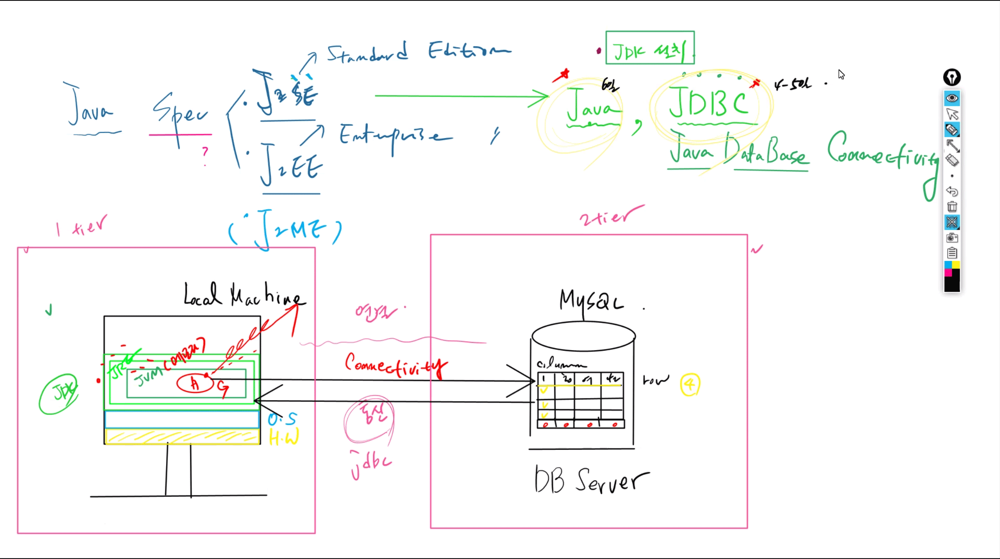
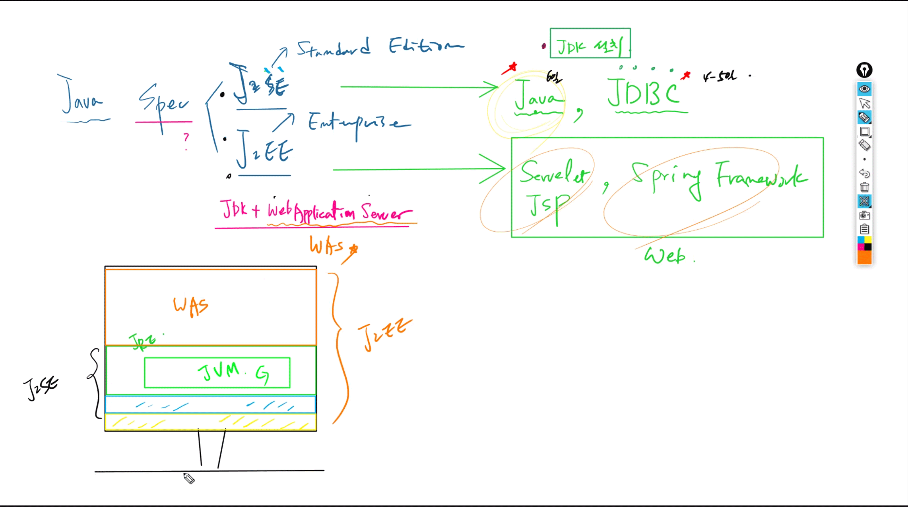
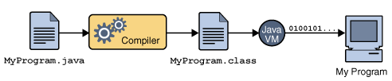
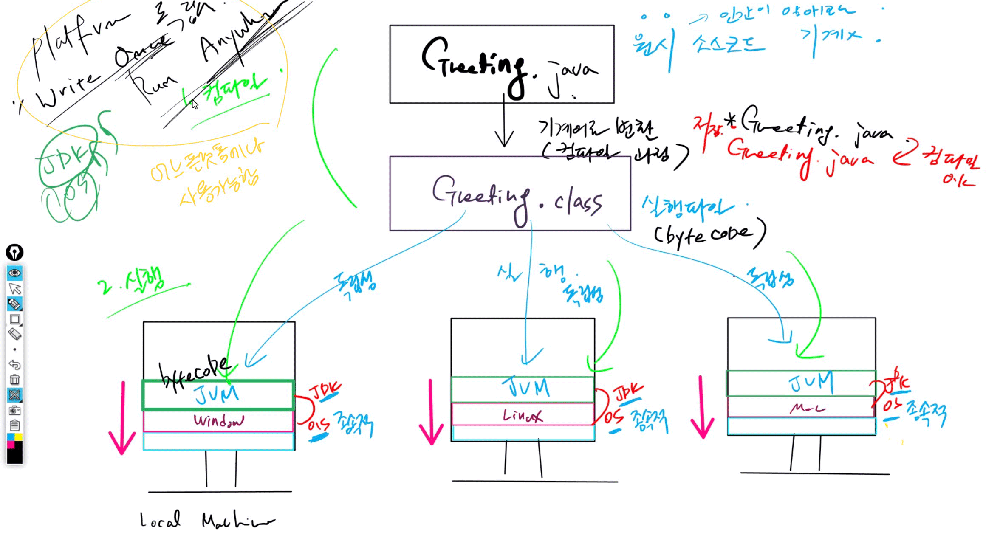

# 1019 Java

## 1. Java 

* 객체 지향 언어로 개발된 프로그래밍 언어
* 자바는 자바 가상 머신(JVM)을 사용하여 어느 운영체제에서나 같은 형태로 실행 가능


### 1) Java Spec 

- J2SE (Java 2 Standard Edition)
  - JAVA,  JDBC
- J2EE (Java 2 Enterprise Edition)
- J2ME


### 2) J2SE

보편적으로 쓰이는 자바 API 집합체로 자바 가상 머신 구격 및 API 집합을 포함한다.

데스크탑 및 서버, 고사양 임베디드 시스템을 위한 표준 자바 플랫폼.

* **1 Tier ** : 로컬머신
  * **H/W** - **OS** - **JDK** (JAVA)
* **2 Tier** : DB Server
* 연결과 통신은 JDBC로 




### 3) J2EE

자바를 이용한 서버측 개발을 위한 프로그램. WAS(web application server) 를 이용하는 프로그램 개발 시 사용한다.

웹 애플리케이션 관련 기술 등으로 자바 개발을 할 수 있는 라이브러리가 포함 된다.

* J2SE + WebApplication Server (WAS)의 구조
* servelet, jsp , spring framework 등의 엔터프라이즈




## 2. Java 프로그래밍

자바는 컴파일과 실행 두 가지로 이루어진다

- 컴파일 : `.java` 파일을 `.class` 파일로 바꾸어 줌
  - javac.exe
- 실행 : `.class` 파일을 실행
  - java.exe




1. 소스코드(MyPrograme.java)를 작성한다.
2. 컴파일러(Compiler)는 자바 소스코드를 이용하여 클래스 파일(MyProgram.class)을 생성한다. 컴파일 된 클래스 파일은 Java VM(Java Virtual Machine)이 인식할 수 있는 바이너리 파일이다.
3. Java VM(JVM)은 클래스 파일의 바이너리 코드를 해석하여 프로그램을 수행한다.
4. MyProgram 수행 결과가 컴퓨터에 반영된다.


* 자바는 완벽한 기계어 (바이너리 코드)가 아닌 바이트 코드로 컴파일
* 따라서 JVM에서 바이트 코드가 실행되야 한다. 
* **Why?** 플랫폼에서 독립적으로 만들었기 때문이다.


## 3. Java 기초

자바는 객체 지향 프로그래밍

* 객체 지향 프로그래밍(OOP, Object-Oriented Programming)
  * 모든 데이터를 객체(object)로 취급하며, 이러한 객체가 바로 프로그래밍의 중심이 됨
  * 객체의 상태(state)와 행동(behavior)을 구체화하는 형태의 프로그래밍이 바로 객체 지향 프로그래밍
  * 

### 1) 패키지 (Package)

package: 비슷한 기능을 가지고 있는 클래스 묶어주는 역할

 * 모든 패키지 이름은 소문자
 * 상위 패키지와 하위 패키지는 `.`으로 구분
 * 패키지 선언은 소스코드의 가장 윗 부분에 위치


### 2) 클래스 (Class)

class : 객체를 정의하는 틀 또는 설계도와 같은 의미

 * 클래스 이름은 반드시 대문자로 시작
 * 클래스 이름으로 파일명이 결정
 * 클래스 확장자는 `java`


#### GreetingTest.java

```java
package com.edu.pro;

// class 클래스 이름 -> Greeting
public class GreetingTest { 			// 실행 클래스: Greeting -> GreetingTest / GreetingAppTest 로 변경해야!
	
	// method -> main method
	// main method가 있는 클래스는 실행 대상이 됨
	public static void main(String[] args) {
		// 콘솔창(System.out)에 "안녕하세요" 메세지 출력
		System.out.println("안녕하세요");
		// sysout + ctl + space -> System.out.println();
	}
}
```

* 위 코드는 무늬만 자바인 프로그램
   * 결과적으로 문법은 자바 문법을 사용했지만 OOP를 지향해서 작성한 코드가 아니기 때문에 자바라 할 수 없음
   * com.edu.oop 패키지에서는 위 코드를 그대로 객체지향적인 프로그램으로 바꿔볼 것 !!





#### Greeting.java

```java
package com.edu.oop;

/*
 * 인삿말에 대한 성질과 기능을 담고 있는 클래스
 * 인삿말--? (값) -> 변수 = 값을 담는 공간
 * 인삿말을 콘솔창에 출력하는 기능-- method, 함수

 * Greeting 클래스 설계 시
 * 변수 / 기능 
 */

public class Greeting {
	public String message; // 변수 (message) 선언
	
	// method 정의 = method 선언 + method 구현
	public void printMessage() {								// method 선언
		System.out.println("Greeting Message = " + message); 	// method 구현 -> worker
	
	}
}
```


#### GreetingTest.java

```java
package com.edu.oop.test;

import com.edu.oop.Greeting;

/*
 * main method를 가진 실행 클래스
 * ~~Test.java
 * 
 * 1) 객체를 생성한다 -> 클래스의 모든 요소를 메모리에 올린다
 * 2) 메모리에 올라간 변수와 method에 접근한다 
 *    변수에 접근 -> 값 할당 / method에 접근 -> 호출
 */

public class GreetingTest {

	public static void main(String[] args) {
		// 객체 생성 (객체 이름 = g) -> Greeting 클래스의 모든 요소가 메모리에 올라감 => why? 사용하려고		
		Greeting g = new Greeting();
		
		// 메모리에 올라간 멤버(변수와 method)에 접근
		g.message = "안녕하세요 여러분";	// 변수(variable)에 실제값(literal value) 할당(assign)
		g.printMessage();			// method 호출(calling)

	}
}

```


#### NoteBook.java

```java
package com.edu.oop;

// 2개의 field(member variable)과 1개의 method => NoteBook 클래스 구성 요소
public class NoteBook {
	public String brandName;
	public int price;
	
	public void printInfo() {
		// System.out.println("Brand = " + brandName);
		// System.out.println("Price = " + price);
		System.out.println("Brand = " + brandName + ", Price = " + price);
	}
}
```


#### NoteBookTest

```java
package com.edu.oop.test;

import com.edu.oop.NoteBook;

public class NoteBookTest {

	public static void main(String[] args) {
		NoteBook nb = new NoteBook();
		
		nb.brandName = "SAMSUNG";
		nb.price = 150;	
		nb.printInfo();
	}
}
```

