# 1020 Java

NoteBook.java 에는 Member가 3개

* brandName , price, printInfo

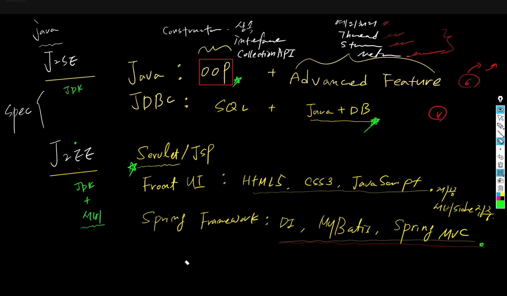


## 1. 클래스의 구성 요소

- 클래스의 멤버(member) : 
  - 속성을 표현하는 필드(field)와 기능을 표현하는 메소드(method)
- 필드(field) : 클래스에 포함된 변수(variable)를 의미
  - 클래스 변수(static variable)
  - 인스턴스 변수(instance variable)
  - 지역 변수(local variable)
- 메소드(method) : 어떠한 특정 작업을 수행하기 위한 명령문의 집합


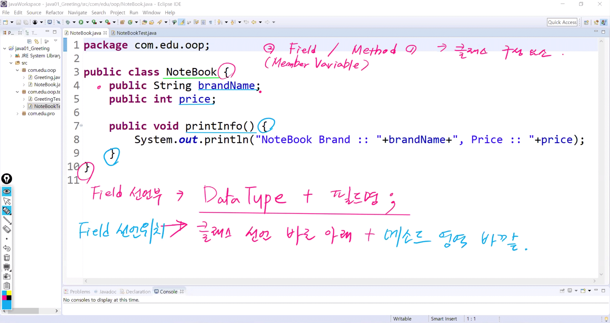

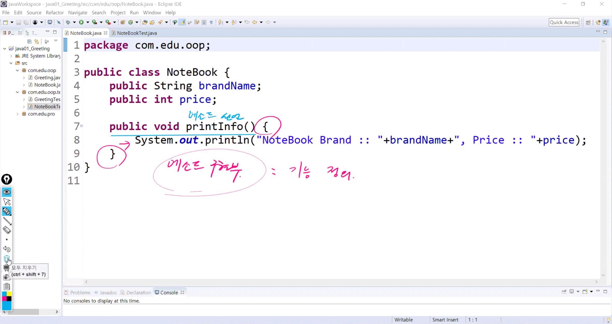

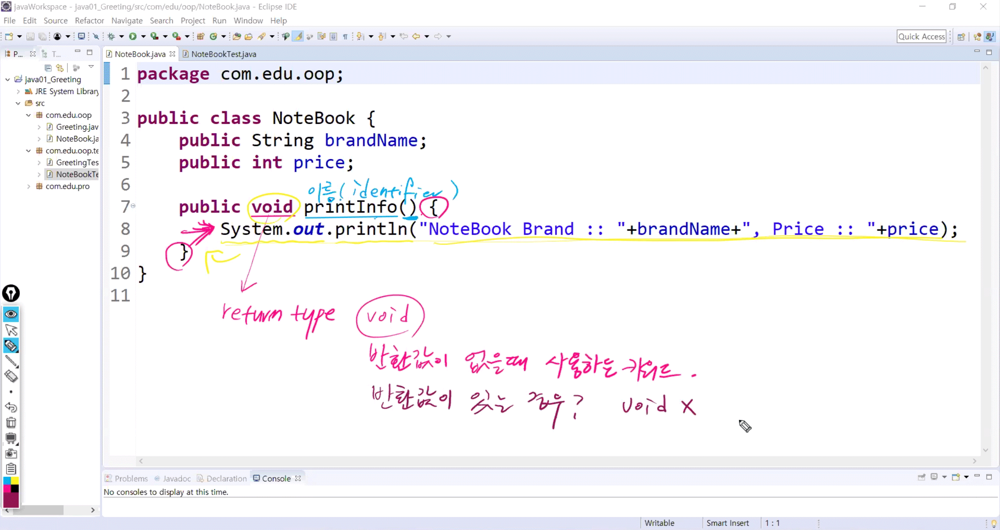


#### NoteBook.java

```java
package com.edu.oop;
/*
 * 필드선언 위치 :
 * 클래스 선언 바로 아래 + method 영역 바깥
 * 
 * method 정의(worker method) :
 * 리턴타입 + method 이름(인자값 0 ~) {		// method 선언부
 * 		method가 어떤 일을 하는지 기술		// method 구현부
 * }
 */

public class NoteBook {
	public String brandName;
	public int price;
	// filed 추가
	public int serialNumber;
	
	public void printInfo() {
		System.out.println("Brand = " + brandName + ", Price = " + price +", Number = " + serialNumber);
	}
	// method 추가 -> return type이 void가 아닌 기능 추가
	public String getBrandName() {
		// 리턴되는 위치는 calling / worker 왔다갔다
		return "NoteBook brandName = " + brandName;
		// 호출한 곳으로 brandName이 리턴 test 클래스의 26번째 라인
	}
}
```


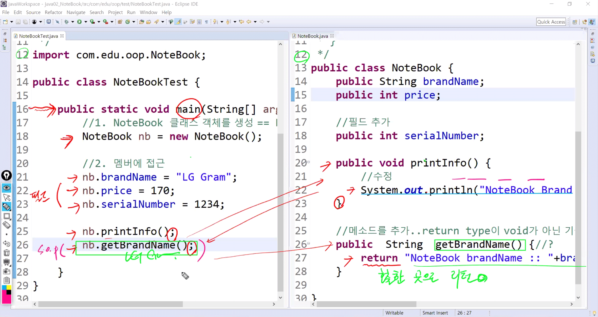


#### NoteBookTest.java

```java
package com.edu.oop.test;
/*
 * ~Test class
 * ::
 * 실행클래스...main
 * ::
 * 1. 객체 생성
 * 2. 메모리에 올라간 멤버에 접근...
 *    field ---> 값 할당 (assign)
 *    method ---> 호출 (calling)
 */

import com.edu.oop.NoteBook;

public class NoteBookTest {

	public static void main(String[] args) {
		//1. NoteBook 클래스 객체를 생성 -> NoteBook 멤버를 메모리에 올림
		NoteBook nb = new NoteBook();
		
		//2. 멤버에 접근 -> 값 할당
		nb.brandName = "SAMSUNG";
		nb.price = 150;	
		nb.serialNumber = 1234;
		
		nb.printInfo(); //void일 때 저쪽에서 출력되고 
		System.out.println(nb.getBrandName()); //String일 때 이쪽으로 리턴된 값을 출력
		
	}
}
```


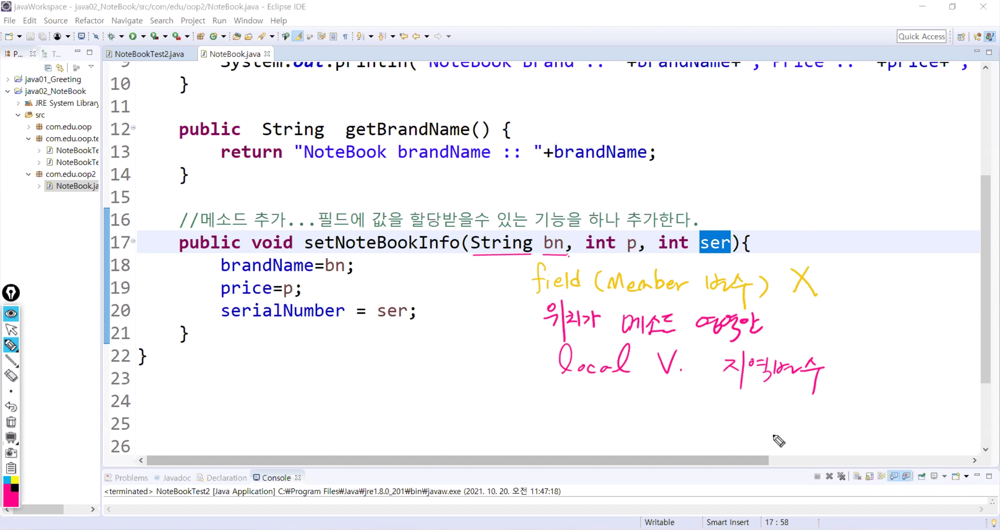

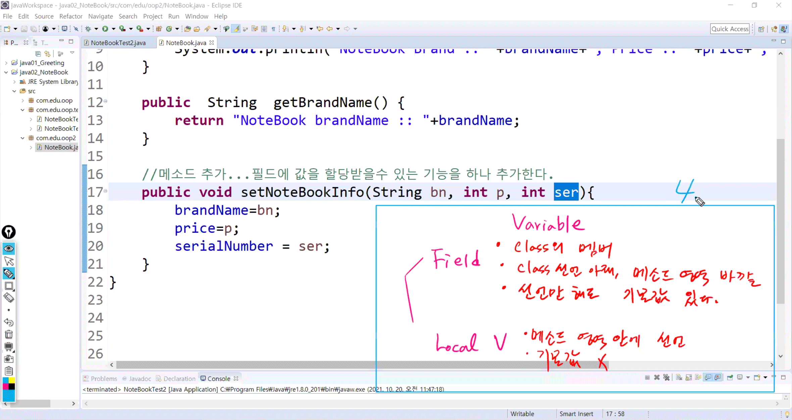


#### NoteBook.java

```java
package com.edu.oop2;

public class NoteBook {
	public String brandName;
	public int price;
	public int serialNumber;
	
	public void printInfo() {
		System.out.println("Brand = " + brandName + ", Price = " + price +", Number = " + serialNumber);
	}
	
	public String getBrandName() {
		return "NoteBook brandName = " + brandName;
	}
	
	// method 추가 -> 필드에 값을 할당받을 수 있는 기능을 하나 추가한다
	
/*	public void setNoteBookInfo(String bn, int p, int ser) {
		//~Test에서 기능 호출할 때 받은 인자값(SAMSUNG, LG)으로 다시 필드에 할당
		// -> 필드초기화(Field Initialization) !!!
		brandName=bn;
		price=p;
		serialNumber=ser;
		*/
	public void setNoteBookInfo(String brandName, int price, int serialNumber){
		// this: 필드와 로컬변수의 이름이 같을 때 구분하기 위해서 필드 앞에 붙여준다
		this.brandName=brandName;
		this.price=price;
		this.serialNumber=serialNumber;
	}
}
```


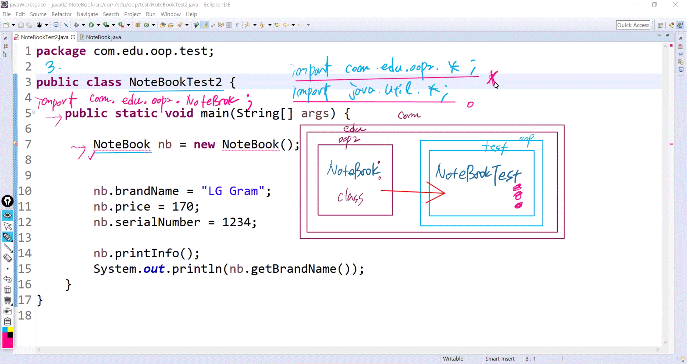

#### NoteBookTest2.java

```java
package com.edu.oop.test;

import com.edu.oop2.NoteBook;
/*
 * NoteBookTest2 문제
 * 1) 클래스의 filed에 값 할당하는 부분이 코드라인을 너무 길게 만듦
 *    만약에 필드가 여러개 더 추가된다면 필드값 할당하는 부분이 늘어남
 *    더욱이 객체 생성을 여러개 한다면 기하급수적으로 코드라인이 늘어남
 *    -> 재사용성을 떨어뜨리는 결정적인 요인
 *    
 */
public class NoteBookTest2 {

	public static void main(String[] args) {
		
		NoteBook nb = new NoteBook();
		NoteBook nb2 = new NoteBook();
		
/*		nb.brandName = "SAMSUNG";
		nb.price = 150;	
		nb.serialNumber = 1234;
		
		nb2.brandName = "LG";
		nb2.price = 200;	
		nb2.serialNumber = 5678;*/			// ctrl + shift + / or \
		
		nb.setNoteBookInfo("SAMSUNG", 150, 1234);
		nb2.setNoteBookInfo("LG", 200, 5678);
		
		nb.printInfo(); 
		System.out.println(nb.getBrandName()); 
		
		System.out.println("=============================="); 
		
		nb2.printInfo(); 
		System.out.println(nb2.getBrandName()); 
		

	}
}
```


### 

####  Programmer.java

```java
package com.edu.oop2;
/*
 * Programmer의 정보(필드, 기능)를 담고 있는 클래스
 * field(4) :: 이름, 사는곳, 기술, 연봉(String, int)
 * method(2) :: 
 * 1) 필드초기화
 * 2) 필드의 모든 값을 리턴하는 기능
 * 
 */
public class Programmer {
	String name;
	String address;
	String mainSkill;
	int salary;
	
	public String getProgrammerInfo() {
		return name+"\t"+address+"\t"+mainSkill+"\t"+salary;
	}
	
	public void setProgrammerInfo(String name,
			String address,String mainSkill, int salary ) {
		//필드초기화
		this.name = name;
		this.address = address;
		this.mainSkill = mainSkill;
		this.salary = salary;
	}

	
	//연봉을 리턴하는 기능을 작성
	public int getAnnualSalary() {
		//구현부 기능은 method명에 잘 맞도록 알아서 구현한다
		return salary*12;
	}
}
```

####  ProgrammerTest.java

```java
package com.edu.oop.test;

import com.edu.oop2.Programmer;

/*
 * 1. Programmer를 2명 생성...pro1, pro2
 * 2. 각각의 Programmer의 값을 입력
 *    입력된 각각의 값을 콘솔로 출력
 */
public class ProgrammerTest {
	public static void main(String[] args) {	
		
		Programmer pro1 = new Programmer();
		Programmer pro2 = new Programmer();
		
		pro1.setProgrammerInfo("James", "LA", "AI", 5000000);
		pro2.setProgrammerInfo("Gosling", "Texas", "Python", 3500000);
		
		System.out.println(pro1.getProgrammerInfo());
		System.out.println(pro2.getProgrammerInfo());
	
		System.out.println(pro2.getAnnualSalary());
	}
}
```

------


## 2. 데이터 타입 (Data type)

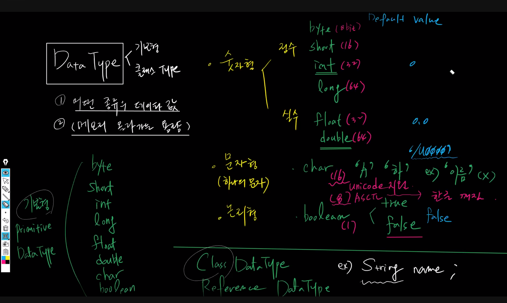


####  WhiteBoardTest.java

```java
package com.edu.datatype;
/*
 * 클래스를 여러개 한꺼번에 작성할때는
 * - main method를 가지는 클래스 앞에 public을 붙인다. (다른 클래스 앞에는 붙이면 안됨)
 * - public이 붙은 클래스 이름으로 파일명을 지정한다.
 */

class Date{
	int year;
	int month;
	int day;
	
	public void setDate(int year, int month, int day) {
		this.year = year;
		this.month = month;
		this.day = day;
	}
	//String + NonString 붙여지면 String으로 Converting !!!
	public String getDate() {
		return year+"-"+month+"-"+day;
	}
}


class WhiteBoard{
	// company, color, material, price, scratch, madeDate
	String company;
	char color;
	String material;
//	float price;
	double price;
	boolean scratch;
	Date madeDate;
	
	//2. 필드에 값 할당(setWhiteBoard) / 할당된 값 받아오는 (get)
	public void setWhiteBoard(char color, double price, boolean scratch, Date madeDate) {
		this.color = color;
		this.price = price;
		this.scratch = scratch;
		this.madeDate = madeDate;
	}
	
	public String getWhiteBoard() {
		return color + "," + price + "," + scratch +"," + madeDate.getDate();		
	}
}

public class WhiteBoardTest {

	public static void main(String[] args) {
		//1. wb라는 이름으로 WhiteBoard 객체 생성
		WhiteBoard wb = new WhiteBoard();
		
		//2. 필드 초기화
		Date madeDate = new Date();
		madeDate.setDate(2021, 10, 20);	
		
		wb.setWhiteBoard('W', 100, false, madeDate);
		
		//3. 필드값을 콘솔로 출력
	
		System.out.println(wb.getWhiteBoard());

	}
}
```


## 3. 생성자 (Constructor)

객체생성 -> 메모리 올라감 -> 값 주입은 x but 값 있는것

#### PersonTest.java

```java
package com.edu.cons;

class Person{
	String name;
	int age;
	
	Person(){} 
	
	Person(String name, int age){		
		this.name = name;
		this.age = age;
	}
	
	public void setPerson(String name, int age) {
		this.name = name;
		this.age = age;
	}
	
	public String getPerson() {
		return name +"," + age;
	}
}

public class PersonTest {

	public static void main(String[] args) {
		Person p1 = new Person("James", 65);	//생성자 calling*3
		Person p2 = new Person("Kate", 30);
		Person p3 = new Person();
		
		p3.setPerson("John", 40);		
		
		System.out.println(p1.getPerson());
		System.out.println(p2.getPerson());
		System.out.println(p3.getPerson());

	}

}

```


#### PersonTest.java

```java
package com.edu.cons;

class Person{
	String name;
	int age; 
	
	//Person(){} 필드초기화 명시적으로 할당
	Person(String name, int age){
		this.name=name;
		this.age=age;
	}
	
	//set 필드초기화를 메소드
	public void setPerson(String name, int age) {		
		this.name = name;
		this.age = age;
	}
	//get
	public String getPerson() {
		return name + "," + age;
	}
}

public class PersonTest {
	public static void main(String[] args) {
		//객체생성
		/*
		 * 생성자란? 
		 * 객체가 생성될 때마다 구동하는 것
		 * 
		 * 1.모든 클래스에는 하나이상의 생성자가 무조건 존재한다. 
		 * 2.기본생성자는 개발자가 작성하지 않아도 무조건 클래스에 암묵적으로 존재한다.
		 *  Default Constructor는 인자값x, {} 구현부에서 아무런 일도 하지않는 생성자
		 * 3.명시적생성자는 인자값이 하나이상
		 *  하는일은 "필드 초기화"
		 */
		
		//객체생성과 동시에 명시적 값을 할당..
		Person p1= new Person("James", 65);//객체가 3번 시행
		Person p2= new Person("아이유", 30);
		Person p3= new Person("기안84", 35);
		
		
		//
//		p1.setPerson("James", 65);
//		p2.setPerson("아이유", 30);
//		p3.setPerson("기안84", 35);
		
		System.out.println(p1.getPerson());
		System.out.println(p2.getPerson());
		System.out.println(p3.getPerson());
		
	
	}
}
```


#### PersonTest.java

```java
package com.edu.cons;

class Person{
	String name;
	int age; 
	
	Person(){} //기본생성자
	Person(String name, int age){//명시적생성자
		//필드초기화
		this.name=name;
		this.age=age;
	}
	
	//set 메소드
	public void setPerson(String name, int age) {
		//필드초기화
		this.name = name;
		this.age = age;
	}
	//get
	public String getPerson() {
		return name + "," + age;
	}
}

public class PersonTest {
	public static void main(String[] args) {
		//객체생성
		/*
		 * 생성자란? 
		 * 객체가 생성될 때마다 구동하는 것
		 * 
		 * 1.모든 클래스에는 하나이상의 생성자가 무조건 존재한다. 
		 * 
		 * 2.기본생성자는 개발자가 작성하지 않아도 무조건 클래스에 암묵적으로 존재한다.
		 *  Default Constructor는 인자값x, {} 구현부에서 아무런 일도 하지않는 생성자
		 * 
		 * 3.명시적생성자는 인자값이 하나이상
		 *  하는일은 "필드 초기화"
		 *  
		 * 4. 클래스에 명시적 생성자를 작성해 놓으면 컴파일러가 기본생성자를 넣어주는 작업을 하지 않는다. 
		 * 
		 * ::
		 * 
		 * 필드에 값이 주입되는 통로는 단 2개이다.
		 * 1)명시적 생성자.. 객체가 생성되는 것과 동시에 값이 주입됨
		 * 2)setter().. 객체가 생성된 직후에 값이 주입됨 
		 * 
		 */
		
		//객체생성과 동시에 명시적 값을 할당..
		Person p1= new Person("James", 65);//객체가 3번 시행
		Person p2= new Person("아이유", 30);
		Person p3= new Person();
		
		
		//
//		p1.setPerson("James", 65);
//		p2.setPerson("아이유", 30);
		p3.setPerson("기안84", 35);
		
		System.out.println(p1.getPerson());
		System.out.println(p2.getPerson());
		System.out.println(p3.getPerson());
		
	
	}
}
```


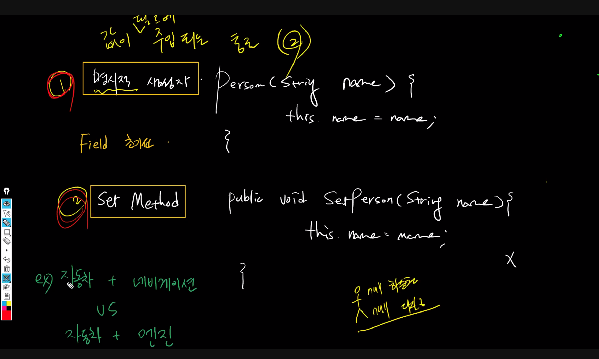

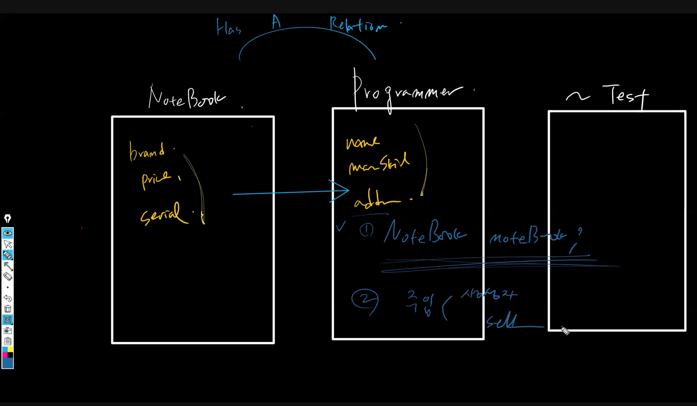

## 4. 필드초기화

* 값이 필드에 주입되는 통로 두 가지

- set Method : 자동차에 네비게이션 주입, 할당- 객체생성이 되고서 값을 주입

```
	public void setPerson(String name, int age) {
		this.name = name;
		this.age = age;
	}
```

- 명시적 생성자 : 자동차에 엔진 주입 할당 - 라이프사이클을 같이할때(생성, 소멸)

```
	Person(String name, int age){
		this.name=name;
		this.age=age;
	}	
```

------


## 5. 실습

#### NoteBook.java

```java
package com.edu.cons;

public class NoteBook {
	public String brandName;
	public int price;
	public int serialNumber;
	
	//생성자
	public NoteBook(){}
	public NoteBook(String brandName, int price, int serialNumber){
		this.brandName=brandName;
		this.price=price;
		this.serialNumber=serialNumber;
	}
	
	
	public void printInfo() {
		System.out.println("Brand = " + brandName + ", Price = " + price +", Number = " + serialNumber);
	}
	
	public String getBrandName() {
		return "NoteBook brandName = " + brandName;
	}
	
	public void setNoteBookInfo(String brandName, int price, int serialNumber){
		this.brandName=brandName;
		this.price=price;
		this.serialNumber=serialNumber;
	}
}

```

#### Programmer.java

```java
package com.edu.cons;

public class Programmer {
	String name;
	String address;
	String mainSkill;
	int salary;
	
	public Programmer(){}
	public Programmer(String name,String address,String mainSkill, int salary ) {
		this.name = name;
		this.address = address;
		this.mainSkill = mainSkill;
		this.salary = salary;
	}
	
	public String getProgrammerInfo() {
		return name+"\t"+address+"\t"+mainSkill+"\t"+salary;
	}
	
	public void setProgrammerInfo(String name,String address,String mainSkill, int salary ) {
		this.name = name;
		this.address = address;
		this.mainSkill = mainSkill;
		this.salary = salary;
	}

	
	public int getAnnualSalary() {
		return salary*12;
	}
}

```

#### ProgrammerTest1.java

```java
package com.edu.cons.test;

import com.edu.cons.NoteBook;
import com.edu.cons.Programmer;


public class ProgrammerTest1 {

	public static void main(String[] args) {
		/*
		 * 1. NoteBook 객체를 2개 생성 - nb1,nb2
		 *    이때 값의 주입 통로를 생성자로 - set 사용 x
		 * 2. Programmer 객체를 2개 생성 - pro1, pro2
		 *    이때 값의 주입 통로를 생성자로 - set 사용 x
		 * 3. nb1,nb2 정보 출력
		 * 4. pro1,pro2  정보 출력
		 * 
		 */
		
		NoteBook nb1 = new NoteBook("SAMSUNG", 150, 1234);
		NoteBook nb2 = new NoteBook("LG", 200, 5678);
		
		Programmer pro1 = new Programmer("James", "LA", "AI", 5000000);
		Programmer pro2 = new Programmer("Gosling", "Texas", "Python", 3500000);
		
		nb1.printInfo();
		nb2.printInfo();
		
		System.out.println(pro1.getProgrammerInfo());
		System.out.println(pro2.getProgrammerInfo());	

	}
}
```


## 6. 과제

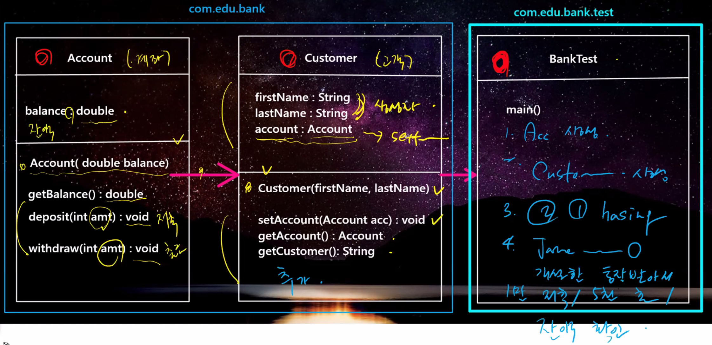