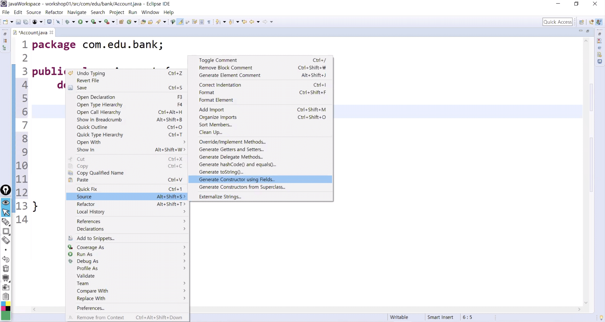
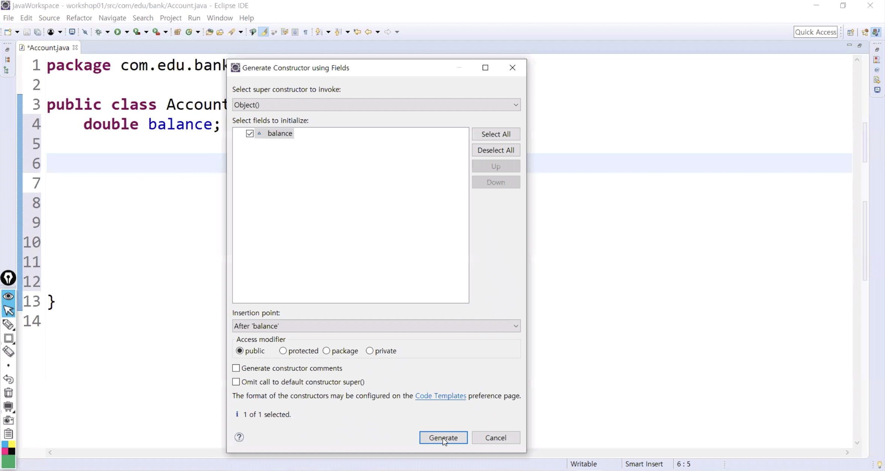
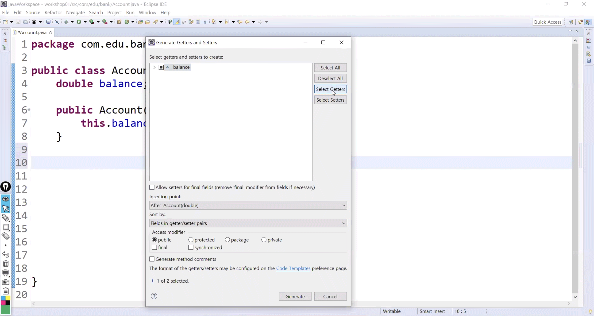
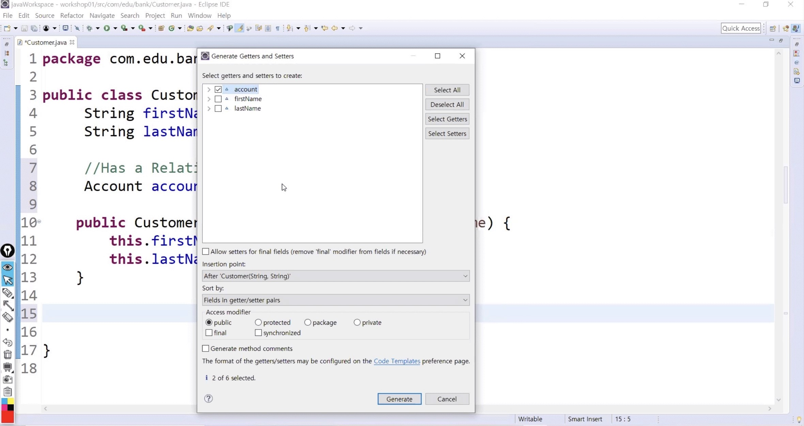
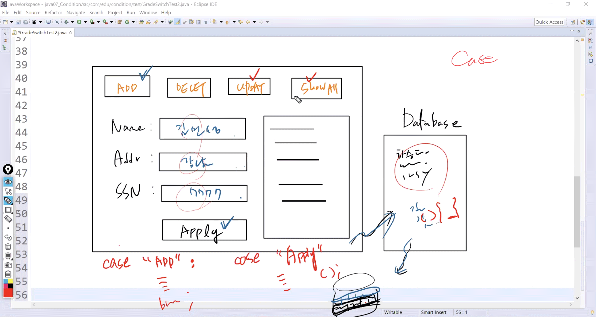
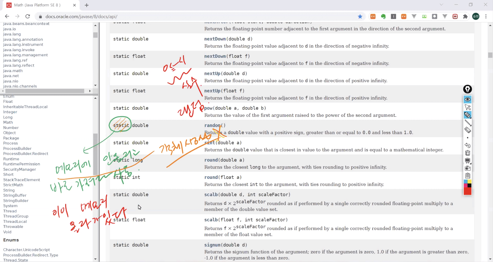
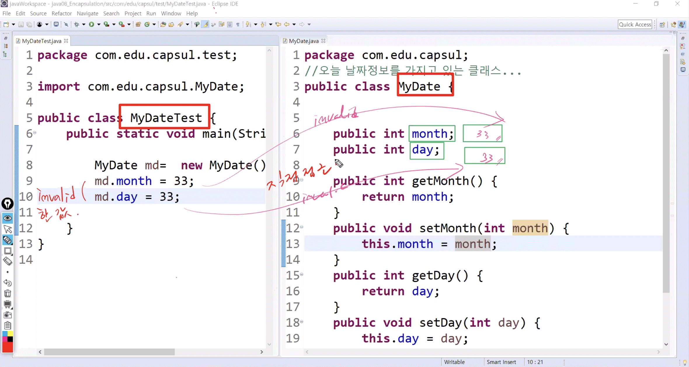

# 1021 Java

1. Has a 관계
2. 연산자(Operator) & 스캐너(Scanner)
3. 제어문(If, Switch)
4. 캡슐화(Encapsulation)

------

**Cf) 객체 지향 프로그래밍(OOP)의 3대 특징**

​	1. 캡슐화 (Encapsulation)

​	2. 상속 (Inheritance)

​	3. 다형성 (Polymorphism)


## 1. Has a 관계

* **Has a** : 포함 관계 (수평적)
  * **Is a** : 상속 관계 (수직적)
* 다른 객체를 받아들여서 그 객체의 기능을 사용


* 개발자가 노트북을 가진다 / 구매한다

  1) 필드에 NoteBook을 추가

  * `Identifier`:  simple & specific 
  * ex) NoteBook noteBook

  2) NoteBook 필드를 주입

  * `생성자` or `setter` -> 이 경우는 `setter` 사용
  * NoteBook  buyNoteBook()


### 1) 실습

#### NoteBook.java

```java
package com.edu.cons;

public class NoteBook {
	public String brandName;
	public int price;
	public int serialNumber;	
    
	//생성자
	public NoteBook(){}
    
	public NoteBook(String brandName, int price, int serialNumber){
		this.brandName=brandName;
		this.price=price;
		this.serialNumber=serialNumber;
	}		
    
	public void printInfo() {
		System.out.println("Brand = " + brandName + ", Price = " + price +", Number = " + serialNumber);
	}	
    
	public String getBrandName() {
		return "NoteBook brandName = " + brandName;
	}	
    
	public void setNoteBookInfo(String brandName, int price, int serialNumber){
		this.brandName=brandName;
		this.price=price;
		this.serialNumber=serialNumber;
	}
}
```


#### Programmer.java

```java
package com.edu.cons;

public class Programmer {
	String name;
	String address;
	String mainSkill;
	int salary;	
    
    //1. 필드 레벨에 추가하고자 하는 클래스를 선언
	NoteBook noteBook;	
    
	public Programmer(){}
	public Programmer(String name,String address,String mainSkill, int salary ) {
		this.name = name;
		this.address = address;
		this.mainSkill = mainSkill;
		this.salary = salary;
	}	
    
	//2. 추가한 필드를 주입하는 통로를 하나 생성 - setter()
	public void buyNoteBook(NoteBook noteBook) {
		this.noteBook = noteBook;
	}
    
	//3. 주입한 노트북을 다시 받아오는 루트 추가
	public NoteBook getNoteBook() {
		return noteBook;		
	}
    
	public String getProgrammerInfo() {
		return name+"\t"+address+"\t"+mainSkill+"\t"+salary;
	}
    
	public void setProgrammerInfo(String name,String address,String mainSkill, int salary ) {
		this.name = name;
		this.address = address;
		this.mainSkill = mainSkill;
		this.salary = salary;
	}	
    
	public int getAnnualSalary() {
		return salary*12;
	}	
    
	public String getMainSkill() {
		return mainSkill;
	}
}
```


#### ProgrammerTest.java

```java
package com.edu.cons.test;

import com.edu.cons.NoteBook;
import com.edu.cons.Programmer;

public class ProgrammerTest {
	public static void main(String[] args) {
		//James 객체 생성
		Programmer james = new Programmer("James", "LA", "AI", 5000000);		
		//James가 노트북을 구매 - Has a Relation
		james.buyNoteBook(new NoteBook("SAMSUNG", 150, 1234));		
		//James가 구매한 노트북 정보 출력
		james.getNoteBook().printInfo();		
		//James가 기술셋(mainSkill) 출력
		System.out.println("mainSkill: " + james.getMainSkill());
	}
}
```

 1. Programmer 객체 생성 - James

 2. James가 삼성 노트북 한대 구매

 3. James가 구매한 노트북의 정보를 출력

    이때 James의 기술셋(mainSkill)도 함께 출력

    


### 2) 과제


**Cf) 자동완성 기능**

* 우클릭 or `shift` + `alt` + `S`

1. 명시적 생성자 





```java
public class Account {
	double balance;

	public Account(double balance) {
		this.balance = balance;
	}
}
```


2. getter / setter 설정




```java
public class Account {
	double balance;
    	public double getBalance() {
		return balance;
	} 
}
```



```java
public class Customer {
	String firstName;
	String lastName;
    
	public Account getAccount() {
		return account;
	}

	public void setAccount(Account account) {
		this.account = account;
	}
}
```


#### Account.java

```java
package com.edu.bank;

public class Account {
	double balance;

	public Account(double balance) {
		this.balance = balance;
	}

	public double getBalance() {
		return balance;
	} 
	
	public void deposit(int amt) {
//		balance = balance + amt;
		balance += amt;	
	}
	public void withdraw(int amt) {
//		balance = balance - amt;
		balance -= amt;	
	}	
}
```


#### Customer.java

```java
package com.edu.bank;

public class Customer {
	String firstName;
	String lastName;
	
	//Has a Relation
	Account account;	
	
	public Customer(String firstName, String lastName) {
		this.firstName = firstName;
		this.lastName = lastName;
	}

	public Account getAccount() {
		return account;
	}

	public void setAccount(Account account) {
		this.account = account;
	}
	
	public String getCustomer() {
		return lastName + " " + firstName;
	}
}
```


#### BankTest.java

```java
package com.edu.bank.test;

import com.edu.bank.Customer;
import com.edu.bank.Account;

public class BankTest {
	public static void main(String[] args) {
		//1. 고객을 생성
		Customer custom = new Customer("James","Gosling");
		//2. James가 통장을 하나 개설 - Has a Relation
		custom.setAccount(new Account(10000.0));
		//3.James가 개설한 통장을 하나 받아서
		//  Customer 클래스에 있는 getAccount()를 호출
		Account customAcc = custom.getAccount();
		//4.이제 James가 개설한 통장을 사용할 수 있다
		//  5000, 3000, 20000 입금 / 25000 출금 / 13000 잔액
		
		customAcc.deposit(5000);
		customAcc.deposit(3000);
		customAcc.deposit(20000);	
		customAcc.withdraw(25000);
		
		System.out.println(custom.getCustomer() + "'s Account Balance : " + customAcc.getBalance());
	}
}
```

```
Gosling James's Account Balance : 13000.0
```


## 2. 연산자 & 스캐너

### 1) 연산자(Operator)

- `=` : 할당
- `==` : 같다
- `!=` : 같지 않다
- `%` : 특정 값을 어떤 값으로 나눌때 나머지
- `++` : 1씩 값을 증가
- `--` : 1씩 값을 감소


#### OperatorTest1.java

```java
package com.edu.test;

class Operator{
	public boolean test1() {
		System.out.println("test1()...calling");
		return true;
	}
	
	public boolean test2() {
		System.out.println("test2()...calling");
		return false;
	}
}

public class OperatorTest1 {

	public static void main(String[] args) {
		//Local Variable : method 영역 안에서만 사용 가능
		int i = 10;
		int j = 8;
		
		System.out.println(i == j);		//false
		System.out.println(i != j);		//true
		
		//%: 특정 값을 어떤 값으로 나눌때 나머지
		System.out.println(i % j);		//2
		
		//++: 1씩 값을 증가시키는 연산자
		int x = 10; 					//local V 초기화 (선언+할당)
		System.out.println(x++);		//10
		System.out.println(x);			//11 -> 1이 나중에 증가
		
		int y = 10; 					
		System.out.println(++y);		//11 -> 1이 먼저 증가
		System.out.println(y);			//11 
		
		//--: 1씩 값을 감소시키는 연산자
		int z = 10; 					
		System.out.println(z--);		//10
		System.out.println(z);			//9 -> 1이 나중에 감소
		
	}
//i = 100; -> error. local V이기 때문에 반드시 main(){} 안에서만 사용
}
```


### 2) 스캐너(Scanner)

* 컴파일 시점이 아닌 실행 시점에서 값을 입력받을 수 있도록 하는 클래스
* 코드에 값을 직접 입력받는 것이 아님
  * `System.in` : 콘솔창
  * `Sysyem.out` : 키보드


#### ScannerTest2.java

```java
package com.edu.test;

import java.util.Scanner;

public class ScannerTest2 {

	public static void main(String[] args) {
		
		System.out.println("입력 : ");
		
		//1. Scanner 객체를 생성 -> 메모리에 올린다
		Scanner	sc = new Scanner(System.in); //System.in: 키보드로부터 입력 받음
		
		//2. Scanner의 기능을 이용해서 값을 받아옴
		int i = sc.nextInt();		//숫자				
		int j = sc.nextInt();
		String name = sc.next();	//문자
		
		System.out.println("숫자값 : " + i + "," + j);
		System.out.println("이름 : " + name);
		
	}
}
```

```
입력 : 
100 200 james 
숫자값 : 100,200
이름 : james
```


## 3. 제어문(조건문)

* 특정한 상황에서만 코드가 실행되도록 제어하는 문장


### 1) if 조건문

```java
if (조건) / else if (조건) / else
    
if(i=0) {}		//error. 조건이 아님(할당)
if(i==0) {} 	//조건
```

* 조건이 참일때만 코드블락`{}`을 실행


#### GradeIfTest1.java

```java
package com.edu.condition.test;

import java.util.Scanner;

public class GradeIfTest1 {

	public static void main(String[] args) {
//		int grade = 88; //local V - 컴파일시 변수 할당 -> 실행시로 변경해줘야 함
		
		System.out.println("점수 입력 : ");
		Scanner	sc = new Scanner(System.in); 
		int grade = sc.nextInt();				
				
//		if(grade >= 90 & grade <= 100) {
//			System.out.println("A grade");
//		}else if(grade >= 80 & grade < 90) {
//			System.out.println("B grade");
//		}else if(grade >= 70 & grade < 80) {
//			System.out.println("C grade");
//		}else {
//			System.out.println("Try Again");
//		}	//if
				
		if(grade >= 90 & grade <=100) 
			System.out.println("A grade");			
		else if(grade >=80 & grade < 90) 
			System.out.println("B grade");
		else if(grade >=70 & grade < 80)
			System.out.println("C grade");
		else 
			System.out.println("Try Again");	// {} 생략가능   
	}	//main
}	//class
```

```
점수 입력 : 
99
A grade
```


### 2) switch 조건문

```java
switch(변수){
    case x:
        ~
        break; 
}
```

* 변수가 x일 때 ~을 실행 (특별한 상황시만, 범위 x)
* 여기서 변수는 숫자, 문자, 문자열 (실수 x)
* `break` 키워드를 어떻게 활용하느냐에 따라 다양한 결과 도출 가능




* 


#### GradeSwitchTest2.java

> break를 사용했을 경우

```java
package com.edu.condition.test;

import java.util.Scanner;

public class GradeSwitchTest2 {

	public static void main(String[] args) {
		System.out.println("점수 입력 : ");
		Scanner	sc = new Scanner(System.in); 
		int grade = sc.nextInt();				
		
		//다양한 성적에 따른 경우의 코드를 작성
		switch(grade) {				// 실수만 x
			case 95:
			case 90:
				System.out.println("A grade");		
				break;
			case 80:
			case 85:
				System.out.println("B grade");		
				break;
			case 70:
			case 75:
				System.out.println("C grade");		
				break;
			default:
				System.out.println("Try Again");
				
		} //switch
	} //main
} //class
```

* 90~95의 범위가 아닌 95와 90일 때의 조건


**Cf) [lang.math](https://docs.oracle.com/javase/8/docs/api/)**



* `random()` : 0에서 1사이의 실수 출력
* `Math`의 `random()`은 static
  * 객체생성할 필요가 없음
  * 미리 메모리에 올라가 있음

```java
Math m = new Math();
m.random();				//원래는 이렇게


Math.random(); 			// static은 바로 가능
```


#### SwitchNoBreakTest3.java

> break를 사용하지 않았을 경우

```java
package com.edu.condition.test;

public class SwitchNoBreakTest3 {

	public static void main(String[] args) {
//		double time = Math.random();	//0~1사이의 실수가 랜덤하게 리턴
		int time = (int)(Math.random()*4) +8;	//8~11 사이의 정수가 랜덤하게 리턴
		System.out.println("현재시각: " +time+"시");
		
		switch(time) {
		case 8:
			System.out.println("출근 준비");
		case 9:
			System.out.println("회사 도착");
		case 10:
			System.out.println("오전 업무");
		case 11:
			System.out.println("외근 준비");	
		}
	}
}
```

```
현재시각: 8시
출근 준비
회사 도착
오전 업무
외근 준비
```

```
현재시각: 9시
회사 도착
오전 업무
외근 준비
```

```
현재시각: 10시
오전 업무
외근 준비
```

```
현재시각: 11시
외근 준비
```


## 4. 캡슐화(Encapsulation)

* Field 값을 보호하려는 목적
* Encapsulation Pattern
  * Field 앞에 **private**지정 - 다른 클래스에서 Field에 값할당을 못하도록 직접 접근을 막는다
  * `void set()` / `int get()` method를 **public** 지정
  * `set()` method에서 필드 초기화 되기 직전에 받은 값이 타당한지 유효성 검사




* 필드에 직접 접근 : 절대 금지 -> invalid한 값이 주입될 수 있기 때문
* 해결책 = **Encapsulation**


**Cf) import 단축키**

* `ctrl` + `shift` + `O`


### 1) 과제

#### MyDate.java

```java
package com.edu.capsul;

//오늘 날짜 정보를 가지고 있는 클래스
public class MyDate {
	
	// private: 같은 클래스에서만 접근 가능, 다른 클래스에서 접근 불가
	private int month;
	private int day;
	
	// public:  set() / get() method로 소통
	public int getMonth() {
		return month;
	}
	public void setMonth(int month) {
		//invalid한 값이 전달되더라도 필드 초기화 직전에 필터링 가능
		//month에 해당하는 값이 1~12일 경우에만 필드 초기화 되도록 한다
		if(1<=month & month<=12) {
		this.month = month;
		}else {
			System.out.println("1~12월 사이를 입력하세요");
		}
	}
	public int getDay() {
		return day;
	}
	public void setDay(int day) {		
		
		switch(month) {			
		case 1:
		case 3:
		case 5:
		case 7:
		case 8:
		case 10:
		case 12:
			if(1<=day & day<=31) {
				this.day = day;
				}else {
					System.out.println("1~31일 사이를 입력하세요");
				}
			break;
		case 4:
		case 6:
		case 9:
		case 11:
			if(1<=day & day<=30) {
				this.day = day;
				}else {
					System.out.println("1~30일 사이를 입력하세요");
				}
			break;
		case 2:
			if(1<=day & day<=28) {
				this.day = day;
				}else {
					System.out.println("1~28일 사이를 입력하세요");
				}
			break;			
			}	//switch
	}
}
```


#### MyDateTest.java

```java
package com.edu.capsul.test;

import java.util.Scanner;

import com.edu.capsul.MyDate;

public class MyDateTest {
	public static void main(String[] args) {
		
		MyDate md = new MyDate();

		Scanner	sc = new Scanner(System.in); 
		
		System.out.println("월 입력 : ");
		md.setMonth(sc.nextInt());			
		System.out.println("일 입력 : ");
		md.setDay(sc.nextInt());
		
		//출력될 때 0값 출력되지 않도록 주의
		if(md.getMonth()==0 | md.getDay()==0) 
//			System.out.println("0이 포함되므로 날짜가 출력되지 않습니다");
			System.exit(0);
		else
			System.out.println("오늘의 날짜: "+md.getMonth()+"월" + md.getDay()+"일");
	}
}
```


```
월 입력 : 
9
일 입력 : 
4
오늘의 날짜: 9월4일
```

```
월 입력 : 
2
일 입력 : 
29
1~28일 사이를 입력하세요
```


### 2) 풀이

#### MyDate.java

```java
package com.edu.capsul;

// 오늘 날짜정보를 가지고 있는 클래스
/*
 * Encapsulation Pattern
 * 1. 필드 앞에 private 지점 -- 다른 클래스에서 필드에 값 할당 못함(직접적인 접근을 막는다)--3번과 연결됨
 * 2. void setXxx(o,o), | int getXxx() 는 public으로 지정
 * 3. setXxx() 메소드에서 필드초기화 되기 직전에 받은 값이 타당한 값인지에 대한 유효성 검사를 한다.
 * 
 */

public class MyDate {
   
   //1.
   private int month;
   private int day;

   //2.
   public void setMonth(int month) {
      //invalid한 값이 잘못전달되더라도 필드 초기화 되기 직전에 걸러낼 수 있다
      //month에 해당하는 값이 1~12일 경우에만 필드초기회 되도록 한다.
   
      if(month >= 1 & month <= 12) {
         this.month = month;//1~12
      }else {
         System.out.println("잘못된 월!");//0
         System.exit(0); //0 정상종료, -1(비정상종료) 
      }
   }

   public void setDay(int day) {
      /*
       * switch문은 사용
       * 1,3,5,7,8,10,12일때는 day가 1~31일
       * 4,6,9,11일때는 day가 1~30일
       * 2월일때는 day가 1~28일 까지의 값을 갖도록 로직을 제어하세요
       */
      switch(month) {
      case 2:
         if(day >=1 & day <= 28) {
            this.day = day;
         }else {
            System.out.println("잘못된 날짜!");
            System.exit(0); //0 정상종료 여기서 프로그램 끝내도록.. 다시  Test로 돌아가지 않도록
         }
         break;
      case 4:
      case 6:
      case 9:
      case 11:
         if(day >=1 & day <= 30) {
            this.day = day;
         }else {
            System.out.println("잘못된 날짜!");
            System.exit(0); //0 정상종료 여기서 프로그램 끝내도록.. 다시  Test로 돌아가지 않도록
         }
         break;
      default:
         if(day >=1 & day <= 31) {
            this.day = day;
         }else {
            System.out.println("잘못된 날짜!");
            System.exit(0); //0 정상종료 여기서 프로그램 끝내도록.. 다시  Test로 돌아가지 않도록
         }
         break;
      }//switch
      
   }//setDay  
   
   public int getMonth() {
      return month;
   }
   public int getDay() {
      return day;
   }  
}
```


#### MyDateTest.java

```java
package com.edu.capsul.test;

import java.util.Scanner;

import com.edu.capsul.MyDate;

public class MyDateTest {

   public static void main(String[] args) {
      Scanner sc = new Scanner(System.in);
      System.out.println("오늘 날짜를 입력하세요.");
      
      MyDate md = new MyDate();
      
      System.out.println("월 입력>>");
      int month = sc.nextInt();
      
      System.out.println("날짜 입력>>");
      int day = sc.nextInt();         
      
      //method call.. setMonth()를 먼저..(월에 따라서 날짜가 달라지기 때문)    
       md.setMonth(month);
       md.setDay(day);          
       System.out.println("오늘은 " + md.getMonth()+"월"+ md.getDay()+"일");
   }
}
```


```
오늘 날짜를 입력하세요.
월 입력>>
9
날짜 입력>>
4
오늘은 9월4일
```

```
오늘 날짜를 입력하세요.
월 입력>>
2
날짜 입력>>
29
잘못된 날짜!
```

