# 1022 Java

1. 객체 생성시 메모리 할당 순서
2. 반복문(Looping)
3. Array (Primitive)

------


## 1. 객체 생성시 메모리 할당 순서

Cf) 추상화 (Clothing) / 구체화 (Tshirt).

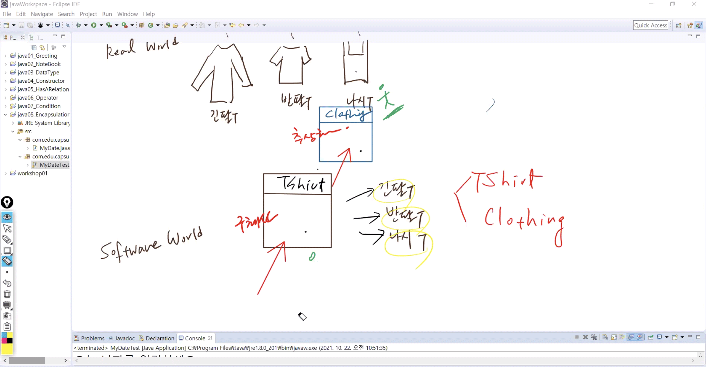

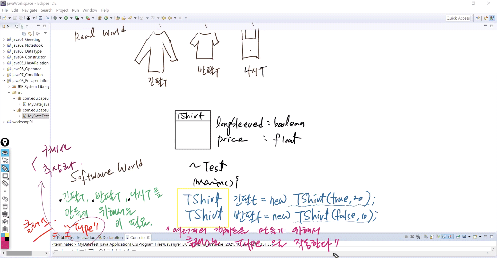


1. Stack에 Tshirt(긴팔t/반팔t)라는 공간이 만들어짐

2. Heap영역에 new라는 객체가 기본값(false/0)으로 초기화

   - 묵시적 초기화 !!!!!!!!!!!!!!!
   - present label ??
   - Heap에 값이 채워지면 representation 위치값/주소값이 뜸

3. 객체 생성의 결론은 주소값 할당 (라벨링)

4. stack의  md라는 변수에서 heap의 주소를 가리키게 됨 - 참조한다 !!!

   따라서 md는 참조변수 (reference variable) / 객체변수

5. Heap에서 값을 주입 - 명시적 초기화

라벨링값이 참조 -> 객체 가리키게 - 사용 매커니즘 생성

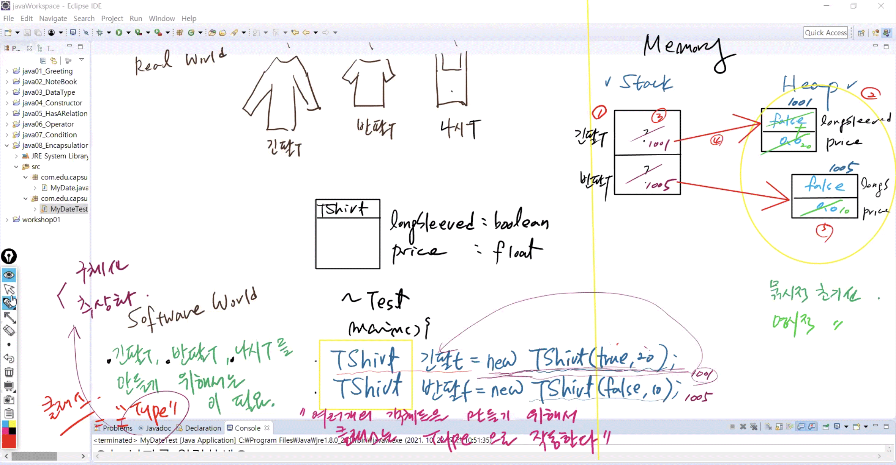

[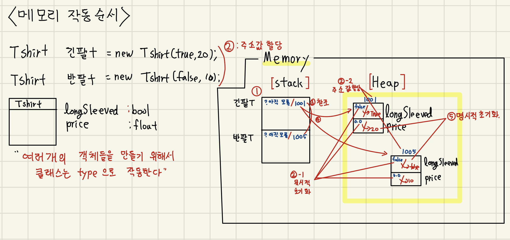](https://github.com/msio900/miracom_javaEduSummary/blob/master/image/1022-03.jpg)


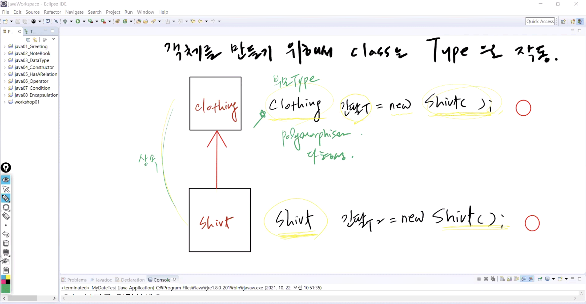


## 2. 반복문(Looping)

* 참인 조건을 만족하는 동안에 코드블락을 반복적으로 수행하는 문장


### 1) for 문

```java
for(initialization;boolean expression;update){		//초기식;조건식;증감식
	//code block
}
```


#### BasicLoopTest1.java

```java
public class BasicLoopTest1 {

	public static void main(String[] args) {
		System.out.println("=========for=========");
		
		for(int i=0; i<10; i++) {				//초기식;조건식;증감식
			System.out.println("for 1 : "+i); 	//명령문 (++i: 0부터 시작은 똑같음)
		}

		for(int i=1, j=1; i<10 &j<10; i++) {
			System.out.println("for 2 : "+i);	
		}
    }
}
```


**Cf) for each 문**


```java
for (type var: iterate) {    ////자료형 변수 : 배열
    //code block
}
```


### 2) while문

```java
<Syntax>
initialization
while(boolean expression){
    //code block
}
```


#### BasicLoopTest1.java

```java
public class BasicLoopTest1 {

	public static void main(String[] args) {
		System.out.println("=========while=========");
		
		int i = 10;			//초기식
		while (i>0) {		//조건식
		    System.out.println("while 1 : "+i);		//반복 명령문
		    i--;			//결과 명령문 - 없으면 무한 루프
		}
    }
}
```


## 3. 배열(Array)

* 배열(Array): `자료형[] 변수명`
  * 같은 데이터 타입을 가지는 서로 다른 값들을 하나의 변수로 처리
  * 즉, 각각의 칸에 여러개의 객체를 담는 것

1. 기본형 타입 (Primitive Type) : 알고리즘
2. 클래스 타입 (ClassType) : oop 정수


### 1) 기본형 타입 배열 (Primitive DataType Array)

* 선언, 생성, 초기화
  1. 선언 : `int[] arr`;
  2. 생성 (반드시 사이를 명시) : `arr = new int[3];`
  3. 초기화  : `arr[0] =11; arr[1]=22; arr[2]=33`


* 배열은 클래스가 존재하지 않음 -> 사용할 수 있는 method x
  * ` length` : 배열의 유일한 Field로 배열의 사이즈를 리턴 (int)

[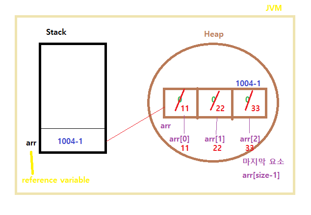](https://user-images.githubusercontent.com/83646543/138593094-4f44c168-7899-4a3d-b1c4-de2c0cde736d.png)

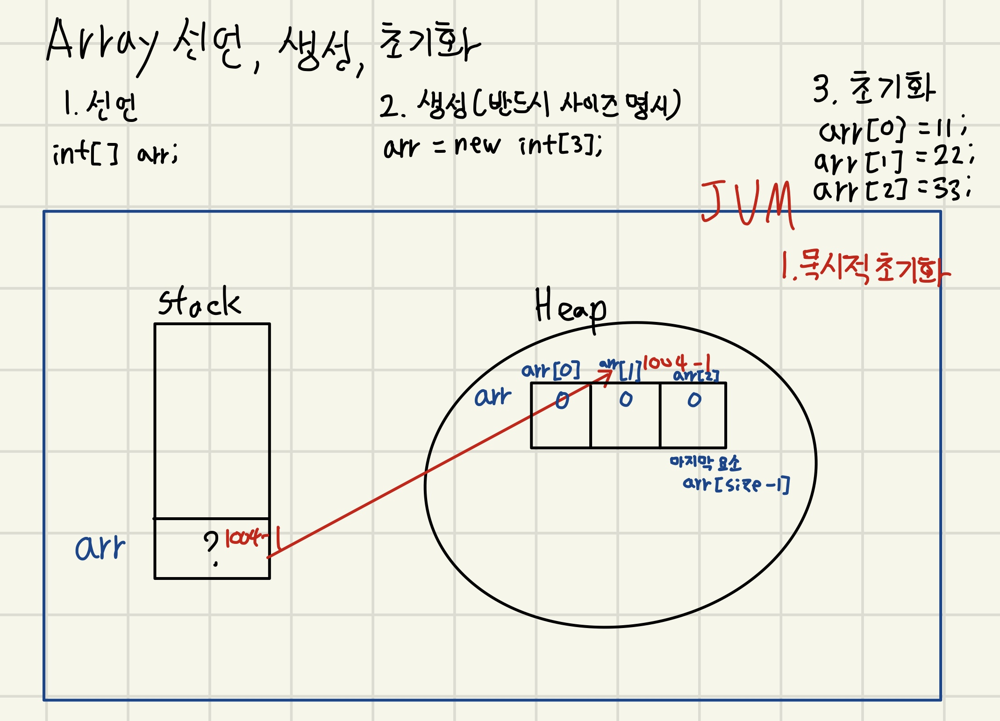


#### BasicArrayTest1.java

* 1) 선언, 2) 생성, 3) 초기화

```java
package com.edu.array.test;

public class BasicArrayTest1 {

	public static void main(String[] args) {
		//1. 배열 선언
		int[] arr;
		
		//2. 배열 생성
		arr = new int[3];
		
		//3. 초기화
		arr[0] = 11;
		arr[1] = 22;
		arr[2] = 33;
		
		System.out.println("배열 각각의 칸에 들어있는 값: " );
        
        for(int i=0; i<3; i++)
            
		for(int i=0; i< arr.length; i++) {		////length: 배열의 사이즈 리턴
			System.out.print(arr[i] + " ");
		}
		System.out.println("\n배열 객체를 참조하는 주소값: " + arr);	
	}
}
```


#### BasicArrayTest2.java

* 1) 선언 + 생성, 2) 초기화

```java
package com.edu.array.test;

public class BasicArrayTest2 {
	
	public static void main(String[] args) {
		
		//1.배열 선언과 생성
		int[ ] arr= new int[3];			
			
		//2. 초기화
		arr[0] = 11;
		arr[1] = 22;
		arr[2] = 33;		
		
		System.out.println("배열 각각의 칸에 들어있는 값: ");		
		for(int i=0; i< arr.length; i++) 
			System.out.print(arr[i]+" ");
		
		System.out.println("\n배열 객체를 참조하는 주소값: "+arr);
	}
}
```


#### BasicArrayTest3.java

* 1) 선언 + 생성 + 초기화

```java
package com.edu.array.test;

public class BasicArrayTest3 {
	
	public static void main(String[] args) {
		
        //배열 선언 + 생성 + 초기화
		int[] arr = {11,22,33};

		System.out.println("배열 각각의 칸에 들어있는 값: " );
		for(int i=0; i< arr.length; i++) {
			System.out.print(arr[i] + " ");
		}
		System.out.println("\n배열 객체를 참조하는 주소값: " + arr);	
		
		System.out.println("\n=============================\n");
    }
}
```


### 2) 쓰레기 객체


#### BasicArrayTest3.java

```java
package com.edu.array.test;

public class BasicArrayTest3 {
	public static void main(String[] args) {
		int[] arr = {11,22,33};
		int[ ] arr2 = {1,2,3};
        
		System.out.println("배열 각각의 칸에 들어있는 값: " );
		for(int i=0; i< arr.length; i++) {
			System.out.print(arr[i] + " ");
		}
		System.out.println("\n배열 객체를 참조하는 주소값: " + arr);	
		
		System.out.println("\n=============================\n");
	
		System.out.println("배열 각각의 칸에 들어있는 값2: ");		
		for(int i=0; i< arr2.length; i++) 
			System.out.print(arr2[i]+" ");
		
		System.out.println("\n배열 객체를 참조하는 주소값: "+arr2);
		System.out.println("배열 객체를 참조하는 주소값: "+arr2.toString());
	}
}
```

```
배열 각각의 칸에 들어있는 값: 
11 22 33 
배열 객체를 참조하는 주소값: [I@7852e922

=============================

배열 각각의 칸에 들어있는 값2: 
1 2 3 
배열 객체를 참조하는 주소값: [I@4e25154f
배열 객체를 참조하는 주소값: [I@4e25154f
```


```java
package com.edu.array.test;

public class BasicArrayTest3 {
	public static void main(String[] args) {
		int[] arr = {11,22,33};
		int[ ] arr2 = {1,2,3};
        
		System.out.println("배열 각각의 칸에 들어있는 값: " );
		for(int i=0; i< arr.length; i++) {
			System.out.print(arr[i] + " ");
		}
		System.out.println("\n배열 객체를 참조하는 주소값: " + arr);	
		
		System.out.println("\n=============================\n");

		arr2 = arr;		//추가
		
		System.out.println("배열 각각의 칸에 들어있는 값2: ");		
		for(int i=0; i< arr2.length; i++) 
			System.out.print(arr2[i]+" ");
		
		System.out.println("\n배열 객체를 참조하는 주소값: "+arr2);
		System.out.println("배열 객체를 참조하는 주소값: "+arr2.toString());
	}
}
```

```
배열 각각의 칸에 들어있는 값: 
11 22 33 
배열 객체를 참조하는 주소값: [I@7852e922

=============================

배열 각각의 칸에 들어있는 값2: 
11 22 33 
배열 객체를 참조하는 주소값: [I@7852e922
배열 객체를 참조하는 주소값: [I@7852e922
```

* `arr2 = arr;`
  * `arr2`의 주소값이 `[I@4e25154f` 에서 `[I@7852e922` 으로 변화
  * **Stack** 영역으로부터 참조가 끊어진 객체는 **Heap**에서 사용할 수 없음 -> 쓰레기 객체!
* `toString()`:
  * 주소값을 문자열로 리턴하는 기능
  * 객체변수 , 참조변수 뒤에 항상 생략되어 붙어있다.

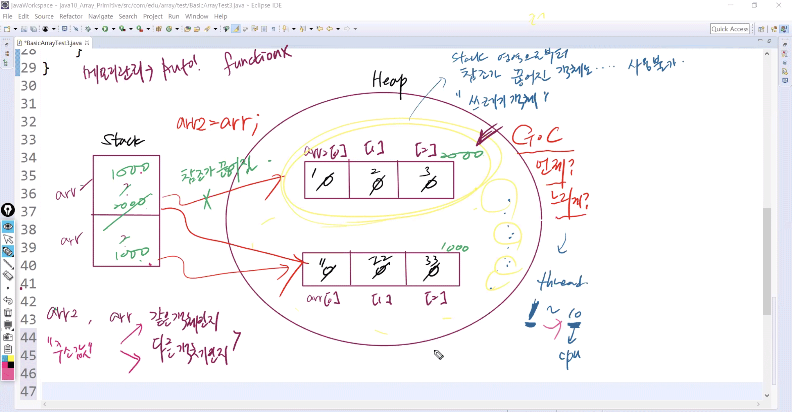

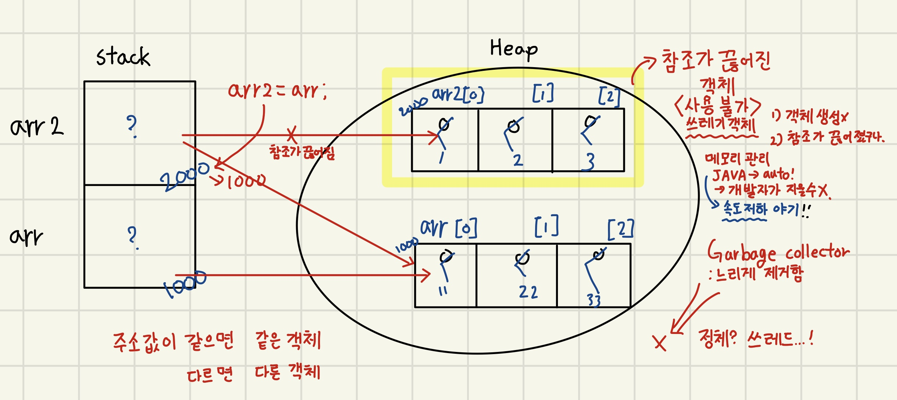

[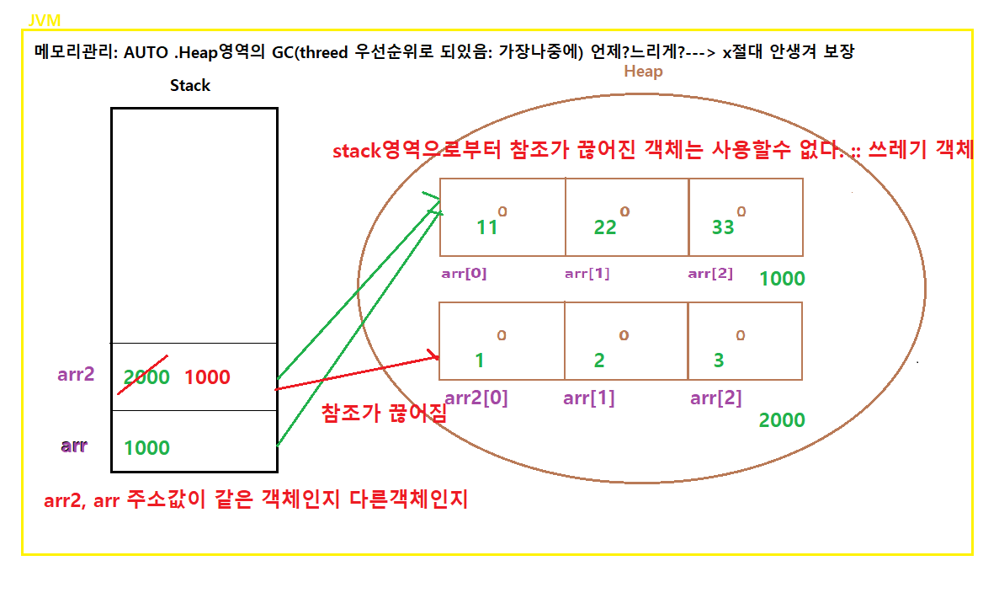](https://user-images.githubusercontent.com/83646543/138593115-2d98eb5e-b864-41ac-84ef-a95a2b7ab978.png)


### 3) Resize / Copy

 * 배열은 **Resizing** 불가
     * 이미 만든 배열 객체 사이즈를 수정하게 되면 새로운 객체가 생성됨
     * 한번 배열을 만들때 사이즈를 넉넉히 ! -> `.length`가 최대
 * **Copy**는 가능
     * 다른 사이즈 배열의 내용을 복사하는 것은 가능 -> 사이즈는 원래 배열!
     * `System.arraycopy()`;


#### BasicArrayCopyTest4.java

* Resizing 불가

```java
package com.edu.array.test;

public class BasicArrayCopyTest4 {

	public static void main(String[] args) {
		int[] target = {1,2,3,4,5,6};
        
		//1.기본 for
		for(int i=0; i<target.length;i++) System.out.println(target[i]+ " ");
        
		//2.for in(for each)
		for(int i : target) System.out.println(i+" ");
		
		target = new int[10];	//3.배열 사이즈 늘리기
		target[6]=11;
		target[7]=22;
		target[8]=33;
		target[9]=44;
		
		System.out.println("========================");
		
		for(int i : target) System.out.print(i+" ");
	}
}
```

```
1 
2 
3 
4 
5 
6 
1 
2 
3 
4 
5 
6 
=======================
0 0 0 0 0 0 11 22 33 44 
```


#### BasicArrayCopyTest5.java

* `Arraycopy()` 사용
  * [API](https://docs.oracle.com/javase/8/docs/api/) -> java.lang -> classes -> System
  * static: 객체 생성하지 않고 바로 사용 가능

```java
package com.edu.array.test;

public class BasicArrayCopyTest5 {

	public static void main(String[] args) {
		int[] target = {1,2,3,4,5,6};	//size: 6
		int[] source = {10,9,8,7,6,5,4,3,2,1}; //size: 10
		
		System.arraycopy(source, 2, target, 0 , target.length);
        //source의 2번 값을 target의 0번 값부터  target.length만큼 복사
		for(int i:target) System.out.print(i+" ");
	}
}
```

```
8 7 6 5 4 3 
```


## 4. 알고리즘 (Algorithm)


### 1) Max and Min

#### ArrayMaxAndMinTest1.java

```java
package com.edu.array.algo.test;

public class ArrayMaxAndMinTest1 {

	public static void main(String[] args) {
		int[] scores = {79,88,91,44,100,55,95};
		
		//scores 안에 들어있는 점수 중에서 가장 잘한 성적과 가장 못받은 성적을 찾아서 출력
		//가장 잘한 성적 -> MAX | 가장 못한 성적 -> MIN
		
		int min = scores[0]; //초기화시 가장 첫번째를 기준으로 삼는 것이 좋다. 
		int max = scores[0];
		
		//for문과 if문을 사용해서 로직을 작성.
		for(int i=0; i< scores.length; i++) {
			if(scores[i] < min)min =scores[i];
			if(scores[i] > max)max =scores[i];
		}
		System.out.println("최댓값: "+max);
		System.out.println("최솟값: "+min);
	}
}
```

```
최댓값: 100
최솟값: 44
```


### 2) Catch a Mouse

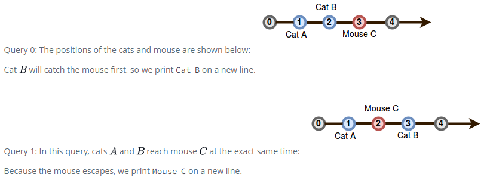

#### CatchAMouseTest2.java

```java
package com.edu.array.algo.test;

import java.util.Scanner;

public class CatchAMouseTest2 {
	
	private static String solve(int x, int y, int z) {
		int[ ] arr= {x,y,z};
		
		if(Math.abs(arr[2]-arr[0])<Math.abs(arr[2]-arr[1])) {
			return "CatA Catch";
		}else if(Math.abs(arr[2]-arr[0])>Math.abs(arr[2]-arr[1])) {
			return "CatB Catch";
		}else return "Mouse Escape";

	}	
	public static void main(String[] args) {
		Scanner sc = new Scanner(System.in);
		//값을 순서대로 3개..catA, catB, Mouse
		
		int cata = sc.nextInt();
		int catb = sc.nextInt();
		int mouse = sc.nextInt();
		
		String result=solve(cata,catb,mouse);
		System.out.println("Result :: "+result);
	}
}
```

------


### 3) Array Person Type

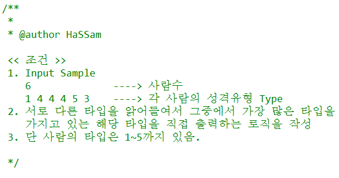

#### ArrayPersonTypeTest3.java

```java
package com.edu.array.algo.test;

import java.util.Arrays;
import java.util.Scanner;

public class ArrayPersonTypeTest3 {
	public static void main(String[] args) {
		
		Scanner sc = new Scanner(System.in);
		
		System.out.print("사람 수: ");
		int num = sc.nextInt();		//6
		
		int[] people = new int[num];
		
		System.out.print("성격 유형: ");
		
		for(int i=0; i<people.length; i++) {
			people[i] = sc.nextInt();	//1 4 4 4 5 3
		}
		
		int[] cnt = new int[num];
		
		for(int i=0; i<cnt.length; i++) {
			cnt[i] = 0;	
		}
		
		System.out.println(Arrays.toString(people));
		
		for(int i=0; i<people.length; i++) {
			cnt[people[i]]++;	
		}
		
		System.out.println(Arrays.toString(cnt));
		
		int type = 0;
		int max=cnt[0];
		for(int i=0; i<cnt.length; i++) {
			if(cnt[i]>max) {
				max = cnt[i];
				type = i+1;
				}
		}
		System.out.println("Result: " + type);
	}
}
```


