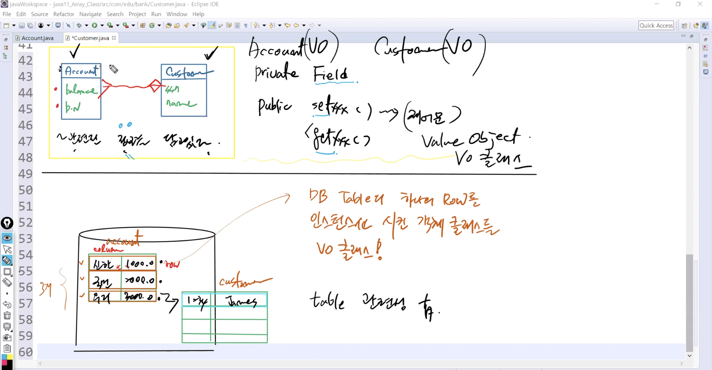
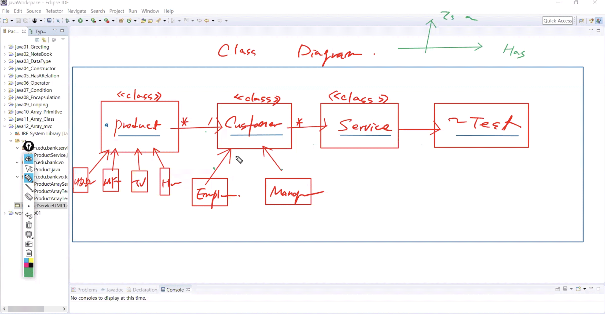

# 1025 Java


## 1. 배열(Array)

1. 기본형 타입 (Primitive Type) : 
   * 기본형 타입의 배열에서의 값 = 데이터 자체
   * 알고리즘
2. 클래스 타입 (ClassType) : oop 정수


### 클래스 타입 배열 (Class DataType Array)

* 선언 생성 초기화 한꺼번에
  * 기본형 타입의 배열에서의 값 = 데이터 자체
  * 클래스 타입의 배열에서의 값 = 생성된 객체


#### Account.java

* 통장에 대한 정보를 가지고 있는 클래스
   * balance, bankName 필드를 선언

```java
package com.edu.bank;

public class Account {
    
	//1.필드 선언
	private double balance;
	private String bankName;
	
	//2.주입통로를 결정
	public Account(double balance, String bankName) {
		this.balance = balance;
		this.bankName = bankName;
	}
	
	//3.필드를 반환
	public String getDetails() {
		return balance+","+bankName;
	}
	
	public String getBankName() {
		return bankName;
	}
	
	//4.나머지 기능
	public void deposit(double amt) {
		if(amt>=1000) 		//1천원 이상의 금액만 입금 가능
		balance += amt;
		else 
			System.out.println("==1천원이상의 금액을 입력하세요==");
			return;			//호출한 지점으로 다시 되돌림 -> 타당한 값을 다시 입력하도록 제어
	}

	public void withdraw(double amt) {
		if(balance>=amt) 	//잔액 이상의 금액만 출금 가능
		balance -= amt;
		else 
			System.out.println("==잔액이상의 금액을 입력하세요==");
			return;
	}
	
	public double getBalance() {
		return balance;
	}
}
```


#### Customer.java

* 은행 고객의 정보를 담고 있는 클래스
  * 여러개의 통장을 가지고 있는 고객으로 설계
  * **Customer** 클래스는 **Account []** 클래스를 가지는 관계

```java
package com.edu.bank;

public class Customer {
	//1.필드 선언
	//생성자 주입
	private int ssn;	//주민번호
	private String name;
	
	//setter 주입 (Has a Relation)
	private Account[] accounts;
	
	//2.선언한 필드값을 각각 주입
	public Customer(int ssn, String name) {
		this.ssn = ssn;
		this.name = name;
	}

	public Account[] getAccounts() {
		return accounts;
	}

	public void setAccounts(Account[] accounts) {
		this.accounts = accounts;
	}
	
	//고객의 정보를 반환
	public String getCustomerInfo() {
		return ssn+","+name;
	}
}
```


#### BankTest1.java


```java
package com.edu.bank.test;

import com.edu.bank.Account;

public class BankTest1 {

	public static void main(String[] args) {
		
/*		//accounts라는 이름으로 Account 타입의 배열 생성 (사이즈 3)
		Account[ ] accounts = new Account[3];		
		
		//각각의 칸에 신한, 국민, 우리은행 통장을 생성
		accounts[0] = new Account(10000, "신한");		//객체 생성한 결과 할당 - Heap에 객체 올라감 
		accounts[1] = new Account(5000, "국민");
		accounts[2] = new Account(7000, "우리");
		*/
		
        //선언, 생성, 초기화 한꺼번에
		Account[ ] accounts = {
				new Account(10000, "신한"),
				new Account(5000, "국민"),
				new Account(7000, "우리"),
		};
		
		
		//for문을 이용해서 배열안에 있는 Account 정보를 출력
		for(Account account : accounts) 				// for each문: accounts안에서 loop
			System.out.println(account.getDetails());	
	}
}
```

```
10000.0,신한
5000.0,국민
7000.0,우리
```


#### BankTest2.java


```java
package com.edu.bank.test;

import com.edu.bank.Account;
import com.edu.bank.Customer;

public class BankTest2 {

	public static void main(String[] args) {
		
		//1. Account 타입의 배열 생성 (신한, 국민, 우리)
		Account[ ] accounts = {
				new Account(1000, "신한"),
				new Account(2000, "국민"),
				new Account(3000, "우리"),
		};
		
		//2. james라는 고객을 생성
		Customer cus = new Customer(1234,"James");
		
		//3. james가 3개의 통장을 가짐
		cus.setAccounts(accounts);		//Has a Relation
		
		//4. james가 가지고 있는 통장 중에서 신한
		Account[] reAcc = cus.getAccounts();	//배열로 가져와서 한번에 리턴받음
		
		Account choice = null; //Local V 초기화
		
		for(Account acc : reAcc) {	
			if(acc.getBankName().equals("신한")){		//getBankName의 결과가 "신한"일 때
				choice = acc;	//신한 선택				
			}
		}
		
		System.out.println("Balance: "+choice.getBalance());
		System.out.println("==신한은행 통장에 입금을 진행==");
        //900원, 30000원 입금 - 900원은 입금 x
		choice.deposit(900);
		choice.deposit(30000);
		System.out.println("Balance: "+choice.getBalance());
		
		System.out.println("==신한은행 통장에 출금을 진행==");
        //5000원, 50000원 출금 - 900원은 출금 x
		choice.withdraw(5000);
		choice.withdraw(50000);
		
		System.out.println("==신한은행 잔액 확인==");
		System.out.println("Balance: "+choice.getBalance());
	}
}
```

```
Balance: 1000.0
==신한은행 통장에 입금을 진행==
==1천원이상의 금액을 입력하세요==
Balance: 31000.0
==신한은행 통장에 출금을 진행==
==잔액이상의 금액을 입력하세요==
Balance: 26000.0
==신한은행 잔액 확인==
Balance: 26000.0
```


## 2. VO - Service - Test 클래스


### 1) VO (Value Object) 클래스

* DB 테이블의 하나의 Row를 인스턴스화 시킨 객체 클래스
  * 하나의 Row가 인스턴스화: VO와 Table이 mapping 
* DO (Domain Object)  -> VO (Value Object) -> DTO (Domain Transfer Object)
* 객체와 관련된 정보를 담고있다 (정보 = Field)




### 2) Service 클래스

* 객체들을 핸들링하는 기능(알고리즘)만으로 작성된 클래스

### 3) Test 클래스 (실행)

* 객체를 메모리에 올려서 메서드를 호출하는 기능을 가진 클래스
* 1) 객체를 생성 (클래스의 멤버를 메모리에 올리고)
 * 2) 멤버에 접근 (필드 접근이 막혔기 때문에 메소드 접근만 가능) 
 * 3) 메소드 호출


**Cf) DB (Data Base)**

* 데이터를 저장하는 보관소
* DB 안에는 여러개의 Table - 2차원 구조 (행과 열)


### 4) 예제


#### Product.java

* Product 정보를 가지고 있는 VO 클래스

```java
package com.edu.bank.vo;

public class Product {
	 private String maker;
	 private int price;
	 private int quantity;
	 private String company;
	 
	public Product(String maker, int price, int quantity, String company) {
		this.maker = maker;
		this.price = price;
		this.quantity = quantity;
		this.company = company;
	}

	public String getMaker() {
		return maker;
	}

	public void setMaker(String maker) {
		this.maker = maker;
	}

	public int getPrice() {
		return price;
	}

	public void setPrice(int price) {
		this.price = price;
	}

	public int getQuantity() {
		return quantity;
	}

	public void setQuantity(int quantity) {
		this.quantity = quantity;
	}

	public String getCompany() {
		return company;
	}

	public void setCompany(String company) {
		this.company = company;
	}
	
	public String getDetails() {
		return maker+" "+price+" "+quantity+" "+company;
	}
}
```


#### ProductArrayTest1.java

```java
package com.edu.bank.vo.test;

import com.edu.bank.vo.Product;

public class ProductArrayTest1 {

	public static void main(String[] args) {
		Product[] pros = {
	            new Product("신라면", 3000, 4, "농심"),
	            new Product("생수", 12000, 10, "농심"),
	            new Product("옥시크린", 23000, 1, "LG"),
	            new Product("정수기", 440000, 1, "대우")
		};
		
		 System.out.println("===상품들 정보를 출력합니다===");
	      for(Product pro: pros) {
	         System.out.println(pro.getDetails());
	      }
	   }// main
	}//class
```

```
===상품들 정보를 출력합니다===
신라면 3000 4 농심
생수 12000 10 농심
옥시크린 23000 1 LG
정수기 440000 1 대우
```


#### ProductArrayTest2.java

```java
package com.edu.bank.vo.test;

import com.edu.bank.vo.Product;

public class ProductArrayTest2 {

	public static void main(String[] args) {
		Product[] pros = {
	            new Product("신라면", 3000, 4, "농심"),
	            new Product("생수", 12000, 10, "농심"),
	            new Product("옥시크린", 23000, 1, "LG"),
	            new Product("정수기", 440000, 1, "대우")
		};
		
		System.out.println("==1.상품들의 메이커 출력==");
	    for(Product pro: pros) {
	    	System.out.println(pro.getMaker());
	     }
	      
		System.out.println("==2.10만원 이상 상품들의 메이커와 가격 출력==");
	    for(Product pro: pros) {
	    	if(pro.getPrice()>=100000)
	    		System.out.println(pro.getMaker() + ": " +pro.getPrice());
	     }
	      
		System.out.println("==3.구매한 모든 상품의 총 가격 출력==");
		
		int total = 0;
		for(Product pro: pros) {
			total += pro.getPrice()*pro.getQuantity();
			}
	     
	    System.out.println("총합: " + total);	    
	   }// main
	}//class
```

```
==1.상품들의 메이커 출력==
신라면
생수
옥시크린
정수기
==2.10만원 이상 상품들의 메이커와 가격 출력==
정수기: 440000
==3.구매한 모든 상품의 총 가격 출력==
총합: 595000
```


#### ProductService.java

* Product 객체들을 핸들링하는 기능(알고리즘)만으로 작성된 Service 클래스

```java
package com.edu.bank.service;

import com.edu.bank.vo.Product;

public class ProductService {			//method 정의 = 선언부 + 구현부
	
/*	private Product[] pros;
	
	public ProductService(Product[] pros) {
		this.pros = pros;
	}	
*/	
	
	//1)모든 상품들의 maker를 출력
	public void printAllProductMaker(Product[] pros) {	//Product 객체를 인자값으로
		//출력 - 반환 x
		System.out.println("==1.모든 제품의 상품명==");
		for(Product pro : pros) {
	    	System.out.println(pro.getMaker());
	     };
	}
	
	//2)상품들의 총 구입액을 리턴
	public int getTotalPrice(Product[] pros) {
		System.out.println("==2.상품들의 총 구입액==");
		int total = 0;
		for(Product pro: pros) {
			total += pro.getPrice()*pro.getQuantity();
		}
		return total;
	}
	
	//3)특정 금액 이상이 되는 제품들을 리턴
	public Product[] getMorePrice(Product[] pros, int price) {	//리턴타입이 배열 - 배열 먼저 생성
		System.out.println("==3.특정 금액 이상 상품==");
		Product[] temp = new Product[pros.length]; //임시 배열 생성해야 but 사이즈 아직 미정 -> pros.length : 배열이 가질 수 있는 최대 사이즈로 생성
		
		int index = 0;
		for(Product pro: pros) {
			if(pro.getPrice()>=price) {
				temp[index++] = pro;
			}
		}
		return temp;
	}
	
	//4)동일한 회사 제품들만 리턴
	public Product[] getCertainCompany(Product[] pros, String company) {
		System.out.println("==4.동일한 회사 제품==");
		Product[] temp = new Product[pros.length];
		
		int index = 0;
		for(Product pro:pros) {
			if(pro.getCompany().equals(company)) {
				temp[index++]=pro;
			}
		}
		return temp;
	}
	
	//5)구입한 상품의 평균가 리턴
	public int getAvgPrice(Product[] pros) {
		System.out.println("==5.구입한 상품의 평균가==");

		return getTotalPrice(pros)/pros.length;
	}
}
```


#### ProductServiceTest3.java

* Product Service 객체를 생성하여 메소드를 호출하는 Test 클래스

```java
package com.edu.bank.vo.test;

import com.edu.bank.service.ProductService;
/* 
 * ~ Test 클래스는
 * 1) 객체를 생성 (==클래스의 멤버를 메모리에 올리고)
 * 2) 멤버에 접근 (필드 접근이 막혔기 때문에 메소드 접근만 가능) == 메소드 호출
 * 
 * ProductService에서 모든 메소드를 정의해두었기 때문에
 * ProductService 객체를 생성 -> 메소드 호출
 * 
 */
import com.edu.bank.vo.Product;

public class ProductServiceTest3 {

	public static void main(String[] args) {
		Product[] pros = {
	            new Product("신라면", 3000, 4, "농심"),
	            new Product("생수", 12000, 10, "농심"),
	            new Product("옥시크린", 23000, 1, "LG"),
	            new Product("정수기", 440000, 1, "대우")
		};
		
		//1.Service 객체 생성
		ProductService service = new ProductService();
		
		//2. Service의 구현된 메소드를 하나씩 호출
		
		//1)
		service.printAllProductMaker(pros);
		
		//2)
		System.out.println(service.getTotalPrice(pros));	//return 함수이기 때문에 print
		
		//3)
		Product[] returnPros = service.getMorePrice(pros, 20000);
		for(Product pro:returnPros) {				//배열의 크기가 다르기 때문에 Null 값 출력 -> Error!
			if(pro == null) continue;				//Null일 때 건너뛰고 continue
			System.out.println(pro.getDetails());
		}
		
		//4)
		Product[] returnPros2 = service.getCertainCompany(pros, "농심");
		for(Product pro:returnPros2) {				
			if(pro == null) continue;				
			System.out.println(pro.getDetails());
		}
		
		//5)
		System.out.println(service.getAvgPrice(pros));		

	   }// main
	}//class
```

```java
==1.모든 제품의 상품명==
신라면
생수
옥시크린
정수기
==2.상품들의 총 구입액==
595000
==3.특정 금액 이상 상품==
옥시크린 23000 1 LG
정수기 440000 1 대우
==4.동일한 회사 제품==
신라면 3000 4 농심
생수 12000 10 농심
==5.구입한 상품의 평균가==
==2.상품들의 총 구입액==
148750
```


**Cf) 3) 특정 금액 이상이 되는 제품들을 리턴**

> ProductService.java

```java
public class ProductService {			
	public Product[] getMorePrice(Product[] pros, int price) {	
        //리턴타입이 배열 - 배열 먼저 생성
		Product[] temp = new Product[pros.length]; 
        //임시 배열 생성해야 but 사이즈 아직 미정 -> pros.length : 배열이 가질 수 있는 최대 사이즈로 생성		
		int index = 0;
		for(Product pro: pros) {
			if(pro.getPrice()>=price) {
				temp[index++] = pro;
			}
		}
		return temp;
	}
}
```


> ProductArrayServiceTest3.java

```java
public class ProductArrayServiceTest3 {
	public static void main(String[] args) {
		Product[] returnPros = service.getMorePrice(pros, 20000);
		for(Product pro:returnPros) {				//배열의 크기가 다르기 때문에 Null 값 출력 -> Error!
			if(pro == null) continue;				//Null일 때 건너뛰고 -> continue
			System.out.println(pro.getDetails());
		}
    }
}
```


#### CustomerService.java

* 아울렛에서 상품을 구매하는 고객에 대한 기능을 다루는 Service 클래스

```java
package com.edu.bank.service;

import com.edu.bank.vo.Customer;
import com.edu.bank.vo.Product;

public class CustomerService {
	//1. 특정 고객이 구입한 상품을 리턴하는 기능
	public Product[ ] getProduct(Customer c) {
		System.out.println("==1. 특정 고객이 구입한 상품==");
		return c.getProducts();
	}
	
	//2. 특정 고객이 구입한 상품의 maker들만 리턴하는 기능
	public String[ ] getAllProductMaker(Customer c) {
		System.out.println("==2. 특정 고객이 구입한 상품의 maker==");
		String[ ] temp = new String[c.getProducts().length];
		Product[ ] pros=c.getProducts();
		int cnt = 0;
		for(Product p : pros) temp[cnt++] = p.getMaker();		
		return temp;
	}
	//3. Outlet안에 있는 모든 고객을 리턴하는 기능
	public Customer[ ] getAllCustomer(Customer[ ] custs) {
		System.out.println("==3. Outlet안에 있는 모든 고객==");
		Customer[ ] temp = new Customer[custs.length];
		int cnt = 0;
		for(Customer c : custs) temp[cnt++] = c;		
		return temp;
	}
	//4. 모든 고객들 중에서 특정한 고객을 검색하는 기능 - ssn으로 검색
	public Customer findCustomerBySsn(Customer[ ] custs, int ssn) {
		System.out.println("==4. 모든 고객들 중에서 특정한 고객==");
		Customer customer=  null;
		for(Customer c : custs) {
			if(c.getSsn()==ssn) customer = c;
		}
		return customer;
	}	
	//5. 특정 고객이 구입한 물건중 최고가에 해당하는 물건의 가격을 리턴하는 기능
	public int maxPriceProduct(Customer c) {
		System.out.println("==5. 최고가에 해당하는 물건의 가격==");
		int maxPice = 0;
		Product[ ] pros = c.getProducts();
		for(Product p : pros) {
			if(p.getPrice()>maxPice) maxPice = p.getPrice();
		}
		return maxPice;
	}
	//6. 모든 고객이 구입한 물건중 특정가격 이상되는 제품들을 리턴하는 기능
	public Product[ ] getMorePriceProducts(Customer[ ] custs, int price) {
		System.out.println("==6. 특정가격 이상되는 제품==");
		int len = 0;
		int cnt = 0;
		for(Customer c : custs) len+= c.getProducts().length;
				
		Product[ ] temp = new Product[len];
		
		for(Customer c : custs) {
			for(Product p : c.getProducts()) {
				if(p.getPrice()>price) temp[cnt++] = p;
			}
		}		
		return temp;	
	}
	//7. 동일한 동네에 살고있는 고객들을 리턴하는 기능 - address로 검색
	public Customer[ ] findCustomerByAddr(Customer[ ] custs, String address) {
		System.out.println("==7. 동일한 동네에 살고있는 고객==");
		Customer[ ] temp = new Customer[custs.length];
		int cnt = 0;
		for(Customer c : custs) {
			if(c.getAddress().equals(address)) temp[cnt++] = c;
		}
		return temp;
	}
}
```


#### OutletServiceTest4.java

```java
package com.edu.bank.vo.test;

import com.edu.bank.service.CustomerService;

import com.edu.bank.vo.Product;
import com.edu.bank.vo.Customer;

public class OutletServiceTest4 {

	public static void main(String[] args) {
		Product[] pros1 = {
	            new Product("신라면", 3000, 4, "농심"),
	            new Product("생수", 12000, 10, "농심"),
	            new Product("옥시크린", 23000, 1, "LG"),
	            new Product("정수기", 440000, 1, "대우")
		};
		
		
	    Product[ ] pros2= {
	            new Product("죽염치약", 8000, 3, "LG"),
	            new Product("새우깡", 1000, 2, "농심"),
	            new Product("하이타이", 50000, 1, "LG")
	    };
	    
	    Product[ ] pros3= {
	            new Product("삼양라면", 2000, 3, "삼양"),
	            new Product("퐁퐁", 10000, 2, "LG"),
	            new Product("노트북", 900000, 1, "삼성")
	    };
	    
	    Customer[ ] cust= {
	            new Customer(111, "원빈", "방배동" ),
	            new Customer(222, "아이유", "신사동"),
	            new Customer(333, "현빈", "신사동"),
	    };
	    
	    //각각의 고객이 상품 구매
	    cust[0].buyProducts(pros1);
	    cust[1].buyProducts(pros2);
	    cust[2].buyProducts(pros3);
	        
	    CustomerService service = new CustomerService();
	    
	    //1. 특정 고객이 구입한 상품을 리턴하는 기능
//	    System.out.println(service.getProduct(cust[0]));
		Product[] returnPros = service.getProduct(cust[0]);
		for(Product p:returnPros)							
			System.out.println(p.getDetails());
		
	    
	    //2. 특정 고객이 구입한 상품의 maker들만 리턴하는 기능
//	    System.out.println(service.getAllProductMaker(cust[2]));
		String[] returnMakers = service.getAllProductMaker(cust[0]);
		for(String m:returnMakers)							
			System.out.println(m);
	    
	    //3. Outlet안에 있는 모든 고객을 리턴하는 기능
//	    System.out.println(service.getAllCustomer(cust));
	    Customer[] returnCustomers = service.getAllCustomer(cust);
		for(Customer r:returnCustomers)							
			System.out.println(r.getName());
	    
	    //4. 모든 고객들 중에서 특정한 고객을 검색하는 기능...ssn으로 검색
//	    System.out.println(service.findCustomerBySsn(cust, 333));
	    Customer findCustomer = service.findCustomerBySsn(cust, 333);
		System.out.println(findCustomer.getName());
	    
	    //5. 특정 고객이 구입한 물건중 최고가에 해당하는 물건의 가격을 리턴하는 기능
	    System.out.println(service.maxPriceProduct(cust[0]));	
//	    int max = service.maxPriceProduct(cust[0]);
//		System.out.println(max);
	    
	    
	    //6. 모든 고객이 구입한 물건중 특정가격 이상되는 제품들을 리턴하는 기능
//	    System.out.println(service.getMorePriceProducts(cust, 50000));
	    Product[ ] morepros = service.getMorePriceProducts(cust, 50000);
	    for(Product p : morepros) {
	    	if(p == null) continue;
	    	System.out.println(p.getDetails());
	    	}
	    		
	   
	    //7. 동일한 동네에 살고있는 고객들을 리턴하는 기능
//	    System.out.println(service.findCustomerByAddr(cust, "신사동"));
	    Customer[] findCustomers = service.findCustomerByAddr(cust, "신사동");
		for(Customer f:findCustomers) {
	    	if(f == null) continue;						
			System.out.println(f.getName());
		}
	    
	   }// main
	}//class
```

```
==1. 특정 고객이 구입한 상품==
신라면 3000 4 농심
생수 12000 10 농심
옥시크린 23000 1 LG
정수기 440000 1 대우
==2. 특정 고객이 구입한 상품의 maker==
신라면
생수
옥시크린
정수기
==3. Outlet안에 있는 모든 고객==
원빈
아이유
현빈
==4. 모든 고객들 중에서 특정한 고객==
현빈
==5. 최고가에 해당하는 물건의 가격==
440000
==6. 특정가격 이상되는 제품==
정수기 440000 1 대우
노트북 900000 1 삼성
==7. 동일한 동네에 살고있는 고객==
아이유
현빈
```


## 3. 클래스 다이어그램(Class Diagram)

### 1) Amateras UML 설치

1. Help -> Install New Software


2. Location: https://takezoe.github.io/amateras-update-site 입력


3.  Amateras Modeler 선택


### 2) Class Diagram 생성


* `C` : 클래스
  * VO Class - Service Class - Test Class 
* 빨간색: private / 초록색: public
* 위: Filed / 아래: Method



* 클래스 간의 유기적 관계를 직관적으로 보여줌
* 필드와 메소드 보여줄 필요 x
* 수직적 or 수평적? -> Has a / Is a 