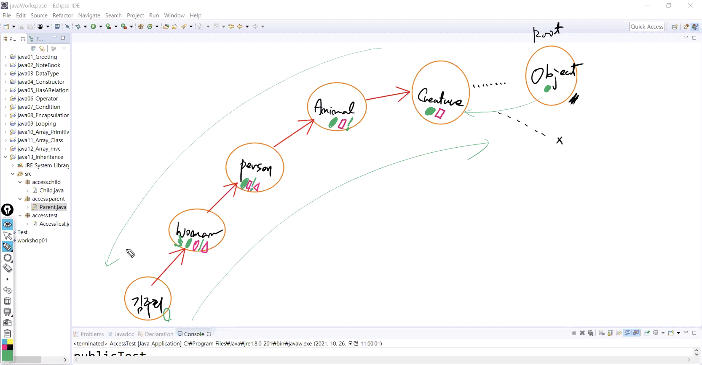
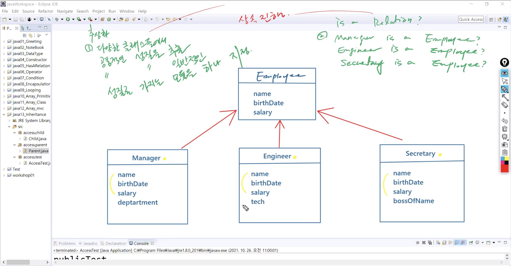
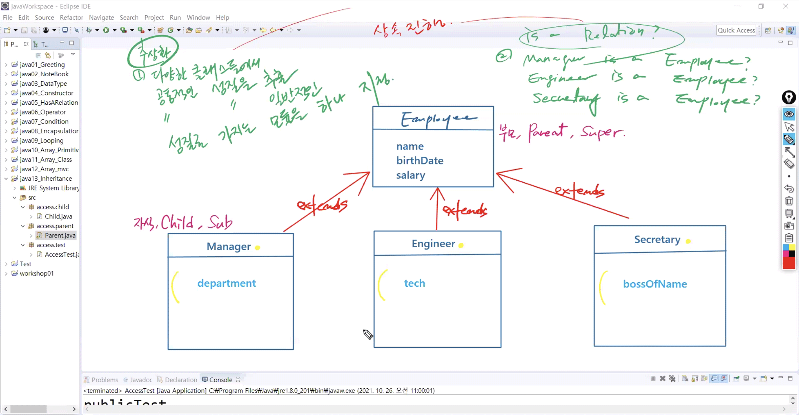
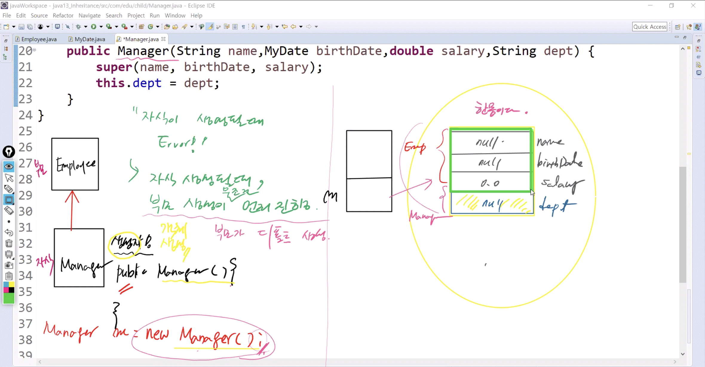
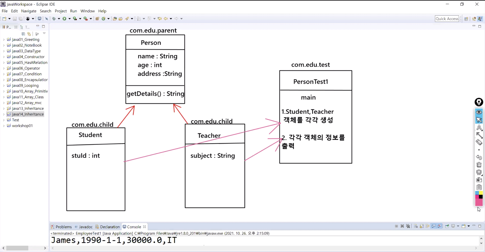
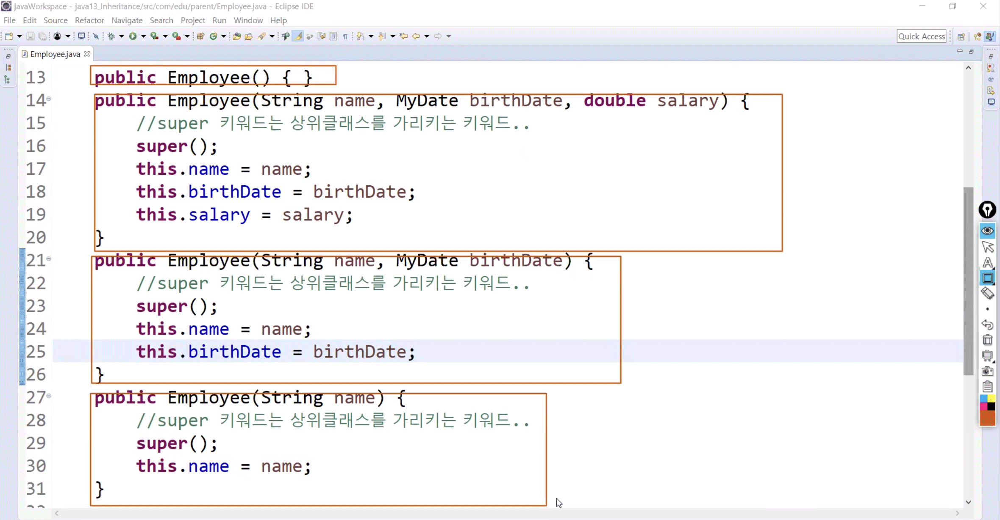

# 1026 Java

1. Method Overloading
2. Constructor Overloading
3. Inheritance
4. Polymorphism


## 1. 메소드 오버로딩 (Method Overloading)


#### CustomerService.java

```java
	public Customer findCustomer(Customer[ ] custs, int ssn) {
		Customer customer=  null;
		for(Customer c : custs) {
			if(c.getSsn()==ssn) customer = c;
		}
		return customer;
	}	

	public Customer[ ] findCustomer(Customer[ ] custs, String address) {
		Customer[ ] temp = new Customer[custs.length];
		int cnt = 0;
		for(Customer c : custs) {
			if(c.getAddress().equals(address)) temp[cnt++] = c;
		}
		return temp;
	}
```

* `findCustomer()` 이라는 method 2개지만 에러는 일어나지 않음
  * **Why?** method 이름은 같지만 Argument list가 다르기 때문
  * 통일성을 높이기 위해 사용


* **Method Overloading : **
  * 하는 일은 동일하지만 처리하는 데이터들을 달리할 때 사용하는 것
  * 상속과 전혀 상관없이 하나의 클래스에서 일어남
  * 규칙 
    * method 이름은 반드시 동일
    * 인자값 (argument list)은 반드시 달라야 함 - 순서, 갯수, 타입
    * return 타입은 상관 없음


## 2. 상속 (Inheritance)

### 1) 접근 지정자 (Accesss Modifier)

* 접근을 허용하는 범위를 키워드로 지정

* 접근 지정자 종류
  * **private**: 같은 클래스에서만 접근 허용
  * **[default]** (접근 지정자x) : 같은 폴더(패키지) 안에서만 접근 허용 
  * **protected** : 같은 폴더 안에서만 접근 허용 / 상속관계의 클래스인 경우 **public**과 동일
  * **public** : 어디서든 접근허용


#### Parent.java

* Child의 부모클래스
* 각각의 필드에 접근 지정자를 서로 다르게 지정

```java
package access.parent;

public class Parent {
	public String publicTest = "publicTest";
	protected String protectedTest = "protectedTest";
	String defaultTest = "defaultTest";
	private String privateTest = "privateTest";
	
	public void access() {
		System.out.println("Access Modifier Test");
	}
}
```


#### Child.java

* Parent의 자식 클래스
* 다른 클래스에서 해당 필드에 어떻게 접근하는지 확인

```java
package access.child;

import access.parent.Parent;

public class Child extends Parent{
	@Override
	public void access() {
		System.out.println(publicTest);		//접근 허용
		System.out.println(protectedTest);	//접근 허용
//		System.out.println(defaultTest); 	//접근 x (not visible)
//		System.out.println(privateTest); 	//접근 x (not visible)
		
		System.out.println("상속관계시 public, protected 지정자만 접근 가능");
		
	}
}
```


#### AccessTest.java

```java
package access.test;

import access.child.Child;

public class AccessTest {

	public static void main(String[] args) {
		Child c = new Child();		//부모 생성이 먼저 전제로 진행
		c.access();
	}
}
```

```
publicTest
protectedTest
상속관계시 public, protected 지정자만 접근 가능
```


### 2) 상속 (Inheritance)

* 부모가 가진 모든것을 자식에게 물려주고 자식은 자신만의 멤버를 추가하는 것 

  * 추상화/일반화 : 상위 계층으로 가는 것
  * 구체화 : 하위 계층으로 가는 것

* java에서 모든 근원 (부모)의 class는 **object**

  

**Cf) object class** - 왜 나옴 ???

https://docs.oracle.com/javase/8/docs/api/

```
boolean equals(Object obj)
Indicates whether some other object is "equal to" this one.

String toString()
Returns a string representation of the object.
```





* 두 가지 조건 충족시 상속 진행

  1. 추상화
     * 다양한 클래스들에서 공통적인 성질을 추출
     * 공통적인 성질을 일반적인 성질로 가지는 모듈을 하나 지정

  2. Is a Relation?
     * manager is a Employee?
     * Engineer is a Employee?
     * Secretary is a Employee?

* 상속이 되면 자식 클래스는 자기 자신만의 멤버만 작성 (부모것 쓸 필요x)
  * 부모 클래스 :  parent, super
  * 자식 클래스:  child, sub
  * 부모자식 관계: `extends`







### 3) 실습

> Error 코드

#### Employee.java

* 부모 클래스 작성

```java
package com.edu.parent;

import com.edu.util.MyDate;

public class Employee {
	private String name;
	private MyDate birthDate;
	private double salary;
	
//	public Employee() {} 	//default constructor
	public Employee(String name, MyDate birthDate, double salary) {
		super();	//super 키워드는 상위 클래스를 가리키는 키워드
		this.name = name;
		this.birthDate = birthDate;
		this.salary = salary;
	}
	
	public String getDetails() {
		return name+","+birthDate.getDate()+","+salary;
	}
}
```


#### Manager.java

* Employee의 자식 클래스

```java
package com.edu.child;

import com.edu.parent.Employee;
import com.edu.util.MyDate;

//부모 Employee로 부터 확장된 자식 클래스 Manager 선언
public class Manager extends Employee{		
	private String dept;

	public Manager(String name, MyDate birthDate, double salary, String dept) {
		this.name = name;					//Error !!
		this.birthDate = birthDate;
		this.salary = salary
		this.dept = dept;
	}
}
```

* 자식 클래스의 생성자 `public Manager()` 에서 에러 발생
  * 생성자: 객체 생성할 때 !!
* **Why?** 
  * 자식 만들려면 부모가 메모리에 무조건 먼저 (디폴트) 생성되어야 함
  * 기존 코드는 부모의 기본 생성자인 `public Employee() {}`가 없었음
  * 즉, 자식 생성 이전에 부모가 아직 생성되지 않아 에러 발생
* 메모리 생성 순서
  * **stack**에 `m` 변수 공간 -> **heap**에 `manager` 객체 올라감 -> 이때 부모가 먼저 만들어져야 자식이 부모에 붙음 -> 그 다음에 참조




> Error 해결

#### Employee.java

* 부모 클래스 작성

```java
package com.edu.parent;

import com.edu.util.MyDate;

public class Employee {
	private String name;
	private MyDate birthDate;
	private double salary;
	
//	public Employee() {} 	//기본 생성자: Error 해결
    
	public Employee(String name, MyDate birthDate, double salary) {
		super();	
		this.name = name;
		this.birthDate = birthDate;
		this.salary = salary;
	}
	
	public String getDetails() {
		return name+","+birthDate.getDate()+","+salary;
	}
}
```


#### Manager.java

* Employee의 자식 클래스

```java
package com.edu.child;

import com.edu.parent.Employee;
import com.edu.util.MyDate;

//부모 Employee로 부터 확장된 자식 클래스 Manager 선언
public class Manager extends Employee{		
	private String dept;

	public Manager(String name, MyDate birthDate, double salary, String dept) {
/*		this.name = name;					//Error !!
		this.birthDate = birthDate;
		this.salary = salary;*/
		
//		super(); 							//Employee();호출 - null,null,0.0
		super(name, birthDate, salary);		//				  James,1990-1-1,30000.0 -> 부모 클래스 명시 -> public Employee() {} 생략 가능
		this.dept = dept;
	}
}
```


#### EmployeeTest1.java

```java
package com.edu.test;

import com.edu.child.Manager;
import com.edu.util.MyDate;

public class EmployeeTest1 {

	public static void main(String[] args) {
		Manager m = new Manager("James", new MyDate(1990,1,1), 30000.0, "IT");
		System.out.println(m.getDetails());		
	}
}
```


## 3. 메소드 오버라이딩(Method Overriding)

#### EmployeeTest1.java

```java
	public static void main(String[] args) {
		Manager m = new Manager("James", new MyDate(1990,1,1), 30000.0, "IT");
		System.out.println(m.getDetails());		
	}
```

* `m.getDetails()` : dept는 출력되지 않음
  * **Why?** Manager가 아닌 Employee의 method
  * Method Overriding 으로 method 재정의 !


* **Method Overriding : **
  * 부모가 가진 메소드를 물려받아서 기능을 자식에게 맞게 다시 고쳐서 사용하는 것
     1. 부모가 가진 메소드를 물려받는다
     2. 그걸 자식한테 맞게 고쳐쓴다
     3. 부모의 기능과 자식의 기능이 달라진다
     4. 자식에게 맞는 기능으로 다시 고쳐썼다
  * 기능이 바뀌었기 때문에 새로운 메소드로 취급 
    * 따라서 **''메소드 재정의'**' 라고도 부름
  * 규칙 
    * 메소드 선언부는 모두 일치해야 함 - 이름, 인자값, 리턴타입
    * 메소드 구현부는 달라야 함 - 기능이 달라짐
    * 서로 다른 상속관계의 클래스에서 발생 - 상속이 아닌 관계에서는 발생하지 않음


### 1) 예제 1

#### MyDate.java

```java
package com.edu.util;

public class MyDate {
	private int year;
	private int month;
	private int day;
	
	public MyDate(int year, int month, int day) {
		super();
		this.year = year;
		this.month = month;
		this.day = day;
	}
	
	public String getDate() {
		return year+"-"+month+"-"+day;
	}
}
```


#### Employee.java

```java
package com.edu.parent;

import com.edu.util.MyDate;

public class Employee {
	private String name;
	private MyDate birthDate;
	private double salary;
	
//	public Employee() {} 	//기본 생성자
	public Employee(String name, MyDate birthDate, double salary) {
		super();	//super 키워드는 상위 클래스를 가리키는 키워드
		this.name = name;
		this.birthDate = birthDate;
		this.salary = salary;
	}	
	public String getDetails() {
		return name+","+birthDate.getDate()+","+salary;
	}
}
```


#### Manager.java

```java
package com.edu.child;

import com.edu.parent.Employee;
import com.edu.util.MyDate;

public class Manager extends Employee{				//Field 4개 + Method 1개 = 5개
	
	private String dept;
	
	public Manager(String name, MyDate birthDate, double salary, String dept) {
		
//		super(); 							//Employee();호출 - null,null,0.0
		super(name, birthDate, salary);		//				  James,1990-1-1,30000.0 -> 부모 클래스 명시 -> public Employee() {} 생략 가능
		this.dept = dept;
	}

	public String getDetails() {
//		return name+","+birthDate.getDate()+","+salary;		//접근x - private
		return super.getDetails()+","+dept;		//Method overriding - James,1990-1-1,30000.0,IT
	}
    //자식만의 멤버로 새롭게 추가한 기능 - 오버라이딩과 상관없음
	public void changeDept(String dept) {
		this.dept = dept;
	}
	
	public String getDept() {
		return dept;
	}
}
```


#### EmployeeTest1.java

```java
package com.edu.test;

import com.edu.child.Manager;
import com.edu.util.MyDate;

public class EmployeeTest1 {

	public static void main(String[] args) {
		Manager m = new Manager("James", new MyDate(1990,1,1), 30000.0, "IT");
		System.out.println(m.getDetails());		
		
		m.changeDept("Marketing");
		System.out.println(m.getDetails());	
	}
}
```

```
James,1990-1-1,30000.0,IT
James,1990-1-1,30000.0,Marketing
```


### 2) 예제 2




- 상속에서 자식의 생성은 부모의 생성을 먼저 전제 조건으로 한다
- 부모가 생성되어 있지 않고서는 결코 자식을 만들 수 없다
- 부모와 자식 클래스는 서로 다른 클래스이지만, 메모리에서는 한몸으로 올라간다


#### Person.java

```java
package com.edu.parent;

public class Person {
	private String name;
	private int age;
	private String address;
	
	public Person() {}											//기본 생성자
	public Person(String name, int age, String address) {		//명시적 생성자
		super();
		this.name = name;
		this.age = age;
		this.address = address;
	}

	public String getDetails() {
		return name+","+age+","+address;
	}
}
```


#### Student.java

```java
package com.edu.child;

import com.edu.parent.Person;

public class Student extends Person{
	private int stuId;
	
	public Student(String name, int age, String address, int stuId) {
		super(name, age, address);	//기본 생성자가 아닌 명시적 생성자로 부모! (super(); - x)
		this.stuId = stuId;
	}
	
	@Override
	public String getDetails() {
		return super.getDetails()+","+stuId;
	}
}
```


#### Teacher.java

```java
package com.edu.child;

import com.edu.parent.Person;

public class Teacher extends Person{
	private String subject;
	
	public Teacher(String name, int age, String address, String subject) {
		super(name, age, address);
		this.subject = subject;
	}

	@Override
	public String getDetails() {
		return super.getDetails()+","+subject;
	}
}
```


#### PersonTest1.java

```java
package com.edu.test;

import com.edu.child.Student;
import com.edu.child.Teacher;

public class PersonTest1 {
	public static void main(String[] args) {
		Student stu = new Student("아이유", 28, "신사동", 123);
		Teacher tea = new Teacher("강호동", 45, "신림동", "Java");
		
		System.out.println(stu.getDetails());
		System.out.println(tea.getDetails());		
	}
}
```

```java
아이유,28,신사동,123
강호동,45,신림동,Java
==================
아이유,28,신사동,123
강호동,45,신림동,Java
```


### 3) Method Overriding의 대표적 사례

|        | toString()                             | equlas()                                                     |
| ------ | -------------------------------------- | ------------------------------------------------------------ |
| Object | 객체가 저장된 위치값을 String으로 변환 | 객체의 주소값을 비교함으로써 이 객체가 저 객체와 같은지 다른지를 Boolean으로 반환 |
| String | 객체의 문자열을 반환                   | 문자열을 비교하여 같으면 true / 다르면 false를 반환          |

* `toString()`을 사용해 `getDate()`를 문자열로 반환해오기


#### MyDate.java

```java
package com.edu.util;

public class MyDate {
	private int year;
	private int month;
	private int day;
	
	public MyDate(int year, int month, int day) {
		super();
		this.year = year;
		this.month = month;
		this.day = day;
	}
	
//	public String getDate() {
//		return year+"-"+month+"-"+day;
//	}
	
	public String toString() {				//toString() 사용
		return year+"-"+month+"-"+day;
	}
}
```


#### Employee.java

```java
package com.edu.parent;

import com.edu.util.MyDate;

public class Employee {
	private String name;
	private MyDate birthDate;
	private double salary;
	
//	public Employee() {} 	
	public Employee(String name, MyDate birthDate, double salary) {
		super();	
		this.name = name;
		this.birthDate = birthDate;
		this.salary = salary;
	}
	
	public String getDetails() {
//		return name+","+birthDate.getDate()+","+salary;
		return name+","+birthDate+","+salary; 	//toString
	}
}
```


## 4. 생성자 오버로딩 (Constructor Overloading) 



* `Employee()`이라는 생성자 4개

  * Constructor 이름은 같지만 입력 항목이 다름
  * **Why?** 정보 없어도 회원가입 먼저
    * DB에 먼저 등록
    * default 값 -> 나중에 실제 값

  

* **Constructor Overloading : **
  * 하나의 클래스에 여러개의 입력항목이 다른 생성자를 만드는 것
  * 규칙 
    * Constructor 이름은 반드시 동일
    * 입력 항목은 반드시 달라야 함 
    * `this()`와 함께 사용


#### Employee.java

```java
package com.edu.parent;

import com.edu.util.MyDate;

public class Employee {
	//기본값에 해당하는 상수값을 지정
	public static final double BASIC_SALARY = 100;		//상수값 :  static final 자료형 대문자
	
	private String name;
	private MyDate birthDate;
	private double salary;
	
	//1.기본 생성자
	public Employee() {} 	
	
	//2.생성자
	public Employee(String name, MyDate birthDate, double salary) {	
		super();	
		
		//여기서 this는 필드 앞에 붙음 - 이 클래스의 필드!! (인자값이랑 구분)
		this.name = name;		
		this.birthDate = birthDate;
		this.salary = salary;
	}
	
	//3.생성자
	public Employee(String name, MyDate birthDate) {		//argument list가 동일하면 error - 순서 개수 타입 -> 생성자 overloading
//		super();	
//		this.name = name;
//		this.birthDate = birthDate;
		
		//여기서 this는 생성자 앞 - 한 클래스 내에서 또다른 생성자를 호출 !!
		this(name, birthDate, BASIC_SALARY);		//명시적으로 넘어온 salary값이 없을 때는 지정된 상수값을 연결해준다
	}
	
	//4.생성자
	public Employee(String name) {		//이름만으로 객체 생성 - 하나의 row 추가 / 나머지 기본값
		super();	
		this.name = name;
	}
	
	
	public String getDetails() {
		return name+","+birthDate+","+salary;
	}
}
```


#### EmployeeTest1.java

```java
package com.edu.test;

import com.edu.child.Manager;
import com.edu.parent.Employee;
import com.edu.util.MyDate;

public class EmployeeTest1 {
	public static void main(String[] args) {
		
		Employee e = new Employee("Peter", new MyDate(2000,1,1));
		Manager m = new Manager("James", new MyDate(1990,1,1), 30000.0, "IT");		
		System.out.println(m.getDetails());		
		System.out.println(e.getDetails());		//기본값 없을 때: Peter,2000-1-1,0.0 -> 기본값 생성: Peter,2000-1-1,100.0	
	}
}
```

```
James,1990-1-1,30000.0,IT
Peter,2000-1-1,100.0
```


**Cf) this와 this()**

1. `this. 변수`
   * 인스턴스가 바로 자기 자신을 참조하는 데 사용 - 해당 인스턴스의 주소를 가리킴
   * 생성자의 매개변수 이름과 인스턴스 변수의 이름이 같을 경우 인스턴스 변수 앞에 `this` 키워드를 붙여 구분

```java
	public Employee(String name, MyDate birthDate, double salary) {		
		super();	//super 키워드는 상위 클래스를 가리키는 키워드
		
		//여기서 this는 필드 앞에 붙음 - 이 클래스의 필드!! (인자값이랑 구분)
		this.name = name;		
		this.birthDate = birthDate;
		this.salary = salary;
```


2. `this()` 메소드
   * 생성자 내부에서 같은 클래스의 다른 생성자를 호출할 때 사용
   * `this()` 메소드에 인수를 전달하면 일치하는 다른 생성자를 찾아 호출

```java
	public Employee(String name, MyDate birthDate) {		//argument list가 동일하면 error - 순서 개수 타입 -> 생성자 overloading
//		super();	
//		this.name = name;
//		this.birthDate = birthDate;
		
		//여기서 this는 생성자 앞 - 한 클래스 내에서 또다른 생성자를 호출 !!
		this(name, birthDate, BASIC_SALARY);		//명시적으로 넘어온 salary값이 없을 때는 지정된 상수값을 연결해준다
	}
```


### 요약

```
Method Overloading
"상속과 전혀 상관없이 하나의 클래스에서 일어나는 것"
"하는 일은 동일하지만 처리하는 데이터들을 달리할 때 사용"

<Rule>

=======================================================

생성자 Overloading
"하나의 클래스 안에서 생성자를 여러개 사용할 수 있다"
""
<Rule>

this()
this.변수

=======================================================

Method Overriding
"상속 관계에 있는 2개의 클래스에서 작용하는 기능"
""

<Rule>
```


## 5. 다형성 (Polymorphism)


* 타입이 다른 이기종 간 핸들링 - 같은 레벨은 일일이 다뤄줘야 함
  
  * e / eg / m / s - 기능 기하급수적으로 늘어남
  * 단일하게 manage / 핸들링 하려면 같은 레벨 x - 한단계 위에서 
    * super급 : 부모 타입으로 manage
    * 객체를 생성할 때 부모 타입으로 다양한 자식 - 상속이 전제되어야
  
  
  
* **Polymorphism  : **
  
  * 부모 타입으로 다양한 자식 객체를 생성하는 것
  * 규칙 
    * Virtual Method Invocation
    * Object Casting


#### PolyTest1.java

```java
package com.edu.test;

import com.edu.child.Engineer;
import com.edu.child.Manager;
import com.edu.child.Secretary;
import com.edu.parent.Employee;
import com.edu.util.MyDate;

public class PolyTest1 {

	public static void main(String[] args) {
		
/*		Employee e = new Employee("Peter", new MyDate(2000,1,1));
		Manager m = new Manager("James", new MyDate(1990,1,1), 30000.0, "IT");
		Engineer eg = new Engineer("Tom", new MyDate(1980,1,1), 400000.0, "AI", 1000);*/
		
		//Polymorphism 방식으로 자식 객체를 생성
//		Employee e = new Employee("Peter", new MyDate(2000,1,1));	//부모
		Employee m = new Manager("James", new MyDate(1990,1,1), 30000.0, "IT");
		Employee eg = new Engineer("Tom", new MyDate(1980,1,1), 400000.0, "AI", 1000);
		Employee s = new Secretary("Jane", new MyDate(1985,1,1), 350000.0, "Tom");
		
		//1)
		System.out.println(m.getDetails());		//Employee의 getDetails 호출 -> 왜 다 출력??
		System.out.println(eg.getDetails());
		System.out.println(s.getDetails());
		
		//2)
		m.changeDept("Marketing");				//왜 오류?
		
	}
}
```


