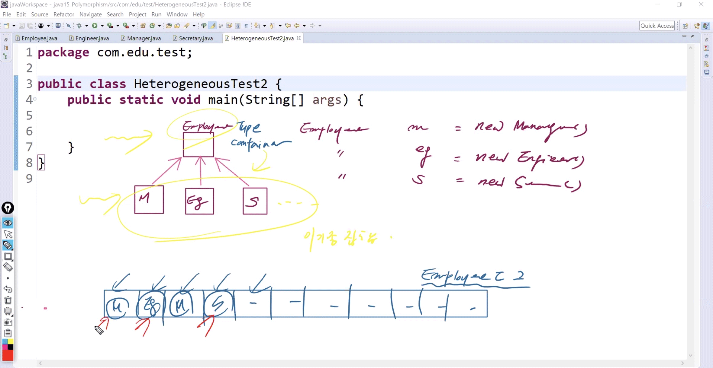
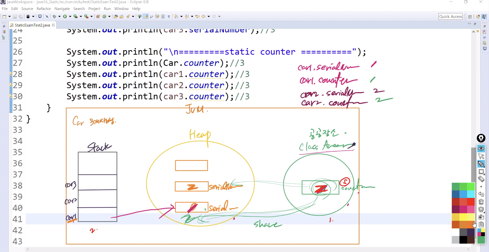
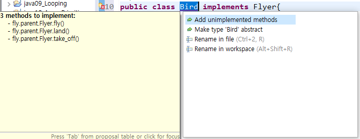

# 1028 Java

1. Polymorphism

2. Static
3. Interface
4. Collection API

===============1~3번 상속

------

## 1. 다형성 (Polymorphism)

> 저번 시간에 이어서...

* **Polymorphism  : **

  * 부모 타입으로 다양한 자식 객체를 생성하는 것

    


### 1) 가상함수 호출 (Virtual Method Invocation)

* `부모type의 변수.Overriding (); `
  * Compile Type Method -> 부모 method 호출
  * Runtime Type Method -> 자식 method 호출
  * ex) `m.getDetails();` :

* 상속관계에서 오버라이딩된 동일한 이름의 method가 충돌했을 때 실행 타임 시점의 메소드가 컴파일 타임 시점의 메소드보다 우선적으로 실행
* 즉, 자식 클래스가 부모 클래스에 있는 메소드를 오버라이딩 했을 때 자식 클래스의 메소드가 호출됨


### 2) 객체 캐스팅 (Object Casting)

* 참조변수 `m`의 타입은 **Employee**이기 때문에 **Manager** 클래스가 가지고있는 고유의 Method는 접근 불가

  *  `Manager m = new Manager();` 로 인스턴스를 생성하였을 경우에는 Employee와 Manager의 method에 모두 접근 가능했지만, 

    `Employee m = new Manager();` 으로 참조변수 타입을 부모클래스로 지정할 경우에는 자식클래스의 고유멤버에는 접근할 수 없다

  * 둘다 `new Manager ();`으로 같은 타입의 인스턴스지만, 참조변수의 타입에 따라 사용할 수 있는 멤버의 개수가 달라진다

* 부모클래스의 참조변수 `m`를 자식클래스인 **Manager**타입으로 강제 변환한다면 접근 가능

  * **Employee**가 아닌 **Manager**를 캐스팅해야 함


**Cf) 객체 캐스팅의 종류**

* 업캐스팅 (up-casting) : `Employee m = new Manager();` 

* 다운캐스팅 (down-casting) : `((Manager)m).changeDept("Marketing");`

  

#### PolyTest1.java

```java
package com.edu.test;

import com.edu.child.Engineer;
import com.edu.child.Manager;
import com.edu.child.Secretary;
import com.edu.parent.Employee;
import com.edu.util.MyDate;

public class PolyTest1 {

	public static void main(String[] args) {		
		//Polymorphism 방식으로 자식 객체를 생성
//		Employee e = new Employee("Peter", new MyDate(2000,1,1));	//부모
		Employee m = new Manager("James", new MyDate(1990,1,1), 30000.0, "IT");
		Employee eg = new Engineer("Tom", new MyDate(1980,1,1), 400000.0, "AI", 1000);
		Employee s = new Secretary("Jane", new MyDate(1985,1,1), 350000.0, "Tom");
		
		//1) Virtual Method Invocation
		System.out.println(m.getDetails());		//James,1990-1-1,30000.0,IT
		System.out.println(eg.getDetails());	//Tom,1980-1-1,400000.0,AI
		System.out.println(s.getDetails());		//Jane,1985-1-1,350000.0,Tom
		
		//2) Object Casting
		((Manager)m).changeDept("Marketing");
		System.out.println(m.getDetails());		//James,1990-1-1,30000.0,Marketing
		
	}
}
```


### 3) 이기종집합 (Heterogeneous Collection)



* **Heterogeneous Collection** :
  * 서로 다른 타입을 가지는 이기종간의 집합체
  * 같은 레벨에서 핸들링 불가 -> super급에서 다뤄야 단일한 관리 가능
  * 즉, 이기종간의 다양한 자식클래스들을 단일하게 관리하기 위해서는 부모타입의 `[]`에 담아야 함
  * <-> **Homogeneous Collection**


#### HeterogeneousTest2.java

```java
package com.edu.test;

import com.edu.child.Engineer;
import com.edu.child.Manager;
import com.edu.child.Secretary;
import com.edu.parent.Employee;
import com.edu.util.MyDate;

public class HeterogeneousTest2 {

	public static void main(String[] args) {
        //Manager/Engineer/Secretary로 서로 다른 클래스 타입 -> Employee 상속
		//단일한 관리를 위해 부모타입의 Employee []에 담는다
		Employee[]emps= {
				new Manager("James", new MyDate(1990,1,1), 30000.0, "IT"),
				new Engineer("Tom", new MyDate(1980,1,1), 400000.0, "AI", 1000),
				new Secretary("Jane", new MyDate(1985,1,1), 350000.0, "Tom"),
				new Manager("Peter", new MyDate(1982,2,11), 50000.0, "Python"),
				new Manager("Juliet", new MyDate(1992,3,1), 65000.0, "Education")
		};
		
		//자식들은 부모타입 container에 담길 수 있다
//		for(Employee e : emps) System.out.println(e.getDetails());
		
		System.out.println("=========모든 고용인들의 연봉 출력=========");
		int total = 0;
		for(Employee e : emps) {
			System.out.println("Information: "+e.getDetails());
			System.out.println("AnnualSalary: "+e.getSalary()*12);
			System.out.println("------------------------------------");
		}
	} //main
} //class
```

```
=========모든 고용인들의 연봉 출력=========
Information: James,1990-1-1,30000.0,IT
AnnualSalary: 360000.0
------------------------------------
Information: Tom,1980-1-1,400000.0,AI
AnnualSalary: 4800000.0
------------------------------------
Information: Jane,1985-1-1,350000.0,Tom
AnnualSalary: 4200000.0
------------------------------------
Information: Peter,1982-2-11,50000.0,Python
AnnualSalary: 600000.0
------------------------------------
Information: Juliet,1992-3-1,65000.0,Education
AnnualSalary: 780000.0
------------------------------------
```

* 여기서 Tom은 bonus를 더해줘야함 - 자식 객체마다 고유한 기능이 있을 수 있음
* 따라서 **emps** 중에서 실질적으로 생성된 자식객체 타입을 알아야할 필요가 있다
  * **instanceof** : 부모타입으로 생성된 객체를 확인시켜주는 키워드
  * Manager, Engineer, Secretary 인지...


```java
package com.edu.test;

import com.edu.child.Engineer;
import com.edu.child.Manager;
import com.edu.child.Secretary;
import com.edu.parent.Employee;
import com.edu.util.MyDate;


public class HeterogeneousTest2 {

	public static void main(String[] args) {
		Employee[]emps= {
				new Manager("James", new MyDate(1990,1,1), 30000.0, "IT"),
				new Engineer("Tom", new MyDate(1980,1,1), 400000.0, "AI", 1000),
				new Secretary("Jane", new MyDate(1985,1,1), 350000.0, "Tom"),
				new Manager("Peter", new MyDate(1982,2,11), 50000.0, "Python"),
				new Manager("Juliet", new MyDate(1992,3,1), 65000.0, "Education")
		};
		
		System.out.println("=========모든 고용인들의 연봉 출력=========");
		int total = 0;
		
		for(Employee e : emps) {
			//e타입으로 생성된 객체타입이 Engineer가 맞다면
			if(e instanceof Engineer) {
				System.out.println("Information Engineer: "+e.getDetails());
				System.out.println("AnnualSalary: "+((e.getSalary())*12+((Engineer) e).getBonus()));	//int끼리 먼저 연산 후 String과 연산 - Non String과 String 붙으면 String으로 계산됨
				System.out.println("------------------------------------");
			}
            //e타입으로 생성된 객체타입이 Manager가 맞다면
			else if (e instanceof Manager) {
				System.out.println("Information Manager: "+e.getDetails());
				((Manager) e).changeDept("교육부");
				System.out.println("Change Dept: "+((Manager) e).getDetails());
				System.out.println("------------------------------------");
			}
			else {
			System.out.println("Information: "+e.getDetails());
			System.out.println("AnnualSalary: "+e.getSalary()*12);
			System.out.println("------------------------------------");
		}
		}
				
	} //main

} //class
```

```
=========모든 고용인들의 연봉 출력=========
Information Manager: James,1990-1-1,30000.0,IT
Change Dept: James,1990-1-1,30000.0,교육부
------------------------------------
Information Engineer: Tom,1980-1-1,400000.0,AI
AnnualSalary: 4801000.0
------------------------------------
Information: Jane,1985-1-1,350000.0,Tom
AnnualSalary: 4200000.0
------------------------------------
Information Manager: Peter,1982-2-11,50000.0,Python
Change Dept: Peter,1982-2-11,50000.0,교육부
------------------------------------
Information Manager: Juliet,1992-3-1,65000.0,Education
Change Dept: Juliet,1992-3-1,65000.0,교육부
------------------------------------
```

* Tom의 연봉이 맞게 출력되었다


재사용성 높이는 코드


```
	 					Employee

			Manager		Engineer	Secretary

위 구조를 핸들링할 때 사용하는 메소드 기법 - 추가에 관련된 기능을 정의하는 경우

1) 가장 저차원적 - 절대 이렇게 하면 안됨!!! 코드 가동력 떨어짐
public void addManager(Manager m){ }
public void insertEngineer(Engineer eg){ }
public void manageSec(Secretary sc){ } 	 

2) 위 보단 조금 나은 정의 - 일관성 있음
public void addManager(Manager m){ }
public void addEngineer(Engineer eg){ }
public void addSecretary(Secretary sc){ }

3) 2단계와 비슷하지만 훨씬 더 일관성과 가독성을 높임
	- method overloading
public void addEmployee(Manager m){ }
public void addEmployee(Engineer eg){ }
public void addEmployee(Secretary sc){ } 

4) 3단계와 같은 역할을 하지만 한번만 정의하면 된다
public void addEmployee(Employee e){
	if(e instance Manager){ }
 	if(e instance Engineer){ }
 	if(e instance Secretary){ }
 }
```


#### EmployeeService.java

* Employee의 자식 클래스인 Manager,Engineer,Secretary 객체들을 핸들링하는 기능만으로 이뤄진 Service 클래스

```java
package com.edu.service;

import com.edu.child.Engineer;
import com.edu.child.Manager;
import com.edu.parent.Employee;


public class EmployeeService {
	public void manageEmployee(Employee e){		 
		if(e instanceof Engineer) {
			System.out.println("Engineer AnnualSalary: "+((e.getSalary())*12+((Engineer) e).getBonus()));
		}
		
		if (e instanceof Manager) {
			((Manager) e).changeDept("오락부");
			System.out.println("Manager Change Dept: "+((Manager) e).getDetails());
		  }
	   }
	   
	   public void printAllEmployee(Employee[ ] emps) {
	      for(Employee e : emps)
	         System.out.println(e.getDetails());
	   }
	}//class
```


#### HeterogeneousTest3.java

* EmployeeService 객체를 생성하고 메소드를 호출하는 클래스

```java
package com.edu.test;

import com.edu.child.Engineer;
import com.edu.child.Manager;
import com.edu.child.Secretary;
import com.edu.parent.Employee;
import com.edu.service.EmployeeService;
import com.edu.util.MyDate;

public class HeterogeneousTest3 {

	public static void main(String[] args) {
		Employee[]emps= {
				new Manager("James", new MyDate(1990,1,1), 30000.0, "IT"),
				new Engineer("Tom", new MyDate(1980,1,1), 400000.0, "AI", 1000),
				new Secretary("Jane", new MyDate(1985,1,1), 350000.0, "Tom"),
				new Manager("Peter", new MyDate(1982,2,11), 50000.0, "Python"),
				new Manager("Juliet", new MyDate(1992,3,1), 65000.0, "Education")
		};
		
		EmployeeService service = new EmployeeService();
		service.manageEmployee(emps[0]); //Manager James를 입력
	    service.manageEmployee(emps[1]); //Engineer Tom를 입력

		
		service.printAllEmployee(emps);
		
	} //main
} //class
```

```
Manager Change Dept: James,1990-1-1,30000.0,오락부
Engineer AnnualSalary: 4801000.0
James,1990-1-1,30000.0,오락부
Tom,1980-1-1,400000.0,AI
Jane,1985-1-1,350000.0,Tom
Peter,1982-2-11,50000.0,Python
Juliet,1992-3-1,65000.0,Education
```


## 2. Static

### 1) Static

* Static의 특징

1. **static**으로 지정된 멤버는 객체 생성할 필요 없이 바로 접근해서 사용 가능하다
   * `클래스 이름.`으로 바로 사용 가능 
   * 메모리에 미리 올라감
2. Class (실행파일 - byteCode) 파일이 메모리(JVM)에 로더되는 과정에서 미리 메모리에 올라간다
3. **static**으로 지정한 변수는 local레벨에서 사용할 수 없다
4. **static**으로 지정된 변수는 생성된 객체들에서 공유된다	!!!!!!
5. **static **키워드는 **final** 키워드와 거의 함께 많이 쓰인다
6. **Filed (Member V)**		vs. 	**Local V**		vs. 	**static V**


#### StaticExamTest1.java

* static 특징 1,2,3
  1. static으로 지정된 멤버는 객체 생성할 필요 없이 바로 접근해서 사용 가능하다
  2. class(실행파일 - byteCode)파일이 메모리(JVM)에 로더되는 과정에서 미리 메모리에 올라간다
  3. static으로 지정한 변수는 local레벨에서 사용할 수 없다


```java
package com.edu.test;

class Member{
	static String name = "홍길동";	//static V
	static int age = 19;			//static V
	int count = 1;					//field
	
	//static
	public static void getMember() {
		System.out.println("우윳빛깔 " + name);
	}
	
	//non-static
	public void getMember2() {
		//static은 local 레벨로 사용할 수 없다
//		static String address = "한남동";
		System.out.println("우윳빛깔 " + name);
	}
	
	//static
	public static void getMember3() {
		System.out.println("우윳빛깔 " + name);
//		count++; //non-static - 에러
	}
}

public class StaticExamTest1 {

	public static void main(String[] args) { 			//main은 static
		//Member에 있는 getMember()를 사용 - 호출
		//static으로 지정한 것들은 객체 생성 필요없이 클래스 이름.으로 바로 사용 가능 (메모리에 미리 올라감)
		Member.getMember(); 
		
//		Member.getMember2();	//static 영역에서 non-static 멤버 사용 불가 - static은 static끼리
		Member m = new Member(); //객체 생성(메모리 올린) 다음에 사용 가능
		m.getMember2();
	}
}
```


#### StaticExamTest2.java

* static 특징 4
  4. static으로 지정된 변수는 생성된 객체들에서 공유된다

```java
package com.edu.test;

class Car{
	int serialNumber;		//field
	static int counter;		//static V - local이 아니기 때문에 기본값 0
	
	Car(){
		counter++;	//1,2,3,4,...
		serialNumber = counter;
	}
	
}

public class StaticExamTest2 {

	public static void main(String[] args) {
		Car car1 = new Car();
		Car car2 = new Car();
		Car car3 = new Car();
		
		System.out.println("===========Field Serial Number===========");
		System.out.println(car1.serialNumber);	//1
		System.out.println(car2.serialNumber);	//2
		System.out.println(car3.serialNumber);	//3
		
		System.out.println("===========Static Counter===========");
		System.out.println(car1.counter);		//3
		System.out.println(car2.counter);		//3
		System.out.println(car3.counter);		//3
		System.out.println(Car.counter);		//3

	}
}
```

```
===========Field Serial Number===========
1
2
3
===========Static Counter===========
3
3
3
3
```


여기서 왜 **Static Counter**는 모두 3이 나올까?

**1) 객체 생성 순서** 

* 객체 생성 순서

1. static은 class area에 먼저 올라감 
   * 초기화가 아직 이루어지지 않았기 때문에 기본값 0 
2. 이후 객체가 생성되면 stack에 참조변수를 위한 공간도 생성
3. 힙에 new로 생성된 객체 올라감 
   * 3개의 Car와 그 필드인 serialNumber
4. 첫번째 자동차가 만들어졌을 때
   1. Car의 멤버인 serialNumber가 먼저 생성
   2. 차가 한대 만들어지면 counter = 1
   3. counter를 참조하여 serialNumber = 1 
5. 이후 counter / serialNumber 하나씩 증가





**2) 결론**

* filed는 생성된 객체마다 서로 다른 값을 가짐 (Specific)
  * 왜? 객체의 멤버이기 떄문
* static 변수는 동일한 값을 서로 다른 객체가 공유
  * 왜 ? 공공의 값이기 때문에
  * 클래스 / 레퍼런스 변수 둘다 공유한 값을 가져옴
* `serialNumber`는 Car의 필드 / `counter`는 class area에 올라가 있는 변수


### 2) final

* "내가 마지막이야" 라는 의미를 가지는 키워드

* 한번 설정되면 그 값을 변경하지 못하게 한다

  * `final + 변수` : 내가 마지막 변수야 -> 상수값

     

  * `final + 메소드` : 내가 마지막 메소드야 -> 오버라이딩 금지

      

  * `final + 클래스` : 내가 마지막 클래스야 -> 상속 금지

     

* static과 거의 함께 쓰인다

  * final과 static 순서는 상관없음


#### StaticExamTest3.java

```java
package com.edu.test;

class A{
	public final static int BASIC_SALAY = 1000;
	public final String test() {
		return "Overriding 금지";
	}
	
final class B{	
}

//class C extends B{}

class D extends A{
//	public String test() {
//		return "Overriding 금지"+100;
//	BASIC_SALAY = 2000;
}

}
public class StaticExamTest3 {

	public static void main(String[] args) {
		// TODO Auto-generated method stub

	}
}
```


#### StaticExamTest4.java

```java
package com.edu.test;

public class StaticExamTest4 {
	static int i=0;
	
	//1.main method - static block
	public static void main(String[] args) {
		System.out.println("1. main method block : "+i);	//0

	}//main
	
	//2.static initialization(초기화)
	static {
		i=300;
		System.out.println("2. static initialization block : "+i);	//300
	}

}//class
```

```
2. static initialization block : 300
1. main method block : 300
```

* main 보다 static initialization 블락이 더 먼저 실행


### 3) Sigletone Pattern 

* 하나의 클래스로부터 오직 하나의 객체만을 생성하는 패턴
*  코드 작성 단계
  1. private static으로 해당 클래스에서 객체를 일단 하나 생성
  2. 다른 곳에서 객체 생성을 못하도록 생성자 앞에 private
  3. 하나 만들어놓은 객체를 여기저기서 가져다 쓸 수 있도록 public으로 리턴하는 기능을 만든다

* Singleton 클래스의 생성자에 private 키워드로 외부 클래스에서 Singleton 클래스의 생성자로의 접근을 막는다

* getInstance라는 static 메소드를 이용하여 Singleton 객체를 돌려 받을 수 있다. 
* Singleton 클래스에 one 이라는 static 변수를 두고 getInstance 메소드에서 one 값이 null 인 경우에만 객체를 생성하도록 하여 one 객체가 단 한번만 만들어지도록 했다.

getInstance 메소드의 동작원리

* 최초 getInstance가 호출 되면 one이 null이므로 `new`에 의해서 객체가 생성이 된다. 이렇게 한번 생성이 되면 one은 static 변수이기 때문에 그 이후로는 null이 아니게 된다. 그런 후에 다시 getInstance 메소드가 호출되면 이제 one은 null이 아니므로 이미 만들어진 싱글톤 객체인 one을 항상 리턴하게 된다.


#### StaticExamTest5.java

```java
package com.edu.test;

class Factory{
	private static Factory factory = new Factory();			//1 step
	private Factory() {
		System.out.println("Factory Only One Creating");	//2 step
	}
	public static Factory getInstance() {							//3 step
		return factory;
	}
}

public class StaticExamTest5 {
	public static void main(String[] args) {
		System.out.println("Singletone Pattern");
		
//		Factory factory1 = new Factory();	//에러
		
		Factory factory1 = Factory.getInstance();
		Factory factory2 = Factory.getInstance();
		Factory factory3 = Factory.getInstance();
		
		//getInstance를 여러번 호출해서 Factory객체 여러번 리턴
		System.out.println(factory1);
		System.out.println(factory2);
		System.out.println(factory3);	
		
	}//main
}//class
```

```
Singletone Pattern
Factory Only One Creating
com.edu.test.Factory@7852e922
com.edu.test.Factory@7852e922
com.edu.test.Factory@7852e922
```

* Factory factory1, 2, 3 - 주소값이 모두 동일하므로 다 같은 객체 !!


## 3. 인터페이스 (Interface)

상속 - 추상화단계가 첫번째

공통적인 기능 추출 -> 일반적으로 가지는 모듈로 ?

ex. `fly()`, `land()`, `take_off()`


인터페이스 - field가 없다. 기능의 Template만 존재(구현부x)


클래스 간은 상속을 하지만 인터페이스는 구현을 한다!!

실선이 아닌 점선으로!!!!!!


인터페이스는 완벽한 미완성

클래스는 미완은 올 수 없음 - 전부다 완성으로 만들어야함 



 * 인터페이스는 구현부가 없는 기능의 템플릿(추상적인 기능)들만으로 구성된다
 * 
 * 인터페이스의 구성 요소
 * 1)추상 메소드 (Template 기능)
    * public abstract 메소드 -
    * 인터페이스 안에서는 무조건 메소드 앞에 public abstract이 붙는다 
    * 구현부가 없는 메소드 선언일때는 abstract 키워드를 붙여야한다 
 * 2) - 상수(필드가 아님)
    * public static final 변수
    * 터페이스 안에서는 무조건 변수 앞에 public static final이 붙는다 - 상수
* 인터페이스를 상속받는 클래스는 반드시 인터페이스의 추상메소드를 구현해야한다


#### Flyer.java

```java
package fly.parent;

public interface Flyer {
	int SPEED = 100;				//상수
	
	public abstract void fly();		//추상 메소드
	void land();					//public abstract 생략
	void take_off();
}
```


 * 인터페이스를 상속받는 클래스는
 * 반드시 인터페이스의 추상 메소드를 구현해야 한다
 * **implements**


#### Bird.java

```java
package fly.child;

import fly.parent.Flyer;

public class Bird implements Flyer{

	@Override
	public void fly() {
		System.out.println("Bird fly");
		
	}

	@Override
	public void land() {
		System.out.println("Bird land");
		
	}

	@Override
	public void take_off() {
		System.out.println("Bird take off");
		
	}
	
	//Bird만의 기능
	public String layEggs() {
		return "알을 낳다";
	}

	public String buildNest() {
		return "둥지를 짓다";
	}

}

```

```java
package fly.child;

import fly.parent.Flyer;

public class Airplane implements Flyer{

	@Override
	public void fly() {
		System.out.println("Airplane fly");
		
	}

	@Override
	public void land() {
		System.out.println("Airplane land");
		
	}

	@Override
	public void take_off() {
		System.out.println("Airplane take off");
		
	}
	
}

```

```java
package fly.child;

import fly.parent.Flyer;

public class SuperMan implements Flyer{

	@Override
	public void fly() {
		System.out.println("SuperMan fly");
		
	}

	@Override
	public void land() {
		System.out.println("SuperMan land");
		
	}

	@Override
	public void take_off() {
		System.out.println("SuperMan take off");
		
	}
	
	//SuperMan만의 기능
	public String stop_bullet() {
		return "총알을 막다";
	}

}

```


#### FlyerTest1.java

```java
package fly.test;

import fly.parent.Flyer;
/* 
 * 인터페이스는 객체 생성 대상이 될 수 없다
 */

public class FlyerTest1 {
	public static void main(String[] args) {
		Flyer f1 = new Flyer();		//에러
	}
}
```


* 인터페이스는 객체 생성 대상이 될 수 없다
* 클래스는 설계도
* 설계도에는 완제품 객체 를 어떻게 만들어라 라고 구체적 명시
* 절대로 abstract가 하나라도 있으면 안됨 (미완성x) - 인스턴스? ?? 불가
* 클래스로만 객체생성 가능 !!!
* 인터페이스는 완벽한 미완성 - 전부 다 미완
* 인터페이스는 객체 생성 대상은 못 되지만 Type으로서는 존재한다
* Polymorphism	: 부모 타입으로 다양한 자식 객체 생성


```java
package fly.test;

import fly.child.Airplane;
import fly.child.Bird;
import fly.child.SuperMan;
import fly.parent.Flyer;

public class FlyerTest1 {
	public static void main(String[] args) {
//		Flyer f1 = new Flyer();		//에러
		
		//인터페이스는 객체 생성 대상은 못 되지만 Type으로서는 존재한다
		//Polymorphism	: 부모 타입으로 다양한 자식 객체 생성
		Flyer bird = new Bird();	
		Flyer airplane = new Airplane();
		Flyer superman = new SuperMan();
		
		Flyer[] flyers = {
				bird, airplane, superman
		};
		
		for(Flyer f : flyers) {
			if(f instanceof Bird) {
				System.out.println(((Bird) f).layEggs());
				f.fly();
				f.land();
				System.out.println("---------------------");
			}
			if(f instanceof SuperMan) {
				System.out.println(((SuperMan) f).stop_bullet());
				f.fly();
				f.land();
				System.out.println("---------------------");
			}
		}
	}
}
```

```
알을 낳다
Bird fly
Bird land
---------------------
총알을 막다
SuperMan fly
SuperMan land
---------------------
```


DB vendor: 소프트웨어 - 특정 기술로 만든 구현체

<동작하려면 함수를 호출해야하는 원리는 같다>


DB에 연결하는 코드

1. sql 쿼리문으로 함수 구현

2. 데이터 넣을 준비

3. 데이터 넣어서 호출 

DB vendor 가 바뀌면 (**오라클** -> **MySQL**) 코드(함수)를 다시 짜야하는 비효율적인 상황!!

클라이언트는 디비 벤더 이용자 : 개발자


**Sum Microsystem** 해결책 -> 통합하는 인터페이스

* `getConnection();` : 선언부만 만들어 놓음 (구현은 받아서)
* `preparedStatement();`
* `insert();`
* `delete();`
* 처럼 템플릿/표준안을 만들어놓음
* 벤더사들은 이걸 받아서 제품을 구현
* 클라이언트는 호출하면 됨(사용)

인터페이스를 가장 잘 설명하는 것

* Client와 Vendor사 사이의 일종의 Contract(약속)


## 과제


인터페이스를 구현할 클래스는 거의 Impl을 붙인다

인터페이스는 EmployeeService

* 메소드 그대로 추상메소드 만들고
* 선언할때 implements ~~
* 템플릿 그대로 오버라이딩


