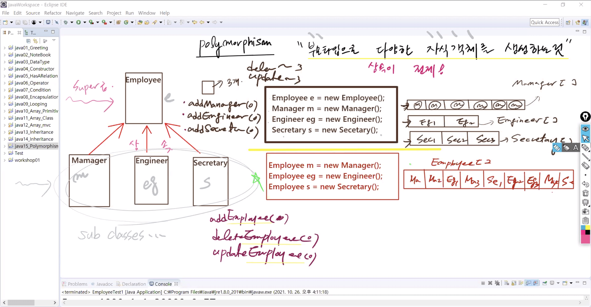
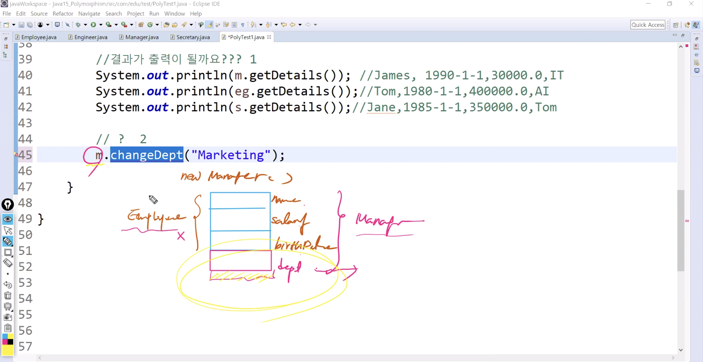

# 1028 Java

1. Polymorphism

2. Static
3. Interface
4. Collection API

===============1~3번 상속

------

## 1. 다형성 (Polymorphism)



* 타입이 다른 이기종 간 핸들링 - 같은 레벨은 일일이 다뤄줘야 함

  * e / eg / m / s - 기능 기하급수적으로 늘어남
  * 단일하게 manage / 핸들링 하려면 같은 레벨 x - 한단계 위에서 
    * super급 : 부모 타입으로 manage
    * 객체를 생성할 때 부모 타입으로 다양한 자식 - 상속이 전제되어야

  

* **Polymorphism  : **

  * 부모 타입으로 다양한 자식 객체를 생성하는 것

    

#### PolyTest1.java

```java
package com.edu.test;
/* 
 * Polymorphism
 * 
 * 부모 타입의 클래스로 자식을 생성하는 것
 * 2가지 이슈가 발생 -> 해결 -> 정확한 이해
 * 1)왜 결과가 멀쩡하게 출력?
 *   -> Virtual Method Invocation
 * 2)왜 에러?
 * 	 -> Object Casting
 * 
 */

import com.edu.child.Engineer;
import com.edu.child.Manager;
import com.edu.child.Secretary;
import com.edu.parent.Employee;
import com.edu.util.MyDate;

public class PolyTest1 {

	public static void main(String[] args) {
		
/*		Employee e = new Employee("Peter", new MyDate(2000,1,1));
		Manager m = new Manager("James", new MyDate(1990,1,1), 30000.0, "IT");
		Engineer eg = new Engineer("Tom", new MyDate(1980,1,1), 400000.0, "AI", 1000);*/
		
		//Polymorphism 방식으로 자식 객체를 생성
//		Employee e = new Employee("Peter", new MyDate(2000,1,1));	//부모
		Employee m = new Manager("James", new MyDate(1990,1,1), 30000.0, "IT");
		Employee eg = new Engineer("Tom", new MyDate(1980,1,1), 400000.0, "AI", 1000);
		Employee s = new Secretary("Jane", new MyDate(1985,1,1), 350000.0, "Tom");
		
		//1)
		System.out.println(m.getDetails());		//James,1990-1-1,30000.0,IT
		System.out.println(eg.getDetails());	//Tom,1980-1-1,400000.0,AI
		System.out.println(s.getDetails());		//Jane,1985-1-1,350000.0,Tom
		
		//2)
		((Manager)m).changeDept("Marketing");
		System.out.println(m.getDetails());		//James,1990-1-1,30000.0,Marketing
		
	}
}
```


#### 2가지 Issue


##### 1. 왜 `System.out.println(m.getDetails());`가 실행?

* **가상함수 호출 (Virtual Method Invocation)**
* Employee이 아닌 Manager의 getDetails이 호출되기 때문
* 상속관계에서 오버라이딩된 동일한 이름의 method가 충돌했을 때 실행타임 시점의 메소드가 컴파일 타임 시점의 메소드보다 우선적으로 실행
* 즉, 자식 클래스가 부모클래스에 있는 메소드를 오버라이딩(Overriding) 했을 때 자식 클래스의 메소드가 호출됨
* * 부모type의 변수.Overriding (); 
    * `e.getDetails();` : 
      * Compile Type Method -> 부모 method 호출
      * Runtime Type Method -> 자식 method실행



##### 2. 왜 `m.changeDept("Marketing");	`는 에러?

* **객체 캐스팅 (Object Casting)**

* `Employee m = new Manager();` -> **업캐스팅(up-casting)**

* 참조변수 m의 타입은 Employee이기 때문에 Manager 클래스가 가지고있는 고유의 Method는 접근 불가

* 즉, 앞서 `Manager m = new Manager();` 로 인스턴스를 생성하였을 경우에는 Employee와 Manager의 method에 모두 접근 가능했지만, 

  `Employee m = new Manager();` 으로 참조변수 타입을 부모클래스로 지정할 경우에는 자식클래스의 고유멤버에는 접근할 수 없다

* 둘다 `new Manager ();`으로 같은 타입의 인스턴스지만, 참조변수의 타입에 따라 사용할 수 있는 멤버의 개수가 달라진다

* 부모클래스의 참조변수 m를 자식클래스인 Manager타입으로 강제형변환한다면 접근 가능

* `((Manager)m).changeDept("Marketing");` ->**다운캐스팅(down-casting)**


## 2. instanceof


* 이기종집합 - 타입이 다 다름
* 같은 레벨에서 핸들링 불가 - super급에서 다뤄야 단일한 관리
* 그래서 부모타입으로 자식 만듦
* 단일한 관리: 

Heterogeneous Collection <-> Homogeneous Collection
 * 
 * 서로 다른 타입을 가지는 이기종간의 집합체
 * -> 이기종간의 자식 클래스들을 부모타입으로 단일하게 관리
 * 이기종간의 다양한 자식클래스들을 단일하게 관리하기 위해서는 부모타입의 []에 담아야
 * 
 * 배열의 전제조건 - SameDataType 
 * -> 여기서는 Manager/Engineer/Secretary로 서로 다른 클래스 타입
 * -> Employee 상속
 * 
 * 그러나 동종간의 집합은 x -> Heterogeneous Collection


#### HeterogeneousTest2.java

```java
package com.edu.test;

import com.edu.child.Engineer;
import com.edu.child.Manager;
import com.edu.child.Secretary;
import com.edu.parent.Employee;
import com.edu.util.MyDate;

public class HeterogeneousTest2 {

	public static void main(String[] args) {
		//이기종간의 다양한 자식클래스들을 단일하게 관리하기 위해서 부모타입의 []에 담긴다
		Employee[]emps= {
				new Manager("James", new MyDate(1990,1,1), 30000.0, "IT"),
				new Engineer("Tom", new MyDate(1980,1,1), 400000.0, "AI", 1000),
				new Secretary("Jane", new MyDate(1985,1,1), 350000.0, "Tom"),
				new Manager("Peter", new MyDate(1982,2,11), 50000.0, "Python"),
				new Manager("Juliet", new MyDate(1992,3,1), 65000.0, "Education")
		};
		
		//자식들은 부모타입 container에 담길 수 있다
//		for(Employee e : emps) System.out.println(e.getDetails());
		
		System.out.println("=========모든 고용인들의 연봉 출력=========");
		int total = 0;
		for(Employee e : emps) {
			System.out.println("Information: "+e.getDetails());
			System.out.println("AnnualSalary: "+e.getSalary()*12);
			System.out.println("------------------------------------");
		}
	} //main
} //class
```

```
=========모든 고용인들의 연봉 출력=========
Information: James,1990-1-1,30000.0,IT
AnnualSalary: 360000.0
------------------------------------
Information: Tom,1980-1-1,400000.0,AI
AnnualSalary: 4800000.0
------------------------------------
Information: Jane,1985-1-1,350000.0,Tom
AnnualSalary: 4200000.0
------------------------------------
Information: Peter,1982-2-11,50000.0,Python
AnnualSalary: 600000.0
------------------------------------
Information: Juliet,1992-3-1,65000.0,Education
AnnualSalary: 780000.0
------------------------------------
```

* 여기서 Tom은 bonus를 더해줘야함
* emps중에서 실질적으로 생성된 자식객체 타입을 알아야할 필요가 있다
* 부모타입으로 생성된 객체가 Manager, Engineer, Secretary 인지 알아야한다
* 이럴 때 사용하는 키워드가 **instanceof**

```java
package com.edu.test;

import com.edu.child.Engineer;
import com.edu.child.Manager;
import com.edu.child.Secretary;
import com.edu.parent.Employee;
import com.edu.util.MyDate;


public class HeterogeneousTest2 {

	public static void main(String[] args) {
		//이기종간의 다양한 자식클래스들을 단일하게 관리하기 위해서는 부모타입의 []에 담아야
		Employee[]emps= {
				new Manager("James", new MyDate(1990,1,1), 30000.0, "IT"),
				new Engineer("Tom", new MyDate(1980,1,1), 400000.0, "AI", 1000),
				new Secretary("Jane", new MyDate(1985,1,1), 350000.0, "Tom"),
				new Manager("Peter", new MyDate(1982,2,11), 50000.0, "Python"),
				new Manager("Juliet", new MyDate(1992,3,1), 65000.0, "Education")
		};
		
		System.out.println("=========모든 고용인들의 연봉 출력=========");
		int total = 0;
		
		for(Employee e : emps) {
			//e타입으로 생성된 객체타입이 Engineer가 맞다면
			if(e instanceof Engineer) {
				System.out.println("Information Engineer: "+e.getDetails());
				System.out.println("AnnualSalary: "+((e.getSalary())*12+((Engineer) e).getBonus()));	//int끼리 먼저 연산 후 String과 연산 - Non String과 String 붙으면 String으로 계산됨
				System.out.println("------------------------------------");
			}
			else if (e instanceof Manager) {
				System.out.println("Information Manager: "+e.getDetails());
				((Manager) e).changeDept("교육부");
				System.out.println("Change Dept: "+((Manager) e).getDetails());
				System.out.println("------------------------------------");
			}
			else {
			System.out.println("Information: "+e.getDetails());
			System.out.println("AnnualSalary: "+e.getSalary()*12);
			System.out.println("------------------------------------");
		}
		}
				
	} //main

} //class
```

```
=========모든 고용인들의 연봉 출력=========
Information Manager: James,1990-1-1,30000.0,IT
Change Dept: James,1990-1-1,30000.0,교육부
------------------------------------
Information Engineer: Tom,1980-1-1,400000.0,AI
AnnualSalary: 4801000.0
------------------------------------
Information: Jane,1985-1-1,350000.0,Tom
AnnualSalary: 4200000.0
------------------------------------
Information Manager: Peter,1982-2-11,50000.0,Python
Change Dept: Peter,1982-2-11,50000.0,교육부
------------------------------------
Information Manager: Juliet,1992-3-1,65000.0,Education
Change Dept: Juliet,1992-3-1,65000.0,교육부
------------------------------------
```


## 3. 

재사용성 높이는 코드

```java
package com.edu.test;

import com.edu.child.Engineer;
import com.edu.child.Manager;
import com.edu.child.Secretary;
import com.edu.parent.Employee;
import com.edu.service.EmployeeService;
import com.edu.util.MyDate;

public class HeterogeneousTest3 {

	public static void main(String[] args) {
		Employee[]emps= {
				new Manager("James", new MyDate(1990,1,1), 30000.0, "IT"),
				new Engineer("Tom", new MyDate(1980,1,1), 400000.0, "AI", 1000),
				new Secretary("Jane", new MyDate(1985,1,1), 350000.0, "Tom"),
				new Manager("Peter", new MyDate(1982,2,11), 50000.0, "Python"),
				new Manager("Juliet", new MyDate(1992,3,1), 65000.0, "Education")
		};
		
		EmployeeService service = new EmployeeService();
		service.manageEmployee(emps[0]); //Manager James를 입력
	    service.manageEmployee(emps[1]); //Engineer Tom를 입력

		
		service.printAllEmployee(emps);
		
	} //main

} //class

```

```
Manager Change Dept: James,1990-1-1,30000.0,오락부
Engineer AnnualSalary: 4801000.0
James,1990-1-1,30000.0,오락부
Tom,1980-1-1,400000.0,AI
Jane,1985-1-1,350000.0,Tom
Peter,1982-2-11,50000.0,Python
Juliet,1992-3-1,65000.0,Education
```


## 4. Static

static 키워드에 대한 정리

1. static으로 지정된 멤버는 객체 생성할 필요 없이 바로 접근해서 사용 가능하다
2. class(실행파일 - byteCode)파일이 메모리(JVM)에 로더되는 과정에서 미리 메모리에 올라간다
3. static으로 지정한 변수는 local레벨에서 사용할 수 없다
4. static으로 지정된 변수는 생성된 객체들에서 공유된다	!!!!!!
5. static키워드는 final키워드와 거의 함께 많이 쓰인다
6. Filed(Member V)		vs. 	Local V		vs. 	static V

* static으로 지정한 것들은 객체 생성 필요없이 `클래스 이름.`으로 바로 사용 가능 (메모리에 미리 올라감)

#### StaticExamTest1.java

* static 1,2,3에 대한 코드

```java
package com.edu.test;

/*
 * static 1,2,3에 대한 코드
 * 1. static으로 지정된 멤버는 객체 생성할 필요 없이 바로 접근해서 사용 가능하다
 * 2. class(실행파일 - byteCode)파일이 메모리(JVM)에 로더되는 과정에서 미리 메모리에 올라간다
 * 3. static으로 지정한 변수는 local레벨에서 사용할 수 없다
 */

class Member{
	static String name = "홍길동";	//static V
	static int age = 19;			//static V
	int count = 1;					//field
	
	//static
	public static void getMember() {
		System.out.println("우윳빛깔 " + name);
	}
	
	//non-static
	public void getMember2() {
		//static은 local 레벨로 사용할 수 없다
//		static String address = "한남동";
		System.out.println("우윳빛깔 " + name);
	}
	
	//static
	public static void getMember3() {
		System.out.println("우윳빛깔 " + name);
//		count++; //non-static - 에러
	}
}

public class StaticExamTest1 {

	public static void main(String[] args) { 			//main은 static
		//Member에 있는 getMember()를 사용 - 호출
		//static으로 지정한 것들은 객체 생성 필요없이 클래스 이름.으로 바로 사용 가능 (메모리에 미리 올라감)
		Member.getMember(); 
		
//		Member.getMember2();	//static 영역에서 non-static 멤버 사용 불가 - static은 static끼리
		Member m = new Member(); //객체 생성(메모리 올린) 다음에 사용 가능
		m.getMember2();

	}

}

```


#### StaticExamTest2.java

* 4. static한 멤버는 생성된 객체들이 다 공유한다

```java
package com.edu.test;

class Car{
	int serialNumber;		//field
	static int counter;		//static V - local이 아니기 때문에 기본값 0
	
	Car(){
		counter++;	//1,2,3,4,...
		serialNumber = counter;
	}
	
}

public class StaticExamTest2 {

	public static void main(String[] args) {
		Car car1 = new Car();
		Car car2 = new Car();
		Car car3 = new Car();
		
		System.out.println("===========Field Serial Number===========");
		System.out.println(car1.serialNumber);	//1
		System.out.println(car2.serialNumber);	//2
		System.out.println(car3.serialNumber);	//3
		
		System.out.println("===========Static Counter===========");
		System.out.println(car1.counter);		//3
		System.out.println(car2.counter);		//3
		System.out.println(car3.counter);		//3
		System.out.println(Car.counter);		//3

	}
}
```

```
===========Field Serial Number===========
1
2
3
===========Static Counter===========
3
3
3
3
```

1.static은 class area에 먼저 올라감

초기화 아직 x - 0

2.이후 객체 생성

스택에 참조변수를 위한 공간

3.힙에 new로 생성된 객체 올라감 - 3개


4. 첫번째 자동차가 만들어 졌을때

- 카의 멤버는 시리얼넘버밖에없음 - 먼저 하나
- 차가 한대 만들어지면 카운터 증가 - 1 -> 시리얼넘버에 들어감
- 주소할당 - 참조
- `System.out.println(car1.serialNumber);` -> 1
- `System.out.println(car1.counter);` -> 1
- counter는 class area에 올라가 있는 변수
  - area에 있는 값을 공유(share)해서 가져옴
  - 공공장소!!! -> 객체의 멤버가 아님


5.자동차 두개 만들어졌을때

* 카운터 2
* 시리얼넘버 2
* `System.out.println(car1.counter);` -> 2
* `System.out.println(car2.counter);` -> 2


* 필드는 생성된 객체마다 서로 다른 값을 가짐 (Specific)
* 왜? 객체의 멤버이기 떄문
* static 변수는 동일한 값을 서로 다른 객체가 공유
* 왜 ? 공공의 값이기 때문에
* 증가한 값을 서로 sharing!
* 클래스 / 레퍼런스 변수 둘다 공유한 값을 가져옴


### final

static과 final은 다른 의미이지만 거의 함께 쓰임


#### StaticExamTest3.java

```java
package com.edu.test;
/*
 * static 키워드는 상수값을 지정할 때 쓰이는 final 키워드와 함께 사용되는 경우가 많다
 * 
 * Usage Modifier
 * final static abstract
 * 
 * 1.final
 * "내가 마지막이야" 라는 의미를 가지는 키워드이다
 * final + 변수 : 내가 마지막 변수야 -> 상수값
 * final + 메소드 : 내가 마지막 메소드야 -> 오버라이딩 금지
 * final + 클래스 : 내가 마지막 클래스야 -> 상속 금지
 * 
 * final과 static 순서는 상관없음
 * 
 */

class A{
	public final static int BASIC_SALAY = 1000;
	public final String test() {
		return "Overriding 금지";
	}
	
final class B{
	
}

//class C extends B{}

class D extends A{
//	public String test() {
//		return "Overriding 금지"+100;
//	BASIC_SALAY = 2000;
}

}
public class StaticExamTest3 {

	public static void main(String[] args) {
		// TODO Auto-generated method stub

	}
}
```


#### StaticExamTest4.java

```java
package com.edu.test;

public class StaticExamTest4 {
	static int i=0;
	
	//1.main method - static block
	public static void main(String[] args) {
		System.out.println("1. main method - static block - "+i);	//0

	}//main
	
	//2.static initialization(초기화)
	static {
		i=300;
		System.out.println("2. static initialization block - "+i);	//300
	}

}//class
```

```
2. static initialization block - 300
1. main method - static block - 300
```

* main 보다 static initialization 블락이 더 먼저 돌아감


