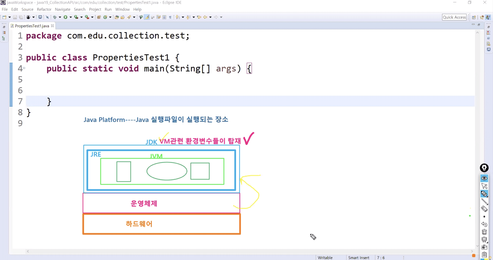
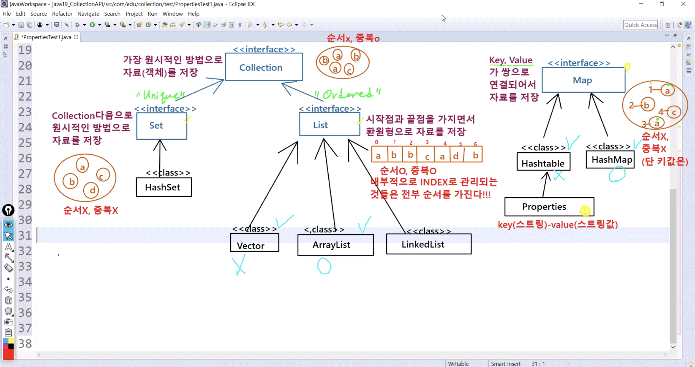
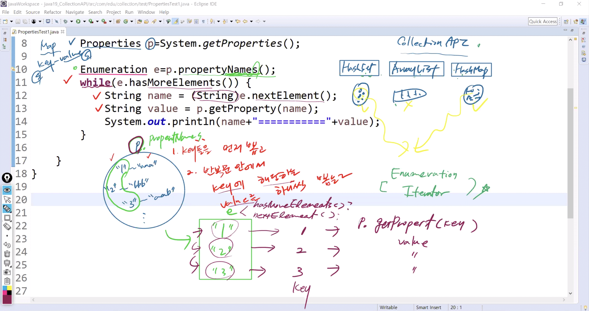

# 1029 Java

## 1. Java Platform

* Java Platform: java 실행파일이 실행되는 장소
  * JDK : VM 관련 환경변수들이 탑재가 됨
    * JRE > JVM > 스택(Stack), 힙(Heap), 클래스영역(Class area)
  * 운영체제
  * 하드웨어




## 2. Collection API

* Collection API : 여러 객체들을 담아내는 인터페이스들의 특징
  * [Collection](https://docs.oracle.com/javase/8/docs/api/java/util/Collection.html) 참고



* **collection** : 가장 원시적인 방법으로 객체를 저장 
  - 순서x, 중복o
* **set** : collection 다음으로 원시적인 방법으로 저장 
  * 순서x, 중복x - **unique**
  * python의 tuple과 비슷한 개념
  * HashSet
* **list** : 시작점과 끝점을 가지면서 환원형으로 자료를 저장 
  * 순서o, 중복o - **ordered**
  * python의 list와 비슷한 개념
  * Vector, ArrayList, LinkedList
* **map** : Key와 Value가 쌍으로 연결되어서 자료를 저장 
  * 순서x, key는 중복x, value는 중복o
  * python의 dictionary와 비슷한 개념
  * HashTable, HashMap
    * Properties : key  (String) - value (String)


### 1) 동기화 (Synchronize)

* 병렬적 구조가 아닌 **직선적 구조**
  1. 요청	2. 수행	3.응답
* 메모리 접근에 있어서 동시 접근을 막는 것
  * 하나의 쓰레드가 작업을 하는 동안에는 다른 쓰레드가 작업을 못하도록 객체에 lock을 건다
* 동기화 유무: 
  * Vector vs Arraylist
  * Hashtable vs HashMap 


**Cf) List 종류**

* **Vector**
  * Java 1.0부터 이어져온 리스트 객체로 배열 형태를 이룬다.
  * 동기화가 항상 이루어진다
  * 데이터 입출력 정확도는 높으나 엄청난 lock 때문에 무거워 성능이 저하된다.

*  **ArrayList**
  * 동기화 하지않은 vector와 똑같은 구조
  * 속도는 빠르나 데이터 안정성을 위해 직접 동기화 처리를 걸어야 한다.

* **LinkedList**
  * 노드간에 연결을 통해 리스트로 구현된 객체이다.
  * 노드의 주소 필드로 이어져 있는 구조여서 데이터의 검색은 순차적으로 일어난다. 
  * 비순차적인 데이터의 삽입/삭제시 노드의 주소지만 변경하면 되므로 용이하다.


### 2) Properties

#### PropertiesTest1.java

* properties의 부모 = map 
  * Key와 Value 쌍으로 저장
  * 파편적인 상수값을 저장하는데 쓰임

```java
package com.edu.collection.test;

import java.util.Enumeration;
import java.util.Properties;

public class PropertiesTest1 {
	public static void main(String[] args) {
		Properties p=System.getProperties();		//리턴타입 Properties
		
		Enumeration e=p.propertyNames();			//propertyNames : key 뽑아냄
		while(e.hasMoreElements()) {				//hasMoreElements : Element있니 없니 
			String name = (String)e.nextElement();	//nextElement : 있으면 뽑아라 - String
			String value = p.getProperty(name);		//value 리턴
			System.out.println(name+"=========="+value);
		}//while
	}//main
}//class
```

* Properties 출력 순서

  1. `p.propertyNames()` : key 먼저 뽑는다.

  2. 반복문 안에서 Key에 해당하는 value 를 하나씩 뽑는다.

     **Enumeration / Iterator** 사용

     1. `hasMoreElements()` /`hasNext()` : 요소가 있는지 없는지
        *  return true / false
     2. `nextElements()` / `next()` : 해당 요소를 뽑는다




### 2) Set

Set Method

 * 		`add(E e)` : Adds the specified element to this set if it is not already present (optional operation).
      * 	`boolean`
 * 		`size()` : Returns the number of elements in this set (its cardinality).
      *  `int`
 * 		`remove(E)` : Removes the specified element from this set if it is present (optional operation).
      *  `boolean`
 * 		`clear()` : Removes all of the elements from this set (optional operation).
      *  void
 * 		`isEmpty()` : Returns `true` if this set contains no elements.
      *  boolean
 * 		`contains(E)` : Returns `true` if this set contains the specified element.
      *  boolean


#### HashSetTest2.java

Set - HashSet의 데이터 저장 방법을 알아보는 로직을 작성

 * 		순서가 없다 : 내부적으로 index 관리가 안된다
 * 		중복을 허용하지 않는다 : 설사 중복이 되었다 하더라도 저장되지 않는다

```java
package com.edu.collection.test;

import java.util.HashSet;

public class HashSetTest2 {

	public static void main(String[] args) {
		//<E> Set안에 들어있는 객체 타입을 미리 지정할 수 있다
		HashSet<String> set = new HashSet<String>();
		set.add("서장훈");
		set.add("이수근");
		set.add("강호동");
		set.add("강호동");
		set.add("김희철");
		
		System.out.println("몇명? " +set.size()); 	//4 -> 중복허용x
		
		//Set안에 들어있는 데이터를 출력	
		//1.입력된 순서대로 출력되지 않는다 - 순서가 없음을 확인
		//2.Collection에서는 toString()이 데이터를 리턴하도록 자체적으로 오버라이딩 되어져있다
		System.out.println(set.toString());			//[서장훈, 강호동, 이수근, 김희철]
		System.out.println(set);					//위와 동일 - 주소값 x
		
		//김영철이 포함되어져 있는지 여부
		System.out.println("김영철이 포함? "+set.contains("김영철"));	//false
		
		//강호동을 삭제
		set.remove("강호동");
		System.out.println(set);	//[서장훈, 이수근, 김희철]
		
		//set에 저장된 모든 데이터를 삭제
		set.clear();
		
		System.out.println("set안이 다 비워져 있는가? "+set.isEmpty());		//true
		System.out.println(set);	//[]	

	}
}
```


### 3) List

list의 Method

* `remove(int index)` : Removes the element at the specified position in this list (optional operation).
  * return `E`
* `remove(Object o)` : Removes the first occurrence of the specified element from this list, if it is present (optional operation).
  * return `boolean`


#### ArrayListTest3.java

List - ArrayList의 데이터 저장 방법을 알아보는 로직을 작성

 *  	순서가 있다 : 내부적으로 index로 관리된다
 *  	데이터 중복을 허용한다

```java
package com.edu.collection.test;

import java.util.ArrayList;
import java.util.List;

public class ArrayListTest3 {

	public static void main(String[] args) {
		List<String> list = new ArrayList<String>();
		
		list.add("강호동");
		list.add("이수근");
		list.add("강호동");
		list.add("김영철");
		list.add("서장훈");
		
		System.out.println(list); 	//순서가 있음(입력한 순서대로 출력), 중복 허용
		
		//2번째(index 1)데이터 삭제
		String removeName=list.remove(1); //삭제된 데이터 자체가 리턴
		System.out.println(removeName+" 님을 삭제");
		System.out.println(list);
		
		//가장 첫번째에 김희철을 추가
		list.add(0,"김희철");
		System.out.println(list);
		
		//list의 멤버들 중에서 이름이 서장훈인 사람을 찾아서 출력
		//for, equals, get
		for(int i=0;i<list.size();i++) {
			if(list.get(i).equals("서장훈"))
				System.out.println(list.get(i));
					}
	}
}
```


### 4) Map

Map Method

* `put(K key, V value)` : Associates the specified value with the specified key in this map (optional operation).

  * key와 value 모두 저장
  * return  `V`

* `keySet()` : Returns a Set view of the keys contained in this map.

  * 모든 키를 가져올 때
  * return  `Set<K>`

 * `get(Object key)`Returns the value to which the specified key is mapped, or null if this map contains no mapping for the key.

    * return  `V`

 * `remove(Object key)` : Removes the mapping for a key from this map if it is present (optional operation).

    * return  `V`

 * `remove(Object key, Object value)` : Removes the entry for the specified key only if it is currently mapped to the specified value.

    * return  `default boolean`

   

* iterator: 소진 -> 반복 불가 
* set에서 for 사용 불가 -> 순서를 가지는 데이터일 때 (index)


#### HashMapTest4.java

Map - Hashtable - Propertiest의 데이터 저장 방법을 알아보는 로직을 작성

```java
package com.edu.collection.test;

import java.util.Collection;
import java.util.Collections;
import java.util.HashMap;
import java.util.Iterator;
import java.util.Map;
import java.util.Set;

public class HashMapTest4 {
	public static void main(String[] args) {
		
		Map<String, Integer> map = new HashMap<>();
		
		map.put("강호동", 90);
		map.put("서장훈", 95);
		map.put("이수근", 100);
		map.put("김희철", 90);
		map.put("김영철", 92);
		
		//1. map에 저장된 모든 키 값을 받아온다
		Set<String> set = map.keySet();
		//2.Set에 담겨진 key값을 뽑아낸다
		//1)Iterator
		Iterator<String> it = set.iterator();
		
		while(it.hasNext()) {
			String name = it.next();
			int score = map.get(name);
			System.out.println(name+": "+score);
		}
		
		System.out.println("=========================");
		
		//2.for문
//		for(int i=0;i<set.size();i++) 	//index형이라 불가
		int total = 0;
		for(String name : set) {
			int score = map.get(name);
			System.out.println(name+": "+score);
			total += score;
		}
		System.out.println("=========================");
		System.out.println("Total: "+total);
		System.out.println("Avg: "+total/map.size());
		
		
		System.out.println("=========================");
		
		
		Collection<Integer> scores = map.values();
		int total2 = 0;
		for(int score : scores) {
			System.out.println("score: "+score);
			total2 += score;
		}
		System.out.println("=========================");
		System.out.println("Total: "+total2);
		System.out.println("Avg: "+total2/scores.size());
		
		System.out.println("=========================");
		System.out.println("Max: "+Collections.max(scores));
		System.out.println("Min: "+Collections.min(scores));
		
	}
}
```

```
서장훈: 95
강호동: 90
김영철: 92
이수근: 100
김희철: 90
=========================
서장훈: 95
강호동: 90
김영철: 92
이수근: 100
김희철: 90
=========================
Total: 467
Avg: 93
=========================
score: 95
score: 90
score: 92
score: 100
score: 90
=========================
Total: 467
Avg: 93
=========================
Max: 100
Min: 90
```


## 3. 실습

#### PersonArrayTest.java

```java
package com.edu.collection.test2;

import java.util.ArrayList;

import com.edu.collection.vo.Person;

public class PersonArrayTest {

	public static void main(String[] args) {
		//1.ArrayList 객체를 생성 - list
		ArrayList<Person> list = new ArrayList<>();
		
		//2.list에 Person 객체를 추가 - add
		list.add(new Person("강호동","방배동",46));
		list.add(new Person("이수근","신림동",42));
		list.add(new Person("서장훈","서초동",39));
		list.add(new Person("김영철","서초동",40));
		
		//3.list에 저장된 사람들의 평균 연령 출력
		int total=0;
		for(Person p : list) {
			int age = p.getAge();
			total += age;
		}
		System.out.println("평균 나이: "+total/list.size());
		
		//4.서초동에 사는 사람의 정보 출력
		for(Person p : list) {
			if(p.getAddress().equals("서초동"))
				System.out.println("서초동 거주: "+p.getName());
		}	
	}
}
```

```
평균 나이: 41
서초동 거주: 서장훈
서초동 거주: 김영철
```


#### CustomerMapTest.java

```java
package com.edu.collection.test2;

import java.util.HashMap;
import java.util.Set;

import com.edu.collection.vo.Customer;

public class CustomerMapTest {

	public static void main(String[] args) {
		HashMap<String, Customer> map = new HashMap();
		map.put("111", new Customer("KANG","강호동",50));
		map.put("222", new Customer("LEE","이수근",46));
		map.put("333", new Customer("SEO","서장훈",42));
		map.put("444", new Customer("KIM","김희철",38));
		
		//1.키값이 222인 사람을 찾아서 출력
//		Customer c = map.get("222");
//		System.out.println(c);
		System.out.println(map.get("222"));	//overriding

			
		//2.Id가 LEE인 사람을 찾아서 그 사람의 이름을 출력
		Set<String> set = map.keySet();
		for(String key : set) {
			Customer cust = map.get(key);
			if(cust.getCustId().equals("LEE"))
				System.out.println("ID가 LEE인 사람의 이름 : "+cust.getName());
		}
		
		//3.map에 저장된 모든 데이터의 key값을 모두 출력
		Set<String> keys = map.keySet();
		
		System.out.println(keys);
		
//		for(String key : keys) {
//			System.out.println(key);
//		}
		
		//4.map에 저장된 사람들의 나이와 평균 나이를 모두 출력
		Set<String> set2 = map.keySet();
		
		int totalAge=0;
		for(String key : set2) {
			totalAge += map.get(key).getAge();
		}
		System.out.println("멤버들의 평균 연령: "+totalAge/map.size());
		
		

	}//main

}//class
```

```
Customer [custId=LEE, name=이수근, age=46]
ID가 LEE인 사람의 이름 : 이수근
[111, 222, 333, 444]
멤버들의 평균 연령: 44
```


## 4. **J2SE** vs. **J2EE** 

- **J2SE** ( Standard Edition ) :
  일반 자바 프로그램 개발을 위한 용도로 이용되는 개발도구이며 각종 자료구조, 기본 유틸리티, 스윙이나 AWT와 같은 GUI도구등의 기본기능을 포함하고 있다.

- **J2EE** ( Enterprise Edition) :
  엔터프라이즈 환경을 위한 도구로 EJB, JSP, Servlet, JNDI같은 기능을 지원하며 웹 애플리케이션 서버를 이용하는 프로그램 개발시 많이 사용한다.

