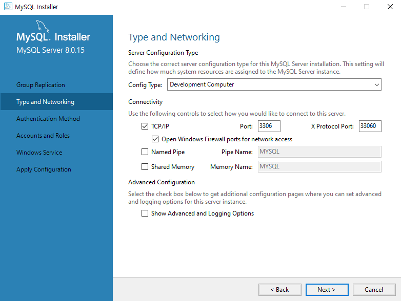
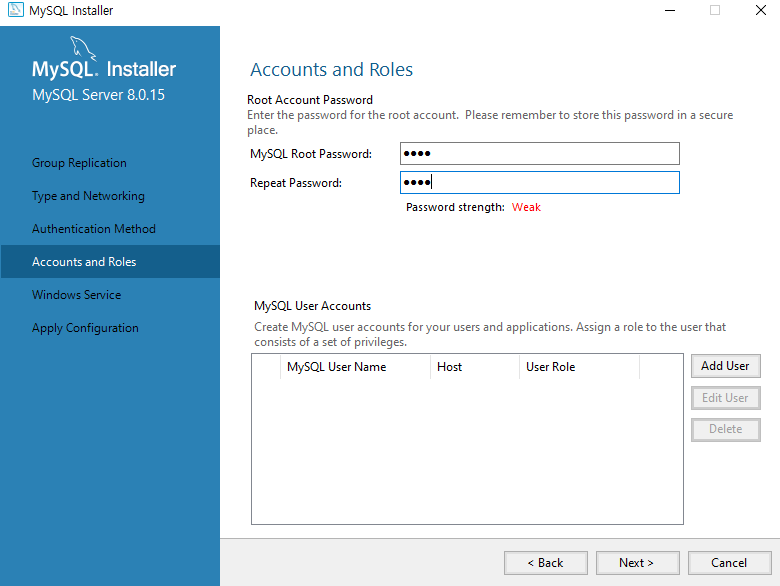
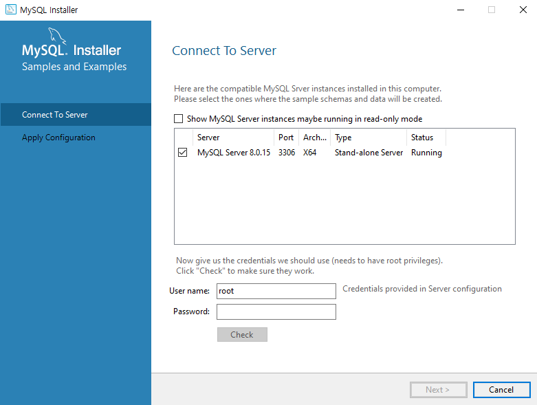
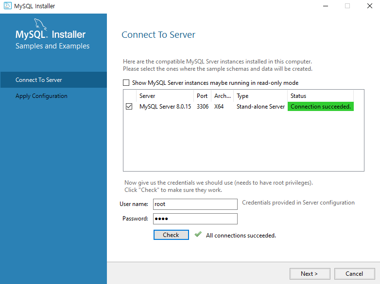
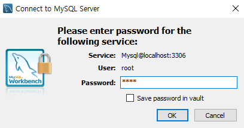

# 1101 Java

## 1. 예외처리 (Exception)

예외 (Exception) : 

* 프로그램을 실행하는 도중에 발생하는 예기치 못한 상황으로 일종의 버그
* 버그를 처리하지 않고서는 프로그램을 정상적으로 실행할 수 없다
* try, cathch, finally, throws, throw ...


[java.lang.Throwable](https://docs.oracle.com/javase/8/docs/api/java/lang/Throwable.html)

* Throwable 자식은 2개 
  * Exception / Error 
  * 이 중 우리가 다룰 것은 Exception !!

1. Exception : Mild한 손상
   - Runtime 계열 : Compiler가 인식 x, 컴파일은 됨 but 실행이 안됨
   - Compile 계열: Compiler가 인식, 컴파일 자체가 안됨

2. Error : Serious한 손상
   - 개발자가 프로그램적 처리로 살릴 수 x
   - JVM Death
   - Phsical Memory full down 


## 2. RuntimeException

Runtime Exception
* 컴파일러가 인식을 못함 - 컴파일은 되고 실행할 때 예외를 발생시킨다
 * 예외처리를 굳이 명시적으로 할 필요가 없고 소스코드를 수정하기만 하면 된다


명시적으로 예외 처리하는 방법
* try 블록 : 기본적으로 맨 먼저 실행되는 코드로 여기에서 발생한 예외는 catch 블록에서 처리
* catch 블록 : try 블록에서 발생한 예외 코드나 예외 객체를 인수로 전달받아 그 처리를 담당
* finally 블록 : 이 블록은 try 블록에서 예외가 발생하건 안 하건 맨 마지막에 무조건 실행

```java
try{
    	//예외 발생 가능성 있는 코드
    	//만약에 예외 발생이 안되면 이 부분이 수행
}catch(예외 타입){
    	//예외를 잡았을 때 수행되는 코드
    	//만약에 try 블락에서 예외가 발생되면 이 부분으로 내려옴
}finally{
    	//예외 발생하든 안하든 무조건 수행되어져야 하는 코드
}
```


#### RuntimeExceptionTest1.java

```java
package exception.runtime.test;

public class RuntimeExceptionTest1 {
	public static void main(String[] args) {
		String[] str= {
				"Hello JAVA",
				"No, I Mean it",
				"Nice to meet you"
		};
		
		int i=0;        
		while(i<=3) {										//4가 되면 loop 빠져나옴 
			try {
				System.out.println(str[i]);					//i=0,1,2일때는 예외 x, i=3일때 예외(버그) - JVM: 발생한 타입으로 객체로 (버그도 객체로 핸들링!) -> 다시 프로그램으로
			}catch(ArrayIndexOutOfBoundsException e) {		//JVM이 만든 객체(ArrayIndexOutOfBoundsException)로 catch!!
				System.out.println("Nice Catch");			
			}
			i++;											//i=0->1->2->3->4
		}
		System.out.println("while loop the end");
	}
}
```

```
Hello JAVA
No, I Mean it
Nice to meet you
Nice Catch
while loop the end
```


#### RuntimeExceptionTest2.java

* catch는 여러번 할 수 있다
   * 하지만 그 중에서 하나의 catch만 수행된다
   * 작은 것(자식)  --> 큰 것(부모) 순으로

```java
package exception.runtime.test;

public class RuntimeExceptionTest2 {
	public static void main(String[] args) {
		String[] str= {
				"Hello JAVA",
				"No, I Mean it",
				"Nice to meet you"
		};
		
		int i=0;
		while(i<=3) {										
			try { 
				System.out.println(str[i]);				//i=3일때 JVM:ArrayIndexOutOfBoundsException으로 버그 객체 던져 
			}catch(NullPointerException e) {	
				System.out.println("Nice Catch 1");		//catch 안됨
			}catch(ArithmeticException e) {		
				System.out.println("Nice Catch 2");		//catch 안됨
			}catch(ArrayIndexOutOfBoundsException e) {		
				System.out.println("Nice Catch 3");		//catch 됨
			}
			i++;											
		}
		System.out.println("while loop the end");
	}
}
```


#### RuntimeExceptionTest3.java

* 상황에 맞는 Exception을 catch해야

````java
package exception.runtime.test;

import java.sql.SQLException;

public class RuntimeExceptionTest3 {

	public static void main(String[] args) {
		String[] str= {
				"Hello JAVA",
				"No, I Mean it",
				"Nice to meet you"
		};
		
		int i=0;
		while(i<=3) {										
			try { 
				System.out.println(str[i]);				//i=3일때 JVM:ArrayIndexOutOfBoundsException으로 버그 객체 던져 
			}catch(NullPointerException e) {	
				System.out.println("Nice Catch 1");		//catch 안됨
			}catch(ArithmeticException e) {		
				System.out.println("Nice Catch 2");		//catch 안됨
			}catch(NegativeArraySizeException e) {		
				System.out.println("Nice Catch 3");		//catch 안됨 -> 비정상 종료
			}
			i++;													
		}//
		
		System.out.println("while loop the end...");
	}//
}//

````


## 3. CompileException

**Cf) FileReader**

```java
public FileReader(String fileName)
           throws FileNotFoundException
```

Creates a new `FileReader`, given the name of the file to read from.

- **Parameters:**

  `fileName` - the name of the file to read from

- **Throws:**

  `FileNotFoundException` - if the named file does not exist, is a directory rather than a regular file, or for some other reason cannot be opened for reading.


#### CompileExceptionTest1.java

```java
package exception.compile.test;

import java.io.FileNotFoundException;
import java.io.FileReader;

class FileReading{
	public void readFile(String filename) {
		//File을 읽기 위한 기능을 가지고 있는 클래스를 제공 - FileReader
		//FileReader 객체를 생성하면 무조건 예외가 터지도록 만들었다
		try {
			FileReader fr = new FileReader(filename);
			System.out.println("FileReader Creating...");
		} catch (FileNotFoundException e1) {
			System.out.println("파일을 찾지 못했습니다");
			
			/* 
			 * 1.비워두거나
			 * 2.e.pringStackTrade(), e.getMessage()
			 * 3.System.out.println("")
			 */
		}
		System.out.println("file end...");
	}	//readfile
}	//class


public class CompileExceptionTest1 {
	public static void main(String[] args) {
		FileReading fr = new FileReading();
		String path = "C:\\miracom_edu\\util\\message.txt";
		
		fr.readFile(path);
		System.out.println("파일을 잘 읽어들였습니다");
		
	}
}
```

```
FileReader Creating...
file end...
파일을 잘 읽어들였습니다
```


#### 

* finally 구문이 실행되지 않는 경우
   1. 원인모를 이유에 의해서 컴퓨터의 파워가 꺼진 경우
   2. finally 블락 안에서 또다른 예외가 발생할 경우 - 지금 !!!!

      -> 예외를 다시 처리하고 finally 수행


### 1) 예외 처리 방법1

* 명시적으로 그자리에 즉각적으로 처리
   * 	  try ~catch
* `catch (IOException e` 사용

#### CompileExceptionTest2.java

```java
package exception.compile.test;

/*
 * finally 구문이 실행되지 않는 경우
 * 1. 원인모를 이유에 의해서 컴퓨터의 파워가 꺼진 경우
 * 2. finally 블락 안에서 또다른 예외가 발생할 경우 - 지금 !!!!
 * 	  -> 예외를 다시 처리하고 finally 수행
 */

import java.io.FileNotFoundException;
import java.io.FileReader;
import java.io.IOException;

class FileReading2{
	public void readFile(String filename) {
		
		FileReader fr = null;								//2)한단계 위의 local V로 선언
		
		try {
			//Stream 자원을 열어서 사용하겠다 == 객체 생성의 의미
//			FileReader fr = new FileReader(filename);		//1)try블럭 안에서만 사용되는 local V
			fr = new FileReader(filename);					//3)새로 생성한 local V 사용
			
			System.out.println("FileReader Creating...");
			
		} catch (FileNotFoundException e1) {
			System.out.println("파일을 찾지 못했습니다");		
			
		}finally {
			//위에서 열어서 사용한 자원은 finally 블럭 안에서 닫아준다.
			try {
				fr.close();	
				System.out.println("자원을 닫습니다");			//또 다른 예외 발생
			} catch (IOException e) {						//다시 처리
			}
		}
		System.out.println("file end...");
		
	}	//readfile
}	//class


public class CompileExceptionTest2 {
	public static void main(String[] args) {
		FileReading2 fr = new FileReading2();
		String path = "C:\\miracom_edu\\util\\message.txt";
		
		fr.readFile(path);
		System.out.println("파일을 잘 읽어들였습니다");
		
	}	//main
}	//
```


### 2) 예외처리 방법 2

* 즉각적으로 처리하지 않고 발생한 예외를 던지는 방법
   * 	  throws

#### CompileExceptionTest3.java

```java
package exception.compile.test;

import java.io.FileNotFoundException;
import java.io.FileReader;

class FileReading3{
	//readFile 메소드를 호출한 곳으로 예외가 던져진다 !!!
	public void readFile(String filename) throws FileNotFoundException{
		
		//발생한 예외 객체를 던진다
		FileReader fr = null;								
		fr = new FileReader(filename);					
			
		System.out.println("FileReader Creating...");
		System.out.println("file end...");
		
	}	//readfile
}	//class

public class CompileExceptionTest3 {
	//main 메소드를 호출한 곳(JVM)으로 예외가 던져진다 !!!
	public static void main(String[] args) throws FileNotFoundException{
		FileReading3 fr = new FileReading3();
		String path = "C:\\miracom_edu\\util\\message.txt";
		fr.readFile(path);		
		System.out.println("파일을 잘 읽어들였습니다");
		
	}	//main
}	//
```


### 3) 예외처리 방법 1 & 2

* throws로 예외 처리 +  finally 쓰기 위해 try

#### CompileExceptionTest3.java

```java
package exception.compile.test;

import java.io.FileNotFoundException;
import java.io.FileReader;
import java.io.IOException;

class FileReading3{
	//readFile 메소드를 호출한 곳으로 예외가 던져진다 !!!
//	public void readFile(String filename) throws FileNotFoundException, IOException{		//여러개 던질 수 있다
	public void readFile(String filename) throws IOException{								//IOException으로 하나만 던져도 됨 - 부모
		
		//발생한 예외 객체를 던진다
		FileReader fr = null;	
		try {																				//throws는 예외 던지는데 finally 쓰기 위해 try
			fr = new FileReader(filename);		//FileNotFoundException			
		
			System.out.println("FileReader Creating...");
			System.out.println("file end...");			
		}finally {
			fr.close();							//IOException
		}
	}	//readFile
}	//class


public class CompileExceptionTest3 {
	//main 메소드를 호출한 곳(JVM)으로 예외가 던져진다 !!!
	public static void main(String[] args) {
		FileReading3 fr = new FileReading3();
		String path = "C:\\miracom_edu\\util\\message.txt";
		try {
			fr.readFile(path);
		} catch (FileNotFoundException e) {			
		} catch (IOException e) {			
		}		
		System.out.println("파일을 잘 읽어들였습니다");
		
	}	//main

}	//
```


## 4. 사용자 정의 Exception

* 사용자 정의 예외 (User Exception)
  * 내가 직접 Exception 클래스를 정의해서 사용
   * 어떤 특정한 조건이 되었을 때 내가 고의적으로 예외를 발생시키는 것
     * 사용자 정의 Exception은 하나의 강력한 제어문으로 사용된다


#### UserExceptionTest1.java

```java
package exception.user.test;

class User{
	//
	public void go() {											//4) go 실행 
		//스캐너로 i,j값을 실행시점에 입력받는 상황
		int i=10; int j=0;										//5) 변수할당
		System.out.println("1. i,j에 입력된 값으로 연산을 진행합니다...");	//6) 2번째 출력
		if(j==0) {												//7) true
			//ArithmeticException을 발발시켜야 한다
			throw new ArithmeticException();					//8. 폭탄 터져 -> 비정상 종료
		}
		
		//이 부분에서 i/j (10/0) ..ArithmeticException .. 이런 연산이 진행되는 상황이라면?
	}
} //class

public class UserExceptionTest1 {
	
	public static void main(String[] args) {					//1) main 실행
		User user = new User();									
		System.out.println("2. go() calling...");				//2) 1번째 출력
		user.go();												//3) go 메소드 호출
		
		System.out.println("3.프로그램을 종료합니다..");				//비정상 종료로 실행 안됨!
		

	} //main

} //

```

```
2. go() calling...
1. i,j에 입력된 값으로 연산을 진행합니다...
Exception in thread "main" java.lang.ArithmeticException
	at exception.user.test.User.go(UserExceptionTest1.java:19)
	at exception.user.test.UserExceptionTest1.main(UserExceptionTest1.java:31)
```


* 사용자 정의 예외 클래스 생성
  * `ZeroDevide`
  * message 추가
    * "This is ZeroDevide Exception"
    * "분모가 0이면 에러"

```java
package exception.user.test;

//해당 클래스를 Exception으로 만들려면 어떻게 선언?
class ZeroDevide extends Exception{			//Exception 상속
   ZeroDevide(){
	   this("This is ZeroDevide Exception");
	   }
   ZeroDevide(String message){				//생성자 오버로딩
	      super(message);
	   }
} //class

class User{
	//
//	public void go() throws ArithmeticException{				//4) go 실행 
	public void go() throws ZeroDevide{				
		//스캐너로 i,j값을 실행시점에 입력받는 상황
		int i=10; int j=0;										//5) 변수할당
		System.out.println("1. i,j에 입력된 값으로 연산을 진행합니다...");	//6) 2번째 출력
		if(j==0) {												//7) true
			//ArithmeticException을 발발시켜야 한다
//			throw new ArithmeticException();					//8) 폭탄 터져 -> 던져
			throw new ZeroDevide("분모가 0이면 에러");				//사용자 정의 - message error
//			throw new ZeroDevide();				
		}
		
		//이 부분에서 i/j (10/0) ..ArithmeticException .. 이런 연산이 진행되는 상황이라면?
	}
} //class

public class UserExceptionTest1 {
	
	public static void main(String[] args) {					//1) main 실행
		User user = new User();									
		System.out.println("2. go() calling...");				//2) 1번째 출력
		try {
			user.go();											//3) go 메소드 호출
//		}catch(ArithmeticException e) {							//8) 폭탄 catch
		}catch(ZeroDevide e) {
//			System.out.println("날라온 폭탄을 처리했습니다");	
			System.out.println(e.getMessage());	
//			e.printStackTrace();								//개발시에는 써도 되지만 배포시에는 x - 해커들 표적
		}
																
		System.out.println("3.프로그램을 종료합니다..");				//9) 3번째 출력 - 정상 종료
		

	} //main

} //
```

```
2. go() calling...
1. i,j에 입력된 값으로 연산을 진행합니다...
분모가 0이면 에러 / This is ZeroDevide Exception
3.프로그램을 종료합니다..
```


**Cf) `e.printStackTrace();`**

```
2. go() calling...
1. i,j에 입력된 값으로 연산을 진행합니다...
3.프로그램을 종료합니다..
exception.user.test.ZeroDevide: This is ZeroDevide Exception
	at exception.user.test.User.go(UserExceptionTest1.java:35)
	at exception.user.test.UserExceptionTest1.main(UserExceptionTest1.java:48)
```

```
2. go() calling...
1. i,j에 입력된 값으로 연산을 진행합니다...
exception.user.test.ZeroDevide: 분모가 0이면 에러
3.프로그램을 종료합니다..
	at exception.user.test.User.go(UserExceptionTest1.java:34)
	at exception.user.test.UserExceptionTest1.main(UserExceptionTest1.java:48)
```

* 개발시에는 써도 되지만 배포시에는 x - 해커들 표적


#### UserExceptionTest2.java

```java
package exception.user.test;

import java.util.Scanner;

class UnderAgeException extends Exception{			
	UnderAgeException(){
		   this("This is UnderAgeException");
		   }
	UnderAgeException(String message){				
		      super(message);
		   }
}//class


class AdultMovieService{
	public void entrance(int age) throws UnderAgeException {
		if(age>=19) {
			System.out.println("Ticketing...OK, Entrance");
		}else {		//고의적으로 예외 객체 생성 - 폭탄
			throw new UnderAgeException("UnderAge!!");
		}
	}
	
}//class

public class UserExceptionTest2 {
	
	public static void main(String[] args) {	
		AdultMovieService service = new AdultMovieService();
		Scanner sc = new Scanner(System.in);
		System.out.println("나이 입력: ");
		int age = sc.nextInt();
		try {
			service.entrance(age);
		}catch(UnderAgeException e) {
			System.out.println(e.getMessage());
		}finally {
			System.out.println("10시가 되어서 마지막 영화를 상영합니다.");
		}
		System.out.println("극장문을 닫습니다..손님들께서는 다 나가주시기 바랍니다.");

	} //main
} //
```

```
나이 입력: 
16
UnderAge!!
10시가 되어서 마지막 영화를 상영합니다
극장문을 닫습니다..손님들께서는 다 나가주시기 바랍니다
```

```
나이 입력: 
25
Ticketing...OK, Entrance
10시가 되어서 마지막 영화를 상영합니다.
극장문을 닫습니다..손님들께서는 다 나가주시기 바랍니다.
```


## 5. MySQL 설치

zip 압축 해제





* password :1234



* password 입력 후 check





