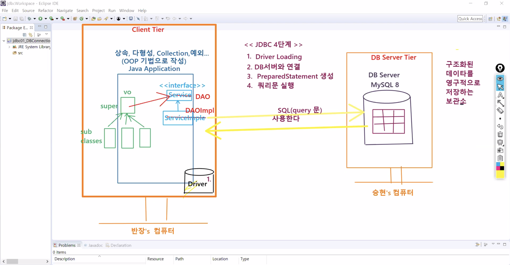
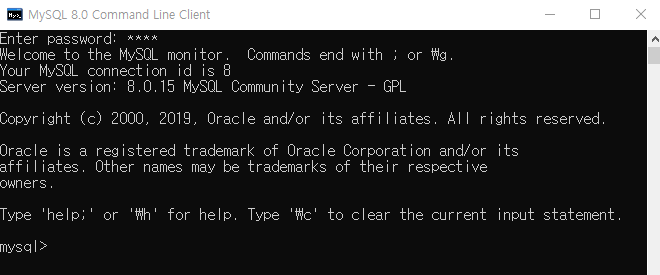
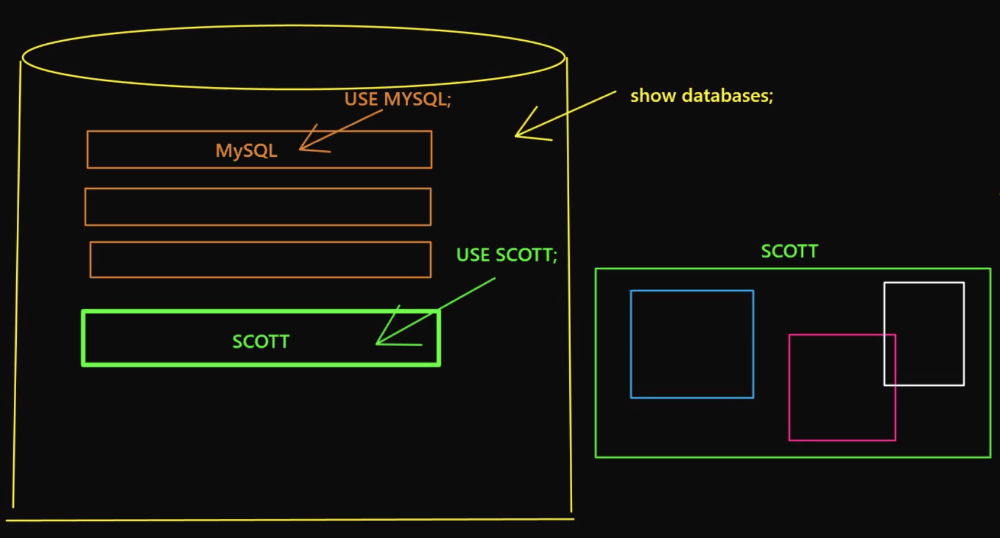
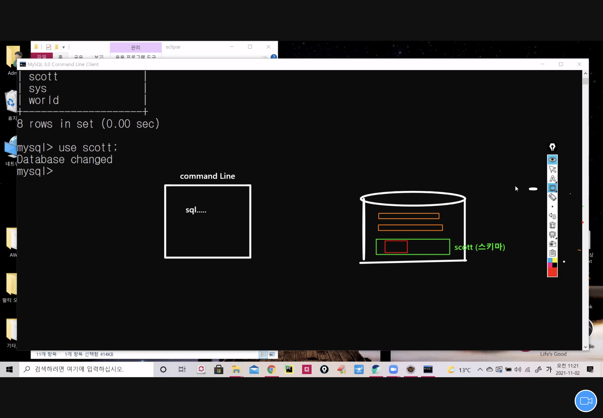
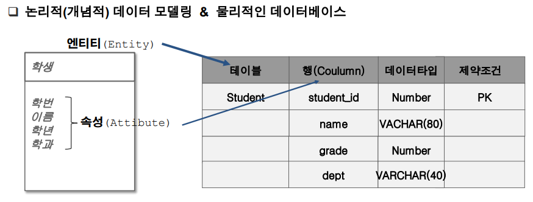
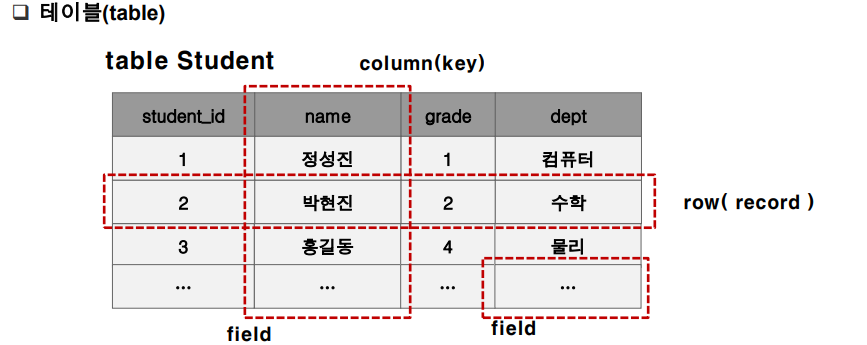
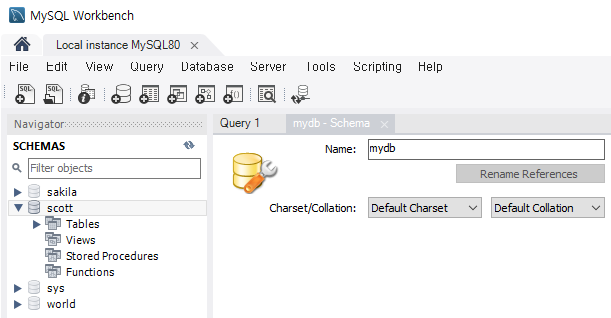
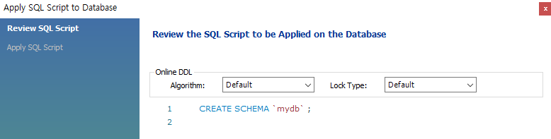

# 1102 Jdbc

# 0. eclipse 설정 변경

1. swtich workspace - jdbcWorkspace
2. open perspective - java
3. preferences - General - Workspace - encoding : UTF-8


## 1.

test 돌고 프로그램 끝나면 날라감 - 프로그램이 끝나더라도 데이터를 영원히 저장할 수 있는 db서버를 추가로 연결

db server tier: 구조화된 데이터를 영구적으로 저장하는 보관소


투 티어 - jdbc 4단계

1. 드라이버 로딩
2. 디비 서버와 연결
3. prepared Statement 생성
4. 쿼리문 실행


db서버 연결하려면 db 정보 압축한 **드라이버가** 메모리상에 있어야함


dao(databaes access object)

daoimpl




Database 종류

정형 DB (관계형 데이터베이스)

- MySQL, Oracle, MS SQL (sql 문법을 공유)


비정형 DB

* Mongo DB (NO sql)..빅데이터 영향


## MySQL



```
mysql> show databases;
+--------------------+
| Database           |
+--------------------+
| information_schema |
| mysql              |
| performance_schema |
| sakila             |
| sys                |
| world              |
+--------------------+
6 rows in set (0.01 sec)
```

```
mysql> use mysql;
Database changed
```

하나의 DB 만들고 실제로 만든 계정을 사용 가능

구조화된 데이터를 저장 - table -> 여러개 있을 수 있음



* scott DB만들기

```
mysql> Create database scott;
Query OK, 1 row affected (0.01 sec)

mysql> show databases;
+--------------------+
| Database           |
+--------------------+
| information_schema |
| mysql              |
| performance_schema |
| sakila             |
| scott              |
| sys                |
| world              |
+--------------------+
7 rows in set (0.00 sec)

mysql> use scott;
Database changed
```


db = 스키마 같은 얘기




* scott.sql 경로 복사

```
mysql> source C:\miracom_edu\util\scott.sql
Query OK, 0 rows affected, 1 warning (0.03 sec)

Query OK, 0 rows affected, 1 warning (0.02 sec)

Query OK, 4 rows affected (0.01 sec)
Records: 4  Duplicates: 0  Warnings: 0

Query OK, 0 rows affected, 1 warning (0.03 sec)

Query OK, 14 rows affected (0.00 sec)
Records: 14  Duplicates: 0  Warnings: 0

ERROR 1064 (42000): You have an error in your SQL syntax; check the manual that corresponds to your MySQL server version for the right syntax to use near 'NULLempno
) ENGINE=InnoDB DEFAULT CHARSET=utf8' at line 4
ERROR 1146 (42S02): Table 'scott.salgrade' doesn't exist
Query OK, 14 rows affected (0.07 sec)
Records: 14  Duplicates: 0  Warnings: 0
```


만들어놓은 쿼리문 한번에 로딩

```
source + 파일 경로 + 파일명
```


* `desc` : table 구조 한번에 보여주는 명령어

```
mysql> desc emp;
+----------+-------------+------+-----+---------+-------+
| Field    | Type        | Null | Key | Default | Extra |
+----------+-------------+------+-----+---------+-------+
| EMPNO    | int(11)     | NO   | PRI | NULL    |       |
| ENAME    | varchar(10) | YES  |     | NULL    |       |
| JOB      | varchar(9)  | YES  |     | NULL    |       |
| MGR      | int(11)     | YES  |     | NULL    |       |
| HIREDATE | datetime    | YES  |     | NULL    |       |
| SAL      | double      | YES  |     | NULL    |       |
| COMM     | double      | YES  |     | NULL    |       |
| DEPTNO   | int(11)     | YES  | MUL | NULL    |       |
+----------+-------------+------+-----+---------+-------+
8 rows in set (0.01 sec)

mysql> desc dept;
+--------+-------------+------+-----+---------+-------+
| Field  | Type        | Null | Key | Default | Extra |
+--------+-------------+------+-----+---------+-------+
| DEPTNO | int(11)     | NO   | PRI | NULL    |       |
| DNAME  | varchar(14) | YES  |     | NULL    |       |
| LOC    | varchar(13) | YES  |     | NULL    |       |
+--------+-------------+------+-----+---------+-------+
3 rows in set (0.00 sec)
```

* 자바의 필드 = 테이블의 컬럼
* 타입 = 컬럼의 타입 :
  * 숫자/날짜/문자
* PRImary key -> null값 불가
  * emp의 EMPNO / dept의 DEPTNO


### Select

* 테이블의 데이터 전부다 불러오기 : `select`
  * db에서 가지고 나오는 쿼리문

```
mysql> SELECT * FROM emp;
+-------+--------+-----------+------+---------------------+------+------+--------+
| EMPNO | ENAME  | JOB       | MGR  | HIREDATE            | SAL  | COMM | DEPTNO |
+-------+--------+-----------+------+---------------------+------+------+--------+
|  7369 | SMITH  | CLERK     | 7902 | 1980-12-17 00:00:00 |  800 | NULL |     20 |
|  7499 | ALLEN  | SALESMAN  | 7698 | 1981-02-20 00:00:00 | 1600 |  300 |     30 |
|  7521 | WARD   | SALESMAN  | 7698 | 1981-02-22 00:00:00 | 1250 |  500 |     30 |
|  7566 | JONES  | MANAGER   | 7839 | 1981-04-02 00:00:00 | 2975 | NULL |     20 |
|  7654 | MARTIN | SALESMAN  | 7698 | 1981-09-28 00:00:00 | 1250 | 1400 |     30 |
|  7698 | BLAKE  | MANAGER   | 7839 | 1981-05-01 00:00:00 | 2850 | NULL |     30 |
|  7782 | CLARK  | MANAGER   | 7839 | 1981-06-09 00:00:00 | 2450 | NULL |     10 |
|  7788 | SCOTT  | ANALYST   | 7566 | 1987-04-19 00:00:00 | 3000 | NULL |     20 |
|  7839 | KING   | PRESIDENT | NULL | 1981-11-17 00:00:00 | 5000 | NULL |     10 |
|  7844 | TURNER | SALESMAN  | 7698 | 1981-09-08 00:00:00 | 1500 |    0 |     30 |
|  7876 | ADAMS  | CLERK     | 7788 | 1987-05-23 00:00:00 | 1100 | NULL |     20 |
|  7900 | JAMES  | CLERK     | 7698 | 1981-12-03 00:00:00 |  950 | NULL |     30 |
|  7902 | FORD   | ANALYST   | 7566 | 1981-12-03 00:00:00 | 3000 | NULL |     20 |
|  7934 | MILLER | CLERK     | 7782 | 1982-01-23 00:00:00 | 1300 | NULL |     10 |
+-------+--------+-----------+------+---------------------+------+------+--------+
14 rows in set (0.00 sec)
```

* 사원 14명 


#### NULL 

* SMITH의 상사는?
  * MGR = 7902 -> FORD가 상사
* KING의 상사는?
  * MGR = NULL -> 무슨 의미 ??

* NULL은 의미를 가지고 있는 값 !!!!!!!!!!
  * 0도 아니고 값이 없는 것도 아니다
  * NULL쓰는 경우
    * 자격없음
    * 미확정
* KING의 MGR = NULL 는 자격 없음
* JOB이 SALESMAN인 데이터는 COMM이 NULL값이 아님
  *  NULL인 데이터는 COMM 자격 없음 - 왜? SALESMAN이 아니니까
* NULL이 미확정인 경우는?
  * 신입사원이나 인턴 - 사원 자격은 있는데 확정이 안됐을 때 ???


#### Projection

* 원하는 컬럼값만 가져옴

```
mysql> SELECT ename, job, sal, deptno FROM emp;
+--------+-----------+------+--------+
| ename  | job       | sal  | deptno |
+--------+-----------+------+--------+
| SMITH  | CLERK     |  800 |     20 |
| ALLEN  | SALESMAN  | 1600 |     30 |
| WARD   | SALESMAN  | 1250 |     30 |
| JONES  | MANAGER   | 2975 |     20 |
| MARTIN | SALESMAN  | 1250 |     30 |
| BLAKE  | MANAGER   | 2850 |     30 |
| CLARK  | MANAGER   | 2450 |     10 |
| SCOTT  | ANALYST   | 3000 |     20 |
| KING   | PRESIDENT | 5000 |     10 |
| TURNER | SALESMAN  | 1500 |     30 |
| ADAMS  | CLERK     | 1100 |     20 |
| JAMES  | CLERK     |  950 |     30 |
| FORD   | ANALYST   | 3000 |     20 |
| MILLER | CLERK     | 1300 |     10 |
+--------+-----------+------+--------+
14 rows in set (0.00 sec)
```


#### Selection

* 조건을 부여해 원하는 Row만 가져옴
* `WHERE` : 조건

```
mysql> SELECT * FROM emp WHERE deptno=10;
+-------+--------+-----------+------+---------------------+------+------+--------+
| EMPNO | ENAME  | JOB       | MGR  | HIREDATE            | SAL  | COMM | DEPTNO |
+-------+--------+-----------+------+---------------------+------+------+--------+
|  7782 | CLARK  | MANAGER   | 7839 | 1981-06-09 00:00:00 | 2450 | NULL |     10 |
|  7839 | KING   | PRESIDENT | NULL | 1981-11-17 00:00:00 | 5000 | NULL |     10 |
|  7934 | MILLER | CLERK     | 7782 | 1982-01-23 00:00:00 | 1300 | NULL |     10 |
+-------+--------+-----------+------+---------------------+------+------+--------+
3 rows in set (0.00 sec)
```


#### 연습

```
mysql> SELECT empno, ename, job, sal FROM emp WHERE job = 'SALESMAN';
+-------+--------+----------+------+
| empno | ename  | job      | sal  |
+-------+--------+----------+------+
|  7499 | ALLEN  | SALESMAN | 1600 |
|  7521 | WARD   | SALESMAN | 1250 |
|  7654 | MARTIN | SALESMAN | 1250 |
|  7844 | TURNER | SALESMAN | 1500 |
+-------+--------+----------+------+
4 rows in set (0.00 sec)
```

* SALESMAN : 쿼리문이 아니라 값이기 때문에 정확히 써줘야!
  * 원래는 소문자로 하면 안나옴...왜 나옴?


`distinct` : 중복제거 키워드

* SELECT 절 바로 뒤에 위치

```
mysql> SELECT deptno FROM emp;
+--------+
| deptno |
+--------+
|     10 |
|     10 |
|     10 |
|     20 |
|     20 |
|     20 |
|     20 |
|     20 |
|     30 |
|     30 |
|     30 |
|     30 |
|     30 |
|     30 |
+--------+
14 rows in set (0.00 sec)
```

```
mysql> SELECT distinct deptno FROM emp;
+--------+
| deptno |
+--------+
|     10 |
|     20 |
|     30 |
+--------+
3 rows in set (0.00 sec)
```


SQL 명령어의 종류 

1. DML ( Data Manipulation Llanguage) : 
   * 데이터 조작어로 검색 및 수정하기 위한 수단제공 
     * SELECT : 검색
     * INSERT : 추가
     * UPDATE : 수정
     * DELETE : 삭제
     * MERGE : insert, update, delete를 한번에 수행하는 명령어
2. DDL ( Data Definition Language ) : 
   * 데이터 구조를 생성, 변경, 삭제등의 기능을 제공 
     * CREATE : 생성
     * ALTER :  
     * DROP : 삭제
     * RENAME 
3. DCL ( Data Control Lanuage )  :
   * 데이터에 대한 권한 관리 및 트랜잭션 제어 
     * GRANT
     * REVOK

쿼리문 사용

* client -> DB server : 
  * DML (insert, update, delete)
* DB server -> client
  * DML (select)
* client gui tool : workbench ??
  * 명령어 질의 콘솔창 x 
  * 좀 더 작업을 편하게






- 테이블 : RDBMS의 기본적 저장구조 한 개 이상의 column 과 0개 이상의 row로 구성 
- 열(Column): 테이블 상에서의 단일 종류의 데이터를 나타냄 특정 데이터 타입 및 크기를 가지고 있음 
- 행(Row): Column들의 값의 조합. 레코드라고 불린다. 기본키(PK)에 의해 구분된다. 기본키는 중복을 허용하지 않으며 없어서는 안 된다. 
- Field : Row 와 Column의 교차점으로 Field는 데이터를 포함할 수 있고 없을 때는 NULL 값을 가 지고 있다고 한다.


## 2. Workbench 






```mysql
-- 1102

/*
select (Projection + Selection)
Projection : 컬럼명을 직접 지정함, distinct 컬럼의 중복을 제거함
Selection : where절을 추가해서 원하는 행만 검색, order by 정렬, alias 지정 방법
*/

-- 문제 1.  emp 테이블에서 업무가 SALESMAN 사원과 사원의 이름이 FROD인 사원의 이름, 업무, 급여를 검색
select ename, job, sal
from emp
where job = 'SALESMAN' or ename='FORD';

-- 위 결과에서 sal값이 점점 높은 순으로 출력되도록 결과를 정렬
-- order by 절이 필요
-- 1) 절의 순서 : select -> from -> where -> ... -> order by
select ename, job, sal
from emp
where job = 'SALESMAN' or ename='FORD'
order by sal asc;
```


