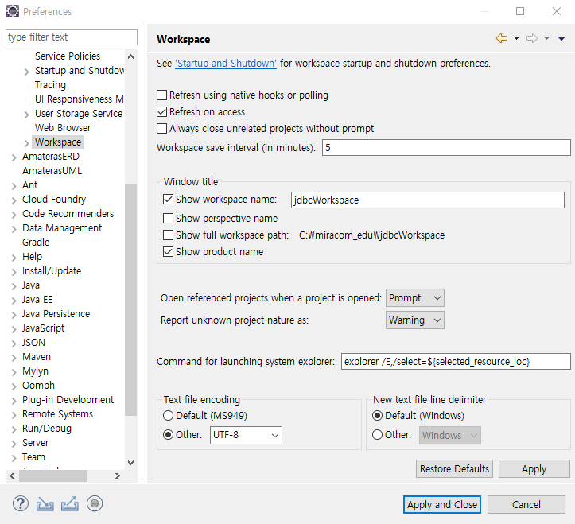
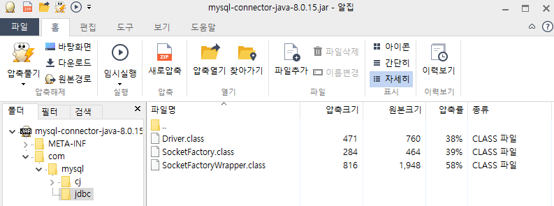

# 1102 Jdbc

## 0. eclipse 환경설정

1. file - swtich workspace - jdbcWorkspace

   

2. open perspective - java

3. window - preferences - General - Workspace - encoding : UTF-8




## 1. JDBC (Java Database Connectivity)

* Java에서 Database에 접속할 수 있도록 하는 API


* 2-Tier Architecture
  * **Client Tier ** : 자바 어플리케이션 
    * 클래스 : VO / Super / Sub
    * 인터페이스 : DAO / DAOImpl
    * 드라이버
  * **DB server Tier** : 구조화된 데이터를 영구적으로 저장하는 보관소
  * 클라이언트 <-> 서버
    * 연결하려면 **드라이버**가 메모리상에 존재해야 함

* JDBC 4단계 
  1. 드라이버 로딩
  2. DB 서버와 연결
  3. Prepared Statement 생성
  4. 쿼리문 실행


**Cf) Database 종류**

- 정형 DB (관계형 데이터베이스)
  - MySQL, Oracle, MS SQL (sql 문법을 공유)
- 비정형 DB
  - Mongo DB (NO sql...)


## 2. MySQL 실습

### 1) MySQL 기초

* password 입력 후 실행


* `show databases` : 존재하는 데이터베이스를 보여줌

```mysql
mysql> show databases;
+--------------------+
| Database           |
+--------------------+
| information_schema |
| mysql              |
| performance_schema |
| sakila             |
| sys                |
| world              |
+--------------------+
6 rows in set (0.01 sec)
```

* `use 데이터베이스` : 지정한 데이터 베이스 사용

```mysql
mysql> use mysql;
Database changed
```


### 2) Database


* `Create database scott` : scott DB 생성
* `use scott` : scott 사용

```mysql
mysql> Create database scott;
Query OK, 1 row affected (0.01 sec)

mysql> show databases;
+--------------------+
| Database           |
+--------------------+
| information_schema |
| mysql              |
| performance_schema |
| sakila             |
| scott              |
| sys                |
| world              |
+--------------------+
7 rows in set (0.00 sec)

mysql> use scott;
Database changed
```


* `scott.sql` 경로 복사

```
C:\miracom_edu\util\scott.sql
```


* `source + 파일 경로` : 만들어놓은 쿼리문(파일)을 한번에 로딩

```mysql
mysql> source C:\miracom_edu\util\scott.sql
Query OK, 0 rows affected, 1 warning (0.03 sec)

Query OK, 0 rows affected, 1 warning (0.02 sec)

Query OK, 4 rows affected (0.01 sec)
Records: 4  Duplicates: 0  Warnings: 0

Query OK, 0 rows affected, 1 warning (0.03 sec)

Query OK, 14 rows affected (0.00 sec)
Records: 14  Duplicates: 0  Warnings: 0

ERROR 1064 (42000): You have an error in your SQL syntax; check the manual that corresponds to your MySQL server version for the right syntax to use near 'NULLempno
) ENGINE=InnoDB DEFAULT CHARSET=utf8' at line 4
ERROR 1146 (42S02): Table 'scott.salgrade' doesn't exist
Query OK, 14 rows affected (0.07 sec)
Records: 14  Duplicates: 0  Warnings: 0
```


* `desc` : 테이블의 구조를 한번에 보여주는 명령어
  * Field = 테이블의 컬럼
  * Type = 컬럼의 타입 
    * 숫자 (int/double) /날짜 (datetime) /문자 (varchar)
  * Primary key는 null 값 불가
    * emp의 EMPNO / dept의 DEPTNO

```mysql
mysql> desc emp;
+----------+-------------+------+-----+---------+-------+
| Field    | Type        | Null | Key | Default | Extra |
+----------+-------------+------+-----+---------+-------+
| EMPNO    | int(11)     | NO   | PRI | NULL    |       |
| ENAME    | varchar(10) | YES  |     | NULL    |       |
| JOB      | varchar(9)  | YES  |     | NULL    |       |
| MGR      | int(11)     | YES  |     | NULL    |       |
| HIREDATE | datetime    | YES  |     | NULL    |       |
| SAL      | double      | YES  |     | NULL    |       |
| COMM     | double      | YES  |     | NULL    |       |
| DEPTNO   | int(11)     | YES  | MUL | NULL    |       |
+----------+-------------+------+-----+---------+-------+
8 rows in set (0.01 sec)

mysql> desc dept;
+--------+-------------+------+-----+---------+-------+
| Field  | Type        | Null | Key | Default | Extra |
+--------+-------------+------+-----+---------+-------+
| DEPTNO | int(11)     | NO   | PRI | NULL    |       |
| DNAME  | varchar(14) | YES  |     | NULL    |       |
| LOC    | varchar(13) | YES  |     | NULL    |       |
+--------+-------------+------+-----+---------+-------+
3 rows in set (0.00 sec)
```


* `select` : 테이블의 데이터를 불러오는 명령어
  * DB에서 가지고 나오는 쿼리문

```mysql
mysql> SELECT * FROM emp;
+-------+--------+-----------+------+---------------------+------+------+--------+
| EMPNO | ENAME  | JOB       | MGR  | HIREDATE            | SAL  | COMM | DEPTNO |
+-------+--------+-----------+------+---------------------+------+------+--------+
|  7369 | SMITH  | CLERK     | 7902 | 1980-12-17 00:00:00 |  800 | NULL |     20 |
|  7499 | ALLEN  | SALESMAN  | 7698 | 1981-02-20 00:00:00 | 1600 |  300 |     30 |
|  7521 | WARD   | SALESMAN  | 7698 | 1981-02-22 00:00:00 | 1250 |  500 |     30 |
|  7566 | JONES  | MANAGER   | 7839 | 1981-04-02 00:00:00 | 2975 | NULL |     20 |
|  7654 | MARTIN | SALESMAN  | 7698 | 1981-09-28 00:00:00 | 1250 | 1400 |     30 |
|  7698 | BLAKE  | MANAGER   | 7839 | 1981-05-01 00:00:00 | 2850 | NULL |     30 |
|  7782 | CLARK  | MANAGER   | 7839 | 1981-06-09 00:00:00 | 2450 | NULL |     10 |
|  7788 | SCOTT  | ANALYST   | 7566 | 1987-04-19 00:00:00 | 3000 | NULL |     20 |
|  7839 | KING   | PRESIDENT | NULL | 1981-11-17 00:00:00 | 5000 | NULL |     10 |
|  7844 | TURNER | SALESMAN  | 7698 | 1981-09-08 00:00:00 | 1500 |    0 |     30 |
|  7876 | ADAMS  | CLERK     | 7788 | 1987-05-23 00:00:00 | 1100 | NULL |     20 |
|  7900 | JAMES  | CLERK     | 7698 | 1981-12-03 00:00:00 |  950 | NULL |     30 |
|  7902 | FORD   | ANALYST   | 7566 | 1981-12-03 00:00:00 | 3000 | NULL |     20 |
|  7934 | MILLER | CLERK     | 7782 | 1982-01-23 00:00:00 | 1300 | NULL |     10 |
+-------+--------+-----------+------+---------------------+------+------+--------+
14 rows in set (0.00 sec)
```


#### Cf) Null

* Null은 의미를 가지고 있는 값 !!
  * 0도 아니고 값이 없는 것도 아니다
  * Null쓰는 경우
    * 자격없음
    * 미확정
* Null의 의미가 **자격없음**인 경우
  * KING의 MGR = NULL : KING은 사장이기 때문에 
  * COMM = NULL : SALESMAN이 아니라 보너스가 없기 때문에
* NULL이 **미확정**인 경우는?
  * 신입사원 / 인턴 - 사원 자격은 있는데 확정이 안됐을 때 ???


* `Projection` : 원하는 컬럼값만 가져옴

```mysql
mysql> SELECT ename, job, sal, deptno FROM emp;
+--------+-----------+------+--------+
| ename  | job       | sal  | deptno |
+--------+-----------+------+--------+
| SMITH  | CLERK     |  800 |     20 |
| ALLEN  | SALESMAN  | 1600 |     30 |
| WARD   | SALESMAN  | 1250 |     30 |
| JONES  | MANAGER   | 2975 |     20 |
| MARTIN | SALESMAN  | 1250 |     30 |
| BLAKE  | MANAGER   | 2850 |     30 |
| CLARK  | MANAGER   | 2450 |     10 |
| SCOTT  | ANALYST   | 3000 |     20 |
| KING   | PRESIDENT | 5000 |     10 |
| TURNER | SALESMAN  | 1500 |     30 |
| ADAMS  | CLERK     | 1100 |     20 |
| JAMES  | CLERK     |  950 |     30 |
| FORD   | ANALYST   | 3000 |     20 |
| MILLER | CLERK     | 1300 |     10 |
+--------+-----------+------+--------+
14 rows in set (0.00 sec)
```


* `Selection` : 조건을 부여해 원하는 Row만 가져옴
  * `WHERE` : 조건절

```mysql
mysql> SELECT * FROM emp WHERE deptno=10;
+-------+--------+-----------+------+---------------------+------+------+--------+
| EMPNO | ENAME  | JOB       | MGR  | HIREDATE            | SAL  | COMM | DEPTNO |
+-------+--------+-----------+------+---------------------+------+------+--------+
|  7782 | CLARK  | MANAGER   | 7839 | 1981-06-09 00:00:00 | 2450 | NULL |     10 |
|  7839 | KING   | PRESIDENT | NULL | 1981-11-17 00:00:00 | 5000 | NULL |     10 |
|  7934 | MILLER | CLERK     | 7782 | 1982-01-23 00:00:00 | 1300 | NULL |     10 |
+-------+--------+-----------+------+---------------------+------+------+--------+
3 rows in set (0.00 sec)
```


>  Q. emp 테이블에서 업무가 SALESMAN 사원의 사원번호, 이름, 업무, 급여를 검색

```mysql
mysql> SELECT empno, ename, job, sal FROM emp WHERE job = 'SALESMAN';
+-------+--------+----------+------+
| empno | ename  | job      | sal  |
+-------+--------+----------+------+
|  7499 | ALLEN  | SALESMAN | 1600 |
|  7521 | WARD   | SALESMAN | 1250 |
|  7654 | MARTIN | SALESMAN | 1250 |
|  7844 | TURNER | SALESMAN | 1500 |
+-------+--------+----------+------+
4 rows in set (0.00 sec)
```

* `SALESMAN` : 쿼리문이 아니라 값이기 때문에 정확히 써줘야!
  * 원래는 소문자로 하면 안나오는데...왜 나옴?


* `distinct` : 중복제거 키워드
  * SELECT 절 바로 뒤에 위치

```mysql
mysql> SELECT deptno FROM emp;
+--------+
| deptno |
+--------+
|     10 |
|     10 |
|     10 |
|     20 |
|     20 |
|     20 |
|     20 |
|     20 |
|     30 |
|     30 |
|     30 |
|     30 |
|     30 |
|     30 |
+--------+
14 rows in set (0.00 sec)
```

```mysql
mysql> SELECT distinct deptno FROM emp;
+--------+
| deptno |
+--------+
|     10 |
|     20 |
|     30 |
+--------+
3 rows in set (0.00 sec)
```


## 3. SQL

### 1) SQL (Structured Query Language) 개요

* 데이터베이스 스키마 생성, 자료의 검색, 수정, 그리고 데이터베이스 객체 접근 관리 등을 위해 고안된 언어 

* 다수의 데이터베이스 관련 프로그램의 표준언어


### 2) SQL 명령어의 종류

1. DML (Data Manipulation Language) : 
   * 데이터 조작어로 검색 및 수정하기 위한 수단제공 
     * SELECT : 검색
     * INSERT : 추가
     * UPDATE : 수정
     * DELETE : 삭제
     * MERGE 
2. DDL (Data Definition Language) : 
   * 데이터 구조를 생성, 변경, 삭제등의 기능을 제공 
     * CREATE : 생성
     * ALTER :  
     * DROP : 삭제
     * RENAME 
3. DCL (Data Control Lanuage)  :
   * 데이터에 대한 권한 관리 및 트랜잭션 제어 
     * GRANT
     * REVOK


* 쿼리문 사용법 
  * client -> DB server : 
    * DML (insert, update, delete)
  * DB server -> client
    * DML (select)


## 4. 데이터베이스 구조


- 테이블 (Table) : 
  - RDBMS의 기본적 저장구조 한 개 이상의 column 과 0개 이상의 row로 구성 
- 열 (Column): 
  - 테이블 상에서의 단일 종류의 데이터를 나타냄 특정 데이터 타입 및 크기를 가지고 있음 
- 행 (Row): 
  - Column들의 값의 조합. 레코드라고 불린다. 기본키(PK)에 의해 구분된다. 기본키는 중복을 허용하지 않으며 없어서는 안 된다. 
- 필드 (Field) : 
  - Row 와 Column의 교차점으로 Field는 데이터를 포함할 수 있고 없을 때는 NULL 값을 가 지고 있다고 한다.


## 5. Workbench 실습


#### jdbc01_Select.sql

```mysql
-- 1102

/*
SELECT (Projection + Selection)
Projection : 컬럼명을 직접 지정함, distinct 컬럼의 중복을 제거함
Selection : where절을 추가해서 원하는 행만 검색
            ORDER BY 정렬, ALIAS 지정 방법
*/

-- 문제 1.  emp 테이블에서 업무가 SALESMAN 사원과 사원의 이름이 FROD인 사원의 이름, 업무, 급여를 검색
SELECT ename, job, sal
FROM emp
WHERE job='SALESMAN' or ename='FORD'; 

-- 위 결과에서 sal값이 점점 높은 순으로 출력되도록 결과를 정렬
-- ORDER BY 절이 필요
-- 1) 절의 순서 : SELECT -> FROM -> WHERE -> ... -> ORDER BY
SELECT ename, job, sal
FROM emp
WHERE job='SALESMAN' or ename='FORD'
ORDER BY sal DESC; 

-- 문제 2.  emp 테이블에서 이름, 월급, 연봉을 출력, 이때 연봉순으로 내림차순 정렬
-- 1) 
SELECT ename, sal, sal*12 + comm
FROM emp
ORDER BY sal*12 + comm DESC; 
-- 2) Alias를 지정 (as를 사용)
SELECT ename, sal, sal*12 + comm as "Annual Salary"
FROM emp
ORDER BY sal*12 + comm DESC;
-- 2-2) as 생략 가능.. 가능하면 뺀다
SELECT ename, sal, sal*12 + comm "Annual Salary"
FROM emp
ORDER BY sal*12 + comm DESC; 
-- 2-3) 원래는 한칸 띄우고 바로 별칭을 붙이면 된다
SELECT ename, sal, sal*12 + comm AnnualSalary
FROM emp
ORDER BY sal*12 + comm DESC; 	-- 별칭으로 정렬

-- 정리
-- 1) 별칭을 지정할 때 as는 굳이 붙이지 않고 생략 가능
-- 2) 별칭에 " "을 지정하는 경우는 별칭에 공백이 있을때만 붙인다

/*
null
sql에서 null값은 연산이 적용되지 않는 값이다.

null을 다른 값으로 치환해서 계산을 해야한다.
ifNull()를 사용

ifNull(comm, 0) : comm이 null값이 아니면 그대로 리턴 / null이면 0으로 리턴
*/

SELECT ename, sal, sal * 12 + ifnull(comm , 0) AnnualSalary
FROM emp
ORDER BY sal*12 + comm DESC; 

/*
SQL 명령어의 종류 

1. DML : 
	1) INSERT INTO table명 VALUES(0,0,0,0)
    2) DELETE FROM table명 WEHRE emono=7786
	   DELETE FROM table명;								-- table의 모든 데이터가 다 삭제 
	3) UPDATE table명 SET sal=2000 WHERE ename='SMITH';
	4) SELECT * FROM table명;							-- 모든 데이터를 다 가지고 옴
       SELECT * FROM table명 WHERE deptno=10; 			-- 조건에 맞는 데이터 행을 가지고 옴
2. DDL : 

3. DCL :

*/
```

------


## 6. Command 실습

* DML (Data Manipulation Language) :
  * SELECT : 검색

  * INSERT : 추가

  * UPDATE : 수정

  * DELETE : 삭제

  * MERGE :

  

### 1) CREATE

* 최소한 1개의 column이 있어야 테이블 생성 가능

```mysql
mysql> USE scott;
Database changed
mysql> CREATE TABLE custom;
ERROR 1113 (42000): A table must have at least 1 column
```

* CREATE로 테이블 생성하기
  * `num` : 데이터 타입: int / 제약조건 : primary key
  * `name` : 데이터 타입: varchar / 제약조건 : not null
  * `addr` : 데이터 타입: varchar / 제약조건 : not null

```mysql
mysql> CREATE TABLE custom(
    -> num int primary key,
    -> name varchar(20) not null,
    -> addr varchar(100) not null);
Query OK, 0 rows affected (0.03 sec)
```

* `DESC` 로 Table 확인


```mysql
mysql> DESC custom;
+-------+--------------+------+-----+---------+-------+
| Field | Type         | Null | Key | Default | Extra |
+-------+--------------+------+-----+---------+-------+
| num   | int(11)      | NO   | PRI | NULL    |       |
| name  | varchar(20)  | NO   |     | NULL    |       |
| addr  | varchar(100) | NO   |     | NULL    |       |
+-------+--------------+------+-----+---------+-------+
3 rows in set (0.00 sec)
```


### 2) INSERT INTO

* 현재 값 비어있음

```mysql
mysql> SELECT num,name,addr FROM custom;
Empty set (0.00 sec)
```

* `INSERT INTO` 로 테이블에 값 넣기
  * num, name, addr

```mysql
mysql> INSERT INTO custom (num,name,addr) VALUES(111,'James','NY');
Query OK, 1 row affected (0.00 sec)

mysql> INSERT INTO custom (num,name,addr) VALUES(222,'Jane','Texas');
Query OK, 1 row affected (0.00 sec)

mysql> SELECT * FROM custom;
+-----+-------+-------+
| num | name  | addr  |
+-----+-------+-------+
| 111 | James | NY    |
| 222 | Jane  | Texas |
+-----+-------+-------+
2 rows in set (0.00 sec)
```


### 3) UPDATE

* UPDATE로 테이블 값 수정하기
  * addr를 Texas에서 NY로 수정

```mysql
mysql> UPDATE custom SET addr='NY' WHERE num=222;
Query OK, 1 row affected (0.00 sec)
Rows matched: 1  Changed: 1  Warnings: 0

mysql> SELECT * FROM custom;
+-----+-------+------+
| num | name  | addr |
+-----+-------+------+
| 111 | James | NY   |
| 222 | Jane  | NY   |
+-----+-------+------+
2 rows in set (0.00 sec)
```


### 4) DELETE

* DELETE로 테이블 값 삭제하기

```mysql
mysql> DELETE FROM custom WHERE num=222;
Query OK, 1 row affected (0.00 sec)

mysql> SELECT * FROM custom;
+-----+-------+------+
| num | name  | addr |
+-----+-------+------+
| 111 | James | NY   |
+-----+-------+------+
1 row in set (0.00 sec)
```


## 7. Eclipse 실습

* Jdbc 4단계 작업
  1. Driver 로딩
  2. DB 서버 연결
  3. PreparedStatement 생성
  4. 쿼리문 실행


### 1) Driver 로딩

* j의 경로
  * `c++`는 Program Files / `j++`는 Program Files (x86) 에 저장

```
C:\Program Files (x86)\MySQL\Connector J 8.0
```

* Driver.class 찾기



```java
Class.forName("com.mysql.cj.jdbc.Driver");
```

* Driver 로딩

```java
package jdbc.test1;

public class DBConnectionTest {
	DBConnectionTest() {
		//1. 드라이버 로딩 - Fully Qualified Class Name
		try {
			Class.forName("com.mysql.cj.jdbc.Driver");
			System.out.println("드라이버 로딩 성공");
		} catch (ClassNotFoundException e) {
			System.out.println("드라이버 로딩 실패");
			e.printStackTrace();
		}
	}
	
	public static void main(String[] args) {		
		new DBConnectionTest();
	}
}
```

```
드라이버 로딩 실패
java.lang.ClassNotFoundException: com.mysql.cj.jdbc.Driver
	at java.net.URLClassLoader.findClass(Unknown Source)
	at java.lang.ClassLoader.loadClass(Unknown Source)
	at sun.misc.Launcher$AppClassLoader.loadClass(Unknown Source)
	at java.lang.ClassLoader.loadClass(Unknown Source)
	at java.lang.Class.forName0(Native Method)
	at java.lang.Class.forName(Unknown Source)
	at jdbc.test1.DBConnectionTest.main(DBConnectionTest.java:15)
```

* 에러 : connector를 설치해야 함 !!!


* jdk / jre에 connector 설치

```
C:\Program Files\Java\jdk1.8.0_301\jre\lib\ext
```

```
C:\Program Files\Java\jre1.8.0_301\lib\ext
```


```
드라이버 로딩 성공
```


### 2) DB 서버 연결

#### DBConnectionTest.java

```java
package jdbc.test1;

import java.sql.DriverManager;
import java.sql.SQLException;

public class DBConnectionTest {
	DBConnectionTest(){
		
		try {
			//1. 드라이버 로딩...Fully Qualified Class Name
			Class.forName("com.mysql.cj.jdbc.Driver");
			System.out.println("1. 드라이버 로딩 성공....");
			
			
			//2. 디비 서버 연결
			String url = "jdbc:mysql://127.0.0.1:3306/scott?serverTimezone=UTC&useUnicode=yes&characterEncoding=UTF-8";
			DriverManager.getConnection(url,"root","1234"); 	//password: 1234
			System.out.println("2. 서버 연결 성공....");
			
		} catch (ClassNotFoundException e) {
			System.out.println("드라이버 로딩 실패....");
		} catch(SQLException e) {
			System.out.println("서버 연결 실패....");
		}
	}
	
	public static void main(String[] args) {		
		new DBConnectionTest();
	}
}
```

```
1. 드라이버 로딩 성공....
2. 서버 연결 성공....
```


### 3) PreparedStatement 객체생성

* 연결되면 connection 객체 리턴

```java
//DriverManager.getConnection(url,"root","1234");
Connection conn = DriverManager.getConnection(url,"root","1234");
```


**Cf) [Connection](https://docs.oracle.com/javase/8/docs/api/java/sql/Connection.html) API**

* Interface Connection

| `PreparedStatement` | `prepareStatement(String sql)`Creates a `PreparedStatement` object for sending parameterized SQL statements to the database. |
| ------------------- | ------------------------------------------------------------ |
| `PreparedStatement` | `prepareStatement(String sql, int autoGeneratedKeys)`Creates a default `PreparedStatement` object that has the capability to retrieve auto-generated keys. |
| `PreparedStatement` | `prepareStatement(String sql, int[] columnIndexes)`Creates a default `PreparedStatement` object capable of returning the auto-generated keys designated by the given array. |
| `PreparedStatement` | `prepareStatement(String sql, int resultSetType, int resultSetConcurrency)`Creates a `PreparedStatement` object that will generate `ResultSet` objects with the given type and concurrency. |
| `PreparedStatement` | `prepareStatement(String sql, int resultSetType, int resultSetConcurrency, int resultSetHoldability)`Creates a `PreparedStatement` object that will generate `ResultSet` objects with the given type, concurrency, and holdability. |
| `PreparedStatement` | `prepareStatement(String sql, String[] columnNames)`Creates a default `PreparedStatement` object capable of returning the auto-generated keys designated by the given array. |


```java
package jdbc.test1;

import java.sql.Connection;
import java.sql.DriverManager;
import java.sql.PreparedStatement;
import java.sql.SQLException;

public class DBConnectionTest {
	DBConnectionTest(){
		
		try {
			//1. 드라이버 로딩...Fully Qualified Class Name
			Class.forName("com.mysql.cj.jdbc.Driver");
			System.out.println("1. 드라이버 로딩 성공....");
			
			
			//2. 디비 서버 연결
			String url = "jdbc:mysql://127.0.0.1:3306/scott?serverTimezone=UTC&useUnicode=yes&characterEncoding=UTF-8";
//			DriverManager.getConnection(url,"root","1234");							//password : 1234
			Connection conn = DriverManager.getConnection(url,"root","1234");		//Connection 객체로 리턴
			System.out.println("2. 서버 연결 성공....");
			
			//3.PreparedStatement 객체생성
			String query = "INSERT INTO custom (num, name, addr) VALUES(?,?,?)";	//뭐 넣을지 아직 몰라 -?
			PreparedStatement ps = conn.prepareStatement("query");					//쿼리문을 변수로 처리
			System.out.println("3. PreparedStatement 객체 생성....");
			
		} catch (ClassNotFoundException e) {
			System.out.println("드라이버 로딩 실패....");
		} catch(SQLException e) {
			System.out.println("서버 연결 실패....");
		}
		
		
	}
	
	public static void main(String[] args) {		
		new DBConnectionTest();
	}
}

```

```
1. 드라이버 로딩 성공....
2. 서버 연결 성공....
3. PreparedStatement 객체 생성....
```


### 4) 쿼리문 실행

```java
package jdbc.test1;

import java.sql.Connection;
import java.sql.DriverManager;
import java.sql.PreparedStatement;
import java.sql.SQLException;

public class DBConnectionTest {
	DBConnectionTest(){
		
		try {
			//1. 드라이버 로딩...Fully Qualified Class Name
			Class.forName("com.mysql.cj.jdbc.Driver");
			System.out.println("1. 드라이버 로딩 성공....");
			
			
			//2. 디비 서버 연결
			String url = "jdbc:mysql://127.0.0.1:3306/scott?serverTimezone=UTC&useUnicode=yes&characterEncoding=UTF-8";
//			DriverManager.getConnection(url,"root","1234");							//password : 1234
			Connection conn = DriverManager.getConnection(url,"root","1234");		//Connection 객체로 리턴
			System.out.println("2. 서버 연결 성공....");
			
			//3.PreparedStatement 객체생성
			String query = "INSERT INTO custom (num, name, addr) VALUES(?,?,?)";	//뭐 넣을지 아직 몰라 -?
			PreparedStatement ps = conn.prepareStatement(query);					//쿼리문을 변수로 처리
			System.out.println("3. PreparedStatement 객체 생성....");
			
			//4.?값에 대한 바인딩 -> 쿼리문 실행 -> 1? 2? 3?
//			ps.setInt(1, 111);						//DB(custom)에 없는 값을 넣어야 함 - 에러
			ps.setInt(1, 222);						
			ps.setString(2, "Kate");
			ps.setString(3, "Boston");
			
			ps.executeUpdate();
			System.out.println("4. 쿼리문 실행....");
				
		//예외 처리	
		} catch (ClassNotFoundException e) {
			System.out.println("드라이버 로딩 실패....");
		} catch(SQLException e) {
			System.out.println("서버 연결 실패....");
		}
		
		
	}//test
	
	public static void main(String[] args) {		
		new DBConnectionTest();
	}//main
}//class
```

```
1. 드라이버 로딩 성공....
2. 서버 연결 성공....
3. PreparedStatement 객체 생성....
4. 쿼리문 실행....
```


> prompt

```
mysql> select * from custom;
+-----+-------+------+
| num | name  | addr |
+-----+-------+------+
| 111 | James | NY   |
+-----+-------+------+
1 row in set (0.00 sec)

mysql> select * from custom;
+-----+-------+--------+
| num | name  | addr   |
+-----+-------+--------+
| 111 | James | NY     |
| 222 | Kate  | Boston |
+-----+-------+--------+
2 rows in set (0.00 sec)
```


**Cf) [PreparedStatement](https://docs.oracle.com/javase/8/docs/api/java/sql/PreparedStatement.html) API**

* Interface PreparedStatement

| `ResultSet` | `executeQuery()`Executes the SQL query in this `PreparedStatement` object and returns the `ResultSet` object generated by the query. |
| ----------- | ------------------------------------------------------------ |
| `int`       | `executeUpdate()`Executes the SQL statement in this `PreparedStatement` object, which must be an SQL Data Manipulation Language (DML) statement, such as `INSERT`, `UPDATE` or `DELETE`; or an SQL statement that returns nothing, such as a DDL statement. |


**ExecuteUpdate**

1. 수행결과로 Int 타입의 값을 반환
   * 실패시 0 / 성공시 1

2. SELECT 구문을 제외한 다른 구문을 수행할 때 사용


**ExecuteQuery**

1. 수행결과로 ResultSet 객체의 값을 반환

   * Q. ResultSet이 어떻게 만들어져야 Table Data를 가장 손쉽게 담을 수 있을까?

     A. Table이랑 똑같이 생기면 됨 !! - 위 아래 각각 하나씩만 더 붙어서 !!

     * BOE (Before Of Elements)
     * EOE (End Of Elements) 

   * BOE (Before Of Elements) / EOE (End Of Elements) 왜 필요?

     * 커서의 위치 - 한줄씩 거쳐가면서 핸들링
     * `next()` 라는 function으로 커서 내리기

2. SELECT 구문을 수행할 때 사용


#### DBConnectionTest2.java

* UPDATE

```java
package jdbc.test1;

import java.sql.Connection;
import java.sql.DriverManager;
import java.sql.PreparedStatement;
import java.sql.SQLException;

public class DBConnectionTest2 {
	DBConnectionTest2(){
		
		try {
			//1. 드라이버 로딩...Fully Qualified Class Name
			Class.forName("com.mysql.cj.jdbc.Driver");
			System.out.println("1. 드라이버 로딩 성공....");
			
			
			//2. DB 서버 연결
			String url = "jdbc:mysql://127.0.0.1:3306/scott?serverTimezone=UTC&useUnicode=yes&characterEncoding=UTF-8";
//			DriverManager.getConnection(url,"root","1234");							//password : 1234
			Connection conn = DriverManager.getConnection(url,"root","1234");		//Connection 객체로 리턴
			System.out.println("2. 서버 연결 성공....");
						
			//3.UPDATE - 기본키는 절대로 수정의 대상이 될 수 없다
			String query = "UPDATE custom SET name=?,addr=? WHERE num=?";
			PreparedStatement ps = conn.prepareStatement(query);
			System.out.println("3. PreparedStatement 객체 생성....");
			
			ps.setString(1, "Kate");
			ps.setString(2, "California");
			ps.setInt(3, 222);	
			
			int row = ps.executeUpdate();
			System.out.println("4. row Update OK...("+row+")");
			
			
		//예외 처리	
		} catch (ClassNotFoundException e) {
			System.out.println("드라이버 로딩 실패....");
		} catch(SQLException e) {
			System.out.println("서버 연결 실패....");
		}
		
		
	}//test
	
	public static void main(String[] args) {		
		new DBConnectionTest2();
	}//main
}//class
```

````
1. 드라이버 로딩 성공....
2. 서버 연결 성공....
3. PreparedStatement 객체 생성....
4. row Update OK...(1)
````

```
mysql> select * from custom;
+-----+-------+--------+
| num | name  | addr   |
+-----+-------+--------+
| 111 | James | NY     |
| 222 | Kate  | Boston |
+-----+-------+--------+
2 rows in set (0.00 sec)

mysql> select * from custom;
+-----+-------+------------+
| num | name  | addr       |
+-----+-------+------------+
| 111 | James | NY         |
| 222 | Kate  | California |
+-----+-------+------------+
2 rows in set (0.00 sec)
```


#### DBConnectionTest3.java

* DELETE

```java
package jdbc.test1;

import java.sql.Connection;
import java.sql.DriverManager;
import java.sql.PreparedStatement;
import java.sql.SQLException;

public class DBConnectionTest3 {
	DBConnectionTest3(){
		
		try {
			//1. 드라이버 로딩...Fully Qualified Class Name
			Class.forName("com.mysql.cj.jdbc.Driver");
			System.out.println("1. 드라이버 로딩 성공....");
			
			
			//2. DB 서버 연결
			String url = "jdbc:mysql://127.0.0.1:3306/scott?serverTimezone=UTC&useUnicode=yes&characterEncoding=UTF-8";
//			DriverManager.getConnection(url,"root","1234");							//password : 1234
			Connection conn = DriverManager.getConnection(url,"root","1234");		//Connection 객체로 리턴
			System.out.println("2. 서버 연결 성공....");
						
			//3.DELETE		
			String query = "DELETE FROM custom WHERE num=?";
			PreparedStatement ps = conn.prepareStatement(query);
			System.out.println("3. PreparedStatement 객체 생성....");

			ps.setInt(1,222);
			
			int row = ps.executeUpdate();
			System.out.println("4. row Delete OK...("+row+")");
			
		//예외 처리	
		} catch (ClassNotFoundException e) {
			System.out.println("드라이버 로딩 실패....");
		} catch(SQLException e) {
			System.out.println("서버 연결 실패....");
		}
		
		
	}//test
	
	public static void main(String[] args) {		
		new DBConnectionTest3();
	}//main
}//class
```

```
1. 드라이버 로딩 성공....
2. 서버 연결 성공....
3. PreparedStatement 객체 생성....
4. row Delete OK...(1)
```

```
mysql> select * from custom;
+-----+-------+------+
| num | name  | addr |
+-----+-------+------+
| 111 | James | NY   |
+-----+-------+------+
1 row in set (0.00 sec)
```


#### DBConnectionTest4.java

* SELECT

```java
package jdbc.test1;

import java.sql.Connection;
import java.sql.DriverManager;
import java.sql.PreparedStatement;
import java.sql.ResultSet;
import java.sql.SQLException;

public class DBConnectionTest4 {
	DBConnectionTest4(){
		
		try {
			//1. 드라이버 로딩...Fully Qualified Class Name
			Class.forName("com.mysql.cj.jdbc.Driver");
			System.out.println("1. 드라이버 로딩 성공....");
			
			
			//2. 디비 서버 연결
			String url = "jdbc:mysql://127.0.0.1:3306/scott?serverTimezone=UTC&useUnicode=yes&characterEncoding=UTF-8";
//			DriverManager.getConnection(url,"root","1234");							//password : 1234
			Connection conn = DriverManager.getConnection(url,"root","1234");		//Connection 객체로 리턴
			System.out.println("2. 서버 연결 성공....");
			
			//3.PreparedStatement 객체생성			
			String query = "INSERT INTO custom (num, name, addr) VALUES(?,?,?)";
			PreparedStatement ps = conn.prepareStatement(query);
			System.out.println("3. PreparedStatement 객체 생성....");
			
			//4.?값에 대한 바인딩 -> 쿼리문 실행 -> 1? 2? 3?
			ps.setInt(1, 222);						
			ps.setString(2, "Jane");
			ps.setString(3, "Texas");
			
//			ps.setInt(1, 333);						
//			ps.setString(2, "Tom");
//			ps.setString(3, "NY");
			
			ps.executeUpdate();
			System.out.println("4. Values Insert OK...");
			
			
			//5.SELECT
			String query2 = "SELECT * FROM custom";
			PreparedStatement ps2 = conn.prepareStatement(query2);
			ResultSet rs = ps2.executeQuery();
			System.out.println("5. Print ResultSet....");					
			
			while(rs.next()) { 								//BOE에서 엘러먼트가 들어있는 곳으로 한단계내려간다
				int num = rs.getInt("num"); 				//컬럼명 혹은 1
				String name = rs.getString("name");
				String addr = rs.getString("addr");
				System.out.println(num +"\t |"+name+"\t |"+addr);
			}		
			
		//예외 처리	
		} catch (ClassNotFoundException e) {
			System.out.println("드라이버 로딩 실패....");
		} catch(SQLException e) {
			System.out.println("서버 연결 실패....");
		}
		
		
	}//test
	
	public static void main(String[] args) {		
		new DBConnectionTest4();
	}//main
}//class

```

```
1. 드라이버 로딩 성공....
2. 서버 연결 성공....
3. PreparedStatement 객체 생성....
4. Values Insert OK...
5. Print ResultSet....
111	 |James	 |NY
222	 |Jane	 |Texas
333	 |Tom	 |NY
```

```
mysql> select * from custom;
+-----+-------+-------+
| num | name  | addr  |
+-----+-------+-------+
| 111 | James | NY    |
| 222 | Jane  | Texas |
| 333 | Tom   | NY    |
+-----+-------+-------+
3 rows in set (0.00 sec)
```

