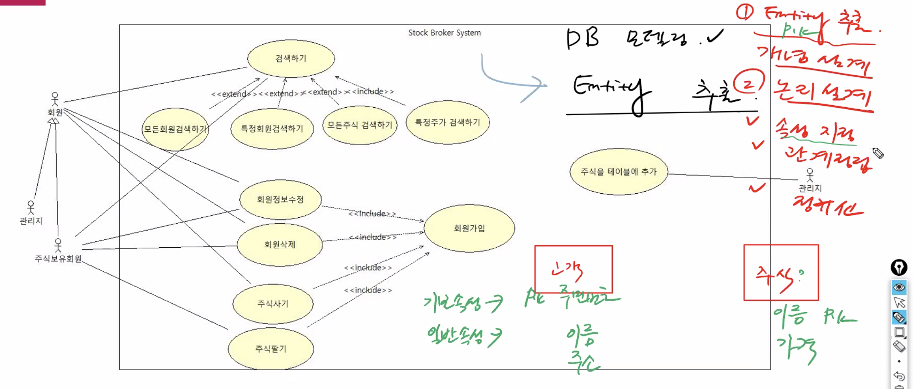
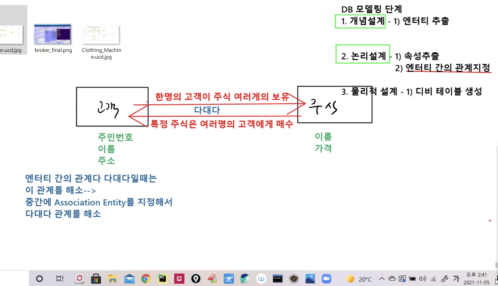
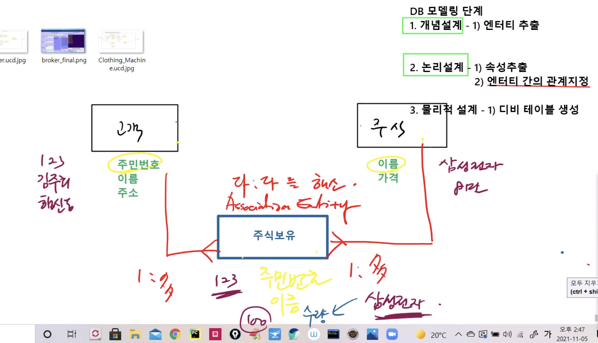
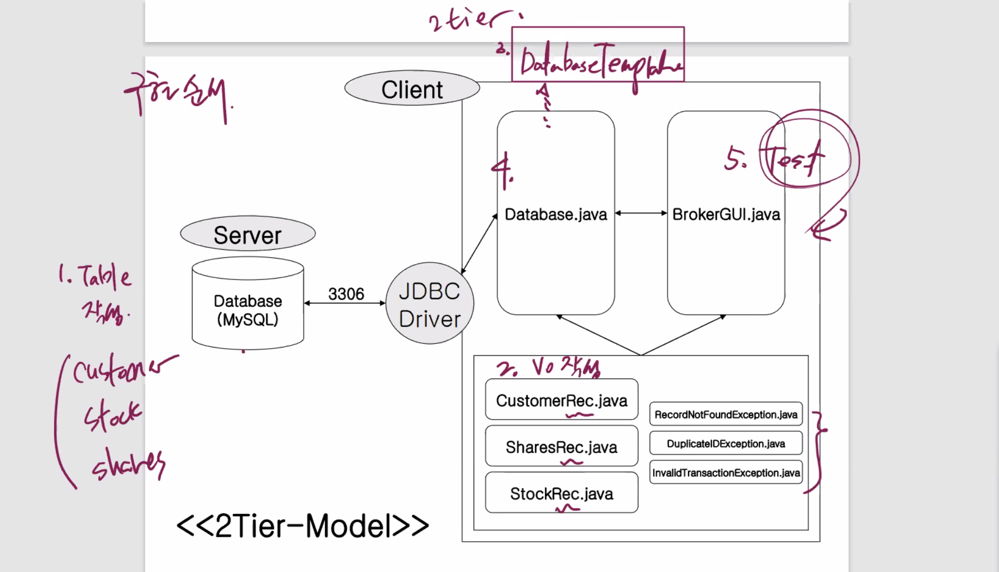
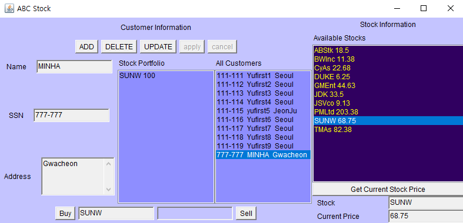

# 1105 Jdbc


## 1. 여러가지 함수

### 1) Limit

* Limit : 출력 갯수를 제한하는 기능 

```mysql
-- 문제 1. emp 테이블에서 sal가 가장 많은 사원 3명 출력 (sal ORDER BY DESC)
SELECT * FROM emp ORDER BY sal DESC;
SELECT * FROM emp ORDER BY sal DESC limit 3;
```

```
EMPNO	ENAME	JOB		MGR	HIREDATE		SAL	COMM	DEPNO
7839	KING	PRESIDENT		1981-11-17 00:00:00	5000		10
7788	SCOTT	ANALYST		7566	1987-04-19 00:00:00	3000		20
7902	FORD	ANALYST		7566	1981-12-03 00:00:00	3000		20
7566	JONES	MANAGER		7839	1981-04-02 00:00:00	2975		20
7698	BLAKE	MANAGER		7839	1981-05-01 00:00:00	2850		30
7782	CLARK	MANAGER		7839	1981-06-09 00:00:00	2450		10
7499	ALLEN	SALESMAN	7698	1981-02-20 00:00:00	1600	300	30
7844	TURNER	SALESMAN	7698	1981-09-08 00:00:00	1500	0	30
7934	MILLER	CLERK		7782	1982-01-23 00:00:00	1300		10
7521	WARD	SALESMAN	7698	1981-02-22 00:00:00	1250	500	30
7654	MARTIN	SALESMAN	7698	1981-09-28 00:00:00	1250	1400	30
7876	ADAMS	CLERK		7788	1987-05-23 00:00:00	1100		20
7900	JAMES	CLERK		7698	1981-12-03 00:00:00	950		30
7369	SMITH	CLERK		7902	1980-12-17 00:00:00	800		20
```

```
EMPNO	ENAME	JOB		MGR	HIREDATE		SAL	COMM	DEPNO
7839	KING	PRESIDENT		1981-11-17 00:00:00	5000		10
7902	FORD	ANALYST		7566	1981-12-03 00:00:00	3000		20
7788	SCOTT	ANALYST		7566	1987-04-19 00:00:00	3000		20	
```


### 2) Null

* Null값은 아직 정해지지 않았거나 (미확정) 자격이 없을 때 사용되는 값
  * 0을 의미하는 값이 아니다
  * 값이 없는 것도 아니다. 나름 의미를 가지는 값이다
*  0과는 전혀 다른 값이기 때문에 비교,연산 적용이 안된다
  * `=`, `!=` 와 같은 연산자 사용 불가
  * `+`, `-`, `*`, `/` 사용 불가
  * 대신에 `ifnull()`을 사용해서 값을 치환시키고 연산 적용 가능 

```mysql
-- 문제 2. emp 테이블에서 comm을 받지 않는 사원을 검색..이름, 업무, comm 출력
SELECT ename,job,comm FROM emp WHERE comm = null;	-- 출력안됨
SELECT ename,job,comm FROM emp WHERE comm is null;
SELECT ename,job,comm FROM emp WHERE comm is not null;

SELECT sal, sal*12 + comm AnnualSalry FROM emp;		-- 연산안됨
SELECT sal, sal*12 + ifnull(comm,0) AnnualSalry FROM emp;
```

```
ename	job		comm 	
SMITH	CLERK	
JONES	MANAGER	
BLAKE	MANAGER	
CLARK	MANAGER	
SCOTT	ANALYST	
KING	PRESIDENT	
ADAMS	CLERK	
JAMES	CLERK	
FORD	ANALYST	
MILLER	CLERK	
```

```
ename	job		comm 	
ALLEN	SALESMAN	300
WARD	SALESMAN	500
MARTIN	SALESMAN	1400
TURNER	SALESMAN	0	
```

```
sal	AnnualSalry
800	9600
1600	19500
1250	15500
2975	35700
1250	16400
2850	34200
2450	29400
3000	36000
5000	60000
1500	18000
1100	13200
950	11400
3000	36000
1300	15600
```


### 3) 숫자/문자/날짜 함수

* 숫자함수 : `abs()`, `round()`, `floor()`, `mod()`, ...
* 문자함수 : `concat()`, `substr()`, `trim()`
* 날짜함수 : `now()`, `sysdate()`, `curdate()`, `year()`, `month()`

```mysql
-- 문제 3. 업무가 사장인 사람과 업무가 SALESMAN인 사람의 급여 차이를 출력 
-- abs(): 절대값 함수
SELECT * FROM emp;
SELECT sal FROM emp WHERE job = 'PRESIDENT'; -- 5000
SELECT sal FROM emp WHERE job = 'SALESMAN'; -- 1600, 1250, 1250, 1500

-- SELECT DISTINCT ABS((SELECT sal FROM emp WHERE job = 'PRESIDENT') - (SELECT sal FROM emp WHERE job = 'SALESMAN')) SalaryGap FROM emp; -- 오류

SELECT DISTINCT ABS((SELECT sal FROM emp WHERE ename = 'KING') - -- 5000
(SELECT sal FROM emp WHERE ename = 'ALLEN')) SalaryGap FROM emp; -- 1600 		-> SalaryGap 3400

SELECT DISTINCT ((SELECT sal FROM emp WHERE ename = 'ALLEN') - -- 1600
(SELECT sal FROM emp WHERE ename = 'KING')) SalaryGap FROM emp; -- 5000 		-> SalaryGap -3400
SELECT DISTINCT ABS((SELECT sal FROM emp WHERE ename = 'ALLEN') - -- 1600
(SELECT sal FROM emp WHERE ename = 'KING')) SalaryGap FROM emp; -- 5000 		-> SalaryGap 3400


-- 문제 4. 사원 번호 중에서 홀수번호만 출력 
-- mod(): 나머지 함수
SELECT ename, empno, job FROM emp WHERE MOD(empno,2)=1; -- 2로 나눴을 때 나머지 1	-> empno: 7369/7499/7521/7839

-- round()
SELECT ROUND(45.923); -- 46
SELECT ROUND(45.923,0); -- 46
SELECT ROUND(45.923,2); -- 45.92 - 소수점 2번째 자리까지 출력

-- now(), sysdate(), curdate()
SELECT NOW() today; -- 2021-11-05 11:20:21
SELECT SYSDATE() today; -- 2021-11-05 11:20:22 - sysdate(): 시간까지
SELECT CURDATE() today; -- 2021-11-05 - curdate() : 날짜만

-- 문제 5. emp 테이블에서 사원들의 입사년도를 출력. 이때 사원의 이름과 함께 출력 
-- year(), month()
SELECT ename, YEAR(hiredate) YEAR, MONTH(hiredate) MONTH FROM emp;
-- substr() 
SELECT ename, SUBSTR(hiredate,1,4) YEAR, SUBSTR(hiredate,6,2) MONTH FROM emp; -- substr(hiredate,시작위치,글자길이)
```

```
ename	YEAR	MONTH
SMITH	1980	12
ALLEN	1981	2
WARD	1981	2
JONES	1981	4
MARTIN	1981	9
BLAKE	1981	5
CLARK	1981	6
SCOTT	1987	4
KING	1981	11
TURNER	1981	9
ADAMS	1987	5
JAMES	1981	12
FORD	1981	12
MILLER	1982	1
```

```
SMITH	1980	12
ALLEN	1981	02
WARD	1981	02
JONES	1981	04
MARTIN	1981	09
BLAKE	1981	05
CLARK	1981	06
SCOTT	1987	04
KING	1981	11
TURNER	1981	09
ADAMS	1987	05
JAMES	1981	12
FORD	1981	12
MILLER	1982	01
```


### 4) Like (%/_)

* like와 와일드카드(%/_)
  * `%` : 0 ~ many
  * `_` : 정확하게 1대1매핑

```mysql
-- 문제 6. 사원 이름중에서 S로 시작하는 사원의 이름 검색 - like
SELECT ename FROM emp WHERE ename LIKE 'S%';
-- 문제 7. 사원 이름중에서 두번째 철자가 A인 사원의 이름 검색 - like_a
SELECT ename FROM emp WHERE ename LIKE '_A%';
-- 문제 8. 사원의 이름중에서 R철자가 포함된 모든 사원을 검색
SELECT ename FROM emp WHERE ename LIKE '%R%';
```

```
SMITH
SCOTT
```

```
WARD
MARTIN
JAMES
```

```
WARD
MARTIN
CLARK
TURNER
FORD
MILLER
```


## 2. 과제 풀이

> 주석 처리한 부분에서 변경된 부분 잘 볼 것

* Data Pack = 값 할당/ 주입 -> setter() 
* Data Unpack = 값 받아옴/반환 -> getter()

`int num`, `String name`, `String addr` 들이 pack된 객체 `Customer`를 핸들링하는 것이 더 쉬움 !!


#### CustomerDAOImpl.java

```java
package jdbc.dao;

import java.sql.Connection;
import java.sql.DriverManager;
import java.sql.PreparedStatement;
import java.sql.ResultSet;
import java.sql.SQLException;
import java.util.ArrayList;

import config.ServerInfo;
import jdbc.vo.Customer;

public class CustomerDAOImpl implements CustomerDAO {
    
	//SingleTone Pattern - dao 
	private static CustomerDAOImpl dao = new CustomerDAOImpl();
	private CustomerDAOImpl() {
		System.out.println("DAO Imple Creating...");
	}
	public static CustomerDAOImpl getInstance() {
		return dao;
	}
	
	@Override
	public Connection getConnect() throws SQLException {
		Connection conn = DriverManager.getConnection(ServerInfo.URL,ServerInfo.USER,ServerInfo.PASS);
		System.out.println("DB Server Connect...");
		return conn;
	}

	@Override
	public void closeAll(PreparedStatement ps, Connection conn) throws SQLException {
		if(ps != null) ps.close();
		if(conn != null) conn.close();
	}

	@Override
	public void closeAll(ResultSet rs, PreparedStatement ps, Connection conn) throws SQLException {
		if(rs != null) rs.close();
		closeAll(ps,conn);	
	}
	
	//Business Logic
	@Override
	public void registerCustomer(Customer vo) throws SQLException {
		Connection conn = null;
		PreparedStatement ps = null;	

		try {
			conn = getConnect();		
			
			String query = "INSERT INTO custom (num, name, addr) VALUES(?,?,?)";
			ps = conn.prepareStatement(query);
			
//			int num = vo.getNum();
//			String name = vo.getName();
//			String addr = vo.getAddr();			
//			ps.setInt(1, num);
//			ps.setString(2, name);
//			ps.setString(3, addr);
			
			ps.setInt(1, vo.getNum());
			ps.setString(2, vo.getName());
			ps.setString(3, vo.getAddr());
			
			ps.executeUpdate();		//DB 서버의 테이블로 값이 주입됨
			System.out.println(vo.getName()+"님, 회원가입 되셨습니다.");
			
		}finally {
			closeAll(ps,conn);			
		}
	}//registerCustomer

	@Override
	public void deleteCustomer(int num) throws SQLException {
		Connection conn = null;
		PreparedStatement ps = null;
		
		try {
			conn=getConnect();
			
			String query = "DELETE FROM custom WHERE num = ?";
			ps = conn.prepareStatement(query);
			
			ps.setInt(1, num);
			
			ps.executeUpdate();
			
			System.out.println(num + "번 회원님이 탈퇴하셨습니다.");
			
		}finally {
			closeAll(ps, conn);
		}
	}//deleteCustomer

	@Override
	public void updateCustomer(Customer vo) throws SQLException {
		Connection conn = null;
		PreparedStatement ps = null;	

		try {
			conn = getConnect();		
			
			String query = "UPDATE custom SET name = ?, addr = ? WHERE num = ?";
			ps = conn.prepareStatement(query);
			
//			int num = vo.getNum();
//			String name = vo.getName();
//			String addr = vo.getAddr();			
//			ps.setString(1, name);	
//			ps.setString(2, addr);
//			ps.setInt(3, num);
			
			ps.setString(1, vo.getName());
			ps.setString(2, vo.getAddr());
			ps.setInt(3, vo.getNum());
			
			ps.executeUpdate();
			System.out.println(vo.getName()+"님의 정보가 수정되었습니다.");
					
		}finally {
			closeAll(ps,conn);			
		}		
	}//updateCustomer

	@Override
	public Customer getCustomer(int num) throws SQLException {
		Connection conn = null;
		PreparedStatement ps = null;
		ResultSet rs = null;
//		Customer c = new Customer();
		Customer c = null;				//생성 대신 선언
		
		try {
			conn=getConnect();
			
			String query = "SELECT * FROM custom WHERE num = ?";
			ps = conn.prepareStatement(query);
			
			ps.setInt(1, num);
			
			rs = ps.executeQuery();
			
//			while(rs.next()) {
//				c.setNum(rs.getInt("num"));
//				c.setName(rs.getString("name"));
//				c.setAddr(rs.getString("addr"));
//			}
			
			if(rs.next()) {						//while 대신 if로 - 데이터가 있다면
				c = new Customer(num,
						rs.getString("name"),
						rs.getString("addr"));	//데이터 pack해서 객체로 만들어야 함
			}

		}finally {
			closeAll(rs, ps, conn);
		}
		return c;
	}//getCustomer

	@Override
	public ArrayList<Customer> getAllCustomer() throws SQLException {
		Connection conn = null;
		PreparedStatement ps = null;
		ResultSet rs = null;
		ArrayList<Customer> custs = new ArrayList<Customer>();		//list는 생성까지 해야!

		try {
			conn=getConnect();
			
			String query = "SELECT * FROM custom";
			ps = conn.prepareStatement(query);
			
			rs = ps.executeQuery();
			
//			while(rs.next()) {
//				int num = rs.getInt("num");
//				String name = rs.getString("name");
//				String addr = rs.getString("addr");
//				Customer c = new Customer(num,name,addr);
//				custs.add(c);
				
			while(rs.next()) {
				custs.add(new Customer(rs.getInt("num"),
						rs.getString("name"),
						rs.getString("addr")));
			}

		}finally {
			closeAll(rs, ps, conn);
		}
		return custs;
	}//getAllCustomer
    
}//class
```


#### CustomerClientTest.java

```java
package jdbc.client;

import java.sql.SQLException;
import java.util.ArrayList;

import config.ServerInfo;
import jdbc.dao.CustomerDAOImpl;
import jdbc.vo.Customer;

public class CustomerClientTest {
	//Static 초기화
	static {
		try {
			Class.forName(ServerInfo.DRIVER_NAME);
			System.out.println("Driver Loading Success...");
		}catch(ClassNotFoundException e) {
			System.out.println("Driver Loading Fail...");
		}
	}//static

	public static void main(String[] args) throws SQLException {
		//싱글톤으로 하나 만들어놓은 객체를 받아서 사용
		CustomerDAOImpl dao = CustomerDAOImpl.getInstance();
		dao.registerCustomer(new Customer(555, "John", "Brandon"));
		dao.deleteCustomer(555);
		dao.updateCustomer(new Customer(333, "Tom", "Boston"));
		System.out.println(dao.getCustomer(111));
//		System.out.println(dao.getAllCustomer());
		ArrayList<Customer> list=dao.getAllCustomer();				
		for(Customer c : list)
			System.out.println(c);
	}//main
}//class
```

```
Driver Loading Success...
DAO Imple Creating...
DB Server Connect...
John님, 회원가입 되셨습니다.
DB Server Connect...
555번 회원님이 탈퇴하셨습니다.
DB Server Connect...
Tom님의 정보가 수정되었습니다.
DB Server Connect...
Customer [num=111, name=James, addr=NY]
DB Server Connect...
Customer [num=111, name=James, addr=NY]
Customer [num=222, name=Jane, addr=Texas]
Customer [num=333, name=Tom, addr=Boston]
Customer [num=444, name=Juliet, addr=LA]
```


## 3. 주식 브로커

> 주식을 거래할 수 있게 해주는 프로그램

* 작업 흐름

1. UseCase Senario 
2. SRS 명세서 (요구사항 정의서) 
3. UseCase Diagram 
4. DB Modeling | 화면 설계 | Class Diagram  
5. VO 작성 
6. Business Logic Template 도출 
7. 구현


### 1) UseCase Diagram

* UseCase Diagram :
  * 시스템의 동작 원리를 가장 잘 이해하기 위해서는 사용자 입장에서 시스템을 이해할 수 있는 기능 중심의 뷰가 필요
  * 개발 초입 단계에서 산출물로 도출 되어야 한다 -> 이를 통해서 디비설계, 화면설계

* UseCase Diagram의 구성
  * Entity 
    * Actor: 사용자, 시스템 외부에 존재하는 개체
    * Use Case : 사용사례, 액터가 수행해야 하는 일련의 행동
    * System : 시스템, 사용사례를 포함하는 시스템
  * Relation
    * Relation : 사용자와 사용사례간의 관계
    * Generalization : 사용사례간의 상속관계
    * Include : 여러 사용사례에게 중복적으로 나타나는 기능들을 별도의 사용사례로 추출하여 관련된 사용사례와 연결
    * Extend : 특정한 사용사례 내에서 사용사례 내의 흐름이 특정 시점에서 여러가지 형태로 분류될 경우


**Cf) 대표적인 Diagram**

* UseCase Diagram 
  * 동적인 뷰를 제공하는 다이어그램 
  * 사용자 관점에서 본 시스템의 활용도 
* Class Diagram 
  * 정적인 뷰를 제공하는 다이어그램 
  * 클래스 간의 관계를 한눈에 볼 수 있다 
  * ObjectAidTool 을 사용하지 말 것.
  * 수직(계층구조, 상속) / 수평(Has a) 관계


### 2) DB 모델링 

1. 개념 설계

   1. Usecase를 보고 entity 추출
      * 고객 / 주식 

2. 논리 설계

   1. 속성 추출

      * 고객 - 주민번호/이름/주소

      * 주식 - 이름/가격

   2. 엔터티 간의 관계 지정

      * 다대다 관계 - 디비에서는 성립 불가
        * 한명의 고객이 주식 여러개 보유 가능
        * 특정 주식은 여러명의 고객에게 매수될 수 있음

      * 중간에 Association Entity를 지정해서 다대다 관계를 해소
        * 고객 - 주식보유 - 주식

3. 물리적 설계

   1. 디비 테이블 생성


#### 개념 설계 - Usecase를 보고 entity 추출




#### 엔터티 간의 관계 지정 - 다대다 관계




#### 엔터티 간의 관계 지정 - Association Entity




#### 디비 테이블 생성

```
mysql> source C:\miracom_edu\util\jdbc_broker\broker.sql
```


* Entity - customer/stock

```
mysql> desc customer;
+-----------+--------------+------+-----+---------+-------+
| Field     | Type         | Null | Key | Default | Extra |
+-----------+--------------+------+-----+---------+-------+
| ssn       | varchar(50)  | NO   | PRI | NULL    |       |
| cust_name | varchar(50)  | NO   |     | NULL    |       |
| address   | varchar(100) | NO   |     | NULL    |       |
+-----------+--------------+------+-----+---------+-------+
3 rows in set (0.00 sec)
```

```
mysql> desc stock;
+--------+---------------+------+-----+---------+-------+
| Field  | Type          | Null | Key | Default | Extra |
+--------+---------------+------+-----+---------+-------+
| symbol | varchar(20)   | NO   | PRI | NULL    |       |
| price  | decimal(10,2) | NO   |     | NULL    |       |
+--------+---------------+------+-----+---------+-------+
2 rows in set (0.00 sec)
```

* Association Entity - shares

```
mysql> desc shares;
+----------+-------------+------+-----+---------+-------+
| Field    | Type        | Null | Key | Default | Extra |
+----------+-------------+------+-----+---------+-------+
| ssn      | varchar(30) | NO   |     | NULL    |       |
| symbol   | varchar(20) | NO   |     | NULL    |       |
| quantity | int(2)      | NO   |     | NULL    |       |
+----------+-------------+------+-----+---------+-------+
3 rows in set (0.00 sec)
```

* Table 확인

```
mysql> select * from customer;
+---------+-----------+---------+
| ssn     | cust_name | address |
+---------+-----------+---------+
| 111-111 | Yufirst1  | Seoul   |
| 111-112 | Yufirst2  | Seoul   |
| 111-113 | Yufirst3  | Seoul   |
| 111-114 | Yufirst4  | Seoul   |
| 111-115 | yufirst5  | JeonJu  |
| 111-116 | Yufirst6  | Seoul   |
| 111-117 | Yufirst7  | Seoul   |
| 111-118 | Yufirst8  | Seoul   |
| 111-119 | Yufirst9  | Seoul   |
+---------+-----------+---------+
9 rows in set (0.00 sec)
```

```
mysql> select * from stock;
+--------+--------+
| symbol | price  |
+--------+--------+
| ABStk  |  18.50 |
| BWInc  |  11.38 |
| CyAs   |  22.68 |
| DUKE   |   6.25 |
| GMEnt  |  44.63 |
| JDK    |  33.50 |
| JSVco  |   9.13 |
| PMLtd  | 203.38 |
| SUNW   |  68.75 |
| TMAs   |  82.38 |
+--------+--------+
10 rows in set (0.00 sec)
```

```
mysql> select * from shares;
Empty set (0.00 sec)
```


### 3) Business Logic Template



#### 1.Table 작성

- Customer, Stock, Shares

#### 2. VO 작성

#### 2-1. CustomerRec.java

```java
package broker.twotier.vo;
/**
 * 
 * @author HaBaRee
 * 
 * 고객에 대한 정보를 저장하는 Record Class...
 * 해당 고객은 주식을 사고파는데 연관이 있는 고객
 * 
 * 주식을 보유한 고객 | 주식을 보유하지 않은 고객일 수 있다.
 *
 */

import java.util.Vector;

public class CustomerRec {
	private String ssn;
	private String name; //컬럼명은 cust_name
	private String address;
	
	//필드 추가..
	private Vector<SharesRec> portfolio;	//고객이 Vector가 비었다면 주식 보유하지 않은 고객 / array가 한칸 이상이면 주식 보유

	public CustomerRec(String ssn, String name, String address, Vector<SharesRec> portfolio) {
		super();
		this.ssn = ssn;
		this.name = name;
		this.address = address;
		this.portfolio = portfolio;
	}

	public CustomerRec(String ssn, String name, String address) {
		super();
		this.ssn = ssn;
		this.name = name;
		this.address = address;
	}

	public CustomerRec() {
		super();
		// TODO Auto-generated constructor stub
	}

	public String getSsn() {
		return ssn;
	}

	public void setSsn(String ssn) {
		this.ssn = ssn;
	}

	public String getName() {
		return name;
	}

	public void setName(String name) {
		this.name = name;
	}

	public String getAddress() {
		return address;
	}

	public void setAddress(String address) {
		this.address = address;
	}

	public Vector<SharesRec> getPortfolio() {
		return portfolio;
	}

	public void setPortfolio(Vector<SharesRec> portfolio) {
		this.portfolio = portfolio;
	}

	@Override
	public String toString() {
		return "CustomerRec [ssn=" + ssn + ", name=" + name + ", address=" + address + ", portfolio=" + portfolio + "]";
	}
	
}
```


#### 2-2. SharesRec.java

```java
package broker.twotier.vo;

/**
 * 
 * @author HaBaRee
 * 
 * 누가
 * 어떤 주식을
 * 얼마만큼 보유하고 있는지의 정보를 담고 있는 클래스...
 * 
 * shares table의 정보
 *
 */
public class SharesRec {
	private String ssn;
	private String symbol;
	private int quantity;
	
	public SharesRec(String ssn, String symbol, int quantity) {
		super();
		this.ssn = ssn;
		this.symbol = symbol;
		this.quantity = quantity;
	}
	public SharesRec() {	}
		
	public String getSsn() {
		return ssn;
	}
	public void setSsn(String ssn) {
		this.ssn = ssn;
	}
	public String getSymbol() {
		return symbol;
	}
	public void setSymbol(String symbol) {
		this.symbol = symbol;
	}
	public int getQuantity() {
		return quantity;
	}
	public void setQuantity(int quantity) {
		this.quantity = quantity;
	}
	@Override
	public String toString() {
		return "SharesRec [ssn=" + ssn + ", symbol=" + symbol + ", quantity=" + quantity + "]";
	}	
	
}
```


#### 2-3. StockRec.java

```java
package broker.twotier.vo;
/**
 * 
 * @author HaBaRee
 * 
 * Stock 테이블의 정보를 저장하는 클래스,,
 * 주식의 이름, 주식의 가격으로 필드가 구성된다.
 *
 */
public class StockRec {
	private String symbol;
	private float price;
	
	public StockRec(String symbol, float price) {
		this.symbol = symbol;
		this.price = price;
	}
	public StockRec() {
		this("",0.0F);
	}
	
	public String getSymbol() {
		return symbol;
	}
	public void setSymbol(String symbol) {
		this.symbol = symbol;
	}
	public float getPrice() {
		return price;
	}
	public void setPrice(float price) {
		this.price = price;
	}
	@Override
	public String toString() {
		return "StockRec [symbol=" + symbol + ", price=" + price + "]";
	}
}
```


#### 2-4. RecordNotFoundException.java

```java
package broker.twotier.exception;

public class RecordNotFoundException extends Exception{
	public RecordNotFoundException(){
		this("존재하는 데이타가 아닙니다. ");
	}
	public RecordNotFoundException(String message){
		super(message);
	}
}

```


#### 2-5. DuplicateSSNException.java

```java
package broker.twotier.exception;

public class DuplicateSSNException extends Exception{
	public DuplicateSSNException(){
		this("이미 있는 회원이십니다. ");
	}
	public DuplicateSSNException(String message){
		super(message);
	}
}

```


#### 2-6. InvalidTransactionException.java

```java
package broker.twotier.exception;

public class InvalidTransactionException extends Exception{
	public InvalidTransactionException(){
		this("가지고 있는 주식보다 더 많은 양을 팔수 없습니다. ");
	}
	public InvalidTransactionException(String message){
		super(message);
	}
}

```


#### 3. Database Template.java

```java
package broker.twotier.dao;

import java.sql.Connection;
import java.sql.PreparedStatement;
import java.sql.ResultSet;
import java.sql.SQLException;
import java.util.ArrayList;
import java.util.Vector;

import broker.twotier.exception.DuplicateSSNException;
import broker.twotier.exception.InvalidTransactionException;
import broker.twotier.exception.RecordNotFoundException;
import broker.twotier.vo.CustomerRec;
import broker.twotier.vo.SharesRec;
import broker.twotier.vo.StockRec;

public interface DatabaseTemplate {
	Connection getConnect() throws SQLException;
	void closeAll(PreparedStatement ps, Connection conn)throws SQLException;
	void closeAll(ResultSet rs, PreparedStatement ps, Connection conn)throws SQLException;
	
	//비지니스 로직...CRUD
	void addCustomer(CustomerRec cust)throws SQLException,DuplicateSSNException;
	void deleteCustomer(String ssn)throws SQLException,RecordNotFoundException;
	void updateCustomer(CustomerRec cust)throws SQLException,RecordNotFoundException;
	
	Vector<SharesRec> getPortfolio(String ssn) throws SQLException;
	CustomerRec getCustomer(String ssn) throws SQLException;
	ArrayList<CustomerRec> getAllCustomers() throws SQLException;
	ArrayList<StockRec> getAllStocks() throws SQLException;
	
	//비지니스 로직...특화된 로직
	void buyShares(String ssn, String symbol, int quantity)throws SQLException;
	void sellShares(String ssn, String symbol, int quantity)throws SQLException,InvalidTransactionException,RecordNotFoundException;

}
```


#### 4. Database.java

```java
package broker.twotier.dao;

import java.sql.Connection;
import java.sql.DriverManager;
import java.sql.PreparedStatement;
import java.sql.ResultSet;
import java.sql.SQLException;
import java.util.ArrayList;
import java.util.Vector;

import broker.twotier.exception.DuplicateSSNException;
import broker.twotier.exception.InvalidTransactionException;
import broker.twotier.exception.RecordNotFoundException;
import broker.twotier.vo.CustomerRec;
import broker.twotier.vo.SharesRec;
import broker.twotier.vo.StockRec;
import config.ServerInfo;
/*
 * 싱글톤 사용 X
 */
public class Database implements DatabaseTemplate{
	
	/////공통적인 기능/////
	public Database(String serverIp) throws ClassNotFoundException{
		Class.forName(ServerInfo.DRIVER_NAME);
		System.out.println("Driver Loading Success...");
	}
	@Override
	public Connection getConnect() throws SQLException {
		Connection conn =DriverManager.getConnection(ServerInfo.URL, ServerInfo.USER, ServerInfo.PASS);
		System.out.println("Database Connection...");
		return conn;
	}

	@Override
	public void closeAll(PreparedStatement ps, Connection conn) throws SQLException {
		if(ps!=null) ps.close();
		if(conn!=null) conn.close();			
	}

	@Override
	public void closeAll(ResultSet rs, PreparedStatement ps, Connection conn) throws SQLException {
		if(rs!=null) rs.close();
		closeAll(ps, conn);			
	}
	
	/////Business Logic Method/////
	//ssn이 있는지 없는지 확인하는 기능....하나 추가...isIsbn()과 동일한 기능
	public boolean isExist(String ssn, Connection conn)throws SQLException{
		String query ="SELECT ssn FROM customer WHERE ssn=?";
		PreparedStatement ps = conn.prepareStatement(query);
		
		ps.setString(1,ssn);
		ResultSet rs = ps.executeQuery();
		return rs.next();
	}

	@Override
	public void addCustomer(CustomerRec cust) throws SQLException, DuplicateSSNException {
		Connection conn = null;
		PreparedStatement ps = null;
		try {
			conn = getConnect();
			
			if(!isExist(cust.getSsn(), conn)) { 		//추가하려는 고객의 ssn이 없다면...추가
				String query = "INSERT INTO customer (ssn, cust_name, address) VALUES(?,?,?)";
				ps = conn.prepareStatement(query);
				
				ps.setString(1, cust.getSsn());
				ps.setString(2, cust.getName());
				ps.setString(3, cust.getAddress());
				
				System.out.println(ps.executeUpdate()+" 명 INSERT OK....addCustomer() ..");
			}else {
				throw new DuplicateSSNException();
			}			
		}finally {
			closeAll(ps, conn);
		}		
	}
//
	@Override
	public void deleteCustomer(String ssn) throws SQLException, RecordNotFoundException {
		Connection conn = null;
		PreparedStatement ps = null;
		//외래키를 지정을 제약조건에 추가..customer 테이블에서 삭제를 하게되면 연결된 ssn이 shares 테이블에서도 자동 삭제될 것이다
		try {
			conn = getConnect();
			if(isExist(ssn, conn)) {
				String query = "DELETE FROM customer WHERE ssn=?";
				ps = conn.prepareStatement(query);					
				
				ps.setString(1, ssn);		
				
				System.out.println(ps.executeUpdate()+" 명 DELETE OK...deleteCustomer()...");				
			}else {
				throw new RecordNotFoundException();
			}			
		}finally {
			closeAll(ps, conn);
		}		
	}

	@Override
	public void updateCustomer(CustomerRec cust) throws SQLException, RecordNotFoundException {
		Connection conn = null;
		PreparedStatement ps = null;
		try {
			conn = getConnect();
			String query = "UPDATE customer SET cust_name=?, address = ?  WHERE ssn=?";
			
			ps = conn.prepareStatement(query);
			ps.setString(1, cust.getName());
			ps.setString(2, cust.getAddress());
			ps.setString(3, cust.getSsn());
			
			int row = ps.executeUpdate();
			if(row==1) System.out.println(row+" 명 UPDATE OK...updateCustomer()..");
			else throw new RecordNotFoundException();
		}finally {
			closeAll(ps, conn);
		}		
	}

	@Override
	public Vector<SharesRec> getPortfolio(String ssn) throws SQLException {
		 Connection conn = null;
		 PreparedStatement ps = null;	
		 ResultSet rs = null;
		 Vector<SharesRec> v = new Vector<SharesRec>();
		 try{
			 conn = getConnect();
			 
			 String query ="SELECT ssn, symbol, quantity FROM shares WHERE ssn=?";
			 ps = conn.prepareStatement(query);
			 
			 ps.setString(1, ssn);
			 rs = ps.executeQuery();
			 while(rs.next()) {
				 v.add(new SharesRec(ssn, 
						 			 rs.getString("symbol"), 
						 			 rs.getInt("quantity")));
			 }
		 }finally {
			 closeAll(rs, ps, conn);
		 }
		return v;
	}

	@Override
	public CustomerRec getCustomer(String ssn) throws SQLException {
		Connection conn = null;
		PreparedStatement ps = null;	
		ResultSet rs = null;
		CustomerRec cust = null;
		try {
			conn = getConnect();
			String query = "SELECT ssn, cust_name, address FROM customer WHERE ssn=?";
			ps = conn.prepareStatement(query);
			ps.setString(1, ssn);
			
			rs = ps.executeQuery();
			if(rs.next()) { //ssn에 해당하는 고객이 있다면
				cust = new CustomerRec(ssn, 
									   rs.getString("cust_name"),
									   rs.getString("address"));
			}//if
			cust.setPortfolio(getPortfolio(ssn));
			
		}finally {
			closeAll(rs, ps, conn);
		}
		return cust;
	}

	@Override
	public ArrayList<CustomerRec> getAllCustomers() throws SQLException {
		Connection conn = null;
		PreparedStatement ps = null;	
		ResultSet rs = null;
		ArrayList<CustomerRec> list = new ArrayList<>();
		try {
			conn = getConnect();
			
			String query = "SELECT ssn, cust_name, address FROM customer";
			ps = conn.prepareStatement(query);
			
			rs = ps.executeQuery();
			while(rs.next()) {
				list.add(new CustomerRec(
							rs.getString("ssn"), 
							rs.getString("cust_name"), 
							rs.getString("address"), 
							getPortfolio(rs.getString("ssn"))));
			}
		}finally {
			closeAll(rs, ps, conn);
		}
		return list;
	}

	@Override
	public ArrayList<StockRec> getAllStocks() throws SQLException {
		 Connection conn = null;
		 PreparedStatement ps = null;	
		 ResultSet rs = null;
		 ArrayList<StockRec> list = new ArrayList<StockRec>();
		 try{
			 conn = getConnect();
			 String query = "SELECT symbol, price FROM stock";
			 ps = conn.prepareStatement(query);
			 rs = ps.executeQuery();
			 while(rs.next()){
				 list.add(new StockRec(rs.getString(1), 
						 			   rs.getFloat(2)));
			 }
		 }finally{
			 closeAll(rs, ps, conn);
		 }
		 return list;
	}
/*
 * 누가 어떤 주식을 몇개 살지를 정의하는 기능...
 * 
 * 지금 가지고 있는 주식의 갯수(quantity)부터 확인해봐야 한다.
 * 
 * 내가 현재 주식을 안가지고 있다 0 , 100--> insert into  100
 * 내가 현재 어느정도의 주식을 가지고 있다 50, 100--> update 150
 */
	@Override
	public void buyShares(String ssn, String symbol, int quantity) throws SQLException {
		 Connection conn = null;
		 PreparedStatement ps = null;	
		 ResultSet rs = null;
		 try {
			 conn=  getConnect();
			 
			 String query = "SELECT quantity FROM shares WHERE ssn=? AND symbol=?";
			 ps = conn.prepareStatement(query);
			 ps.setString(1, ssn);
			 ps.setString(2, symbol);
			 
			 rs = ps.executeQuery();
			 if(rs.next()) {
				 int q=rs.getInt(1); //q는 현재 가지고 있는 주식의 수량
				 int newQuantity = q+quantity; //  q(50) + quantity(100)
				 
				 //UPDATE
				 String query1 = "UPDATE shares SET quantity=? WHERE ssn=? AND symbol=?";
				 ps = conn.prepareStatement(query1);
				 ps.setInt(1, newQuantity);
				 ps.setString(2, ssn);
				 ps.setString(3, symbol);
				 
				 System.out.println(ps.executeUpdate()+" row buyShares()....UPDATE OK");
			 }else { //주식이 없는 경우..
				 //INSERT
				 String query2 ="INSERT INTO shares (ssn, symbol, quantity) VALUES(?,?,?)";
				 ps = conn.prepareStatement(query2);
				 ps.setString(1, ssn);
				 ps.setString(2, symbol);
				 ps.setInt(3, quantity);
				 
				 System.out.println(ps.executeUpdate()+" row buyShares()....INSERT OK");
			 }
		 }finally {
			 closeAll(rs, ps, conn);
		 }
		
	}
/*
 * 누가 어떤 주식을 몇개 팔것인가에 대한 기능을 정의...
 * 현재 가지고 있는 주식의 수량을 먼저 알아야 한다....int q
 * 
 * 1) 100개를 가지고 있다 ---- 50  SELL --- update
 * 2) 100개를 가지고 있다 ---- 100 SELL --- delete
 * 3) 100개를 가지고 있다 ---- 200 SELL --- InvalidTransactionException 펑!! 
 * 4) 팔려는 주식이 없을때 				 --- RecordNotFoundException 펑!!
 */
	@Override
	public void sellShares(String ssn, String symbol, int quantity)
			throws SQLException, InvalidTransactionException, RecordNotFoundException {
		
		Connection conn = null;
		 PreparedStatement ps = null;	
		 ResultSet rs = null;
		 try {
			 conn=  getConnect();
			 
			 String query ="SELECT quantity FROM shares WHERE ssn=? AND symbol=?";
			 ps = conn.prepareStatement(query);
			 ps.setString(1, ssn);
			 ps.setString(2, symbol);
			 
			 rs = ps.executeQuery();
			 
			 if(rs.next()){//일단 커서를 한단계 아래로 내려서 엘러먼트를 가리키게 하고 수량을 받아올 준비를 한다.
			 
				 int q = rs.getInt(1); // 현재 가지고 있는 수량...100
				 int newQuantity = q-quantity; //팔고 남은 수량
				 
				 if(q==quantity) { //delete
					 String query1 = "DELETE FROM shares WHERE ssn=? AND symbol=?";
					 ps = conn.prepareStatement(query1);
					 ps.setString(1, ssn);
					 ps.setString(2, symbol);
					 
					 System.out.println(ps.executeUpdate()+" row SHARES DELETE....sellShares()1...");
				 }else if(q>quantity) { //update
					 String query2 = "UPDATE shares SET quantity=? WHERE ssn=? AND symbol=?";
					 ps = conn.prepareStatement(query2);
					 
					 ps.setInt(1, newQuantity);
					 ps.setString(2, ssn);
					 ps.setString(3, symbol);
					 
					 System.out.println(ps.executeUpdate()+" row SHARES UPDATE....sellShares()2...");
				 }else {  //펑
					 throw new InvalidTransactionException();
				 }	
			 }else { //주식이 없다면..
				 throw new RecordNotFoundException();
			 }
		 	}finally {
		 		closeAll(rs, ps, conn);
		 	}
	}
}
```


#### 5. BrokerGUI.java

```java
package broker.twotier.gui;

import java.awt.BorderLayout;
import java.awt.Button;
import java.awt.Color;
import java.awt.Frame;
import java.awt.GridLayout;
import java.awt.Label;
import java.awt.List;
import java.awt.Panel;
import java.awt.TextArea;
import java.awt.TextField;
import java.awt.event.ActionEvent;
import java.awt.event.ActionListener;
import java.awt.event.ItemEvent;
import java.awt.event.ItemListener;
import java.awt.event.WindowAdapter;
import java.awt.event.WindowEvent;
import java.sql.SQLException;
import java.util.ArrayList;
import java.util.StringTokenizer;
import java.util.Vector;

import broker.twotier.dao.Database;
import broker.twotier.exception.DuplicateSSNException;
import broker.twotier.exception.InvalidTransactionException;
import broker.twotier.exception.RecordNotFoundException;
import broker.twotier.vo.CustomerRec;
import broker.twotier.vo.SharesRec;
import broker.twotier.vo.StockRec;

//인터페이스 implements 한 상태로 클래스 선언하자
public class Broker implements ActionListener,ItemListener{
	private static int mode = 0;
	private static final int ADD_MODE = 1;
	private static final int UPDATE_MODE = 2;

	Database 		db;

	Frame 	frame =new Frame("ABC Stock");

	//*************컴포넌트 선언...생성 ************************
    //*******************************************************
	Panel 	pc =new Panel();
	Panel 	pe =new Panel();
	
	Panel 	   pec	=new Panel();
	Panel 	   pes	=new Panel();	
	
	
	Panel 	   pcn	=new Panel();
	Panel 	   pcc	=new Panel();
	Panel 	   pcw	=new Panel();
	Panel 	   pcs	=new Panel();
	

	Panel 		pcn1	=new Panel();
	Panel 		pcc1	=new Panel();
	Panel 		pcc2	=new Panel();
	
	Panel 		pcwn	=new Panel();
	Panel 		pcws	=new Panel();
	Panel 		pcwa	=new Panel();
	

	TextField nameTf	= new TextField(15);
	TextField ssnTf		= new TextField(15);
	TextField stockTf	= new TextField(15);
	TextField buyTf		= new TextField(15);
	TextField priceTf	= new TextField(15);
	TextField sellTf	= new TextField(15);

	TextArea addrTa	= new TextArea(3,15);

	List 	custList	= new List(15, false);
	List 	stockList	= new List(15, false);
	List 	portList	= new List(15, false);
	
	Button 	addB	= new Button("ADD");
	Button 	deleteB	= new Button("DELETE");
	Button 	updateB	= new Button("UPDATE");
	Button 	applyB	= new Button("apply");
	Button 	cancelB	= new Button("cancel");

	Button 	buyB	= new Button("Buy");
	Button 	sellB	= new Button("Sell");

	Button 	priceB	= new Button("Get Current Stock Price");

	// **************** 생성자 **************************************
	//*****************************************************************
	public Broker() throws Exception{
		
	   try	{	    
	    db =  new Database("127.0.0.1");
		} catch(Exception cnfe) {
			System.out.println("Broker Constructor : " + cnfe);
	
		}
		createGUI();
		addListener();

		showCustList(db.getAllCustomers(),custList);
		showStockList(db.getAllStocks(),stockList);
	
		initButton(true);
		emptyText();
		textEditable(false);

	}//생성자 닫고...

	// **********배경색, 전경색 지정 **********************
	//**************************************************
	public void createGUI() {	
	
		pc.setBackground(new Color(196 ,196  ,255  ));
		pe.setBackground(new Color(196 ,196  ,255  ));
		pec.setBackground(new Color(196 ,196  ,255  ));
		pes.setBackground(new Color(196 ,196  ,255  ));
		pcn.setBackground(new Color(196 ,196  ,255  ));
		pcc.setBackground(new Color(196 ,196  ,255  ));
		pcw.setBackground(new Color(196 ,196  ,255  ));
		pcs.setBackground(new Color(196 ,196  ,255  ));
		pcn1.setBackground(new Color(196 ,196  ,255  ));
		pcc1.setBackground(new Color(196 ,196  ,255  ));
		pcc2.setBackground(new Color(196 ,196  ,255  ));
		pcwn.setBackground(new Color(196 ,196  ,255  ));
		pcws.setBackground(new Color(196 ,196  ,255  ));
		pcwa.setBackground(new Color(196 ,196  ,255  ));
		custList.setBackground(new Color(142 ,142  ,255));
		stockList.setBackground(new Color(48 ,0  ,96));
		portList.setBackground(new Color(142 ,142  ,255));
		sellTf.setBackground(new Color(196 ,196  ,255));
	
	    frame.add(pc,"Center");
		frame.add(pe,"East");
		// *******************  컴포넌트 부착  ************************************
		// **********************************************************************
		pe.setLayout(new BorderLayout());
			pe.add(new Label("Stock Information", Label.CENTER), "North");
			pe.add(pec, "Center");
			pe.add(pes, "South");

			pec.setLayout(new BorderLayout());
			pec.add(new Label("Available Stocks"), "North");
			pec.add(stockList, "Center");
			pec.add(priceB, "South");
			pes.setLayout(new GridLayout(2, 2));
			pes.add(new Label("  Stock"));	
			pes.add(stockTf);
			pes.add(new Label("  Current Price"));	
			pes.add(priceTf);

		pc.setLayout(new BorderLayout());
			pc.add(pcn, "North");
			pc.add(pcc, "Center");
			pc.add(pcw, "West");
			pc.add(pcs, "South");

			GridLayout grid = new GridLayout(2, 1);
			pcn.setLayout(grid);
			grid.setHgap(20);
			pcn.add(new Label("Customer Information", Label.CENTER));
			pcn.add(pcn1);
			pcn1.add(addB);
			pcn1.add(deleteB);
			pcn1.add(updateB);
			pcn1.add(applyB);
			pcn1.add(cancelB);

			pcc.setLayout(new GridLayout(1, 2));
			pcc.add(pcc1);
			pcc1.setLayout(new BorderLayout());
			pcc1.add(new Label("Stock Portfolio"), "North");
			pcc1.add(portList);

			pcc.add(pcc2);
			pcc2.setLayout(new BorderLayout());
			pcc2.add(new Label("All Customers"), "North");
			pcc2.add(custList);

			pcw.setLayout(new GridLayout(3, 1));
			pcw.add(pcwn);
			pcwn.add(new Label("Name"));
			pcwn.add(nameTf);
			pcw.add(pcws);
			pcws.add(new Label("SSN"));
			pcws.add(ssnTf);
			pcw.add(pcwa);
			pcwa.add(new Label("Address"));
			pcwa.add(addrTa);

			pcs.add(buyB);
			pcs.add(buyTf);
			pcs.add(sellTf);
			pcs.add(sellB);

	// ************* 버튼 초기화 *****************************************
	// ****************************************************************
		buyB.setEnabled(true);
		sellB.setEnabled(true);

		stockTf.setEditable	(false);
		priceTf.setEditable	(false);
		buyTf.setEditable  	(false);

	
		frame.setSize(700, 350);
		frame.setLocation(100, 100);
		frame.setVisible(true);
	}//createGUI() 닫고


	// ************** 리스너 부착 ****************************************
	//*****************************************************************

    public void addListener()
	{
		addB.addActionListener(this);
		deleteB.addActionListener(this);
        updateB.addActionListener(this);
        applyB.addActionListener(this);
		cancelB.addActionListener(this);
		buyB.addActionListener(this);
        sellB.addActionListener(this);
        priceB.addActionListener(this);

		custList.addItemListener(this);
		stockList.addItemListener(this);
        portList.addItemListener(this);               

            
		//***********프레임 창 닫는 로직. ***********************************
		//****************************************************************
   		frame.addWindowListener(
			new WindowAdapter()	{	
				public void windowClosing(WindowEvent we){	
					System.exit(0);
				}
			}
		);
	} //addListener() 닫고....

	/*
	버튼을 Group(add, delete, update vs apply, cancel)하여
	Enable되게 하는 메소드
	*/
    public void initButton(boolean b){
		addB.setEnabled(b);
        deleteB.setEnabled(b);
        updateB.setEnabled(b);
		applyB.setEnabled(!b);
		cancelB.setEnabled(!b);
	}
	// name, ssn, address  TextField의 편집상태를 바꾼다
	public void textEditable(boolean b)	{
		nameTf.setEditable	(b);
		ssnTf.setEditable	(b);
		addrTa.setEditable	(b);
	}

	//ssn, name, address의 TextFiled 값을 clear 시킨다.
	public void emptyText(){
    	nameTf.setText("");
    	ssnTf.setText("");
    	addrTa.setText("");                              
    }
	//==================================================================
	// Database의 method를 호출
	//==================================================================

		// showList(db.getAllCustomer() , custList )
		/**
		 * 1)customer List area에 있는 모든걸 지운다<BR>
		 * 2)CustomerRec[]에 있는 모든 CustomerRec 객체 내용을 List에 뿌려준다<BR>
		 */
		public void showCustList(ArrayList<CustomerRec> cust, List list){
			list.removeAll();
			for(CustomerRec c : cust) {
				String ssn = c.getSsn();
				String name = c.getName();
				String addr = c.getAddress();
				
				list.add(ssn+"  "+name+"  "+addr);				
			}			
	    }	
		
		/**
		*argument로 받은 CustomerRec[]을 stockList에 하나씩 뿌려준다.<BR>
		 * 1)stock List area에 있는 모든걸 지운다.<BR>
		 * 2)StockRec[]에 있는 모든 StockRec 객체 내용을 List에 뿌려준다.<BR>
		 */
		public void showStockList(ArrayList<StockRec> sr, List list){
			list.removeAll();
			list.setForeground(Color.YELLOW);
			for(StockRec s : sr) {
				String symbol = s.getSymbol();
				float price = s.getPrice();
				list.add(symbol+" "+price);
			}			
		}

		
		 /**
		<PRE>
		 * 1)인자값으로 입력된 Vector타입의 portfolio 정보를 폼 리스트중 Stock Portfolio에 뿌려준다.
		 </PRE>
		 */    
		public void showList(Vector<SharesRec> portfolio, List list){
			list.removeAll();
			
			for(SharesRec s : portfolio) {
				String symbol = s.getSymbol();
				int quantity = s.getQuantity();
				list.add(symbol +" "+quantity);
			}			
		}
		
		 /**
		<PRE>
		 * 1)customer List에서 선택된 항목중에서 ssn을 Token한다
		 * 2)잘라진 ssn으로 DB의 getCustomer()를 이용. table에서 ssn에 해당하는 나머지 정보를 가져온다
		 * 3)가져온 정보를 ssn,name,address TextField와 port LIst에 뿌린다. 
		 </PRE>
		 */    
		public void showCustomer(){
			String customer=custList.getSelectedItem();
			StringTokenizer st = new StringTokenizer(customer);
			String ssn = st.nextToken();
			System.out.println(ssn);
			try{
				CustomerRec cr=db.getCustomer(ssn);
				nameTf.setText(cr.getName());
				ssnTf.setText(cr.getSsn());
				addrTa.setText(cr.getAddress());
				Vector<SharesRec> v=cr.getPortfolio();
				if(v !=null){ //주식을 보유한 고객이라면...
					showList(v, portList);
				}else{ //주식을 보유하지 않은 고객이라면...
					portList.removeAll();
				}
			}catch(SQLException e){
				System.out.println("찾는 고객의 정보가 없어여...showCustomer()...");
			}
			
			
		} 
		
		 /**
		<PRE>
		 * 1)ssn, symbol, quantity 정보를 알아온다 --> ssnTf, buyTf, sellTf의 텍스트박스에 입력된 값
		 * 2)각각의 값들을 인자로 DB의 buyShares()를 이용. 
		 * 3)폼의 Stock Portfolio에 주식의 정보와 수량이 뿌려지게 한다.
		 </PRE>
		 */   
		public void buyStock(){
			String ssn = ssnTf.getText().trim();
			System.out.println(ssn+"...buyStock()...");
			String symbol = buyTf.getText().trim();
			int quantity = Integer.parseInt(sellTf.getText());
			try{
				db.buyShares(ssn, symbol, quantity);
				showCustomer();//이거 안해주면 어떻게 되는 지 확인...
			}catch(SQLException e){
				e.printStackTrace();
			}				
			
		 } 
	  

		 /**
		<PRE>
		 * 1)ssn, symbol, quantity 정보를 알아온다 --> ssnTf, buyTf, sellTf의 텍스트박스에 입력된 값
		 * 2)각각의 값들을 인자로 DB의 sellShares()를 이용. 
		 * 3)폼의 Stock Portfolio에 주식의 정보와 수량이 뿌려지게 한다.
		 </PRE>
		 */   
		public void sellStock(){
			String ssn = ssnTf.getText().trim();
			System.out.println(ssn+"...sellStock()...");
			String symbol = buyTf.getText().trim();
			int quantity = Integer.parseInt(sellTf.getText());
			try{
				db.sellShares(ssn, symbol, quantity);
				
			}catch(SQLException e){
				e.printStackTrace();
			}catch(Exception e2){
				System.out.println("팔려는 주식이 넘 많아여...sellStock()");
			}
			showCustomer();//이거 안해주면 어떻게 되는 지 확인...
		}
		 
		 /**
		<PRE>
		 * 1)apply button에 의해 호출되는 메소드(Add button과 관련있다.)
		 * 2)nameTf,ssnTf,addrTa 에 입력된 값을 받아와 CustomerRec 객체를 생성
		 * 3)DB의 addCustomer()를 호출하고
		 * 4)최종적으로 List에 추가된 고객을 포함한 모든 고객의 리스트를 뿌린다.
		 </PRE>
		 */
		public void addCustomer(){
			
			String name = nameTf.getText().trim();
			String ssn = ssnTf.getText().trim();
			String address = addrTa.getText().trim();
			CustomerRec cr = new CustomerRec(ssn, name, address);
			
			try{
				db.addCustomer(cr);
				showCustList(db.getAllCustomers(), custList);
			}catch(DuplicateSSNException e){
				System.out.println("중복되는 고객 있어여...addCustomer()");
			}catch(SQLException e){
				e.printStackTrace();
			}
			
	    } 
		 /**
		<PRE>
		 * 1)apply button에 의해 호출되는 메소드(Add button과 관련있다.)
		 * 2)nameTf,ssnTf,addrTa 에 입력된 값을 받아와 CustomerRec 객체를 생성
		 * 3)DB의 updateCustomer()를 호출하고
		 * 4)최종적으로 List에 수정된 고객을 포함한 모든 고객의 리스트를 뿌린다.
		 </PRE>
		 */ 		  
		public void updateCustomer(){
			
			String name = nameTf.getText().trim();
			String ssn = ssnTf.getText().trim();
			String address = addrTa.getText().trim();
			CustomerRec cr = new CustomerRec(ssn, name, address);
			
			try{
				db.updateCustomer(cr);
				showCustList(db.getAllCustomers(), custList);
			}catch(RecordNotFoundException e){
				System.out.println("수정할 대상의 고객이 없어요...updateCustomer()");
			}catch(SQLException e){
				e.printStackTrace();
			}
			
			
	    } 
		
		/**
		//delete button에 의해 호출된다.
		 * 1)database의 deleteCustomer(ssn)call<BR>
		 * 2)showList(CustomerRec[],List) 호출<BR>
		 * 
		 */
		public void deleteCustomer(){
			String ssn = ssnTf.getText().trim();
			try{
				db.deleteCustomer(ssn);
				ArrayList<CustomerRec> list = db.getAllCustomers();
				showCustList(list, custList);
			}catch(Exception e){
				System.out.println("삭제하려는 고객이 없습니다. Broker.deleteCustomer() "+e);
			}
	    } 


		
		/**
		<PRE>
		*stockList에 선택된 내용을
		*buyTf, sockTf, priceTf TextField에 뿌려준다.
		 * 1)stock List 중에서 선택된 항목을 Token한다.
		 * 2)symbol,price를 해당 textfield에 setting 한다.
		 </PRE>
		 */
		public void showStock(){
			String stock = stockList.getSelectedItem();
			StringTokenizer st = new StringTokenizer(stock);
			String symbol = st.nextToken().trim();
			String price = st.nextToken().trim();
			
			buyTf.setText(symbol);
			stockTf.setText(symbol);
			priceTf.setText(price);
		}

		  /**
		*portList에 선택된 내용을 buy, sell TextField에 뿌려준다.
		 * 1)port List에서 선택된 항목을 Token한다.<BR>
		 * 2)symbol,quantity를 해당 textfield에 setting한다<BR>
		 */
		public void showPortfolio(){
			String portfolio = portList.getSelectedItem();
			StringTokenizer st = new StringTokenizer(portfolio);
			String symbol = st.nextToken();
			String quantity = st.nextToken();
			
			buyTf.setText(symbol);
			sellTf.setText(quantity);
	   	}


	//============================================================
	// Event Handling 처리
	//=============================================================

		 /**
		<PRE>
		 * List내에서 다른 아이템을 선택하면 call
		 * 1)이 메소드 호출시 언제나 2개의 textfield(buy,sell)의 상태를 null로 만들것
		 * 2)이 메소드를 호출시킨 event source가
		 *   customer List일 경우 : showCustomer() method call
		 *   portfolio List일 경우 : showPortfolio() method call
		 *   stock List 일 경우 : showStock() method call
		</PRE>
		 */
		public void itemStateChanged(ItemEvent ie) {
			buyTf.setText("");
			sellTf.setText("");
			List list = (List)ie.getSource();
			if(list.equals(custList)){
				showCustomer();
			}else if(list.equals(stockList)){
				showStock();
			}else{
				showPortfolio();
			}		
			
		}
		//Button들이 eventHandling
		public void actionPerformed(ActionEvent ae){
			String buttonLabel = ae.getActionCommand();
			if(buttonLabel.equals("ADD")){
				initButton(false);
				textEditable(true);
				emptyText(); 
				nameTf.requestFocus();
				mode = ADD_MODE;
				System.out.println(mode);
			}else if(buttonLabel.equals("DELETE")){
				deleteCustomer();
				emptyText();
			}else if(buttonLabel.equals("UPDATE")){
				initButton(false);
				textEditable(true);
				nameTf.requestFocus();
				mode = UPDATE_MODE;
				System.out.println(mode);
			}else if (buttonLabel.equals("apply"))	{
			
				switch(mode){
					case ADD_MODE:
						addCustomer();
						emptyText();
						textEditable(false);
						initButton(true);
						break;
					case UPDATE_MODE:
						updateCustomer();
						textEditable(false);
						initButton(true);
						break;
				}
			}else if(buttonLabel.equals("cancel")){
				initButton(true);
				emptyText();
				textEditable(false);
			}else if(buttonLabel.equals("Buy")){
				buyStock();
				sellTf.setText("");
			}else if (buttonLabel.equals("Sell")){
				sellStock();
				sellTf.setText("");
				System.out.println(0);
			}
		}
	public static void main(String args[])throws Exception {
		Broker broker = new Broker();		
	}
}
```


#### 6. DatabaseTest.java

```java
package broker.twotier.test;

import java.util.Vector;

import broker.twotier.dao.Database;
import broker.twotier.vo.CustomerRec;
import broker.twotier.vo.SharesRec;

public class DatabaseTest {

	public static void main(String[] args)throws Exception{
		
		Database db = new Database("127.0.0");
		db.addCustomer(new CustomerRec("111-111", "하바리", "다산동"));
		//db.deleteCustomer("777-777");
		//db.updateCustomer(new CustomerRec("777-777", "하바리", "약수동"));
		
//		Vector<SharesRec> v = db.getPortfolio("777-777");
//		for(SharesRec sr : v)System.out.println(v);
	}
}
```

4) 출력결과




```
mysql> select * from customer;
+---------+-----------+----------+
| ssn     | cust_name | address  |
+---------+-----------+----------+
| 111-111 | Yufirst1  | Seoul    |
| 111-112 | Yufirst2  | Seoul    |
| 111-113 | Yufirst3  | Seoul    |
| 111-114 | Yufirst4  | Seoul    |
| 111-115 | yufirst5  | JeonJu   |
| 111-116 | Yufirst6  | Seoul    |
| 111-117 | Yufirst7  | Seoul    |
| 111-118 | Yufirst8  | Seoul    |
| 111-119 | Yufirst9  | Seoul    |
| 777-777 | MINHA     | Gwacheon |
+---------+-----------+----------+
10 rows in set (0.00 sec)
```

```
mysql> select * from shares;
+---------+--------+----------+
| ssn     | symbol | quantity |
+---------+--------+----------+
| 777-777 | SUNW   |      100 |
+---------+--------+----------+
1 row in set (0.00 sec)
```


