# 1109 Web

Client : Server측으로 요청을 보내는 입장

Server : Client가 보낸 요청을 받아서 요청을 처리한 결과를 다시 Client 측으로 보내는 입장

요청 -> call -> back : 통신의 하나의 세션


## 1. 정적인 문서 요청


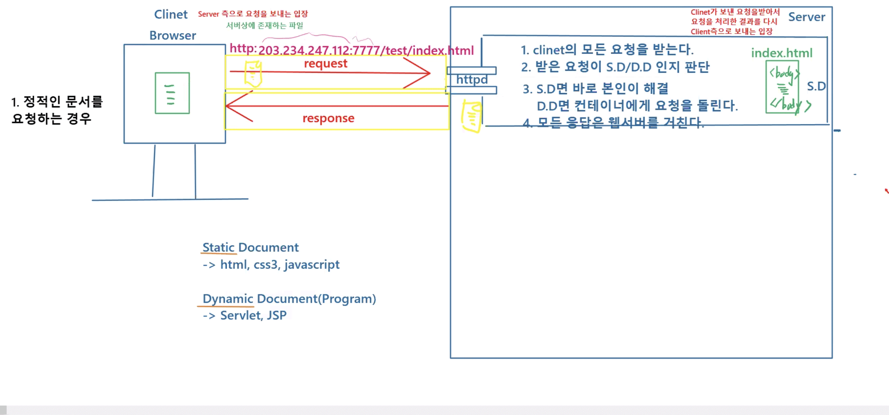

## 2.동적인 문서 요청


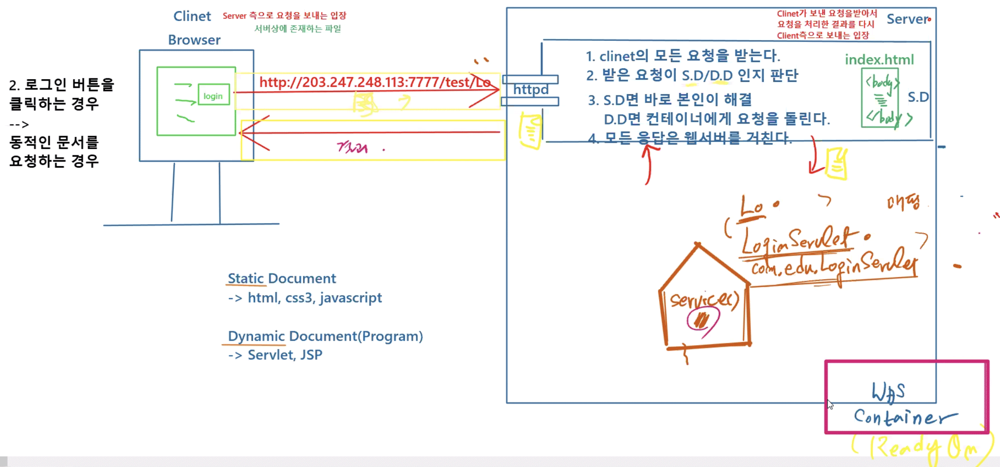


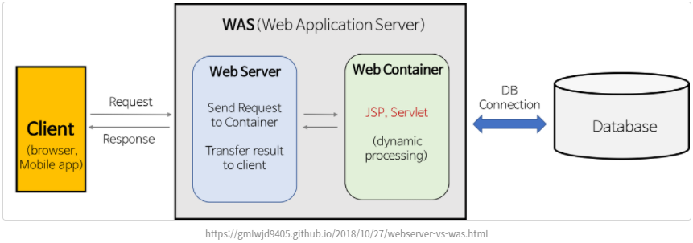


## 3. 3 Tier 구조

servlet : 

1. 클라이언트 화면에 form값을 받는다
   1. re 123, id pss
2. 그 값을 dao method를 호출하면서 넘김
3. 결과 페이지에 정보로 출력 -> jsp

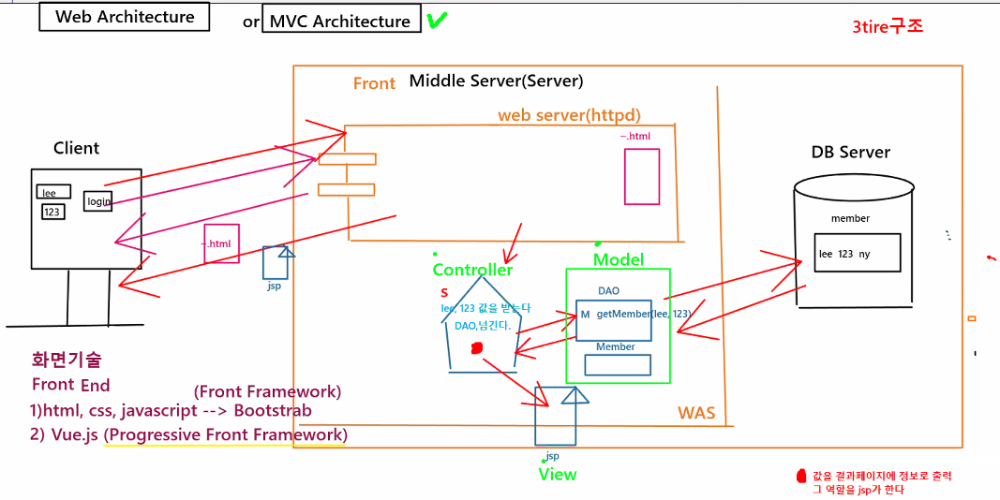

Web MVC Architecture

* Servlet : Controller
* DAO & Member : Model
* jsp : View


## 4. Servlet API

CGI 라고 부름 - 서버상에서 실행되는 모든 프로그램 기술

* asp, php, Servlet , ...
  * php 가장 오래됨 -> 많이 쓰임


### 1) GenericServlet 

: 센터 !!!

*  [**GenericServlet**](https://tomcat.apache.org/tomcat-5.5-doc/servletapi/javax/servlet/GenericServlet.html)

* CGI 기본적인 기능 상속
* 부모 : Servlet, ServletConfig
  * 둘은 hasing 관계
* 패키지 :  **javax.servlet**


#### 1) Servlet

* [**Servlet**](https://tomcat.apache.org/tomcat-5.5-doc/servletapi/javax/servlet/Servlet.html)

intit()

service()

​	: 클라이언트가 요청이 서버상으로 들어올 때 자동으로 호출

destroy()

getServletConfig

​	: ServletConfig로 넘어감


#### 2) ServletConfig

* [**ServletConfig**](https://tomcat.apache.org/tomcat-5.5-doc/servletapi/javax/servlet/ServletConfig.html)

getInitParameter()

getInitParameterNames()


#### 3) GenericServlet 

Servlet, ServletConfig의 기능 

​	+ Generic만의 기능 log()

service(req,res)


### 2) service(req,res)

#### ServletRequest

* [**ServletRequest**](https://tomcat.apache.org/tomcat-5.5-doc/servletapi/javax/servlet/ServletRequest.html)

요청에 관련된 정보를 저장하고 있는 객체

​	: 해당 객체가 어떻게 생겼는지를 한번 파악해볼 필요가 있다

파라미터값 !!

* String	getParameter("폼 이름")
* String[ ]	getParameterValues("폼 이름")
* requestDispatcher()


#### ServletResponse

* [**ServletResponse**](https://tomcat.apache.org/tomcat-5.5-doc/servletapi/javax/servlet/ServletResponse.html)

응답에 관련된 정보를 저장하는 객체

* PrintWriter()
* getWriter()

 

### 3) HttpServlet

* [**HttpServlet**](https://tomcat.apache.org/tomcat-5.5-doc/servletapi/javax/servlet/http/HttpServlet.html) 

* service(req,res) : 오버라이딩
* service(hreq,hres) : 오버로딩
* HttpServletRequest / HttpServletResponse 와 hasing 관계
  * 기본 패키지에 없음
  *  **javax.servlet.http** 패키지 !!!
* doGet(hreq,hres)
* doPost(hreq,hres)


#### HttpServletRequest

* [**HttpServletRequest**](https://tomcat.apache.org/tomcat-5.5-doc/servletapi/javax/servlet/http/HttpServletRequest.html)
* ServletResponse 상속
* HttpSession
* getSession()


#### HttpServletResponse

* [**HttpServletResponse**](https://tomcat.apache.org/tomcat-5.5-doc/servletapi/javax/servlet/http/HttpServletResponse.html)
* sendRedirect()


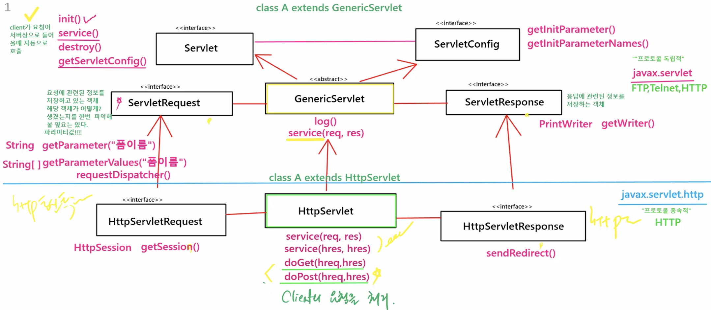


**Cf) javax.servlet vs. javax.servlet.http**

* javax.servlet 패키지
  * 프로토콜 독립적
  * FTP, Telnet, Http 다 돌아감
* javax.servlet.http 패키지
  * 프로토콜 종속적
  * Http 통신에서만 돌아감
* 프로토콜 종속적이어야 한다
  * **Why?**  Http 통신에 특화된 기능 ! 
  * powerful & specific 서비스 -> 명확한 기능 받을 수 있다


클라이언트 요청 -> 서비스 동작 -> 클라이언트 원하는 프로그램


Service Method 호출되는 시점 -> 


http서블릿에서는 서비스 메소드 써도 되지만 조금 더 http에 파워풀한 요청 서비스를 하기 위해

**doGet(hreq,hres) / doPost(hreq,hres)**

를 service 대신 사용 !!!!!!!!!!! -> 해서 클라이언트의 요청을 처리


**Cf) Class Hierarchy**

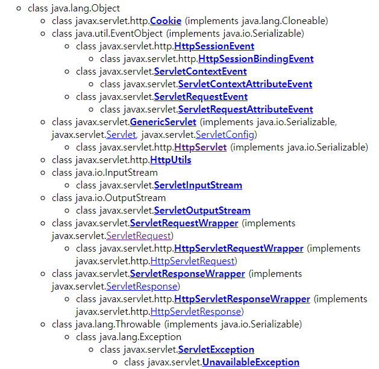


-------------------점심

## 5. 실습


WAS HOME : `C:\miracom_edu\util\apache-tomcat-8.5.72`

-> 표준화 -> 아무리 서버가 바뀌더라도 똑같다

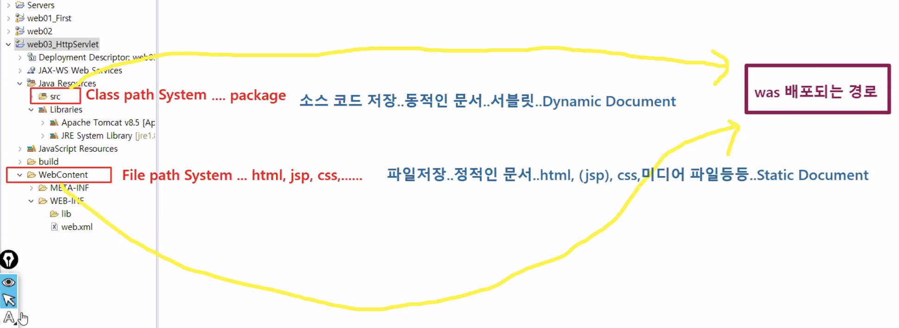


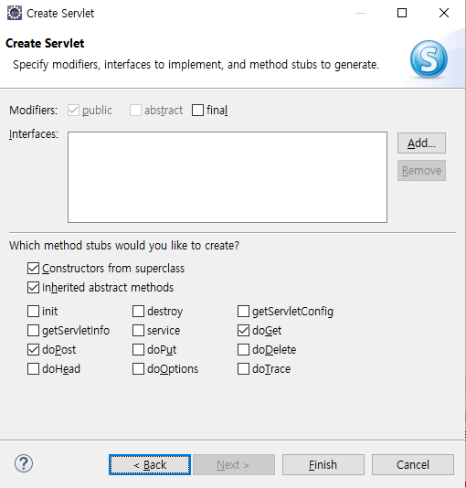

doGet / doPost 둘 중 하나만 !!


#### index.html

```html
<!DOCTYPE html>
<html>
<head>
<meta charset="EUC-KR">
<title>Insert title here</title>
</head>
<body>
<h2>
HttpServletTest으로 요청을 보냅니다.
<!--action : html 파일에서 서버 어느 파일(페이지)로 요청이 들어가는지를 지정  -->
<form action="HttpServletTest">
ID : <input type = "text" name="userId">
<input type = "submit" value="Send">
</form>
</h2>
</body>
</html>
```


#### HttpServletTest.java

```java
package web.servlet;

import java.io.IOException;
import java.io.PrintWriter;

import javax.servlet.ServletException;
import javax.servlet.annotation.WebServlet;
import javax.servlet.http.HttpServlet;
import javax.servlet.http.HttpServletRequest;
import javax.servlet.http.HttpServletResponse;

//annotation ...was xml 변경 - HttpServletTest -> 서버 내부에 HttpServletTest 인스턴스 -> web.servlet.HttpServletTest
@WebServlet("/HttpServletTest")
public class HttpServletTest extends HttpServlet {
	private static final long serialVersionUID = 1L;
       
	//servlet 객체가 생성될 때 호출...언제?...누가? -> was가 알아서 생성
    public HttpServletTest() {					//생성자
        super();
        System.out.println("HttpServletTest Servlet Creating...");
    }

    //언제? -> 클라이언트가 요청을 하면 호출 / 누가? -> was가 알아서 호출
	protected void doGet(HttpServletRequest request, HttpServletResponse response) throws ServletException, IOException {
		System.out.println("service()....call...");
		
		//클라이언트의 요청을 처리하는 코드를 작성
		//클라이언트의 요청을 처리하려면...요청정보(request), 처리된 결과(response)를 전달..
		//요청정보는 request에 담겨짐(id값)
		
		//브라우저로 받은 id 출력
		PrintWriter out = response.getWriter();		//브라우저로 출력하는 기능
		
		//폼값 받아서 처리한다
		String id = request.getParameter("userId"); //폼이름
		
		out.println("<html><body><h2>");
		out.println("User ID : "+id);
		out.println("</h2></body></html>");
	}
}
```


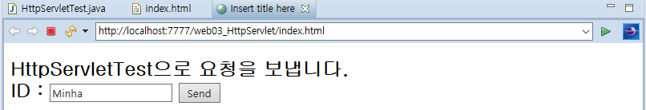

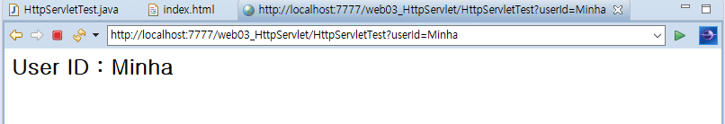


## 6. 제어의 역전

객체 내가 생성 안함 - 메소드도 호출 안함 -> 서버가 다 알아서 해줌 !!

-> 제어의 역전 !!!


제어의 역전 : 객체 생성을 WAS가 life cycle method를 WAS가 자동으로 호출


퍼블릭 빼면 안됨 오류

was는 프로그램 밖 -> public 아닌 class 에 접근 x -> 객체 생성 안됨 (외부 접근)


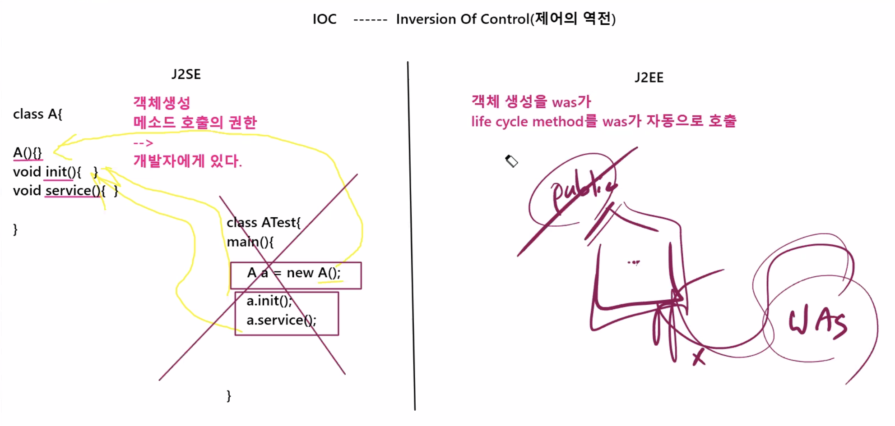


server 스타트 

1. D.D 파일을 읽어들인다

   `@WebServlet('/IS')` : DD파일로 만들어서 읽음

2. Servlet 생성 -> 생성자 호출

   HttpServletTest 객체 생성되어 있음

------------------------------------------------- Ready-On State : 단 한번만 일어남

3. 클라이언트가 요청을 하면 요청정보를 바탕으로 hreq / hres 객체를 생성
   1. 클라이언트 index.html 요청

      웹서버의  index.html 응답

      응답 결과로 ID 폼 생성됨

   2. Send 버튼 클릭 -> 또다른 요청

      다이나믹한 요청 !! 

   3. 대문(httpd ??)이 받아서 컨테이너 쪽으로 요청을 내림

      요청 정보도 컨테이너에게 

   4. 요청 정보를 바탕으로 was가 객체 2개 (hreq / hres) 생성

4.  요청을 처리하기 위해 doGet() 메소드 호출.. 

   1. 이때 hreq / hres 가 인자값으로 투입 (passing into)

5. doGet() {//} 실행

6. 서비스 처리 후 객체들 ( hreq / hres / thread)  death

   1. 메소드를 돌리기 우해 생성된 쓰레드

      모든 요청은 쓰레드 생성되며 동작함

------------------------------------------------- 3,4,5,6 반복...


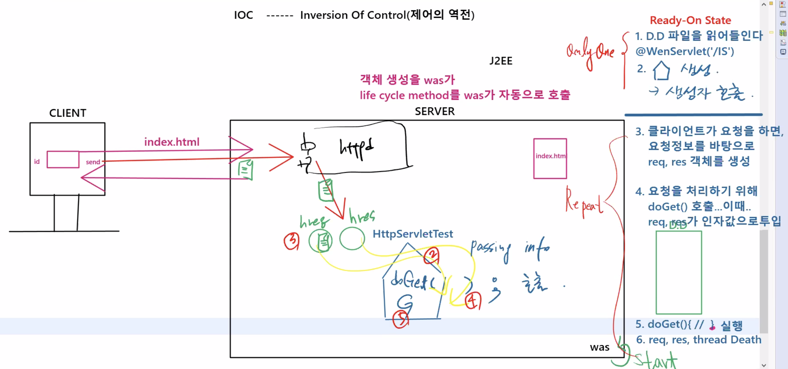


Cf)

`C:\miracom_edu\WebWorkspace\web03_HttpServlet\WebContent`

: index.html

`C:\miracom_edu\WebWorkspace\web03_HttpServlet\WebContent\WEB-INF`

: web.xml

WEB_INF : 을 기준으로 상위에는 동적 / 하위에는 정적 문서가 배포 !!


URL mapping 부분을  Edit 눌러서 FS로 변경

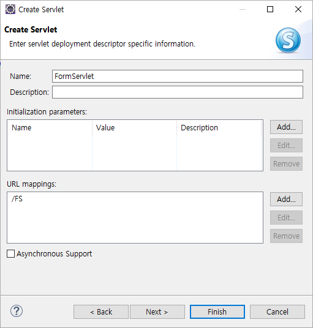


#### form.html

```html
<!DOCTYPE html>
<html>
<head>
<meta charset="EUC-KR">
<title>Insert title here</title>
</head>
<body>
<h2>Form Servlet</h2>
<form action="FS">	<!-- FS 이름으로 서블릿 - 클라이언트 맵핑 ?? -->
	NAME: <input type="text" name="name"><br><br>
	ADDR: <input type="text" name="addr"><br><br>
	<input type="submit" value="Data Send">
</form>
</body>
</html>
```


#### FormServlet.java

```java
package web.servlet;

import java.io.IOException;
import java.io.PrintWriter;

import javax.servlet.ServletException;
import javax.servlet.annotation.WebServlet;
import javax.servlet.http.HttpServlet;
import javax.servlet.http.HttpServletRequest;
import javax.servlet.http.HttpServletResponse;

@WebServlet("/FS")	//Servlet 이름: FS
public class FormServlet extends HttpServlet {
	private static final long serialVersionUID = 1L;
       
    public FormServlet() {
        super();
    }

    //Client가 요청을 하면 이 부분이 호출...was에 의해서
	protected void doGet(HttpServletRequest request, HttpServletResponse response) throws ServletException, IOException {
		
		//1. PrintWriter 객체 생성
		PrintWriter out = response.getWriter();	
		
		//2. 폼값 받아오기...name,addr 변수에 각각 할당
		String name = request.getParameter("name"); 
		String addr = request.getParameter("addr");
		
		//3. 클라이언트의 브라우저로 출력
		out.println("<html><body><h3>");
		out.println("Your Information...</h3><br>");
		out.println("<li> Name "+name+"<br>");
		out.println("<li> Address "+addr);
		out.println("</body></html>");
        
        out.close();		
	}
}
```

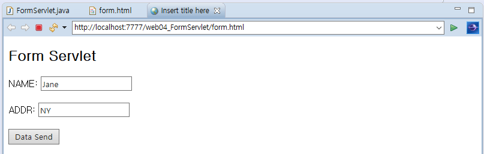

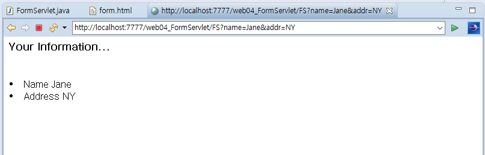