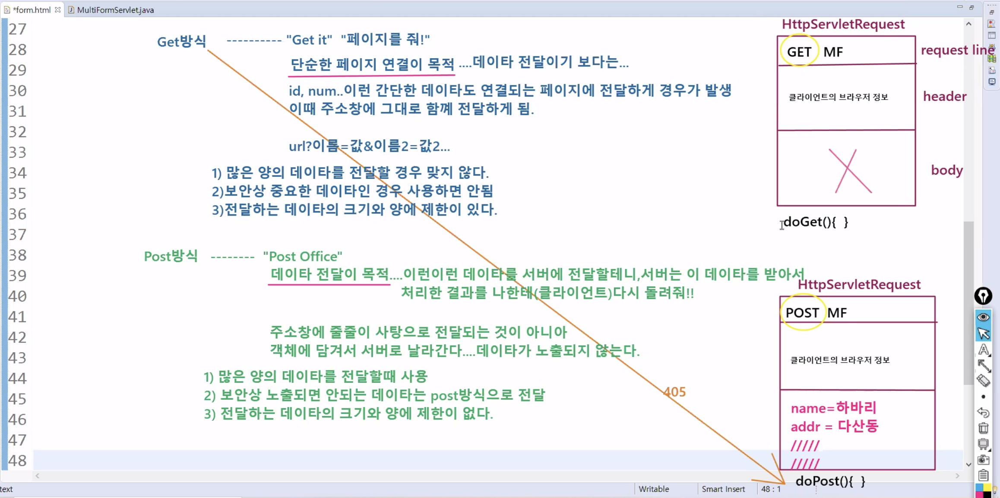
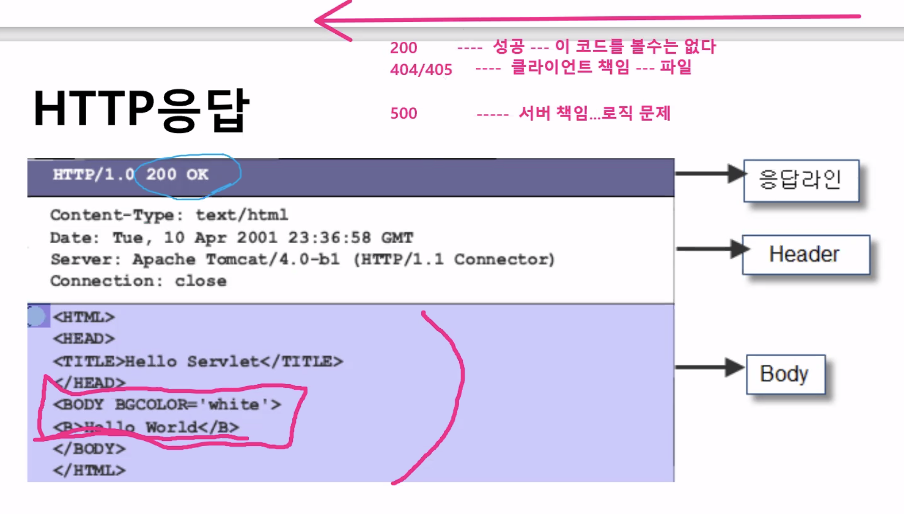
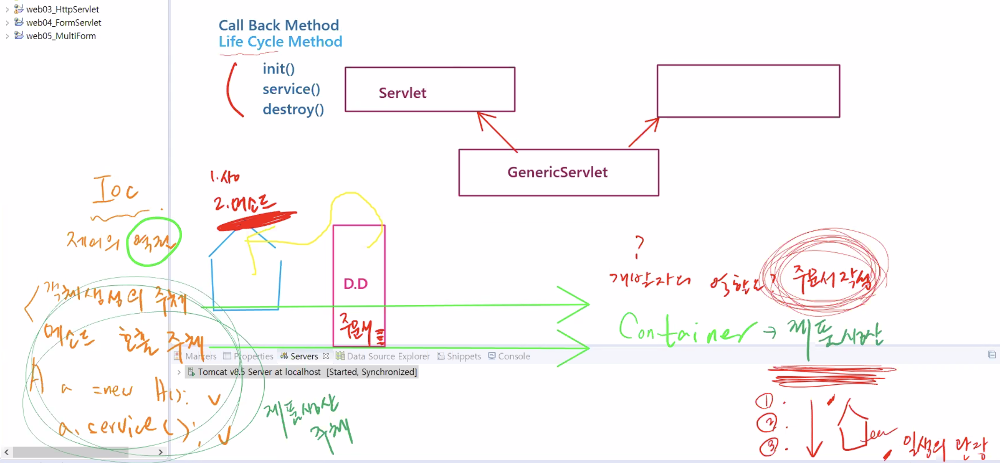
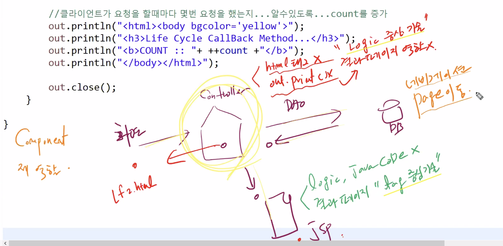
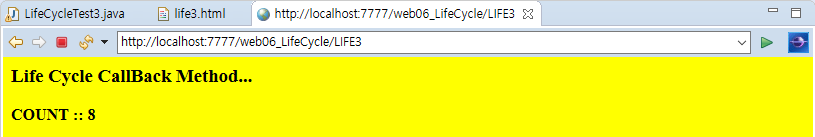
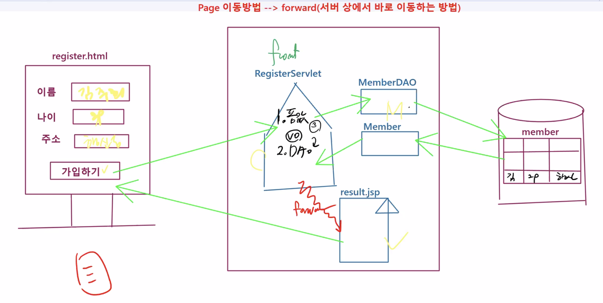
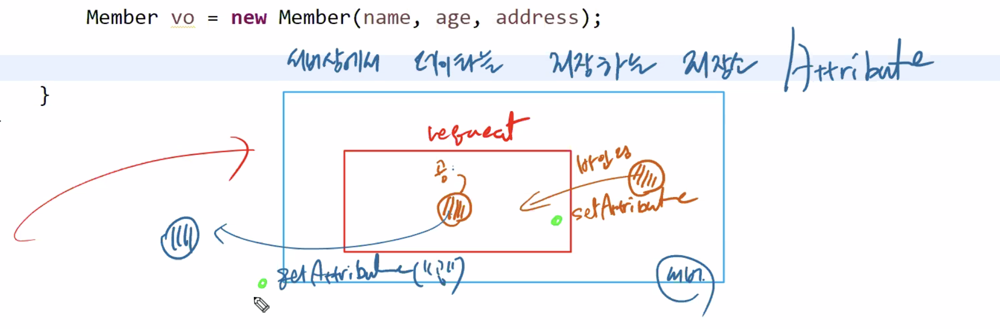

# 1110 Web

## 1.


배포하겠다.

web

xml은 가장 보편적인

xml은 태그 자체가 메타 데이터를 가짐.

form.html 옮기기


File > New > Dynamic Project :: web05_MultiForm , 다이나믹 웹모듈버전 2.5 >디플로이 디스크립터 가 만들어지도록 되어있다. D.D 배치설명서 :: web.xml 가장 보편적인 meta데이터(정보를 가지고 있는 데이터를 메타데이터라고 함) xml에선 테그 자체로서 데이터로서의 의미를 갖음


```xml
<?xml version="1.0" encoding="UTF-8"?>
<web-app xmlns:xsi="http://www.w3.org/2001/XMLSchema-instance"
xmlns="http://java.sun.com/xml/ns/javaee"
xsi:schemaLocation="http://java.sun.com/xml/ns/javaee
http://java.sun.com/xml/ns/javaee/web-app_2_5.xsd" id="WebApp_ID" version="2.5">
<servlet>
<description>다양한 입력폼을 받는 서블릿</description>
<display-name>MultiFormServlet</display-name>
<servlet-name>MultiFormServlet</servlet-name>
<servlet-class>web.servlet.MultiFormServlet</servlet-class>
</servlet>
<servlet-mapping>
<servlet-name>MultiFormServlet</servlet-name>
<url-pattern>/MF</url-pattern>
</servlet-mapping>
</web-app>
```


용어정리 

Web Application :: 

Web기반에서 실행되는 Application 

Web Site(정적 서비스)+CGI(동적 서비스) 

Web Site :: S.D의 집합 , 정적 서비스 제공, HTML, Image... 

CGI :: D.D

Servlet실행 

요청이 들어오기전 servlet이 만들어짐 

요청들어오면 서블릿이 돌아가며 메소드가 하나 thread로 만들어짐 

❗️ WAS안에서 배치경로 

Web Application Root -> 정적파일 : WEB-INF상위 -> WEB-INF -> web.xml -> classes -> lib


tag 

form tag ::

```
1. 다양한 입력방식 폼을 하나로 묶는 역할을 한다
2. 크게 2가지 속성이 있다.
필수속성은 action 연결된 서버상의 페이지(S.D/D.D)를 지정한다
Optional한속성으로는 method 가 있는데 값으로 GET/POST방식으로 나뉜다.
default는 get 방식이다. post일 경우에 써준다.

```

a tag ::

```
a  엥커테그 가장기본적인 연결방식::
필수속성은 href 로 이동값을 넣어준다.
get방식으로 데이터 전달하기 :: page뒤에 물음표 form이름 (key)과 값(value)을 map방식
으로 붙힌다. 연결은 & 로 가능.
```

input tag의 submit::

```
1.form에 필수속성인 Action페이지로 이동 함
2.form안의 모든 값을 가지고 감
```


#### form.html

* WebContent에 form.html (S.D)를 만든다.

```html
<!DOCTYPE html>
<html>
<head>
<meta charset="utf-8">
<title>Insert title here</title>
</head>
<body>
<h1>MultiForm Servlet</h1>
<!-- Form테그 ::
1. 다양한 입력방식 폼을 하나로 묶는 역할을 한다
2. 크게 2가지 속성이 있다.
필수속성은 action 연결된 서버상의 페이지(S.D/D.D)를 지정한다
Optional한속성으로는 method 가 있는데 값으로 GET/POST방식으로 나뉜다.
default는 get 방식이다. post일 경우에 써준다.
-->
<form action="MF" method="post">
NAME: <input type="text" name="name"><br><br>
ADDR: <input type="text" name="addr"><br><br>
<input type="submit" value="Data Send"><br><br>
</form>
<!-- a 엥커테그 가장기본적인 연결방식::
get방식 :: get it == 그 페이지 줘
필수속성은 href 로 이동값을 넣어준다.
get방식으로 데이터 전달하기 :: page뒤에 물음표 form이름 (key)과 값(value)을 map방식
으로 붙힌다. 연결은 & 로 가능.
-->
<a href="MF?name=James&addr=NY">MultiForm Servlet으로 이동합니다.</a>
</body>
</html>
```




## get 방식

"Get it" : 페이지를 줘!

- 페이지 전달의 기본 방식
- 단순한 페이지 연결이 목적...데이터전달이기보다는...
- id, num...이런 간단한 데이터도 연결되는 페이지에 전달하게 경우가 발생
- 이때, 주소창에 그대로 함께 전달하게 됨.
- url?이름=값&이름2=값2....
  1. 많은 양의 데이터를 전달할 경우 맞지 않다.
  2. 보안상 중요한 데이터인 경우 사용하면 안됨.
  3. 전달하는 데이터의 크기와 양에 제한이 있다.

## post 방식

"Post Office"

- 데이터 전달이 목적 : 이런이런 데이터를 서버에 전달할테니..서버는 이 데이터를 받아서 처리한 결과를 나한테(client) 다시 돌려줘
- 주소창에 줄줄이 사탕으로 전달되는 것이 아니라
- 객체에 담겨서 서버로 날라간다...데이터가 노출되지 않는다.
  1. 많은 양의 데이터를 전달 할때 사용
  2. 보안상 노출되면 안되는 데이터는 post방식으로 전달
  3. 전달하는 데이터의 크기와 양에 제한이 없다.


코드 넘버



doGET과 doPOST는 각각 GET요청 POST요청시 사용되기때문에 doProcess를 만들어 둘다 핸들링한다.

 post로 들어오면 doPost() 돌아가고 

get으로 들어오면 doGet() 으로 들어온다.

한글처리는 양방향 처리해줘야 한다 

📝 한글처리 Windows > preference > web 의 css,html, jsp 를 utf-8로 바꿔놔야함

```
request.setCharacterEncoding("utf-8");
response.setContentType("text/html;charset=utf-8");
```

#### MultiFormServlet.java

```java

```


#### MultiFormServletTest.java

```java

```

#### multiform.html

```html

```

### load-on-startup

서블릿 생성이 요청 후 일어나면 자연스럽게 시간이 딜레이 된다라고 이해했어요

그래서 load on startup 해줘서 서블릿 생성을 바로 해주고, 서블릿이 생성되어 있기 때문에 클라이언트가 요청할 때 요청 부분을 실행해주는게 바로 일어나서, 클라이언트 입장에서 대기 시간이 짧아진다. 라고 이해하고 있어요

load-on-startup 을 안해주면 Ready on이 동시에 같이 시행이된다. 

본격적인 서비스 진행 전에 Ready on을 시행되도록 하기위해서 해주는 것!  


#### web.xml 

load-on-startup 의 숫자를 0보다 크면 서버가 스타트 되면서 서블릿을 초기화한다.

load-on-startup 을 안해주면 Ready on이 동시에 같이 시행이된다. 

본격적인 서비스 진행 전에 Ready on을 시행되도록 하기위해서 해주는 것! 

```xml

```







## 2. Servlet LifeCycle

Life Cycle Method == Call back Method 

Servlet 의 init(), service(), destroy() 와같은 것을 Life Cycle Method라고 부른다. 

객체생성의 주체 == 메소드 호출의 주체 

* 개발자가 제품생산의 주체가 됨 

IOC는 객체생성과 메소드호출의 주체가 WAS가 된다. 

* 개발자는 주문자 작성(D.D file..)의 주체가 됨 
* 서블릿의 일생을 관장하는 메소드를 Life Cycle Method라고 한다
* == Container에 의해 자동적으로 호출 된 가장 basic한 객체

```
1.생성자 호출..
2.init()..서블릿 객체가 생성된 직후에 호출 됨
3.doGet() 혹은 doPost().. 클라이언트가 요청을 하면 호출 됨
4.destroy().. 서버를 stop시키면 반드시 호출 됨 이게 호출되면 서블릿이 메모리에서 사라진다
```


D.D = 주문서 -> WAS가 아닌 개발자가 만든다

생성자 / 메소드 호출

-> 라이프 사이클 메소드


컨테이너에 의해 자동적으로 호출

-> 동작 결과 컨테이너로 다시 !!

-> 콜백 메소드


#### life1.html

```html
<!DOCTYPE html>
<html>
<head>
<meta charset="UTF-8">
<title>Insert title here</title>
</head>
<body>
<h2 align="center">Life Cycle...CallBack Method...By Container</h2>
<a href="LIFE1">Life Cycle Test...</a>
</body>
</html>
```


#### LifecycleTest1.java

* init destroy doGet doPost

```java
package web.servlet.life;

import java.io.IOException;
import java.io.PrintWriter;

import javax.servlet.Servlet;
import javax.servlet.ServletConfig;
import javax.servlet.ServletException;
import javax.servlet.annotation.WebServlet;
import javax.servlet.http.HttpServlet;
import javax.servlet.http.HttpServletRequest;
import javax.servlet.http.HttpServletResponse;

/*
 * Servlet의 일생을 관장하는 Lifecycle 메소드
 * 1.생성자 호출
 * 2.init()...서블릿 객체가 생성된 직후 호출
 * 3.doGet() 혹은 doPost()...클라이언트가 요청을 하면
 * 4.destroy()...서버를 stop 시키면 반드시 호출...이게 호출되면 서블릿이 사라진다
 */

@WebServlet("/LIFE1")
public class LifecycleTest1 extends HttpServlet {
	private static final long serialVersionUID = 1L;
	
	
	//추가
	private int count=0;
       
    public LifecycleTest1() {
        super();
        System.out.println("1.Servlet Create...by container");
    }

	public void init(ServletConfig config) throws ServletException {
		System.out.println("2.init call...by container");
	}

	public void destroy() {
		System.out.println("4.destroy call...by container");
	}

	protected void doGet(HttpServletRequest request, HttpServletResponse response) throws ServletException, IOException {
		System.out.println("3.service call...by container");
		request.setCharacterEncoding("utf-8");
		response.setContentType("text/html;charset=utf-8");
		
		PrintWriter out = response.getWriter();
		
		//클라이언트가 요청을 할때마다 몇번 요청을 했는지...알 수 있도록 count를 증가 -> 필드 
		out.println("<html><body bgcolor='yellow'>");
		out.println("<h3>Life Cycle CallBack Method...</h3>");
		out.println("<b>COUNT :: "+ ++count +"</b>");
		out.println("</body></html>");
		
		out.close();

	}
}
```


doGet이전은 ReadyOn -> Servlet 생성과 init 


3번만 계속...


#### life2.html

```html
<!DOCTYPE html>
<html>
<head>
<meta charset="UTF-8">
<title>Insert title here</title>
</head>
<body>
<h2 align="center">Life Cycle...CallBack Method...By Container</h2>
<a href="LIFE2">Life Cycle Test...</a>
</body>
</html>
```


#### LifeCycleTest2.java

```java
package web.servlet.life;

import java.io.IOException;
import java.io.PrintWriter;

import javax.servlet.Servlet;
import javax.servlet.ServletConfig;
import javax.servlet.ServletException;
import javax.servlet.annotation.WebServlet;
import javax.servlet.http.HttpServlet;
import javax.servlet.http.HttpServletRequest;
import javax.servlet.http.HttpServletResponse;

/*
 * LIFE1의 문제점
 * 1. READY ON상태 부분이 요청할때 함께 진행되었다.
 *    --> load on startup 옵션을 지정해야 한다.
 *    --> xml, annotation기반..
 *    
 * 2. 서블릿이 처리한 결과를 직접 클라이언트에게 출력하고 있다.
 *    직접 출력하기 때문에 PrintWriter 객체를 반환받았고
 *    println()메소드 안에서 html 태그 까지 사용하는 무리수를 두고 있다.
 *    --> 결과페이지의 역할은 jsp 파일에게 넘긴다.
 *    --> 아직 네비게이션(페이지 이동방법)에 대해서는 배우지 않았기 때문에
 *        우리가 알고 있는 a 태그를 이용하자.
 */


/**
 * Servlet implementation class LifeCycleTest2
 */

@WebServlet(urlPatterns= {"/LIFE2"}, loadOnStartup=1)	//옵션 지정
public class LifeCycleTest2 extends HttpServlet {
	private static final long serialVersionUID = 1L;
	//추가
	private int count=0;
       
    /**
     * @see HttpServlet#HttpServlet()
     */
    public LifeCycleTest2() {
        super();
        System.out.println("1.Servlet Create...by container");
    }

	/**
	 * @see Servlet#init(ServletConfig)
	 */
	public void init(ServletConfig config) throws ServletException {
		System.out.println("2.init call...by container");
	}

	/**
	 * @see Servlet#destroy()
	 */
	public void destroy() {
		System.out.println("4.destroy call...by container");
	}

	/**
	 * @see HttpServlet#doGet(HttpServletRequest request, HttpServletResponse response)
	 */
	protected void doGet(HttpServletRequest request, HttpServletResponse response) throws ServletException, IOException {
		System.out.println("3.service...doGet call...by container");
		request.setCharacterEncoding("utf-8");
		response.setContentType("text/html;charset=utf-8");
		
		PrintWriter out = response.getWriter();
//		out.println("<html><body bgcolor='yellow'>");
//		out.println("<h3>Life Cycle CallBack Method...</h3>");
//		out.println("<b>COUNT :: "+ ++count +"</b>");
//		out.println("</body></html>");
//		out.close();
		
		count++; 	//카운터 증가
		out.println("<a href=life2.jsp?cnt="+count+">jsp 결과 페이지로 이동</a>");		//get방식?? -> cnt라는 이름으로
		//폼에 입력된 값 전달할 때와 똑같음 -> ${param.cnt} = request.getparameter("cnt");

	}

}
```


#### life2.jsp

```jsp
<%@ page language="java" contentType="text/html; charset=UTF-8"
    pageEncoding="UTF-8"%>
<!DOCTYPE html>
<html>
<head>
<meta charset="UTF-8">
<title>Insert title here</title>
</head>
<body>
<h3>RESULT PAGE</h3>
<!-- EL기법..request.getparameter("cnt");와 똑같다 -->
<b>Count Value : ${param.cnt}</b>

</body>
</html>
```


서블릿은 응답하는 역할x -> 처리 결과를 jsp에 전달 -> jsp가 응답

현재는 서블릿 응답 후 jsp 또다른 요청 응답으로 하는 중... -> 이렇게 하면 안돼!!


#### life3.html

```html
<!DOCTYPE html>
<html>
<head>
<meta charset="UTF-8">
<title>Insert title here</title>
</head>
<body>
<h2 align="center">Life Cycle...CallBack Method...By Container</h2>
<a href="LIFE3">Life Cycle Test...</a>
</body>
</html>
```


#### LifeCycleTest3.java

```java
package web.servlet.life;

import java.io.BufferedReader;
import java.io.File;
import java.io.FileReader;
import java.io.FileWriter;
import java.io.IOException;
import java.io.PrintWriter;

import javax.servlet.Servlet;
import javax.servlet.ServletConfig;
import javax.servlet.ServletException;
import javax.servlet.annotation.WebServlet;
import javax.servlet.http.HttpServlet;
import javax.servlet.http.HttpServletRequest;
import javax.servlet.http.HttpServletResponse;

/*
 * LIFE2의 문제점
 * 1. 서버가 꺼지게 되면 필드값을 영구적으로 잃어버리게 된다.
 *    서블릿 인스턴스가 Death되기 때문에 그 안에 저장된 필드 값도 함께 사라진다.
 *    --> 해결책 ?
 *    데이터를 어딘가에 저장하는 메카니즘...라이프 사이클 메소드를 연계
 *    DB, 파일 ...
 *    
 *    destroy() : 서블릿 죽기 직전...저장 -> Setter(Writer)
 *    init() : 새롭게 Ready On할 때 어딘가에 저장된 이전의 값을 다시 찾아옴 ...-> Getter(Reader)
 *    
 */

@WebServlet("/LIFE3")
public class LifeCycleTest3 extends HttpServlet {
	private static final long serialVersionUID = 1L;
	private int count =0;
	private String path = "C:\\miracom_edu\\util\\count.txt";
       
    public LifeCycleTest3() {
        super();
        System.out.println("1.Servlet Create...by container");
    }

	public void init(ServletConfig config) throws ServletException {
		System.out.println("2.init call...by container");
		//파일에 저장된 내용을 불러온다
		try {
			BufferedReader br = new BufferedReader(new FileReader(path));
			String str = br.readLine();
			 
			 count = Integer.parseInt(str);
			 System.out.println("count.txt값을 읽어서 필드에 다시 할당함 !");

		}catch(Exception e) {
			System.out.println("파일 읽기 실패...");
		}
	}

	public void destroy() {
		System.out.println("4.destroy call...by container");
		//서블릿 인스턴스가 메모리에서 영구적으로 삭제되기 직전에 값을 파일에 저장
		File f = new File(path);
		try {
			PrintWriter pw = new PrintWriter(new FileWriter(f));
			pw.println(count); //이때 파일에 저장됨..출력
			pw.close();
			
			System.out.println(path+", Count값 : "+count+", 파일 저장 성공 !");
		}catch(Exception e) {
			System.out.println("파일 출력 실패...");
			
		}
	}

	protected void doGet(HttpServletRequest request, HttpServletResponse response) throws ServletException, IOException {
		System.out.println("3.service...doGet call...by container");
		request.setCharacterEncoding("utf-8");
		response.setContentType("text/html;charset=utf-8");
		
		PrintWriter out = response.getWriter();
		
		out.println("<html><body bgcolor='yellow'>");
		out.println("<h3>Life Cycle CallBack Method...</h3>");
		out.println("<b>COUNT :: "+ ++count +"</b>");	//요청 끝나도 증가
		out.println("</body></html>");
		
		out.close();
	}
}
```


```
11월 10, 2021 4:05:51 오후 org.apache.catalina.startup.VersionLoggerListener log
정보: 서버 버전 이름:    Apache Tomcat/8.5.72
11월 10, 2021 4:05:51 오후 org.apache.catalina.startup.VersionLoggerListener log
정보: Server 빌드 시각:  Oct 1 2021 15:15:33 UTC
11월 10, 2021 4:05:51 오후 org.apache.catalina.startup.VersionLoggerListener log
정보: Server 버전 번호:  8.5.72.0
11월 10, 2021 4:05:51 오후 org.apache.catalina.startup.VersionLoggerListener log
정보: 운영체제 이름:     Windows 10
11월 10, 2021 4:05:51 오후 org.apache.catalina.startup.VersionLoggerListener log
정보: 운영체제 버전:     10.0
11월 10, 2021 4:05:51 오후 org.apache.catalina.startup.VersionLoggerListener log
정보: 아키텍처:          amd64
11월 10, 2021 4:05:51 오후 org.apache.catalina.startup.VersionLoggerListener log
정보: 자바 홈:           C:\Program Files\Java\jre1.8.0_301
11월 10, 2021 4:05:51 오후 org.apache.catalina.startup.VersionLoggerListener log
정보: JVM 버전:          1.8.0_301-b09
11월 10, 2021 4:05:51 오후 org.apache.catalina.startup.VersionLoggerListener log
정보: JVM 벤더:          Oracle Corporation
11월 10, 2021 4:05:51 오후 org.apache.catalina.startup.VersionLoggerListener log
정보: CATALINA_BASE:     C:\miracom_edu\WebWorkspace\.metadata\.plugins\org.eclipse.wst.server.core\tmp0
11월 10, 2021 4:05:51 오후 org.apache.catalina.startup.VersionLoggerListener log
정보: CATALINA_HOME:     C:\miracom_edu\util\apache-tomcat-8.5.72
11월 10, 2021 4:05:51 오후 org.apache.catalina.startup.VersionLoggerListener log
정보: 명령 행 아규먼트:  -Dcatalina.base=C:\miracom_edu\WebWorkspace\.metadata\.plugins\org.eclipse.wst.server.core\tmp0
11월 10, 2021 4:05:51 오후 org.apache.catalina.startup.VersionLoggerListener log
정보: 명령 행 아규먼트:  -Dcatalina.home=C:\miracom_edu\util\apache-tomcat-8.5.72
11월 10, 2021 4:05:51 오후 org.apache.catalina.startup.VersionLoggerListener log
정보: 명령 행 아규먼트:  -Dwtp.deploy=C:\miracom_edu\WebWorkspace\.metadata\.plugins\org.eclipse.wst.server.core\tmp0\wtpwebapps
11월 10, 2021 4:05:51 오후 org.apache.catalina.startup.VersionLoggerListener log
정보: 명령 행 아규먼트:  -Djava.endorsed.dirs=C:\miracom_edu\util\apache-tomcat-8.5.72\endorsed
11월 10, 2021 4:05:51 오후 org.apache.catalina.startup.VersionLoggerListener log
정보: 명령 행 아규먼트:  -Dfile.encoding=UTF-8
11월 10, 2021 4:05:51 오후 org.apache.catalina.core.AprLifecycleListener lifecycleEvent
정보: 프로덕션 환경들에서 최적의 성능을 제공하는, APR 기반 Apache Tomcat Native 라이브러리가, 다음 java.library.path에서 발견되지 않습니다: [C:\Program Files\Java\jre1.8.0_301\bin;C:\WINDOWS\Sun\Java\bin;C:\WINDOWS\system32;C:\WINDOWS;C:/Program Files/Java/jre1.8.0_301/bin/server;C:/Program Files/Java/jre1.8.0_301/bin;C:/Program Files/Java/jre1.8.0_301/lib/amd64;C:\Program Files (x86)\Common Files\Oracle\Java\javapath;C:\WINDOWS\system32;C:\WINDOWS;C:\WINDOWS\System32\Wbem;C:\WINDOWS\System32\WindowsPowerShell\v1.0\;C:\WINDOWS\System32\OpenSSH\;C:\Program Files\Git\cmd;C:\Program Files\PuTTY\;C:\miracom_edu\util\apache-tomcat-8.5.72\bin;C:/Users/mina/corretto/jdk11.0.8_10\bin;C:\Program Files\R\R-3.6.2\bin\x64;C:\Program Files (x86)\Common Files\Oracle\Java\javapath;C:\WINDOWS\system32;C:\WINDOWS;C:\WINDOWS\System32\Wbem;C:\WINDOWS\System32\WindowsPowerShell\v1.0\;C:\WINDOWS\System32\OpenSSH\;C:/Users/mina/corretto/jdk11.0.8_10\bin;"C:\Users\mina\AppData\Local\Microsoft\WindowsApps;";C:\Program Files\RStudio\bin\rpostback;C:\Program Files\RStudio\bin\postback;C:\Users\mina\AppData\Roaming\Microsoft\Windows\Start Menu\Programs\Python 3.8;C:\python_lib;C:\Users\mina\AppData\Local\Programs\Microsoft VS Code\bin;C:\Program Files\JetBrains\WebStorm 2020.3.2\bin;;C:\Users\mina\AppData\Local\GitHubDesktop\bin;C:\Users\mina\AppData\Local\Microsoft\WindowsApps;;C:\miracom_edu\eclipse;;.]
11월 10, 2021 4:05:51 오후 org.apache.coyote.AbstractProtocol init
정보: 프로토콜 핸들러 ["http-nio-7777"]을(를) 초기화합니다.
11월 10, 2021 4:05:52 오후 org.apache.tomcat.util.net.NioSelectorPool getSharedSelector
정보: Using a shared selector for servlet write/read
11월 10, 2021 4:05:52 오후 org.apache.catalina.startup.Catalina load
정보: Initialization processed in 914 ms
11월 10, 2021 4:05:52 오후 org.apache.catalina.core.StandardService startInternal
정보: 서비스 [Catalina]을(를) 시작합니다.
11월 10, 2021 4:05:52 오후 org.apache.catalina.core.StandardEngine startInternal
정보: 서버 엔진을 시작합니다: [Apache Tomcat/8.5.72]
11월 10, 2021 4:05:57 오후 org.apache.jasper.servlet.TldScanner scanJars
정보: 적어도 하나의 JAR가 TLD들을 찾기 위해 스캔되었으나 아무 것도 찾지 못했습니다. 스캔했으나 TLD가 없는 JAR들의 전체 목록을 보시려면, 로그 레벨을 디버그 레벨로 설정하십시오. 스캔 과정에서 불필요한 JAR들을 건너뛰면, 시스템 시작 시간과 JSP 컴파일 시간을 단축시킬 수 있습니다.
11월 10, 2021 4:06:03 오후 org.apache.jasper.servlet.TldScanner scanJars
정보: 적어도 하나의 JAR가 TLD들을 찾기 위해 스캔되었으나 아무 것도 찾지 못했습니다. 스캔했으나 TLD가 없는 JAR들의 전체 목록을 보시려면, 로그 레벨을 디버그 레벨로 설정하십시오. 스캔 과정에서 불필요한 JAR들을 건너뛰면, 시스템 시작 시간과 JSP 컴파일 시간을 단축시킬 수 있습니다.
1.Servlet Create...by container
2.init call...by container
11월 10, 2021 4:06:03 오후 org.apache.coyote.AbstractProtocol start
정보: 프로토콜 핸들러 ["http-nio-7777"]을(를) 시작합니다.
11월 10, 2021 4:06:03 오후 org.apache.catalina.startup.Catalina start
정보: Server startup in 10969 ms
1.Servlet Create...by container
2.init call...by container
파일 읽기 실패...
3.service...doGet call...by container
3.service...doGet call...by container
3.service...doGet call...by container
3.service...doGet call...by container
3.service...doGet call...by container
3.service...doGet call...by container
3.service...doGet call...by container
11월 10, 2021 4:07:02 오후 org.apache.catalina.core.StandardServer await
정보: 셧다운 포트를 통해 유효한 셧다운 명령을 받았습니다. 서버 인스턴스를 중지시킵니다.
11월 10, 2021 4:07:02 오후 org.apache.coyote.AbstractProtocol pause
정보: 프로토콜 핸들러 ["http-nio-7777"]을(를) 일시 정지 중
11월 10, 2021 4:07:02 오후 org.apache.catalina.core.StandardService stopInternal
정보: 서비스 [Catalina]을(를) 중지시킵니다.
4.destroy call...by container
4.destroy call...by container
C:\miracom_edu\util\count.txt Count값7, 파일 저장 성공 !
11월 10, 2021 4:07:02 오후 org.apache.coyote.AbstractProtocol stop
정보: 프로토콜 핸들러 ["http-nio-7777"]을(를) 중지시킵니다.
11월 10, 2021 4:07:02 오후 org.apache.coyote.AbstractProtocol destroy
정보: 프로토콜 핸들러 ["http-nio-7777"]을(를) 소멸시킵니다.

```

```
11월 10, 2021 4:08:45 오후 org.apache.catalina.startup.VersionLoggerListener log
정보: 서버 버전 이름:    Apache Tomcat/8.5.72
11월 10, 2021 4:08:45 오후 org.apache.catalina.startup.VersionLoggerListener log
정보: Server 빌드 시각:  Oct 1 2021 15:15:33 UTC
11월 10, 2021 4:08:45 오후 org.apache.catalina.startup.VersionLoggerListener log
정보: Server 버전 번호:  8.5.72.0
11월 10, 2021 4:08:45 오후 org.apache.catalina.startup.VersionLoggerListener log
정보: 운영체제 이름:     Windows 10
11월 10, 2021 4:08:45 오후 org.apache.catalina.startup.VersionLoggerListener log
정보: 운영체제 버전:     10.0
11월 10, 2021 4:08:45 오후 org.apache.catalina.startup.VersionLoggerListener log
정보: 아키텍처:          amd64
11월 10, 2021 4:08:45 오후 org.apache.catalina.startup.VersionLoggerListener log
정보: 자바 홈:           C:\Program Files\Java\jre1.8.0_301
11월 10, 2021 4:08:45 오후 org.apache.catalina.startup.VersionLoggerListener log
정보: JVM 버전:          1.8.0_301-b09
11월 10, 2021 4:08:45 오후 org.apache.catalina.startup.VersionLoggerListener log
정보: JVM 벤더:          Oracle Corporation
11월 10, 2021 4:08:45 오후 org.apache.catalina.startup.VersionLoggerListener log
정보: CATALINA_BASE:     C:\miracom_edu\WebWorkspace\.metadata\.plugins\org.eclipse.wst.server.core\tmp0
11월 10, 2021 4:08:45 오후 org.apache.catalina.startup.VersionLoggerListener log
정보: CATALINA_HOME:     C:\miracom_edu\util\apache-tomcat-8.5.72
11월 10, 2021 4:08:45 오후 org.apache.catalina.startup.VersionLoggerListener log
정보: 명령 행 아규먼트:  -Dcatalina.base=C:\miracom_edu\WebWorkspace\.metadata\.plugins\org.eclipse.wst.server.core\tmp0
11월 10, 2021 4:08:45 오후 org.apache.catalina.startup.VersionLoggerListener log
정보: 명령 행 아규먼트:  -Dcatalina.home=C:\miracom_edu\util\apache-tomcat-8.5.72
11월 10, 2021 4:08:45 오후 org.apache.catalina.startup.VersionLoggerListener log
정보: 명령 행 아규먼트:  -Dwtp.deploy=C:\miracom_edu\WebWorkspace\.metadata\.plugins\org.eclipse.wst.server.core\tmp0\wtpwebapps
11월 10, 2021 4:08:45 오후 org.apache.catalina.startup.VersionLoggerListener log
정보: 명령 행 아규먼트:  -Djava.endorsed.dirs=C:\miracom_edu\util\apache-tomcat-8.5.72\endorsed
11월 10, 2021 4:08:45 오후 org.apache.catalina.startup.VersionLoggerListener log
정보: 명령 행 아규먼트:  -Dfile.encoding=UTF-8
11월 10, 2021 4:08:45 오후 org.apache.catalina.core.AprLifecycleListener lifecycleEvent
정보: 프로덕션 환경들에서 최적의 성능을 제공하는, APR 기반 Apache Tomcat Native 라이브러리가, 다음 java.library.path에서 발견되지 않습니다: [C:\Program Files\Java\jre1.8.0_301\bin;C:\WINDOWS\Sun\Java\bin;C:\WINDOWS\system32;C:\WINDOWS;C:/Program Files/Java/jre1.8.0_301/bin/server;C:/Program Files/Java/jre1.8.0_301/bin;C:/Program Files/Java/jre1.8.0_301/lib/amd64;C:\Program Files (x86)\Common Files\Oracle\Java\javapath;C:\WINDOWS\system32;C:\WINDOWS;C:\WINDOWS\System32\Wbem;C:\WINDOWS\System32\WindowsPowerShell\v1.0\;C:\WINDOWS\System32\OpenSSH\;C:\Program Files\Git\cmd;C:\Program Files\PuTTY\;C:\miracom_edu\util\apache-tomcat-8.5.72\bin;C:/Users/mina/corretto/jdk11.0.8_10\bin;C:\Program Files\R\R-3.6.2\bin\x64;C:\Program Files (x86)\Common Files\Oracle\Java\javapath;C:\WINDOWS\system32;C:\WINDOWS;C:\WINDOWS\System32\Wbem;C:\WINDOWS\System32\WindowsPowerShell\v1.0\;C:\WINDOWS\System32\OpenSSH\;C:/Users/mina/corretto/jdk11.0.8_10\bin;"C:\Users\mina\AppData\Local\Microsoft\WindowsApps;";C:\Program Files\RStudio\bin\rpostback;C:\Program Files\RStudio\bin\postback;C:\Users\mina\AppData\Roaming\Microsoft\Windows\Start Menu\Programs\Python 3.8;C:\python_lib;C:\Users\mina\AppData\Local\Programs\Microsoft VS Code\bin;C:\Program Files\JetBrains\WebStorm 2020.3.2\bin;;C:\Users\mina\AppData\Local\GitHubDesktop\bin;C:\Users\mina\AppData\Local\Microsoft\WindowsApps;;C:\miracom_edu\eclipse;;.]
11월 10, 2021 4:08:45 오후 org.apache.coyote.AbstractProtocol init
정보: 프로토콜 핸들러 ["http-nio-7777"]을(를) 초기화합니다.
11월 10, 2021 4:08:45 오후 org.apache.tomcat.util.net.NioSelectorPool getSharedSelector
정보: Using a shared selector for servlet write/read
11월 10, 2021 4:08:45 오후 org.apache.catalina.startup.Catalina load
정보: Initialization processed in 914 ms
11월 10, 2021 4:08:45 오후 org.apache.catalina.core.StandardService startInternal
정보: 서비스 [Catalina]을(를) 시작합니다.
11월 10, 2021 4:08:45 오후 org.apache.catalina.core.StandardEngine startInternal
정보: 서버 엔진을 시작합니다: [Apache Tomcat/8.5.72]
11월 10, 2021 4:08:51 오후 org.apache.jasper.servlet.TldScanner scanJars
정보: 적어도 하나의 JAR가 TLD들을 찾기 위해 스캔되었으나 아무 것도 찾지 못했습니다. 스캔했으나 TLD가 없는 JAR들의 전체 목록을 보시려면, 로그 레벨을 디버그 레벨로 설정하십시오. 스캔 과정에서 불필요한 JAR들을 건너뛰면, 시스템 시작 시간과 JSP 컴파일 시간을 단축시킬 수 있습니다.
11월 10, 2021 4:08:56 오후 org.apache.jasper.servlet.TldScanner scanJars
정보: 적어도 하나의 JAR가 TLD들을 찾기 위해 스캔되었으나 아무 것도 찾지 못했습니다. 스캔했으나 TLD가 없는 JAR들의 전체 목록을 보시려면, 로그 레벨을 디버그 레벨로 설정하십시오. 스캔 과정에서 불필요한 JAR들을 건너뛰면, 시스템 시작 시간과 JSP 컴파일 시간을 단축시킬 수 있습니다.
1.Servlet Create...by container
2.init call...by container
11월 10, 2021 4:08:56 오후 org.apache.coyote.AbstractProtocol start
정보: 프로토콜 핸들러 ["http-nio-7777"]을(를) 시작합니다.
11월 10, 2021 4:08:56 오후 org.apache.catalina.startup.Catalina start
정보: Server startup in 10811 ms
1.Servlet Create...by container
2.init call...by container
count.txt값을 읽어서 필드에 다시 할당함 !
3.service...doGet call...by container

```




## 3.




클라이언트 요청 -> request / response 생성 (스레드 ?)

 request 중요 !!!


객체 생성전에 서블릿 먼저 만들어져 있음

가장 먼저 생성

j2ee : 많은 것들이 만들어짐


서버 상에서 데이터를 저장하는 저장소 : Attribute

ex) 서블릿 request 

Attribute는 페어링 함수가 있다

ex) setAttribute (값 바인딩) / getAttribute (값 가져옴)




#### register.html

```html

```

#### Member.java

```java

```


#### RegisterServlet.java

```java

```


#### result.jsp

```jsp

```


