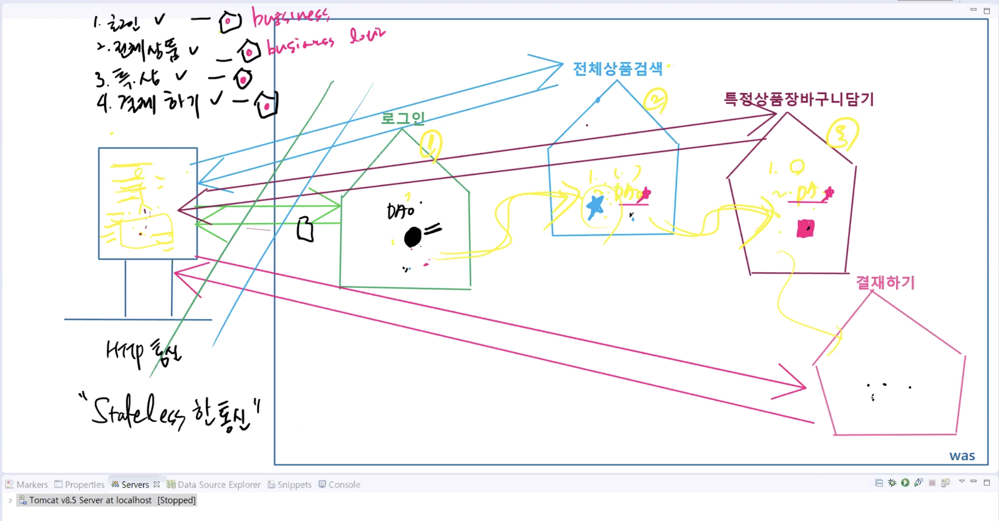
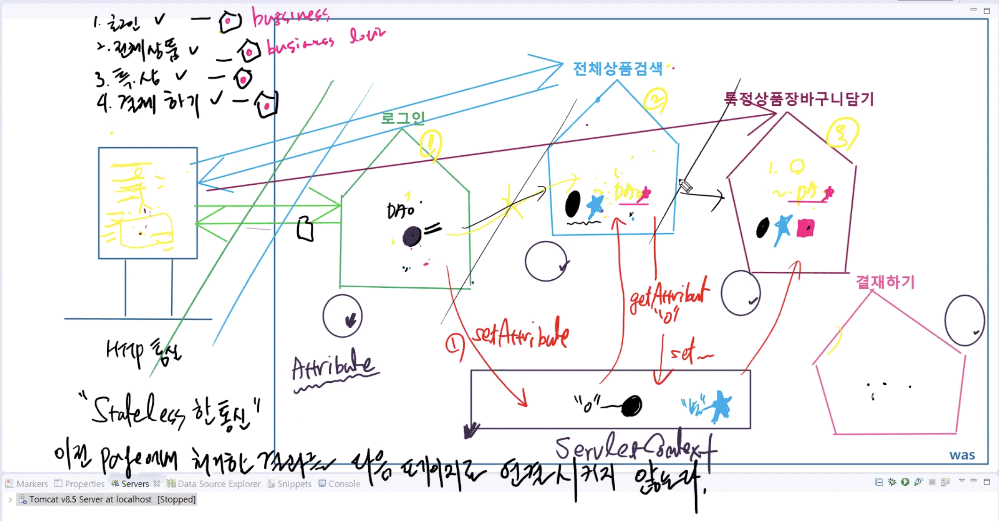
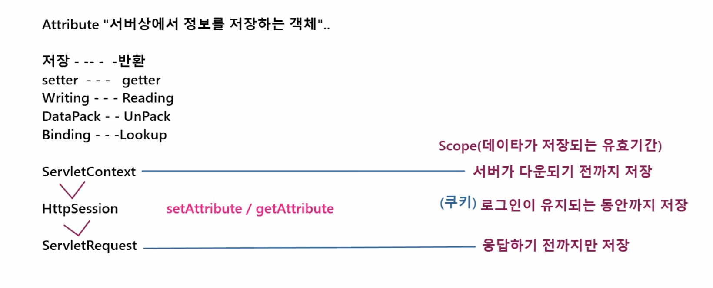
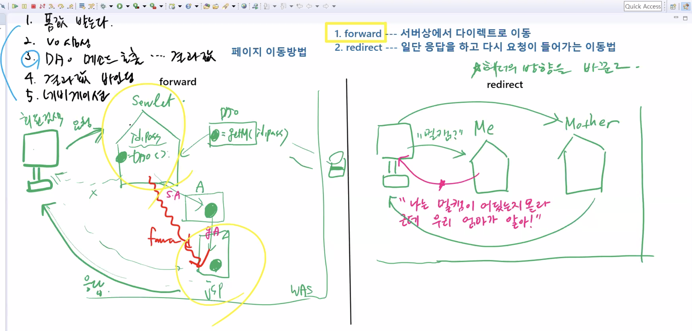
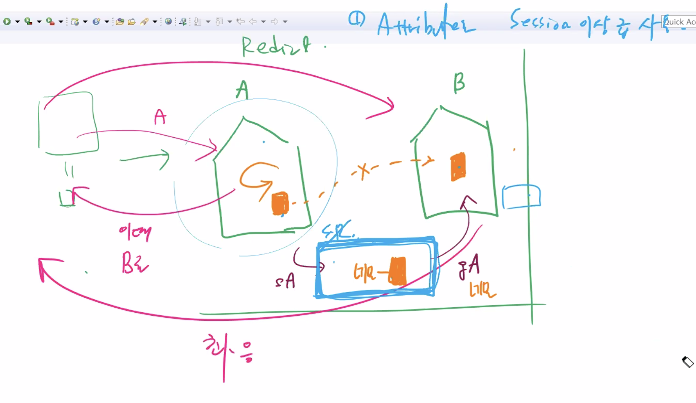
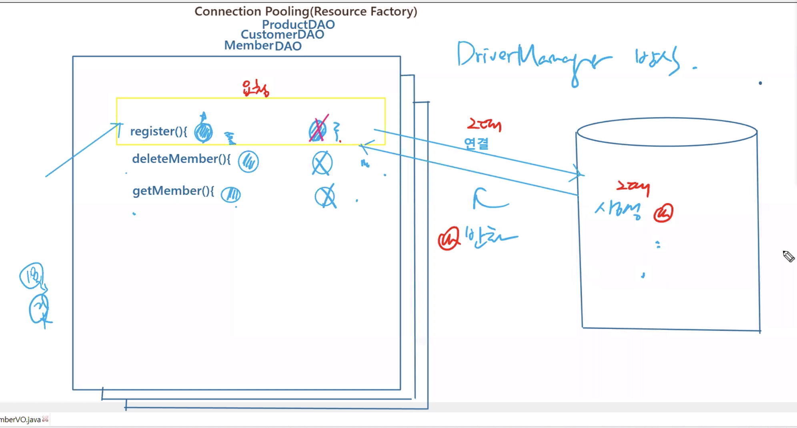
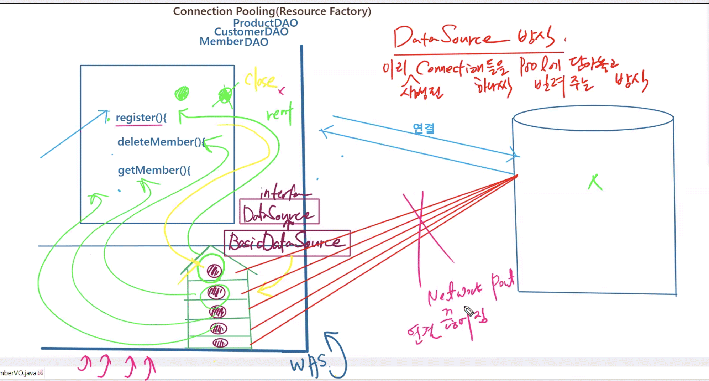

# 1111 Web

## 1. Attribute

### 1) 

4개의 Servlet

1. 로그인
2. 전체 상품
3. 특정 상품 장바구니 담기
4. 결제하기

ServletContext에 데이터를 저장

 setAttribute / getAttribute





### 2) Attribute

Attribute : 서버상에서 정보를 저장하는 객체

| 저장     | 반환       |
| -------- | ---------- |
| setter   | getter     |
| Writing  | Reading    |
| DataPack | DataUnpack |
| Binding  | Lookup     |


Attribute의 종류 3가지


ServletContext

[getAttribute](https://tomcat.apache.org/tomcat-7.0-doc/servletapi/javax/servlet/ServletContext.html#getAttribute(java.lang.String)) / [setAttribute](https://tomcat.apache.org/tomcat-7.0-doc/servletapi/javax/servlet/ServletContext.html#setAttribute(java.lang.String, java.lang.Object))

ServletRequest

[getAttribute](https://tomcat.apache.org/tomcat-7.0-doc/servletapi/javax/servlet/ServletRequest.html#getAttribute(java.lang.String)) / [setAttribute](https://tomcat.apache.org/tomcat-7.0-doc/servletapi/javax/servlet/ServletRequest.html#setAttribute(java.lang.String, java.lang.Object))

HttpSession

[getAttribute](https://tomcat.apache.org/tomcat-7.0-doc/servletapi/javax/servlet/http/HttpSession.html#getAttribute(java.lang.String)) / [setAttribute](https://tomcat.apache.org/tomcat-7.0-doc/servletapi/javax/servlet/http/HttpSession.html#setAttribute(java.lang.String, java.lang.Object))

* Scope가 다름 - 데이터가 저장되는 유효기간
* ServletRequest < HttpSession < ServletContext 순으로 저장기간 길다
  * ServletRequest  : 응답하기 전까지만 저장
  * HttpSession : 로그인이 유지되는 동안까지 저장 (쿠키)
  * ServletContext  : 서버가 다운되기 전까지 저장

| `java.lang.Object` | getAttribute (java.lang.String name)<br />Returns the servlet container attribute with the given name, or `null` if there is no attribute by that name. |
| ------------------ | ------------------------------------------------------------ |
| `void`             | setAttribute (java.lang.String name, java.lang.Object object)<br />Binds an object to a given attribute name in this servlet context. |

| `java.lang.Object` | getAttribute (java.lang.String name)<br />Returns the value of the named attribute as an `Object`, or `null` if no attribute of the given name exists. |
| ------------------ | ------------------------------------------------------------ |
| `void`             | setAttribute (java.lang.String name, java.lang.Object o)<br />Stores an attribute in this request. |

| `java.lang.Object` | getAttribute (java.lang.String name)<br />Returns the object bound with the specified name in this session, or `null` if no object is bound under the name. |
| ------------------ | ------------------------------------------------------------ |
| `void`             | setAttribute (java.lang.String name, java.lang.Object value)<br />Binds an object to this session, using the name specified. |




## 2. 네비게이션

페이지 이동 방법

forward가 디폴트

1. forward : 서버상에서 다이렉트로 이동
2. redirect : 일단 응답을 하고 다시 요청이 들어가는 이동법



### 1) forward 


정보가 이동한 결과가 jsp

한번의 요청과 응답 = 세션 하나

한번의 세션으로 두개의 서블릿

90% 이상


서블릿 / 컨트롤러 ??? 의 역할 5가지

1. 폼값 받는다
2. vo 생성
3. dao 메소드 호출 -> 결과값 반환 -> 가장 중요!!!!!(서블릿 하나씩 있는 이유)
4. 결과값 바인딩 - attribute에
5. 네비게이션 (페이지 이동)


### 2) redirect

클라이언트 "멀캠 어딨어?" 요청 -> Me 서블릿 "나는 몰라 근데 우리 엄마가 알아" 응답

-> 다시 Mother 에게 요청 - 헤더의 방향을 바꾼다 !!!




헤더의 방향을 b로 바꿔줌

다시 b로 요청 - 실질 / 최종적으로는 b가 응답


attribute라는 객체 이용해서 넘긴다

넘기는 매카니즘 - 페어링 시스템 - 저장하고 set/get attribute 

네모라는 이름만 인자값 -> 데이터/객체가 넘어온다

redirect에서 attribute는 Session 이상급을 사용해야 함 !!!


### 3) forward와 redirect 차이점

forward는 request 사용 (단순한 요청?)

redirect는 request  사용 불가 -> 두번의 요청과 응답이기 때문에 request 에 넣은 데이터 없어진다

결정적 차이는?

forward는 같은 서버상의 Component에만 접근

* a라는 Component, b라는 Component는 똑같은 WAS에 존재

redirect는 서로 다른 서버상의 Component에 접근 가능

* a라는 Component는 삼성 서버
* b라는 Component는 네이버 서버
* 가능한 이유는?
* 리다이렉터는 브라우저 거치기 때문에 정적인 문서는 다시 요청
* 에러 페이지 
* 포워드는 브라우저 거치지 않고 서버상 같은 컨테이너


## 3.


### command

```
mysql> use scott;
Database changed
mysql> drop table member;
ERROR 1051 (42S02): Unknown table 'scott.member'
mysql> create table member(
    -> id varchar(20) primary key,
    -> password varchar(30) not null,
    -> name varchar(30),
    -> address varchar(100));
Query OK, 0 rows affected (0.03 sec)
```

### 1) Driver manager 방식



요청하면 그때 연결

1) register()

jdbc 4단계에서 가장 많은 자원 받는 단계

DB - connection - 반환 

회원가입 끝나고 만들어진 커넥션을 재사용 ? -> 객체 소멸!!! (close)

-> 메소드 마다 만들고 없애고 반복


2) deleteMember()

3) getMember()


### 2) Data Source 방식



* 미리 생성된 Conneciton들을 Pool에 담아 놓고 요청이 들어오면 하나씩 빌려주는 방식

* WAS도 하나의 **소프트웨어** + 또 하나 제품 Connection Pooling 연결 =  
  * Data Source -> Sun사
  * Basic Data Source -> Apache사
    * Connection들이 많이 들어가 있다
* Connection Factory = Resource Factory 
  * Connection은 일종의 Resource
* Pooling 기법 : 여러개를 가지고 나와도 다 똑같은 것들 끄집어내...?
* 모든 요청의 시발점은 Connection !
* Connection Factory에 있는 만들어진 Connection 을 하나씩 빌려옴 (렌트)
* 회원가입 끝나면 close -> 원래는 없어지는데.....다시 Pool로 복귀 ! - 또다른 서비스 요청이 왔을 때 재사용 가능

클로즈 안하면?

디비와 was의 네트워크 포트의 연결이 끊어짐

빌려준 커넥션이 복귀 안함 -> 대형사고...


## 4. 실습

`Context.xml`은 무조건 META-INF안에 넣어야 !

Data Source 타입의 Basic Data Source -> WAS

#### Context.xml

```xml
<?xml version="1.0" encoding="UTF-8"?>
<Context>
	<Resource
		name="jdbc/mysql"
		auth="Container"
		type="javax.sql.DataSource"
		username= "root"
		password="1234"
		driverClassName="com.mysql.cj.jdbc.Driver"
		factory="org.apache.tomcat.dbcp.dbcp2.BasicDataSourceFactory"
		url="jdbc:mysql://localhost:3306/scott?serverTimezone=Asia/Seoul"
		maxActive="500"
		maxIdle="30"	
	/>
</Context>
```

* `name="jdbc/mysql"` : 이름으로 객체 등록
* `auth="Container"` : 권한은 컨테이너 (WAS)


#### dbconn.jsp

```jsp
<%@page import="javax.sql.DataSource"%>
<%@page import="javax.naming.InitialContext"%>
<%@page import="javax.naming.Context"%>
<%@page import="java.sql.Connection"%>
<%@ page language="java" contentType="text/html; charset=UTF-8"
    pageEncoding="UTF-8"%>
<!DOCTYPE html>
<html>
<head>
<meta charset="UTF-8">
<title>Insert title here</title>
</head>
<body>
<h2>ConnectionPool....DataSource Test</h2>
<%
Connection conn = null;
//1. Naming Service를 통해서 DataSource(type)를 찾아온다
//2. javax.naming.Context의  lookup() 기능이 이때 사용되어진다.

Context ic = new InitialContext();
DataSource ds = (DataSource)ic.lookup("java:comp/env/jdbc/mysql");	//이 이름으로 찾아옴
out.println("<b>DataSourcew Lookup....<br>");


conn=ds.getConnection();
out.println("Connection....OK..RETURN</b>");
%>
</body>
</html>
```


