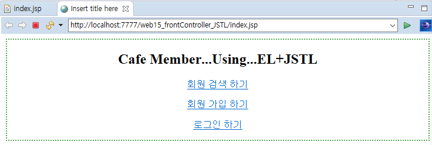
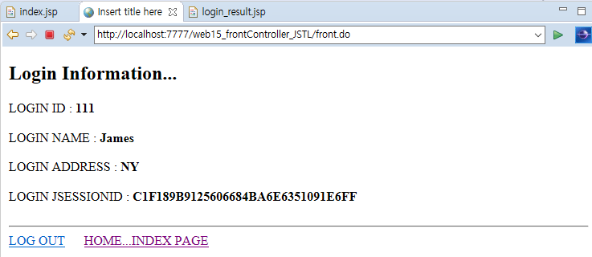
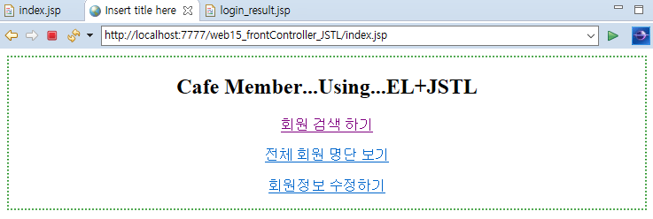

# 1116 Web

> web_14의 cChoose2부터...

프론트 컨트롤러 패턴

jsp는 태그 중심

서블릿은 로직 중심

-> 다른 패턴으로 마무리

팩토리 메소드 패턴

프레임 워크 -> 메카니즘 알기 힘듦

설명적으로 가능 긴시간 요구 -> 설명 하더라도 와닿지 않음 -> 직접 만들고 들어갈 것

```
<!-- 
JSTL사용하기위한 방법
1. ~jar파일(2개)을 반드시 추가...lib안에

2. taglib를 선언부에 지정..
 -->
```


## 1.


`<%@` : 지시어 - 컨테이너에게 이 부분 알리고자 할 때

prefix 접두사 c 로 시작 -> co

jstl 문법 여러 범주,,, 핵심적인 것만 알면 됨

주소를 uri로 바인딩

test 뒤에 조건문 `c:if`-> true이면 실행


## 조건문 

`c:if` / `c:choose`


## 반복문

`c:foreach` 


### c:choose

otherwise는 하나만

c:choose는 양자택일할 때 많이 씀

#### cChoose2.jsp

```jsp
<%@ page language="java" contentType="text/html; charset=UTF-8"
    pageEncoding="UTF-8"%>

<!DOCTYPE html>
<html>
<head>
<meta charset="UTF-8">
<title>Insert title here</title>
</head>
<body>
<h2>c:choose 문법</h2>
<form action="cChoose2_result.jsp">
NUM <input type="text" name="num">
<input type="submit"  value="SEND">
</form>
</body>
</html>
```


#### cChoose2_result.jsp

```jsp
<%@ page language="java" contentType="text/html; charset=UTF-8"
    pageEncoding="UTF-8"%>
<%@ taglib prefix="c" uri = "http://java.sun.com/jsp/jstl/core" %>

<!DOCTYPE html>
<html>
<head>
<meta charset="UTF-8">
<title>Insert title here</title>
</head>
<body>
<h2>c:choose 사용하기</h2>
<c:choose>

	<c:when test="${param.num=='1'}">
		<b>안녕하세요...반갑습니다.</b>
	</c:when>
	<c:when test="${param.num=='2'}">
		<b>그럭저럭 잘 지내고 있습니다.</b>
	</c:when>
	
	<c:otherwise>
		<b>여기는 여의도 사무실이 아닙니다. 다시 문의 하세요</b>
	</c:otherwise>
	
</c:choose>
</body>
</html>
```


### c:foreach 

#### cForEach3.jsp

```jsp
<%@ page language="java" contentType="text/html; charset=UTF-8"
    pageEncoding="UTF-8"%>
<%@ taglib prefix="c" uri = "http://java.sun.com/jsp/jstl/core" %>

<!DOCTYPE html>
<html>
<head>
<meta charset="UTF-8">
<title>Insert title here</title>
</head>
<body>
<h2>c:foreach 문법</h2>

<c:forEach var="cnt" begin="1" end="10">
	<font size="${cnt}">Hello Nice Day</font><br>
</c:forEach>
</body>
</html>
```


jstl하고 el은 같이 쓴다

폰트 사이즈 크기는 6이 최대


### if 비즈니스 로직 돌고 배열 리턴 됐다

jsp의 action 태그

```
request.getRequestDispatcher("cForEach4_result.jsp").forward(request,response);	
```

```
<jsp:forward page=""cForEach4_result.jsp""></jsp:forward>
```

위에는 서블릿 밑에는 jsp


객체 생성 못하니까 바로 넘기지 못한다 -> Attribute로 ! = 데이터 저장되는 공간


#### cForEach4_result.jsp

```jsp
<%@ page language="java" contentType="text/html; charset=UTF-8"
    pageEncoding="UTF-8"%>
<%@page import="java.util.ArrayList"%>

<!DOCTYPE html>
<html>
<head>
<meta charset="UTF-8">
<title>Insert title here</title>
</head>
<body>
<h2>c:foreach 사용법</h2>
<%
	ArrayList<String> list = new ArrayList<String>();
	list.add("사과");
	list.add("바나나");
	list.add("복숭아");
	list.add("포도");
	
	request.setAttribute("list",list);
	
//	request.getRequestDispatcher("cForEach4_result.jsp").forward(request,response);
	
%>

<jsp:forward page="cForEach4_result.jsp"></jsp:forward>


</body>
</html>
```


#### cForEach4.jsp

```jsp
<%@ page language="java" contentType="text/html; charset=UTF-8"
    pageEncoding="UTF-8"%>
<%@ taglib prefix="c" uri = "http://java.sun.com/jsp/jstl/core" %>

<!DOCTYPE html>
<html>
<head>
<meta charset="UTF-8">
<title>Insert title here</title>
</head>
<body>
<h2>우리 Shop에서 가지고 있는 과일 품목들 입니다.</h2>
<c:forEach var="item" items="${list }">	<!-- EL로 받아와야 함 -->
	<li>${item }</li>
</c:forEach>
</body>
</html>
```


::::::::::::::::::::

## 2.


### 1) login / logout 했을 때 로직 만들기

login.html


frontcontroller의 login function : 

```java
if(rvo!=null) { //id, password에 해당하는 vo가 있다면
	session.setAttribute("vo", rvo);
```

* `vo`이름으로 바인딩 -> 세션에 vo 없으면 로그인 안한 것 !!


#### index.jsp

```jsp
<%@ page language="java" contentType="text/html; charset=UTF-8"
    pageEncoding="UTF-8"%>
<%@ taglib prefix="c" uri = "http://java.sun.com/jsp/jstl/core" %>
    
<!DOCTYPE html>
<html>
<head>
<meta charset="UTF-8">
<title>Insert title here</title>

<!-- Authentication(인증)
서비스를 사용하기 위한 인증절차...로그인

무조건적인 서비스 권한
- 회원검색

로그인 안하고 들어온 사용자의 서비스 권한(Authorization)
- 회원가입
- 로그인

로그인 하고 들어온 사용자의 서비스 권한(Authorization)
- 회원정보 수정
- 로그아웃
- 전체회원 보기  
:::::
JSTL

c:choose
   c:when test="로그인 여부"
   c:otherwise
-->

<style type="text/css">
	#wrap{  
			text-align: center;
			border: 2px dotted green;
	}
	
</style>
</head>
<body>
<div id="wrap">
	<h2>Cafe Member...Using...EL+JSTL</h2><p>
	
	<a href="search_member.html">회원 검색 하기</a><p></p>
	<c:choose>
<%-- 	<c:when test="${vo!=null }"> --%>
		<c:when test="${!empty vo }">	<!-- 좀 더 세련된 표현 -->
			<a href="front.do?command=showAll">전체 회원 명단 보기</a><p></p>
			<a href="update.html">회원정보 수정하기</a><p></p>
		</c:when>
		<c:otherwise>
			<a href="register.html">회원 가입 하기</a><p></p>
			<a href="login.html">로그인 하기</a><p></p>	
		</c:otherwise>
	</c:choose>
		
		
</div>

</body>
</html>
```


>  로그인 전




> 로그인 후






### 2)logout 로직 만들기

* EL과 JSTL 이용하여 자바 없애고 태그 기반 jsp 만들기


#### FrontController.java

* 서블릿에서 별도로 로그아웃 로직 작성

```java
	protected String logout(HttpServletRequest request, HttpServletResponse response) {
		String path = "index.jsp";
		//Session을 죽이는 로직을 작성
		try {
			HttpSession session = request.getSession();
			if(session.getAttribute("vo")!=null) {	//로그인된 상태라면...그 때 로그아웃 진행
				session.invalidate();
				path="logout.jsp";		//로그아웃된 상태의 결과 페이지
			}
			
		}catch(Exception e) {
			
		}
		return path;
```


#### logout.jsp

```jsp
<%@page import="servlet.model.MemberVO"%>
<%@ page language="java" contentType="text/html; charset=UTF-8"
    pageEncoding="UTF-8"%>
    
<!DOCTYPE html>
<html>
<head>
<meta charset="UTF-8">
<title>Insert title here</title>
<script type="text/javascript">
alert("로그아웃");

location.href="index.jsp";
	
</script>

</head>
<body>
</body>
</html>
```


#### login_result.jsp

```jsp
<a href="front.do?command=logout">LOG OUT</a> &nbsp;&nbsp;&nbsp;&nbsp;
```


#### index.jsp

```jsp
<a href="front.do?command=logout">로그아웃 하기</a><p></p>
```


### 3) allView.jsp를 태그 기반으로 만들기

```jsp
<%@page import="servlet.model.MemberVO"%>
<%@page import="java.util.ArrayList"%>
<%@ page language="java" contentType="text/html; charset=UTF-8"
    pageEncoding="UTF-8"%>
<%@ taglib prefix="c" uri = "http://java.sun.com/jsp/jstl/core" %>

<!DOCTYPE html>
<html>
<head>
<meta charset="UTF-8">
<title>Insert title here</title>


</head>
<body>
<h3 align="center">회원 전체 명단 보기</h3><p>
<table border="2" width="350" bgcolor="yellow" align="center">
<c:forEach var="vo" items="${list}">
	<tr>
		<td>${vo.id}</td>
		<td>${vo.name}</td>
		<td>${vo.address}</td>
	</tr>

</c:forEach>
	<HR>
	<b><a href="index.jsp" class="home">Home</a></b>
</table>
</body>
</html>
```


### 4) updaterMember 로직 만들기

DAO에 추가

#### MemberDAO.java

```java
void updateMember(MemberVO vo) throws SQLException;
```


#### MemberDAOImpl.java

```java
	@Override
	public void updateMember(MemberVO vo) throws SQLException {
		Connection conn = null;
		PreparedStatement ps = null;
		try{
			conn=  getConnection();
			String query = "UPDATE member SET password=?, name=?, address=? WHERE id=?";
			ps = conn.prepareStatement(query);
			System.out.println("PreparedStatement 생성됨...updateMember");
			
			ps.setString(1, vo.getPassword());
			ps.setString(2, vo.getName());
			ps.setString(3, vo.getAddress());
			ps.setString(4, vo.getId());
			
			System.out.println(ps.executeUpdate()+" row UPDATE OK!!");
		}finally{
			closeAll(ps, conn);
		}
		
	}
```


#### update.jsp

```jsp
<%@ page language="java" contentType="text/html; charset=UTF-8"
    pageEncoding="UTF-8"%>
<!DOCTYPE html>
<html>
<head>
<meta charset="UTF-8">
<title>Insert title here</title>
</head>
<body>

<form action="front.do" method="post">
<input type="hidden" name="command"  value="update">
	<h1>Register Member Form</h1><br><br>
	ID : <input type="text" name="id" value= "${vo.id}" readonly="readonly"><br>
	PASSWORD : <input type="password" name="password" value= "${vo.password}"><br>	
	NAME : <input type="text" name="name" value= "${vo.name}"><br>
	ADDRESS : <input type="text" name="address" value= "${vo.address}"><br>
	<input type="submit" value="Member Update">
</form>

</body>
</html>
```


#### update_result.jsp

```jsp
<%@ page language="java" contentType="text/html; charset=UTF-8"
    pageEncoding="UTF-8"%>
<!DOCTYPE html>
<html>
<head>
<meta charset="UTF-8">
<title>Insert title here</title>
</head>
<body>
<h3>${vo.name}님의 정보가 수정되었습니다</h3>
<h3><a href="index.jsp">Home</a></h3>

</body>
</html>
```


--------------점심

## 3. FactoryMethodPattern


#### Controller.java

```JAVA
package web.controller;

//기능의 Template
public interface Controller {
	String handle();
}
```


#### ControllerFactory.java

```java
package web.controller;
/*
 * Controller를 생성하는 Factory..일종의 공장
 * ControllerFactory에서는 몇개의 Controller를 생성할 수 있을까?...10개
 * ...원하는 만큼 10개의 Controller를 생성하기 위해서는 몇개의 공장이 필요할까?
 * 
 * 단 한개의 Factory만 필요...싱글톤 패턴
 * 
 */
public class ControllerFactory {
	private static ControllerFactory factory =new ControllerFactory();
	private ControllerFactory() {
		System.out.println("Only One Factory Creating...");
	}
	public static ControllerFactory getInstance() {
		return factory;
	}
	
	//AddController,UpdateController,DeleteController,LoginController를 생성
	//이때 클라이언트에서 요청하는 값에 따라서 Controller 객체를 생성...
	public Controller createController(String command) {	//Polymorphism 부모타입으로 자식 객체 생성...
		Controller controller = null;
		if(command.equals("INSERT")) {
			controller  = new AddController();
			System.out.println("AddController Creating...OK...");
		}else if(command.equals("DELETE")) {
			controller  = new DeleteController();
			System.out.println("DeleteController Creating...OK...");
		}else if(command.equals("UPDATE")) {
			controller  = new UpdateController();
			System.out.println("UpdateController Creating...OK...");
		}else if(command.equals("LOGIN")) {
			controller  = new LoginController();
			System.out.println("LoginController Creating...OK...");
		}
		return controller;
	}

}
```

컨트롤러들은 자바 클래스 - was가 아닌 내가 생성 -> Factory

AddController, DeleteController, UpdateController, LoginController.java 생성


#### ClientTest.java

```java
package web.main.client;

import java.util.Scanner;

import web.controller.Controller;
import web.controller.ControllerFactory;

public class ClientTest {

	public static void main(String[] args) {
		Scanner sc = new Scanner(System.in);
		System.out.println("Command 값을 입력하세요>>>");
		String command = sc.next();
		
 		//1. 공장을 하나 받아온다
		ControllerFactory factory = ControllerFactory.getInstance();
		
		//2. 공장에 주문서를 넣는다...주문서를 받은 공장에서 Controller를 생성...
		Controller controller = factory.createController(command);
		
		//3. 공장에서 생성한 Controller를 가져와서 Controller의 메소드를 호출...자식의 메소드가 결과적으로 실행
		controller.handle();

	}

}
```


----------------------

초록색 = 서버사이드

왼쪽...히든? -> 프론트

오른쪽은  -> 백?

컴포넌트 기반 - 팩토리가 생성 

컴포넌트는 인터페이스 기반의 자바 클래스

컴포넌트가 하는 가장 중요한 일

= DAO의 비즈니스 로직을 호출

VO도 존재...


오른쪽 Controller createController는 왼쪽 factory.createController를 호출 

-> createController가 공장한테 Command 값을 줌 -> 컴포넌트 생성

-> 프론트 컨트롤러가 공장한테 커맨드 값을 주고 공장이 생성한 컴포넌트의 부모 타입인 Controller를 리턴받는다


컨트롤러 리턴 받으면 컨트롤러의 메소드를 호출함 -> handle() 메소드

생성된 컴포넌트의 기능이 돌아감 -> 돈 결과로 스트링을 리턴 (결과페이지 이름)

-> add_result.jsp -> 컴포넌트 어딘가 만들어져 있음...

프론트 컴포넌트가 하는 일은 (뷰페이지 리턴받고 ...) 네비게이션 !!!


----------------------------

회원검색 하나만 일단...실습

> web 17


Context.xml -> META_INF

src의 filter, servlet_model 

index.jsp / search_member.html / result_view.jsp -> WebContent


#### Controller.java

```java
package servlet.controller;

import javax.servlet.http.HttpServletRequest;
import javax.servlet.http.HttpServletResponse;

//기능의 template
public interface Controller {
	String requestHandle(HttpServletRequest request, HttpServletResponse response);

}
```


#### FindController.java

```java
package servlet.controller;

import javax.servlet.http.HttpServletRequest;
import javax.servlet.http.HttpServletResponse;

import servlet.model.MemberDAOImpl;
import servlet.model.MemberVO;

//Component...Based...
public class FindController implements Controller{

	@Override
	public String requestHandle(HttpServletRequest request, HttpServletResponse response) {
		String id = request.getParameter("id");		//폼 값 받기
		String path = "index.jsp";
		
		try {
			MemberVO vo = MemberDAOImpl.getInstance().findByIdMember(id);		//비즈니스 로직 호출
			if(vo!=null) {							//id에 해당하는 회원이 존재한다면...
				request.setAttribute("vo", vo);
				path = "result_view.jsp";
			}
		}catch(Exception e) {
			
		}
		return path;
	}

}
```


#### FrontController

* 서블릿


```java
package servlet.controller;

import java.io.IOException;
import javax.servlet.ServletException;
import javax.servlet.annotation.WebServlet;
import javax.servlet.http.HttpServlet;
import javax.servlet.http.HttpServletRequest;
import javax.servlet.http.HttpServletResponse;

@WebServlet("/front.do")
public class FrontController extends HttpServlet {
	private static final long serialVersionUID = 1L;
	
	

	protected void doGet(HttpServletRequest request, HttpServletResponse response) throws ServletException, IOException {
		doProcess(request, response);
	}

	protected void doPost(HttpServletRequest request, HttpServletResponse response) throws ServletException, IOException {
		doProcess(request, response);
	}
	
	protected void doProcess(HttpServletRequest request, HttpServletResponse response) throws ServletException, IOException {
		String command = request.getParameter("command");
		ControllerFactory factory = ControllerFactory.getInstance();	
		Controller controller = factory.createController(command);		//공장에게 Command값 전달
		
		String path = controller.requestHandle(request, response);
		
		request.getRequestDispatcher(path).forward(request, response);
		
	}

}
```


