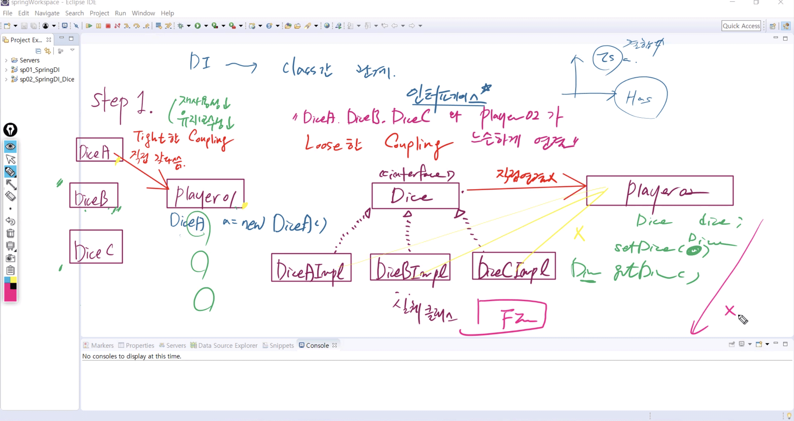
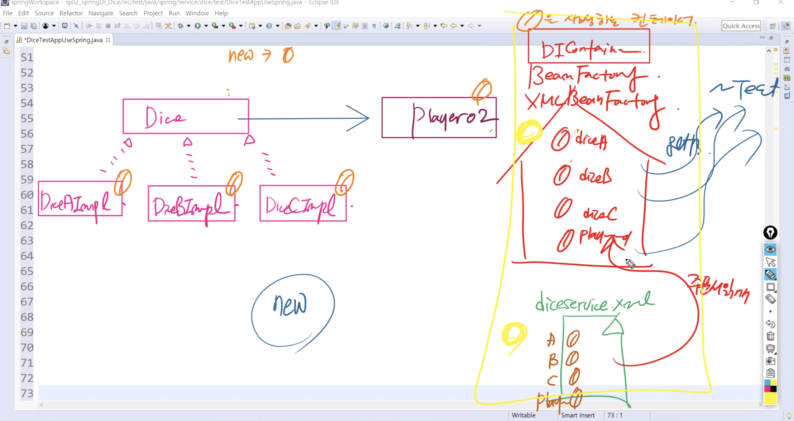
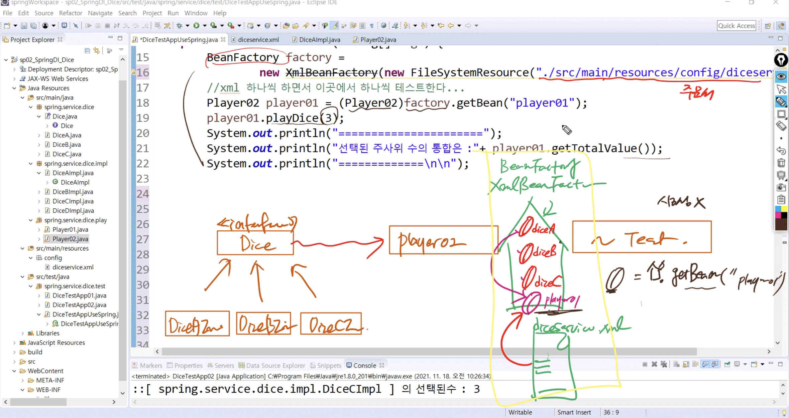
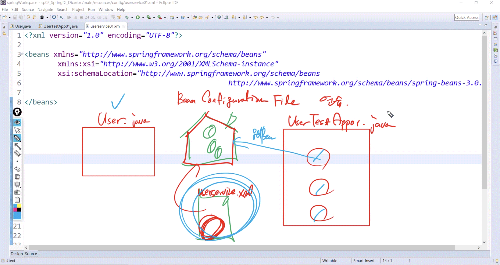
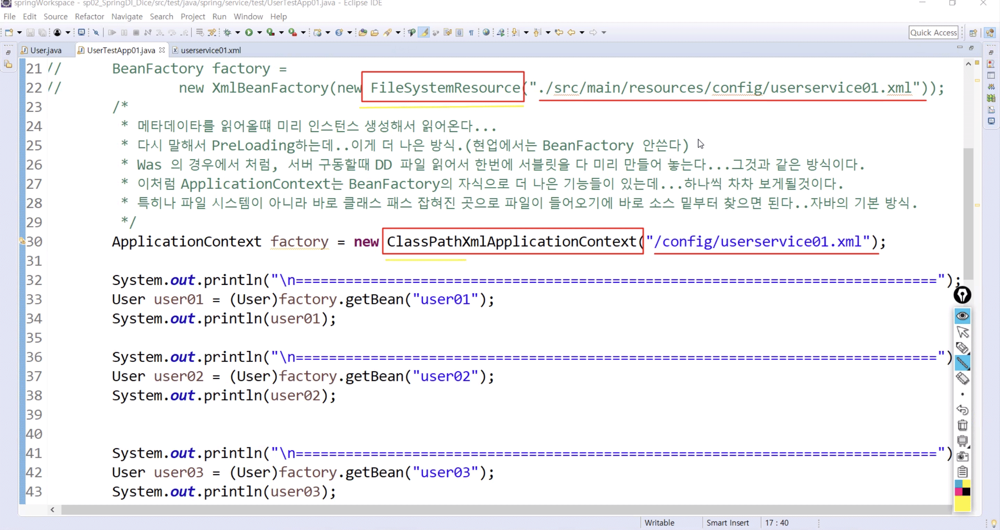
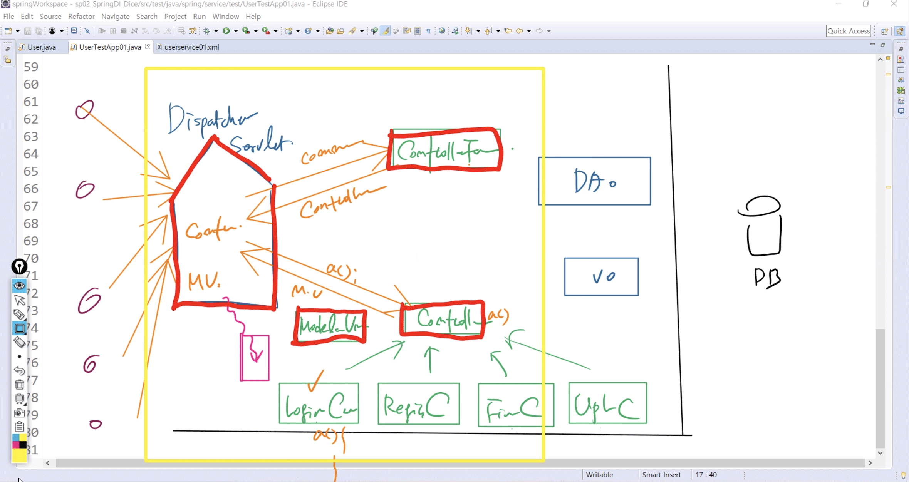
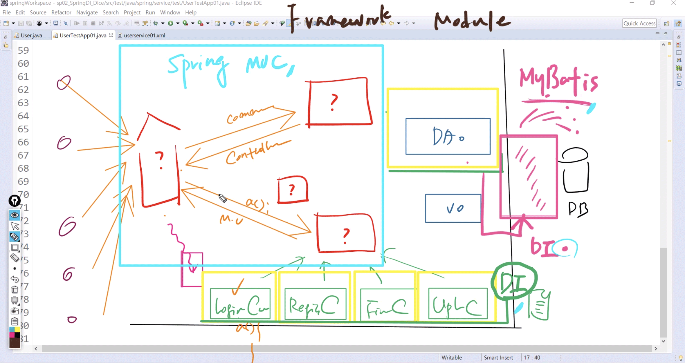
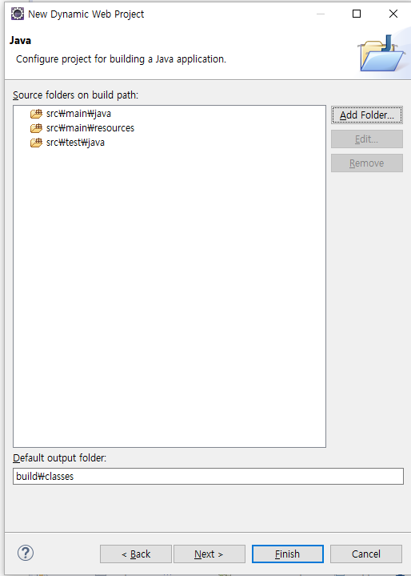
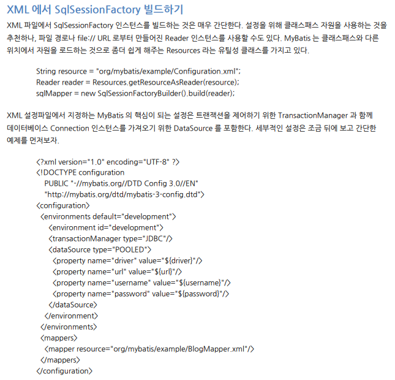
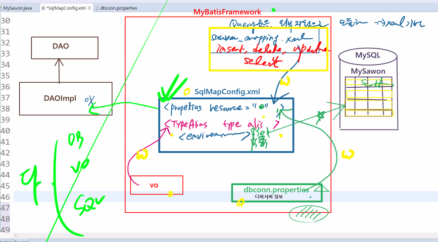

# 1118 Spring

DI 기술은 클래스간의 has a 관계 정확히 파악해야 함



## 1.

**Tight Coupling**

직접 갖다씀 -> 재사용성 / 유지보수성이 낮다


히나씩 추가할 때 마다 네다섯배의 수정 가해짐


결합도가 루즈해야함 - 직접적 연결 x


**Loose Coupling**

결합도 느슨하게 하기 위해 필요한 것 : 인터페이스 !!


인터페이스와 실체 클래스 - hasing player 02


#### DiceTestApp02.java

```java

```

* DiceD를 추가한다하더라도 코드 그대로 사용 가능

new 가 있는이상 결합도 완전히 제거 x


was는 서블릿 비롯한 서버상의 ㅁ듈 기반

di는 컴포넌트 기반


			//코드에 new 키워드가 존재하는 한, 객체 생성을 직접해야 하는 한,
			//결합도를 완벽하게 없앨 수 없다...(아무리 인터페이스를 사용하더라도)
			//:: 
			//DI Container(Core Container, Bean Container)
			//코드에서 new를 사용하지 않는 방법은, 즉 객체 생성을 직접 하지 않는 방법은
			//자바 클래스를(컴포넌트를) 생성하는 컨테이너를 사용하는 것이다.
			//이것이 바로 DI이다.

DI 컨테이너 = 코어 컨테이너


객체 생성의 주체가 커넽이너에게 -> 주문서 작성에 매진해야 함 - xml


주문서 읽으면서 컨테이너 만들어짐 - BeanFactory

Bean 생성 - 3개 -> diceA,B,C -> 안만들어도 객체 생성됨

Player02 Bean 생성 - player01이 이름 -> 주사위 중에 어떤 주사위 가지고 놀까? - diceA를 세번 돌리는 Bean


노란 부분 스프링


test는 factory.getBean("`id`") -> player02 리턴 -> diceA -> playDice 호출 - 세번돌린 총합


개발자의 역할은 주문서 작성만 !!

객체 생성 코드 걷어진다

컨테이너 덕에 !!

주문서에서는 bean만 (- 실체 클래스) 생성 -> 빈 설정 문서

- 인터페이스는 상관 없음 ! - 코드에서만 나와야 함



#### diceservice.xml

```xml
<?xml version="1.0" encoding="UTF-8"?>

<beans xmlns="http://www.springframework.org/schema/beans"
		xmlns:xsi="http://www.w3.org/2001/XMLSchema-instance"
		xsi:schemaLocation="http://www.springframework.org/schema/beans 
												 http://www.springframework.org/schema/beans/spring-beans-3.0.xsd">

<!-- 가지고 놀 주사위 3개를 생성하는 주문서를 먼저 작성 
	 player01이라는 이름으로 player 객체를 생성하는 빈도 작성 -->     

<!-- <bean id = "diceA" class = "spring.service.dice.impl.DiceAImpl"></bean> -->   
	<bean id = "diceA" class = "spring.service.dice.impl.DiceAImpl"/>
	<bean id = "diceB" class = "spring.service.dice.impl.DiceBImpl"/>
	<bean id = "diceC" class = "spring.service.dice.impl.DiceCImpl"/>
	<bean id = "diceD" class = "spring.service.dice.impl.DiceDImpl"/>

<!-- 클래스..필드..주입의 통로 :: 생성자, setter -->

<!-- player01 이름으로 빈을 생성 :: 사용자 정의 빈 :: diceA를 생성자 주입-->
	<bean id = "player01" class = "spring.service.dice.play.Player02">
		<constructor-arg ref = "diceA"/>
	</bean>

<!-- player02 이름으로 빈을 생성 :: 사용자 정의 빈 :: diceB를 생성자 주입-->
	<bean id = "player02" class = "spring.service.dice.play.Player02">
		<constructor-arg ref = "diceB"/>
	</bean>
	
<!-- player03 이름으로 빈을 생성 :: 사용자 정의 빈 :: diceC를 setter 주입-->
	<bean id = "player03" class = "spring.service.dice.play.Player02">
		<property name="dice" ref = "diceC"/>
	</bean>
	
<!-- player04 이름으로 빈을 생성 :: 사용자 정의 빈 :: diceA를 setter 주입-->
	<bean id = "player04" class = "spring.service.dice.play.Player02">
		<property name="dice" ref = "diceA"/>
	</bean>
	
<!-- player 이름으로 빈을 생성 :: 사용자 정의 빈 :: diceD를 setter 주입-->
	<bean id = "player" class = "spring.service.dice.play.Player02">
		<property name="dice" ref = "diceD"/>
	</bean>

</beans>
```

* `<property name="dice" ref = "diceA"/>` : 
  * `SetDice(new DiceCImpl())` 과 동일

#### DiceTestAppUseSpring.java

```java
package spring.service.dice.test;

import java.io.FileInputStream;
import java.io.FileNotFoundException;
import java.io.IOException;
import java.util.Properties;

import org.springframework.beans.factory.BeanFactory;
import org.springframework.beans.factory.xml.XmlBeanFactory;
import org.springframework.core.io.FileSystemResource;

import spring.service.dice.play.Player02;
public class DiceTestAppUseSpring {
   public static void main(String[] args) {
      BeanFactory factory = 
            new XmlBeanFactory(new FileSystemResource("./src/main/resources/config/diceservice.xml"));
      
      //xml 하나씩 하면서 이곳에서 하나씩 테스트한다...
      Player02 player01 = (Player02)factory.getBean("player01");
      player01.playDice(3);
      System.out.println("======================");
      System.out.println("선택된 주사위 수의 통합은 :"+ player01.getTotalValue());
      System.out.println("=============\n\n");
      
      
      
      Player02 player02 = (Player02)factory.getBean("player02");
      player02.playDice(3);
      System.out.println("======================");
      System.out.println("선택된 주사위 수의 통합은 :"+ player02.getTotalValue());
      System.out.println("=============\n\n");
      
      
      Player02 player03 = (Player02)factory.getBean("player03");
      player03.playDice(3);
      System.out.println("======================");
      System.out.println("선택된 주사위 수의 통합은 :"+ player03.getTotalValue());
      System.out.println("=============\n\n");
 
      
      Player02 player04 = (Player02)factory.getBean("player04");
      player04.playDice(3);
      System.out.println("======================");
      System.out.println("선택된 주사위 수의 통합은 :"+ player04.getTotalValue());
      System.out.println("=============\n\n");   
      
      //여러분이 직접 구현...
      Player02 player = (Player02)factory.getBean("player");
      player.playDice(3);
      System.out.println("======================");
      System.out.println("선택된 주사위 수의 통합은 :"+ player.getTotalValue());
      System.out.println("=============\n\n");   
      
   
   }
   
}//end of class
```

```
11월 18, 2021 11:44:16 오전 org.springframework.beans.factory.xml.XmlBeanDefinitionReader loadBeanDefinitions
정보: Loading XML bean definitions from file [C:\miracom_edu\springWorkspace\sp02_SpringDI_Dice\.\src\main\resources\config\diceservice.xml]
::spring.service.dice.impl.DiceAImpl() 호출...
==>spring.service.dice.play.Player02.playDice() start....
::[ spring.service.dice.impl.DiceAImpl ] 의 선택된수 : 3
::[ spring.service.dice.impl.DiceAImpl ] 의 선택된수 : 2
::[ spring.service.dice.impl.DiceAImpl ] 의 선택된수 : 2
==>spring.service.dice.play.Player02.playDice() end....
======================
선택된 주사위 수의 통합은 :7
=============


::spring.service.dice.impl.DiceBImpl() 호출...
==>spring.service.dice.play.Player02.playDice() start....
::[ spring.service.dice.impl.DiceBImpl ] 의 선택된수 : 3
::[ spring.service.dice.impl.DiceBImpl ] 의 선택된수 : 5
::[ spring.service.dice.impl.DiceBImpl ] 의 선택된수 : 4
==>spring.service.dice.play.Player02.playDice() end....
======================
선택된 주사위 수의 통합은 :12
=============


::spring.service.dice.impl.DiceCImpl() 호출...
==>spring.service.dice.play.Player02.playDice() start....
::[ spring.service.dice.impl.DiceCImpl ] 의 선택된수 : 3
::[ spring.service.dice.impl.DiceCImpl ] 의 선택된수 : 6
::[ spring.service.dice.impl.DiceCImpl ] 의 선택된수 : 5
==>spring.service.dice.play.Player02.playDice() end....
======================
선택된 주사위 수의 통합은 :14
=============


==>spring.service.dice.play.Player02.playDice() start....
::[ spring.service.dice.impl.DiceAImpl ] 의 선택된수 : 1
::[ spring.service.dice.impl.DiceAImpl ] 의 선택된수 : 4
::[ spring.service.dice.impl.DiceAImpl ] 의 선택된수 : 2
==>spring.service.dice.play.Player02.playDice() end....
======================
선택된 주사위 수의 통합은 :7
=============


::spring.service.dice.impl.DiceDImpl() 호출...
==>spring.service.dice.play.Player02.playDice() start....
::[ spring.service.dice.impl.DiceDImpl ] 의 선택된수 : 5
::[ spring.service.dice.impl.DiceDImpl ] 의 선택된수 : 5
::[ spring.service.dice.impl.DiceDImpl ] 의 선택된수 : 6
==>spring.service.dice.play.Player02.playDice() end....
======================
선택된 주사위 수의 통합은 :16
=============
```



## 2.



빈은 크게 두가지 - User Definition Bean / API Bean

#### userservice01.xml

```xml
<?xml version="1.0" encoding="UTF-8"?>

<beans xmlns="http://www.springframework.org/schema/beans"
		xmlns:xsi="http://www.w3.org/2001/XMLSchema-instance"
		xsi:schemaLocation="http://www.springframework.org/schema/beans 
												 http://www.springframework.org/schema/beans/spring-beans-3.0.xsd">

<!-- User Definition Bean 정의 :: setter 단순 파라미터 값 주입 :: id(01유저), age(01) -->     
<bean id="user01" class="spring.service.domain.User">
	<property name="userId" value="01유저"/>
	<property name="age" value="01"/>
</bean>

<!-- API Bean 정의 :: -->
<bean id="password" class="java.lang.String">
	<constructor-arg value="7777"/>
</bean>

<!-- User Definition Bean 정의 :: setter 단순 파라미터 값 주입 :: id(02유저), age(02), password=7777(위에서 만든 빈 이용) -->     
<bean id="user02" class="spring.service.domain.User">
	<property name= "userId" value="02유저"/>
	<property name= "age" value="02"/>
	<property name="password" ref="password"/>	<!-- 단순값은 value, 객체 참조는 ref -->
</bean>

<!-- User Definition Bean 정의 :: id(03유저) :: DI 없음 -->     
<bean id="user03" class="spring.service.domain.User"/>

<!-- User Definition Bean 정의 :: 생성자 단순 파라미터 값 주입 :: id(04유저), age(04) -->     
<bean id="user04" class="spring.service.domain.User">

<!-- <constructor-arg value="04유저"/> <constructor-arg value="04"/> 에러 !! -->

<!-- 생성자로 값을 주입할 때,그리고 주입되는 인자값이 여러개일때 주입의 순서를 신경써야 한다
	 이러한 이유로 현업에서는 생성자 값 주입보다는 setter값 주입을 더 선호 -->
<!-- index나 type 사용 가능 -->
	<constructor-arg value="04유저" index ="1"/>
	<constructor-arg value="04" type="int"/>
</bean>

<!-- User Definition Bean 정의 :: 생성자 단순 파라미터 값 주입 :: id(05유저), age(05), password=(0505) -->     
<bean id="user05" class="spring.service.domain.User">
	<constructor-arg value="05유저" type ="String"/>
	<constructor-arg value="05" type ="int"/>
	<constructor-arg value="0505" index ="1"/>
</bean>

</beans>
```

* ` class="java.lang.String"` :
  * `String password = new String("7777")` 
  * `String password = "7777"` 과 동일

#### UserTestApp01.java

```java
package spring.service.test;

import org.springframework.beans.factory.BeanFactory;
import org.springframework.beans.factory.xml.XmlBeanFactory;
import org.springframework.context.ApplicationContext;
import org.springframework.context.support.ClassPathXmlApplicationContext;
import org.springframework.core.io.FileSystemResource;

import spring.service.domain.User;

public class UserTestApp01 {
	public static void main(String[] args) {
		/*
		 * BeanFactory는 객체를 getBean() 하는 순간에 생성함...
		 * 밑에꺼랑 비교해서 살펴보자!!! 호출되는 순서!!!
		 * 이 부분에서 BeanFactory와 ApplicationContext에 대해서 비교 설명하고 넘어가자
		 * (특히, PreLoading 하는게 왜 더 좋은지..was Servlet떄 우리는 이미 봤다. 서버 구동시 서블릿이 미리 로딩되어 있었다)
		 */
		BeanFactory factory = 
				new XmlBeanFactory(new FileSystemResource("./src/main/resources/config/userservice01.xml"));
		/*
		 * 메타데이타를 읽어올떄 미리 인스턴스 생성해서 읽어온다...
		 * 다시 말해서 PreLoading하는데..이게 더 나은 방식.(현업에서는 BeanFactory 안쓴다)
		 * Was 의 경우에서 처럼, 서버 구동할때 DD 파일 읽어서 한번에 서블릿을 다 미리 만들어 놓는다...그것과 같은 방식이다.
		 * 이처럼 ApplicationContext는 BeanFactory의 자식으로 더 나은 기능들이 있는데...하나씩 차차 보게될것이다.
		 * 특히나 파일 시스템이 아니라 바로 클래스 패스 잡혀진 곳으로 파일이 들어오기에 바로 소스 밑부터 찾으면 된다..자바의 기본 방식.
		 */
		//ApplicationContext factory = new ClassPathXmlApplicationContext("/config/userservice.xml");
		
		System.out.println("\n=============================================================================");
		User user01 = (User)factory.getBean("user01");
		System.out.println(user01);
		
		System.out.println("\n=============================================================================");
		User user02 = (User)factory.getBean("user02");
		System.out.println(user02);
		
		System.out.println("\n=============================================================================");
		User user03 = (User)factory.getBean("user03");
		System.out.println(user03);
		
		System.out.println("\n=============================================================================");
		User user04 = (User)factory.getBean("user04");
		System.out.println(user04);
		
		System.out.println("\n=============================================================================");
		User user05 = (User)factory.getBean("user05");
		System.out.println(user05);	
	
	}
}
```

```
11월 18, 2021 2:21:21 오후 org.springframework.beans.factory.xml.XmlBeanDefinitionReader loadBeanDefinitions
정보: Loading XML bean definitions from file [C:\miracom_edu\springWorkspace\sp02_SpringDI_Dice\.\src\main\resources\config\userservice01.xml]

=============================================================================

::spring.service.domain.User 디폴트 생성자....
::spring.service.domain.User.setUserId()
::spring.service.domain.User.setAge()
UserVO [userId=01유저, password=null, age=1]

=============================================================================

::spring.service.domain.User 디폴트 생성자....
::spring.service.domain.User.setUserId()
::spring.service.domain.User.setAge()
::spring.service.domain.User.setPassword()
UserVO [userId=02유저, password=7777, age=2]

=============================================================================

::spring.service.domain.User 디폴트 생성자....
UserVO [userId=null, password=null, age=0]

=============================================================================

::spring.service.domain.User age,userId 인자 받는 생성자....
UserVO [userId=04유저, password=null, age=4]

=============================================================================

::spring.service.domain.Userage,password,userId 인자 받는 생성자
UserVO [userId=05유저, password=0505, age=5]
```


## 3. 

		/*
		 * BeanFactory는 객체를 getBean() 하는 순간에 생성함...
		 * 클라이언트가 서비스를 요청할 때 그때 빈을 급하게 생성하고 요청을 처리하는 것과 동일한 결과
		 * "Lazy Loading"
		 * 밑에꺼랑 비교해서 살펴보자!!! 호출되는 순서!!!
		 * 이 부분에서 BeanFactory와 ApplicationContext에 대해서 비교 설명하고 넘어가자
		 * (특히, PreLoading 하는게 왜 더 좋은지..was Servlet떄 우리는 이미 봤다. 서버 구동시 서블릿이 미리 로딩되어 있었다)
		 */
	     메타데이타를 읽어올떄 미리 인스턴스 생성해서 읽어온다...
	
	  * 다시 말해서 PreLoading하는데..이게 더 나은 방식.(현업에서는 BeanFactory 안쓴다)
	    * Was 의 경우에서 처럼, 서버 구동할때 DD 파일 읽어서 한번에 서블릿을 다 미리 만들어 놓는다...그것과 같은 방식이다.
	     * 이처럼 ApplicationContext는 BeanFactory의 자식으로 더 나은 기능들이 있는데...하나씩 차차 보게될것이다.
	     * 특히나 파일 시스템이 아니라 바로 클래스 패스 잡혀진 곳으로 파일이 들어오기에 바로 소스 밑부터 찾으면 된다..자바의 기본 방식.
	       */
```java
BeanFactory factory = new XmlBeanFactory(new FileSystemResource("./src/main/resources/config/userservice01.xml"));
```

```java
ApplicationContext factory = new ClassPathXmlApplicationContext("/config/userservice01.xml");
```

preloading...->readyon 먼저 -> 요청 getbean 할 때 돌려줌

"Lazy Loading" / preloading 차이!!!



`FileSystem` : src 인식하지 못함 - src부터 적어줘야

`ClassPath` : src 밑에 무조건 - 기본 장착

-------------- DI 끝





## 4. MyBatis

https://blog.mybatis.org/

MyBatis

DB와 dao 사이(java)를 프레임워크화

https://blog.mybatis.org/p/products.html

SQL Mapping Framework for Java


마이바티스 - 스프링과 연결 -> 두개 필요

| Spring    | Integration with Spring        | [download](https://github.com/mybatis/spring/releases) \| [docs](http://www.mybatis.org/spring) |
| --------- | ------------------------------ | ------------------------------------------------------------ |
| MyBatis 3 | SQL Mapping Framework for Java | [download](https://github.com/mybatis/mybatis-3/releases) \| [docs](http://www.mybatis.org/mybatis-3) |


**Cf) scr 다각화**




MyBatis Framework

-> DB와 DAOImpl 사이

```
mysql> create table mysawon(
    -> num int(10) auto_increment primary key,
    -> id varchar(10) not null,
    -> pwd varchar(20),
    -> name varchar(20),
    -> age int(3),
    -> hiredate date,
    -> constraint mysawon_id_uq unique(id));
Query OK, 0 rows affected (0.04 sec)
```

1. DB table 생성
   1. Command로 mysawon 테이블 생성

2. VO 생성
   1.  `MySawon.java`
3. SqlMapConfig.xml 생성



* `SqlMapConfig.xml` -> 마이바티스에서 제일 중요 !! - 설정 문서
* 중요한 정보 다 집어넣을 것
* `dbconn.properties` : DB 서버... 파편적 정보 -> **properties** !!

클래스간 해징 / 문서간 와이어링...

테이블 하나의 row 정보를 담는 객체 = VO

#### SqlMapConfig.xml

```xml
<?xml version="1.0" encoding="UTF-8" ?>
<!DOCTYPE configuration
 PUBLIC "-//mybatis.org//DTD Config 3.0//EN"
 "http://mybatis.org/dtd/mybatis-3-config.dtd">

<!-- MyBatis에서 핵심이 되는 설정문서... -->
 <configuration>
 
 <!-- 1.DB정보 wiring -->
 <properties resource="config/dbconn.properties"/>
 
 <!-- 2.vo정보 wiring  -->
 <typeAliases>
 	<typeAlias type="com.edu.mybatis.vo.MySawon" alias="mySawon"/> 		<!-- vo의 FQCN - alias vo만 소문자로-->
 </typeAliases>
 
 <!-- 3.JDBC 환경구축  -->
 <environments default="DEVELOPMENT">
	<environment id="DEVELOPMENT">										<!-- default/id 반드시! - 똑같이 준다 -->
		<transactionManager type="JDBC"/>
		<dataSource type="UNPOOLED">  									<!-- DriveManager 방식 - 연결 아직 x -->
			<property name="driver" value="${jdbc.mysql.driver}"/>		<!-- property 무조건 ! - value는 EL로 연결 -->
			<property name="url" value="${jdbc.mysql.url}"/>
			<property name="username" value="${jdbc.mysql.username}"/>
			<property name="password" value="${jdbc.mysql.password}"/>
		</dataSource>
	</environment> 								
 </environments>
 
  <!-- 4.SQL쿼리문 Mapper -->
 <mappers>
 	<mapper resource="sql/mysawon_mapping.xml"/>
 </mappers>
 </configuration>
```

sql / xml 기반으로 바꿔서 만드는 방법

결론

DB 서버 정보도 vo 객체 정보도 sql 쿼리문도 와이어링///

마이바티스 프레임 워크에서는 SqlMapConfig.xml만 읽어들이면 됨 - 누가? DAOImpl

다 가지고 있음




#### mysawon_mapping.xml

```xml
<?xml version="1.0" encoding="UTF-8" ?>
<!DOCTYPE mapper
 PUBLIC "-//mybatis.org//DTD Mapper 3.0//EN"
 "http://mybatis.org/dtd/mybatis-3-mapper.dtd">

<mapper namespace="sawonMapper">
	<insert id="sawonAdd" parameterType="mySawon"> <!-- mySawon: vo alias -->
		INSERT
		INTO mysawon (id,pwd,name,age,hiredate) <!-- num은 알아서 생성 - 절대 넣지 x -->
<!-- 폼으로부터 받은 값 -> VO 생성 - 비즈니스 로직에 인자값 -> 뽑아서 집어넣기
	-> VO에서 뽑을때 get -> MyBatis에서 getter는 #{} :: VALUE(#{id}) = mysawon.getId !! -->
		VALUE(#{id},#{pwd},#{name},#{age},curDate()) <!-- curDate() 자동으로 현재날짜 불러오는 함수 -->
		
	</insert>
</mapper>
```


```java
package com.edu.mybatis.test;

import java.io.Reader;

import org.apache.ibatis.io.Resources;
import org.apache.ibatis.session.SqlSession;
import org.apache.ibatis.session.SqlSessionFactory;
import org.apache.ibatis.session.SqlSessionFactoryBuilder;

import com.edu.mybatis.vo.MySawon;

/*
 * MyBatis 프레임워크의 가장 핵심이 되는 설정 문서를 생성함
 * SqlMapConfig.xml
 * 
 * 이제 MyBatis 프레임워크에서 제공하는 라이브러리 클래스를 이용해서
 * SqlMapConfig.xml을 읽어들이고 
 * 쿼리문을 동작시킬 것
 */

public class MySawonTestApp01 {

	public static void main(String[] args) throws Exception{
		//1.화면의 폼을 통해서 vo를 생성한다는 가정으로...
		MySawon vo = new MySawon();
//		vo.setId("hahash");
//		vo.setPwd("1234");
//		vo.setName("하야시");
//		vo.setAge(66);
		
		vo.setId("dorosh");	//unique 때문에 바꿔줘야 함 
		vo.setPwd("1234");
		vo.setName("도로시");
		vo.setAge(22);
		
		//2.핵심이 되는 설정 문서를 읽어들인다.
		Reader r = Resources.getResourceAsReader("config/SqlMapConfig.xml");	//ibatis: mybatis의 이전 버전
		
		//3.MyBatis 라이브러리...순서는 천천히 외우면 된다...
		SqlSessionFactory factory = new SqlSessionFactoryBuilder().build(r);	//SqlSessionFactory 생성
		
		//Session 여기에 쿼리문 실행하는 기능이 다 들어있다...
		SqlSession session = factory.openSession();
		
		session.insert("sawonMapper.sawonAdd",vo); //vo: parameterType ??
		session.commit(); //mybatis만 돌릴때
		session.close();
		
		System.out.println(vo.getName()+"님 회원등록 성공 !!");

	}
}
```

```
mysql> SELECT * FROM mysawon;
+-----+--------+------+--------+------+------------+
| num | id     | pwd  | name   | age  | hiredate   |
+-----+--------+------+--------+------+------------+
|   1 | hahash | 1234 | 하야시 |   66 | 2021-11-18 |
|   2 | dorosh | 1234 | 도로시 |   22 | 2021-11-18 |
+-----+--------+------+--------+------+------------+
2 rows in set (0.00 sec)
```

