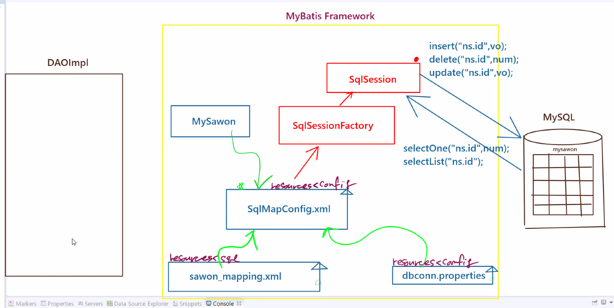

# 1119 Spring

## 1. MyBatis Framework

1. DB 테이블 만들기

   * mysawon

2. vo 클래스 만들기

   * MySawon.java

3. MyBatis 설정 문서 만들기

   * SqlMapConfig.xml
   * 모든걸 다 연결 (와이어링)
     * dbconn.properties : 파편적인 메타정보
     * sawib_mapping.xml : sql을 외부자원으로 모듈화
     * mysawon
     * MySawon.java
   * 정보가 어떤 정보냐에 따라 패키지 구분
     * resources<config
     * resources<sql

4. MyBatis 라이브러리

   * SqlSessionFactory -> SqlSession 리턴

   * 쿼리문을 실행하는 Function 가짐

     * insert("ns.id",vo);

     * delete("ns.id",num);

     * update("ns.id",vo);

     * selectOne("ns.id",num);

     * selectList("ns.id");

       





## 2.

> sp03_MyBatis ...이어서

```
mysql> SELECT * FROM mysawon;
+-----+--------+------+--------+------+------------+
| num | id     | pwd  | name   | age  | hiredate   |
+-----+--------+------+--------+------+------------+
|   1 | hahash | 1234 | 하야시 |   66 | 2021-11-18 |
|   2 | dorosh | 1234 | 도로시 |   22 | 2021-11-18 |
+-----+--------+------+--------+------+------------+
2 rows in set (0.00 sec)
```


### 1) SELECT 쿼리문 작성

#### mysawon_mapping.xml

```xml
<?xml version="1.0" encoding="UTF-8" ?>
<!DOCTYPE mapper
 PUBLIC "-//mybatis.org//DTD Mapper 3.0//EN"
 "http://mybatis.org/dtd/mybatis-3-mapper.dtd">

<mapper namespace="sawonMapper">
	<insert id="sawonAdd" parameterType="mySawon"> <!-- mySawon: vo alias -->
		INSERT
		INTO mysawon (id,pwd,name,age,hiredate) <!-- num은 알아서 생성 - 절대 넣지 x -->
<!-- 폼으로부터 받은 값 -> VO 생성 - 비즈니스 로직에 인자값 -> 뽑아서 집어넣기
	-> VO에서 뽑을때 get -> MyBatis에서 getter는 #{} :: VALUE(#{id}) = mysawon.getId !! -->
		VALUE(#{id},#{pwd},#{name},#{age},curDate()) <!-- curDate() 자동으로 현재날짜 불러오는 함수 -->
		
	</insert>
	
	<select id="sawonList" resultType="mySawon"> <!-- param 필요없음, resultType : ArrayList -->
		SELECT
		num, id, name, age, hiredate
		FROM mysawon
		ORDER BY num DESC
	</select>

</mapper>
```


#### MySawonTestApp02.java

```java
package com.edu.mybatis.test;

import java.io.Reader;
import java.util.List;

import org.apache.ibatis.io.Resources;
import org.apache.ibatis.session.SqlSession;
import org.apache.ibatis.session.SqlSessionFactory;
import org.apache.ibatis.session.SqlSessionFactoryBuilder;

import com.edu.mybatis.vo.MySawon;

/*
 * SELECT문을 실행시키는 Test
 */

public class MySawonTestApp02 {

	public static void main(String[] args) throws Exception{
		//1.핵심이 되는 설정 문서를 읽어들인다.
		Reader r = Resources.getResourceAsReader("config/SqlMapConfig.xml");	//ibatis: mybatis의 이전 버전
		
		//2.MyBatis 라이브러리...순서는 천천히 외우면 된다...
		SqlSessionFactory factory = new SqlSessionFactoryBuilder().build(r);	//SqlSessionFactory 생성
		
		//3.Session 여기에 쿼리문 실행하는 기능이 다 들어있다...
		SqlSession session = factory.openSession();
		
		List<MySawon> list = session.selectList("sawonMapper.sawonList");	 //"namespace.id"
		for(MySawon vo : list) {
			System.out.println(vo);
		}	//CLOSE는 DML일때 -> SELECT는 변경사항이 없다
	}
}
```

```
MySawon [num=2, age=22, id=dorosh, pwd=null, name=도로시, hiredate=2021-11-18]
MySawon [num=1, age=66, id=hahash, pwd=null, name=하야시, hiredate=2021-11-18]

```


```
 * 
 *					 SqlSessionFactory -> SqlSession
 * 							  SqlSession
 * 
 * 	sql query												execute method
 * INSERT INTO ~			------------------>			insert("namespace.id", vo);	
 * DELETE FROM ~			------------------>			delete("namespace.id", pk);					
 * UPDATE tanble ~			------------------>			update("namespace.id", vo);	
 * ----------------------------------------------------------------------------------------------
 * SELECT * FROM			------------------>			List<T> selectlist("namespace.id");
 * 							------------------>			List<T> selectlist("namespace.id","서울");
 * SELECT * FROM WHERE ~	------------------>			Object selectone("namespace.id",pk);
 * 
 * 
 */
```


#### FactoryService.java

```java
package com.edu.mybatis.test;

import java.io.Reader;

import org.apache.ibatis.io.Resources;
import org.apache.ibatis.session.SqlSessionFactory;
import org.apache.ibatis.session.SqlSessionFactoryBuilder;

/*
 * SqlSessionFactory 하나 받아오는 로직을 여기에 작성
 */


public class FactoryService {
	//생성자보다 먼저 가동되는 블락?...main보다 먼저 작동하는 블락?
	//static initialization block
	private static SqlSessionFactory factory;
	static {
		try {
			Reader r = Resources.getResourceAsReader("config/SqlMapConfig.xml");
			factory = new SqlSessionFactoryBuilder().build(r);	
			
			
		}catch(Exception e) {
			
		}
	}//
	
	public static SqlSessionFactory getFactory() {
		return factory;
	}

}
```


#### MySawonTestApp03.java

```java
package com.edu.mybatis.test;

import java.io.Reader;
import java.util.List;

import org.apache.ibatis.io.Resources;
import org.apache.ibatis.session.SqlSession;
import org.apache.ibatis.session.SqlSessionFactory;
import org.apache.ibatis.session.SqlSessionFactoryBuilder;

import com.edu.mybatis.vo.MySawon;

/*
 * SqlSessionFactory 생성부분과
 * SqlSession 반환받아서 로직 호출하는 부분을 나눠서 작성...
 */

public class MySawonTestApp03 {

	public static void main(String[] args) throws Exception{
		//설정 문서를 읽어들여서 SqlSessionFactory를 생성하는 로직을...FactoryService에서 받아온다
		SqlSessionFactory factory = FactoryService.getFactory();

		//Session 여기에 쿼리문 실행하는 기능이 다 들어있다...
		SqlSession session = factory.openSession();
		
		List<MySawon> list = session.selectList("sawonMapper.sawonList");	 
		for(MySawon vo : list) {
			System.out.println(vo);
		}	//CLOSE는 DML일때 -> SELECT는 변경사항이 없다
	}
}
```

```
MySawon [num=2, age=22, id=dorosh, pwd=null, name=도로시, hiredate=2021-11-18]
MySawon [num=1, age=66, id=hahash, pwd=null, name=하야시, hiredate=2021-11-18]
```


## 3.

