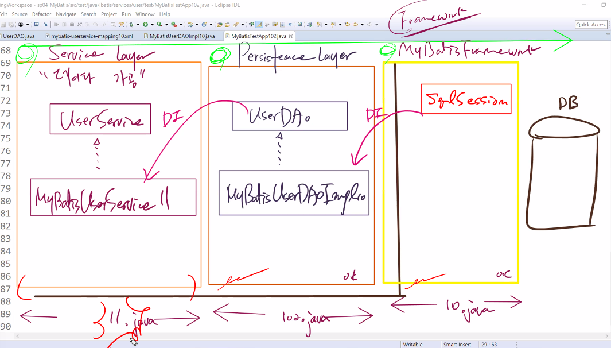
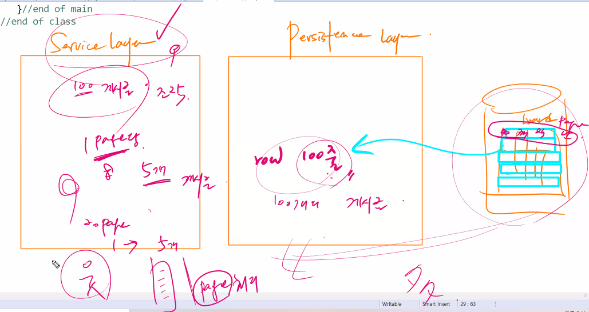
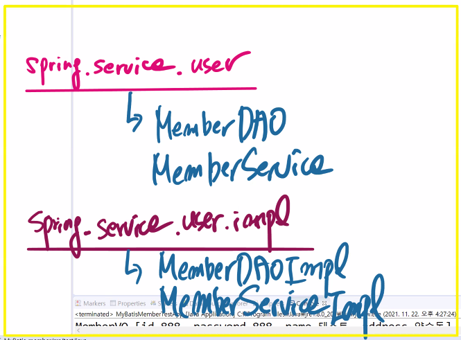

# 1122 Spring

## 1.


```
<!-- 
중요
1. MyBatis에서는 
ParameterType은 사용, ParameterMap은 사용하지 않는다.

ResultType은 ResultMap과 함께 사용되어진다....
비지니스 로직의 리턴타입과 연관된 속성.

ResultMap(결과맵)
1)
select 구문에서만 사용되는 속성
insert, delete, update에서는 사용 안됨
2)
디비 컬럼 타입과 vo클래스의 필드이름이 다를경우
결과셋의 명료함을 위해서 사용함
 -->
```


## 2.


#### UserDAO.java

```java
package ibatis.services.user;

import java.util.List;

import ibatis.services.domain.User;

/*
 * 비즈니스로직의 Template 기능을 담고 있는 모듈...
 * 
 * 비즈니스 로직의 갯수는?
 * 비즈니스 로직의 메소드 이름은?
 * -->
 * mybatis-userservice-mapping10.xml
 * 문서의 쿼리문 tag 갯수    --> 비즈니스로직의 메소드 갯수
 * 문서의 쿼리문 tag id    --> 비즈니스로직의 메소드 이름
 * 
 * 비즈니스 로직의 메소드 선언시
 * parameterType은 메소드 인자값 참고
 * resultMap은 메소드의 리턴 타입 참고
 */
public interface UserDAO {
   int addUser(User user) throws Exception;
   int updateUser(User user) throws Exception;
   int removeUser(String userId) throws Exception;
   List<User> getUser(String userId) throws Exception;
}
```


#### MyBatisDAOImpl10.java

* ibatis.services.user.impl

```java

```


## 3.








#### MemberServiceImpl.java

```java
package spring.service.user.impl;

import java.util.List;

import spring.service.domain.MemberVO;
import spring.service.user.MemberDAO;
import spring.service.user.MemberService;

public class MemberServiceImpl implements MemberService{
   
   private MemberDAO memberDAO;
   
   

   public void setMemberDAO(MemberDAO memberDAO) {
      this.memberDAO = memberDAO;
   }

   @Override
   public MemberVO getMember(String id) throws Exception {
      
      return memberDAO.getMember(id);
   }

   @Override
   public List<MemberVO> showAllMember() throws Exception {
      
      return memberDAO.showAllMember();
   }

   @Override
   public String idExist(String id) throws Exception {
      
      return memberDAO.idExist(id);
   }

}
```


#### MemberService.java

```java
package spring.service.user;

import java.util.List;

import spring.service.domain.MemberVO;

public interface MemberService {
   
   MemberVO getMember(String id) throws Exception;
   List<MemberVO> showAllMember()  throws Exception;
   
   String idExist(String id) throws Exception;
}
```


#### MemberDAOImpl.java

```java
package spring.service.user.impl;

import java.util.List;

import org.apache.ibatis.session.SqlSession;

import spring.service.domain.MemberVO;
import spring.service.user.MemberDAO;

public class MemberDAOImpl implements MemberDAO{
   private SqlSession sqlSession;
   
   
   public void setSqlSession(SqlSession sqlSession) {
      this.sqlSession = sqlSession;
   }

   @Override
   public int registerMember(MemberVO vo) throws Exception {
      int result=sqlSession.insert("MemberMapper.registerMember",vo);
      sqlSession.commit();
      return result;
   }

   @Override
   public int deleteMember(String id) throws Exception {
      int result=sqlSession.delete("MemberMapper.deleteMember",id);
      sqlSession.commit();
      return result;
   }

   @Override
   public int updateMember(MemberVO vo) throws Exception {
      int result=sqlSession.update("MemberMapper.updateMember",vo);
      sqlSession.commit();
      return result;
   }

   @Override
   public MemberVO getMember(String id) throws Exception {
      
      return sqlSession.selectOne("MemberMapper.getMember",id);
   }

   @Override
   public List<MemberVO> showAllMember() throws Exception {
      return sqlSession.selectList("MemberMapper.showAllMember");
   }

   @Override
   public String idExist(String id) throws Exception {
      return sqlSession.selectOne("MemberMapper.idExist",id);
   }

}
```


#### MemberDAO.java

```java
package spring.service.user;

import java.util.List;

import spring.service.domain.MemberVO;

public interface MemberDAO {
   int registerMember(MemberVO vo) throws Exception;
   int deleteMember(String id) throws Exception;
   int updateMember(MemberVO vo) throws Exception;
   
   MemberVO getMember(String id) throws Exception;
   List<MemberVO> showAllMember()  throws Exception;
   
   String idExist(String id) throws Exception;

}
```

