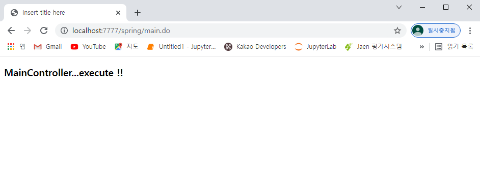

# 1123 Maven

* `C:\miracom_edu\util\spring\sts-bundle\sts-3.9.8.RELEASE`
* STS.exe 실행
* Tomcat 8.5 서버 연결


src 다각화 이미 설정


설정문서


**특징...**

jar 하나가 dependency 하나

maven은 일일이 안 넣어줘도 dependency가 라이브러리 하나

기본적으로 다 들어가 있다

`pom.xml`

-----------------------------

`C:\Users\mina\.m2\repository`

원격지에서 다운

중간에 못받아 올 경우 / 네트워크 안좋을 경우 -> `.m2` 삭제 -> maven이 오리지날 사이트에서 새로 받아옴

두번째 maven 프로젝트 생성했을 때 -> 첫번째 sp01보다 빨리 만들어짐 -> 로컬에서 끌어당기기 때문 - 라이브러리 필요 -> 처음만 원격지에서 끌어옴 - 시간 오래 걸림...두번째 부터는 로컬에서!

어지간한 거는 라이브러리 구축된 상태...maven 기반 가장 큰 특징!!!


## Maven 기반이란?

1. Project 생성시 package 계층을 최소 3개 이상 요구
   * ex) com.edu.spring
   * <groupId>com.edu</groupId>
     <artifactId>spring</artifactId>
   * `artifactId`가 실제 이름

2. Src 다각화 
   * java code
   * 설정문서
   * unit test code

3. 라이브러리를 일일이 추가 x -> `pom.xml`
   * <dependency> 추가하면 사이트에서 알아서 가져온다...
4. STS 기능 추가하면 Spring Configuration File 직접 생성 가능

* Vue나 CLI ...Front 구조 이해하기 쉽다!
  * 이해하기 위해 여태 직접 구축...


Presentation Layer

* Dispatcher Servlet : 클라이언트의 모든 요청은 하나의 서블릿이 다 받는다
* ControllerFactory (HandlerMapping)
  * 컨트롤러 생성
* Controller : 인터페이스 기반 컴포넌트
* 만든애의 부모타입 리턴 - Controller 
* Dispatcher는 Controller의 메소드 call
  * handle(re);
* 모델 MV 리턴
* 모든 페이지의 네비게이션은 forward
* 최종 응답은 result -> web.xml


빨간색은 라이브러리!! - 눈에 안보임

개발자가 작성하는 것은 컴포넌트와 결과 페이지 밖에!

* IndexController / result ...


## 1.


#### IndexController.java

```java
package com.edu.spring.controller;

import javax.servlet.http.HttpServletRequest;
import javax.servlet.http.HttpServletResponse;

import org.springframework.web.servlet.ModelAndView;
import org.springframework.web.servlet.mvc.Controller;

/*
 * Presentation Layer의 Component
 * 이후 Annotation 기법에서는 @Controller라고 마킹되어질 것
 * 일단 xml --> @Controller
 */

public class IndexController implements Controller {
	
	@Override
	public ModelAndView handleRequest(HttpServletRequest request, HttpServletResponse response) throws Exception {
		// DAO 메소드 호출
		ModelAndView mv = new ModelAndView();
		
		mv.setViewName("result"); 	//결과 페이지의 이름(결과 페이지 저장 위치와 확장자는 생략)
		mv.addObject("message", "Hello SpringMVC !!");	//별도의 설정이 없으면 forward로 request 바인딩...message에 Hello SpringMVC !!
		
		return mv;
	}

}
```


#### result.jsp

```jsp
<%@ page language="java" contentType="text/html; charset=UTF-8"
    pageEncoding="UTF-8"%>
<!DOCTYPE html>
<html>
<head>
<meta charset="UTF-8">
<title>Insert title here</title>
</head>
<body>
<strong>${message}</strong>
</body>
</html>
```


#### index.html

```html
<!DOCTYPE html>
<html>
<head>
<meta charset="UTF-8">
<title>Insert title here</title>
</head>
<body>
<a href="index.do">Dispatcher Servlet !!</a>
</body>
</html>
```


#### web.xml

```xml
<?xml version="1.0" encoding="UTF-8"?>
<web-app version="2.5" xmlns="http://java.sun.com/xml/ns/javaee"
	xmlns:xsi="http://www.w3.org/2001/XMLSchema-instance"
	xsi:schemaLocation="http://java.sun.com/xml/ns/javaee https://java.sun.com/xml/ns/javaee/web-app_2_5.xsd">

	<!-- The definition of the Root Spring Container shared by all Servlets and Filters -->
	<context-param>
		<param-name>contextConfigLocation</param-name>
		<param-value>/WEB-INF/spring/root-context.xml</param-value>
	</context-param>
	
	<!-- Creates the Spring Container shared by all Servlets and Filters -->
	<listener>
		<listener-class>org.springframework.web.context.ContextLoaderListener</listener-class>
	</listener>

	<!-- Processes application requests -->
	<servlet>
		<servlet-name>appServlet</servlet-name>
		<servlet-class>org.springframework.web.servlet.DispatcherServlet</servlet-class>
		<init-param>
			<param-name>contextConfigLocation</param-name>
			<param-value>/WEB-INF/spring/appServlet/servlet-context.xml</param-value>
		</init-param>
		<load-on-startup>1</load-on-startup>
	</servlet>
		
	<servlet-mapping>
		<servlet-name>appServlet</servlet-name>
		<url-pattern>*.do</url-pattern>
	</servlet-mapping>

</web-app>
```


WAS 가동하면 바로 D.D 읽는다 -> web.xml

* `/WEB-INF/spring/root-context.xml` 찾기
* `DispatcherServlet` 라이브러리 클래스를 `appServlet` 이름으로 생성
* `servlet-context.xml` 찾기


#### servlet-context.xml

* 빈 설정문서
* `/WEB-INF/spring/appServlet/servlet-context.xml`

```xml
<?xml version="1.0" encoding="UTF-8"?>
<beans:beans xmlns="http://www.springframework.org/schema/mvc"
	xmlns:xsi="http://www.w3.org/2001/XMLSchema-instance"
	xmlns:beans="http://www.springframework.org/schema/beans"
	xmlns:context="http://www.springframework.org/schema/context"
	xsi:schemaLocation="http://www.springframework.org/schema/mvc https://www.springframework.org/schema/mvc/spring-mvc.xsd
		http://www.springframework.org/schema/beans https://www.springframework.org/schema/beans/spring-beans.xsd
		http://www.springframework.org/schema/context https://www.springframework.org/schema/context/spring-context.xsd">

	<!-- DispatcherServlet Context: defines this servlet's request-processing infrastructure -->
	
	<!-- Enables the Spring MVC @Controller programming model -->
	<annotation-driven />

	<!-- Handles HTTP GET requests for /resources/** by efficiently serving up static resources in the ${webappRoot}/resources directory -->
	<resources mapping="/resources/**" location="/resources/" />

	<!-- Resolves views selected for rendering by @Controllers to .jsp resources in the /WEB-INF/views directory -->
	<beans:bean class="org.springframework.web.servlet.view.InternalResourceViewResolver">
		<beans:property name="prefix" value="/WEB-INF/views/" />
		<beans:property name="suffix" value=".jsp" />
	</beans:bean>
	
	<!-- 사용자 정의 Bean 등록 :: IndexController -->
	<beans:bean name="/index.do" class="com.edu.spring.controller.IndexController" />
	
	<context:component-scan base-package="com.edu.spring" />
	
</beans:beans>
```


* 포워딩 했기 때문에 요청한 이름으로 


## 2.


WAS -> D.D 파일을 읽는다 (`web.xml`)

1. `root-context.xml` 찾기
2. `DispatcherServlet` 생성
3. `servlet-context.xml` 찾기

WAS 가동하면서 `servlet-context` 연결

* 설정문서 읽는 것은 WAS

DI Contatiner가 `servlet-context`을 읽고 bean 생성

* 주문서대로 bean 생성해주는 것은 DI Contatiner


#### index.jsp

```jsp
<%@ page language="java" contentType="text/html; charset=UTF-8"
    pageEncoding="UTF-8"%>
<!DOCTYPE html>
<html>
<head>
<meta charset="UTF-8">
<title>Insert title here</title>
</head>
<body>
	<h2 align="center">======== Spring MVC Framework Module ========</h2>
	<!-- main.do라는 요청을  DispatcherServlet 받아서...
		  그걸 HandlerMapping(ControllerFactory)한테 줄 것 
		  그럼 HandlerMapping 그 요청에 해당하는 컴포넌트를 생성...
		 MainController를 우리는 직접 작성해놓으면 된다 
		 
		 index 페이지 다음에 Controller기반의 Component 작성을 하면 된다 -->
	<center><a href="main.do">DispatcherServlet Moving</a></center>
</body>
</html>
```


#### MainController.java

```java
package com.edu.spring.controller;

import javax.servlet.http.HttpServletRequest;
import javax.servlet.http.HttpServletResponse;

import org.springframework.web.servlet.ModelAndView;
import org.springframework.web.servlet.mvc.Controller;

public class MainController implements Controller{

	@Override
	public ModelAndView handleRequest(HttpServletRequest request, HttpServletResponse response) throws Exception {
		ModelAndView mv = new ModelAndView();
		mv.setViewName("result");	//결과 페이지의 이름
		mv.addObject("info","MainController...execute !!");
		
		//자동적으로 forward 방식으로 이동, ServletRequest에 바인딩이 이뤄진다
		return mv;
	}

}
```


#### result.jsp

```jsp
<%@ page language="java" contentType="text/html; charset=UTF-8"
    pageEncoding="UTF-8"%>
<!DOCTYPE html>
<html>
<head>
<meta charset="UTF-8">
<title>Insert title here</title>
</head>
<body>
<h3>${info}</h3>
</body>
</html>
```


#### web.xml

```xml
<?xml version="1.0" encoding="UTF-8"?>
<web-app version="2.5" xmlns="http://java.sun.com/xml/ns/javaee"
	xmlns:xsi="http://www.w3.org/2001/XMLSchema-instance"
	xsi:schemaLocation="http://java.sun.com/xml/ns/javaee https://java.sun.com/xml/ns/javaee/web-app_2_5.xsd">

	<!-- Processes application requests -->
	<servlet>
		<servlet-name>dispatcher</servlet-name>
		<servlet-class>org.springframework.web.servlet.DispatcherServlet</servlet-class>
		<load-on-startup>1</load-on-startup>
	</servlet>
		
	<servlet-mapping>
		<servlet-name>dispatcher</servlet-name>
		<url-pattern>*.do</url-pattern>
	</servlet-mapping>

</web-app>
```

WAS 가동되면서 무조건 읽는 문서... web.xml이 하는 일

* 서블릿 생성
  * `org.springframework.web.servlet.DispatcherServlet`
* Bean 설정 문서 Wiring
  * 별도로 와이어링 하는 문서가 없을때... 디폴트로 와이어링하는 문서 
  * = `서블릿이름-servlet.xml`
    * ex) 여기서는 서블릿 이름이 dispatcher...
    * dispatcher-servlet.xml 이라는 bean 설정 문서 무조건 찾는다 !!!

#### dispatcher-servlet.xml

```xml
<?xml version="1.0" encoding="UTF-8"?>
<beans xmlns="http://www.springframework.org/schema/beans"
	xmlns:xsi="http://www.w3.org/2001/XMLSchema-instance"
	xsi:schemaLocation="http://www.springframework.org/schema/beans https://www.springframework.org/schema/beans/spring-beans.xsd">


	<!-- Bean 등록...일종의 주문서...이 주문서를 BeanContainer가 읽어서 빈을 생성한다 -->
	
	<!-- 결과 페이지의 위치와 확장자 정보를 가지고 있는 API bean :: InternalResourceViewResolver -->
	<bean id="viewResolver" class="org.springframework.web.servlet.view.InternalResourceViewResolver">
		<property name="prefix" value="/WEB-INF/results/" /> <!-- 결과 페이지의 물리적인 저장 위치 -->
		<property name="suffix" value=".jsp" /> <!-- 결과 페이지의 확장자 -->
	</bean>
	
	<!-- 사용자 정의 Bean 등록 name 속성값으로는 어떤 요청이 들어왔을 때 ControllerFactory가 생성해주는 Component인지를 등록 -->
	<bean name="/main.do" class="com.edu.spring.controller.MainController"></bean>	
	
</beans>
```


