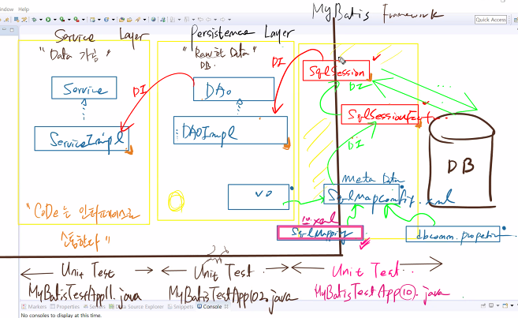
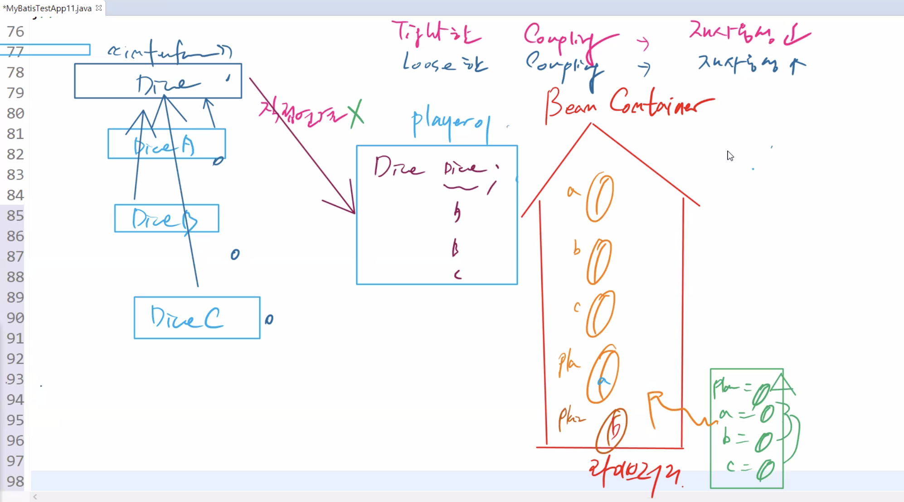
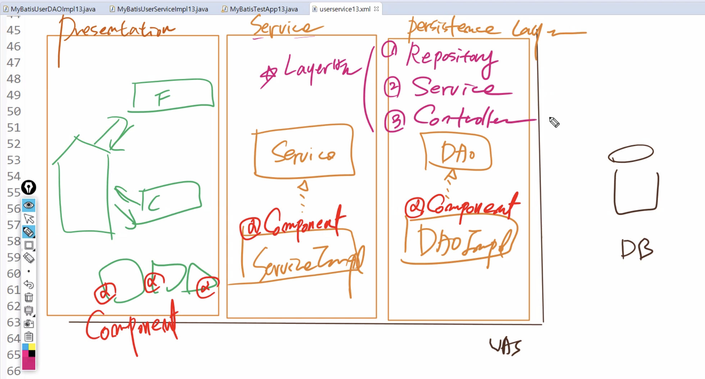

# 1123

## 1.

persistence layer

* raw data - DB에 직접 연결

- DAO
- DAOImpl
- VO

service layer

* data가공




## 2. Coupling

player와 test 여전히 직접 연결 - `new` 키워드

* 인터페이스가 아닌 실체클래스로 접근해야 함

해결책? **DI container / Bean container** 

* 개발자는 주문서만 !




## 3.


#### userservice12.xml

```xml
<?xml version="1.0" encoding="UTF-8"?>

<!-- MyBatis와 DI 연결 -->
<beans xmlns="http://www.springframework.org/schema/beans"
	xmlns:xsi="http://www.w3.org/2001/XMLSchema-instance"
	xmlns:context="http://www.springframework.org/schema/context"
	xsi:schemaLocation="http://www.springframework.org/schema/beans http://www.springframework.org/schema/beans/spring-beans.xsd
	http://www.springframework.org/schema/context http://www.springframework.org/schema/context/spring-context-4.0.xsd">
	
	<context:property-placeholder location="classpath:config/dbconn.properties"/>
	
	<!-- 1. DataSource API Bean -->
	<bean id="dataSource" class="org.apache.commons.dbcp.BasicDataSource"> <!-- FQCN -->
		<property name="driverClassName" value="${jdbc.mysql.driver}"/>
		<property name="url" value="${jdbc.mysql.url}"/>
		<property name="username" value="${jdbc.mysql.username}"/>
		<property name="password" value="${jdbc.mysql.password}"/>	
	</bean>
	
	<!-- 2. MyBatis API Bean :: sqlSessionFactoryBean -->
	<bean id="sqlSessionFactoryBean" class="org.mybatis.spring.SqlSessionFactoryBean"> 
		<property name="configLocation" value="classpath:config/SqlMapConfig.xml"/>
		<property name="dataSource" ref="dataSource"/> <!-- 위에서 만든 Bean 연결 -->
	</bean>
	
	<!-- 3. MyBatis API Bean :: sqlSession -->
	<bean id="sqlSession" class="org.mybatis.spring.SqlSessionTemplate"> 
		<!-- 생성자 주입 -->
		<constructor-arg ref="sqlSessionFactoryBean"/> <!-- API Bean 등록 -->
	</bean>
	
	<!-- 4. DAOImpl12 사용자 정의 Bean -->
	<bean id="myBatisUserDAOImpl12" class="ibatis.services.user.impl.MyBatisUserDAOImpl12">
		<property name="sqlSession" ref="sqlSession"/>
	</bean>
	
	<!-- 5. ServiceImpl12 사용자 정의 Bean -->
	<bean id="myBatisUserServiceImpl12" class="ibatis.services.user.impl.MyBatisUserServiceImpl12">
		<property name="userDAO" ref="myBatisUserDAOImpl12"/>
	</bean>
	
	
</beans>
```


#### SqlMapConfig01.xml

* 현재 설정문서 `xml` 기반
* 점점 `annotation` 기반으로 !
  * 태그 줄이고 `@`로 마크
  * bean 설정문서 줄여줌 -> 생산성 높아짐

```xml
<?xml version="1.0" encoding="UTF-8" ?>
<!DOCTYPE configuration PUBLIC "-//mybatis.org//DTD Config 3.0//EN"
	"http://mybatis.org/dtd/mybatis-3-config.dtd">
<configuration>

<!-- MyBatisFramework와 DI를 연결하는 설정문서... -->

	<settings>
		<setting name="mapUnderscoreToCamelCase" value="True"/>
	</settings>
	
	<!-- 2. vo를 alias.... -->
	<typeAliases>
		<package name="ibatis.services.domain"/>
	</typeAliases>
	
	<!-- 3. sql mapper -->
	<mappers>
		<mapper resource="sql/mybatis-userservice-mapping10.xml"/>
	</mappers>
	
</configuration>
```


#### MyBatisUserDAOImpl12.java

```java
package ibatis.services.user.impl;
/*
 * MyBatisFramework 단위에서의 최고 결정체인
 * SqlSession을 DI(Dependent Injection) 한다.
 */
import java.util.List;

import org.apache.ibatis.session.SqlSession;

import ibatis.services.domain.User;
import ibatis.services.user.UserDAO;

public class MyBatisUserDAOImpl12 implements UserDAO{
	
	private SqlSession sqlSession;
	
	
	public void setSqlSession(SqlSession sqlSession) {
		System.out.println(getClass().getName()+".setSqlSession() Calling..");
		this.sqlSession = sqlSession;
	}

	@Override
	public int addUser(User user) throws Exception {
		/*
		 * 1. Connection 얻어내고,,,
		 * 2. ps 리턴 받고...
		 * 3. 바인딩 
		 * 4. 쿼리문실행
		 * 5. close() :: commit() - DI연결할 떄는 오히려 빼줘야 한다...이미 되어져있음!
		 * --> 지금은 이런 코드가 모두 MyBatisFramework에서 이미 진행되었다.
		 */
		int result = sqlSession.insert("UserMapper10.addUser", user);
//		sqlSession.commit();	
		return result;
	}

	@Override
	public int updateUser(User user) throws Exception {
		int result = sqlSession.update("UserMapper10.updateUser", user);
//		sqlSession.commit();
		return result;
	}

	@Override
	public int removeUser(String userId) throws Exception {
		int result = sqlSession.delete("UserMapper10.removeUser", userId);
//		sqlSession.commit();
		return result;
	}

	@Override
	public User getUser(String userId) throws Exception {
		
		return sqlSession.selectOne("UserMapper10.getUser",userId);
	}

	@Override
	public List<User> getUserList(User user) throws Exception {
		
		return sqlSession.selectList("UserMapper10.getUserList",user);
	}
}
```


#### MyBatisUserServiceImpl12.java

```java
package ibatis.services.user.impl;

import java.util.List;

import ibatis.services.domain.User;
import ibatis.services.user.UserDAO;
import ibatis.services.user.UserService;
/*
 * 바로 뒤에 레이어...UserDAO를 DI(Dependent Injection)하면 됨.
 */
public class MyBatisUserServiceImpl12 implements UserService {
	private UserDAO userDAO;
	
	public void setUserDAO(UserDAO userDAO) {
		System.out.println(getClass().getName()+".setUserDAO()  Call...");
		this.userDAO = userDAO;
	}

	
	@Override
	public void addUser(User user) throws Exception {
		userDAO.addUser(user);
	}

	@Override
	public void updateUser(User user) throws Exception {
		userDAO.updateUser(user);
		
	}

	@Override
	public User getUser(String userId) throws Exception {
		return userDAO.getUser(userId);
	}

	@Override
	public List<User> getUserList(User user) throws Exception {
		return userDAO.getUserList(user);
	}

}
```


#### MyBatisTestApp12.java

```java
package ibatis.services.user.test;

import java.util.List;

import org.springframework.context.ApplicationContext;
import org.springframework.context.support.ClassPathXmlApplicationContext;

import ibatis.services.domain.User;
import ibatis.services.user.UserDAO;
import ibatis.services.user.UserService;

/*
 * FileName : MyBatisTestApp12.java
  * ㅇ SqlMapConfig01.xml / mybatis-userservice-mapping10.xml
  * ㅇ MyBatisUserDAOImpl12 / MyBatisUserServiceImpl12(이건 이름만 바꿔줌)을 작성.
  * ㅇ Spring meta data연동..userservice12.xml
  * --> 여기서 드디어 MyBatisFramework와 DI 연결
  * 	~Test 코드에 new라는 키워드가 다 사라졌다...객체생성의 주체를 BeanContainer에게 위임
  */
public class MyBatisTestApp12 {
	///Main method
	public static void main(String[] args) throws Exception{

		ApplicationContext context =
			new ClassPathXmlApplicationContext(
							new String[] {	"/config/userservice12.xml"	 }
								                                                    );
	//==> IoC Container 로 부터 획득한 UserDAO 인스턴스 획득
	UserService userService = (UserService)context.getBean("myBatisUserServiceImpl12");
	
	User user = new User("user04","주몽","user04",40,40);

	System.out.println("///////////////////////////////////////////////////////////////////////////////////////");
	//1.userService.addUser(user) Test
	System.out.println(":: 1. add(INSERT)  ? ");
	userService.addUser(user);
	
	System.out.println("///////////////////////////////////////////////////////////////////////////////////////");
	//2.UserService.getUser(userId) Test
	user = userService.getUser("user04");
	System.out.println(":: 2. get(SELECT)  ? "+user);
	
	System.out.println("///////////////////////////////////////////////////////////////////////////////////////");
	//3.UserService.uadateUser(user) Test
	user.setUserName("장보고");
	System.out.println(":: 3. update(UPDATE)  ? ");
	userService.updateUser(user);
	
	System.out.println("///////////////////////////////////////////////////////////////////////////////////////");
	//4.UserService.getUser(userId) Test
	user = userService.getUser("user04");
	System.out.println(":: 4. get(SELECT)  ? "+user);

	System.out.println("///////////////////////////////////////////////////////////////////////////////////////");
	//5.UserDAO.removeUser(userId) Test
	//==> UserService 에는 removeUser가 없으므로, DAO에서 직접 호출 Test
	UserDAO userDAO = (UserDAO)context.getBean("myBatisUserDAOImpl12");
	System.out.println(":: 5. remove(DELETE)  ? "+userDAO.removeUser("user04"));
	
	System.out.println("///////////////////////////////////////////////////////////////////////////////////////");
	//6.UserService.getUserList() Test
	System.out.println(":: 6. all User(SELECT)  ? ");
	List<User> list = userService.getUserList(new User());
	for (int i =0 ;  i < list.size() ; i++) {
		System.out.print( "<"+ ( i +1 )+"> 번째 회원 정보... ");
		System.out.println( list.get(i).toString() );
	}
	System.out.println("///////////////////////////////////////////////////////////////////////////////////////");
		
	}//end of main
}//end of class
```

```
11월 23, 2021 11:57:56 오전 org.springframework.context.support.AbstractApplicationContext prepareRefresh
정보: Refreshing org.springframework.context.support.ClassPathXmlApplicationContext@255316f2: startup date [Tue Nov 23 11:57:56 KST 2021]; root of context hierarchy
11월 23, 2021 11:57:57 오전 org.springframework.beans.factory.xml.XmlBeanDefinitionReader loadBeanDefinitions
정보: Loading XML bean definitions from class path resource [config/userservice12.xml]
11월 23, 2021 11:57:57 오전 org.springframework.core.io.support.PropertiesLoaderSupport loadProperties
정보: Loading properties file from class path resource [config/dbconn.properties]
ibatis.services.user.impl.MyBatisUserDAOImpl12.setSqlSession() Calling..
ibatis.services.user.impl.MyBatisUserServiceImpl12.setUserDAO()  Call...
///////////////////////////////////////////////////////////////////////////////////////
:: 1. add(INSERT)  ? 
///////////////////////////////////////////////////////////////////////////////////////
:: 2. get(SELECT)  ? User [userid=user04, userName=주몽, password=user04, age=40, grade=40, active=false, regDate=2021-11-23 11:57:58.482]
///////////////////////////////////////////////////////////////////////////////////////
:: 3. update(UPDATE)  ? 
///////////////////////////////////////////////////////////////////////////////////////
:: 4. get(SELECT)  ? User [userid=user04, userName=장보고, password=user04, age=40, grade=40, active=false, regDate=2021-11-23 11:57:58.491]
///////////////////////////////////////////////////////////////////////////////////////
:: 5. remove(DELETE)  ? 1
///////////////////////////////////////////////////////////////////////////////////////
:: 6. all User(SELECT)  ? 
<1> 번째 회원 정보... User [userid=user03, userName=김유신, password=user03, age=30, grade=3, active=false, regDate=2019-10-09 09:00:00.0]
<2> 번째 회원 정보... User [userid=user02, userName=이순신, password=user02, age=20, grade=2, active=false, regDate=2019-10-12 09:00:00.0]
<3> 번째 회원 정보... User [userid=user01, userName=홍길동, password=user01, age=10, grade=1, active=false, regDate=2019-10-11 09:00:00.0]
<4> 번째 회원 정보... User [userid=mybatis03, userName=김유신iba, password=mybatis03, age=30, grade=3, active=false, regDate=2019-10-02 09:00:00.0]
<5> 번째 회원 정보... User [userid=mybatis02, userName=이순신iba, password=mybatis02, age=20, grade=2, active=false, regDate=2019-10-07 09:00:00.0]
<6> 번째 회원 정보... User [userid=mybatis01, userName=홍길동iba, password=mybatis01, age=10, grade=1, active=false, regDate=2019-10-08 09:00:00.0]
///////////////////////////////////////////////////////////////////////////////////////
```


## 4. Annotation

Annotation : xml 빈 설정문서 (주문서)가 간단해진다



####

```

```


Bean Configuration File 설정 문서(주문서)

주문서에 아래의 마킹

```
<context:component-scan base-package="ibatis.services.user.impl"/>
```

주문서만 읽어서 되는것이 아니라 `base-package`의 모든 클래스 마크에 Annotation을 확인

-> 빈 생성

이 패키지안의 모든 클래스를 스캔 -> 

1. **@Component** 만나면 MyBatisUserDAOImpl13 이름으로 빈 생성 -> sqlSession 주입
2. **@Component** 만나면 MyBatisUserServiceImpl13 이름으로 빈 생성 -> userDAO 주입


Bean 컨테이너 입장에서는 복잡...


### layer 3개

Persistence Layer

* DAOImpl -> DAO

Service Layer

* ServiceImpl -> Service 

Presentation Layer

* Controller / ControllerFactory

Component : Interface 기반 재사용성 높이는...


### Layer별 Component 구분

1. Persistence Layer의 Component  : Repository
2. Service Layer의 Component  :  Service 
3. Presentation Layer의 Component  :  Controller


#### userservice13.xml

```xml
<?xml version="1.0" encoding="UTF-8"?>

<!-- MyBatis와 DI 연결 -->
<beans xmlns="http://www.springframework.org/schema/beans"
	xmlns:xsi="http://www.w3.org/2001/XMLSchema-instance"
	xmlns:context="http://www.springframework.org/schema/context"
	xsi:schemaLocation="http://www.springframework.org/schema/beans http://www.springframework.org/schema/beans/spring-beans.xsd
	http://www.springframework.org/schema/context http://www.springframework.org/schema/context/spring-context-4.0.xsd">
	
	<context:property-placeholder location="classpath:config/dbconn.properties"/>
	
	<!-- 1. DataSource API Bean -->
	<bean id="dataSource" class="org.apache.commons.dbcp.BasicDataSource"> <!-- FQCN -->
		<property name="driverClassName" value="${jdbc.mysql.driver}"/>
		<property name="url" value="${jdbc.mysql.url}"/>
		<property name="username" value="${jdbc.mysql.username}"/>
		<property name="password" value="${jdbc.mysql.password}"/>	
	</bean>
	
	<!-- 2. MyBatis API Bean :: sqlSessionFactoryBean -->
	<bean id="sqlSessionFactoryBean" class="org.mybatis.spring.SqlSessionFactoryBean"> 
		<property name="configLocation" value="classpath:config/SqlMapConfig.xml"/>
		<property name="dataSource" ref="dataSource"/> <!-- 위에서 만든 Bean 연결 -->
	</bean>
	
	<!-- 3. MyBatis API Bean :: sqlSession -->
	<bean id="sqlSession" class="org.mybatis.spring.SqlSessionTemplate"> 
		<!-- 생성자 주입 -->
		<constructor-arg ref="sqlSessionFactoryBean"/> <!-- API Bean 등록 -->
	</bean>
	
	<!-- 4. DAOImpl12 사용자 정의 Bean Annotation -->
	
	<!-- 5. ServiceImpl12 사용자 정의 Bean Annotation -->
	
	<!-- 6. Annotation을 한 대신에 반드시 이 태그를 달아줘야 함 -->
	<context:component-scan base-package="ibatis.services.user.impl"/>
	
	
	
</beans>
```


#### MyBatisUserDAOImpl13.java

```java
package ibatis.services.user.impl;
/*
 * MyBatisFramework 단위에서의 최고 결정체인
 * SqlSession을 DI(Dependent Injection) 한다.
 * 
 * Annotation
 * Persistence Layer Bean :: Component - Interface 기반
 * 
 * @Component
 * 		|
 * Persistence Layer
 * @Repository
 * 
 */
import java.util.List;

import org.apache.ibatis.session.SqlSession;
import org.springframework.beans.factory.annotation.Autowired;
import org.springframework.stereotype.Component;
import org.springframework.stereotype.Repository;

import ibatis.services.domain.User;
import ibatis.services.user.UserDAO;

//@Component
@Repository
public class MyBatisUserDAOImpl13 implements UserDAO{
	
	@Autowired //sqlSession이 MyBatisUserDAOImpl13에 자동적으로 주입됨
	private SqlSession sqlSession;
	
	//Annotation해서 불필요
/*	public void setSqlSession(SqlSession sqlSession) {
		System.out.println(getClass().getName()+".setSqlSession() Calling..");
		this.sqlSession = sqlSession;
	}*/

	
	@Override
	public int addUser(User user) throws Exception {
		/*
		 * 1. Connection 얻어내고,,,
		 * 2. ps 리턴 받고...
		 * 3. 바인딩 
		 * 4. 쿼리문실행
		 * 5. close() :: commit() - DI연결할 떄는 오히려 빼줘야 한다...이미 되어져있음!
		 * --> 지금은 이런 코드가 모두 MyBatisFramework에서 이미 진행되었다.
		 */
		int result = sqlSession.insert("UserMapper10.addUser", user);
//		sqlSession.commit();	
		return result;
	}

	@Override
	public int updateUser(User user) throws Exception {
		int result = sqlSession.update("UserMapper10.updateUser", user);
//		sqlSession.commit();
		return result;
	}

	@Override
	public int removeUser(String userId) throws Exception {
		int result = sqlSession.delete("UserMapper10.removeUser", userId);
//		sqlSession.commit();
		return result;
	}

	@Override
	public User getUser(String userId) throws Exception {
		
		return sqlSession.selectOne("UserMapper10.getUser",userId);
	}

	@Override
	public List<User> getUserList(User user) throws Exception {
		
		return sqlSession.selectList("UserMapper10.getUserList",user);
	}

}
```


#### MyBatisUserServiceImpl13.java

```java
package ibatis.services.user.impl;

import java.util.List;

import org.springframework.beans.factory.annotation.Autowired;
import org.springframework.stereotype.Component;
import org.springframework.stereotype.Service;

import ibatis.services.domain.User;
import ibatis.services.user.UserDAO;
import ibatis.services.user.UserService;
/*
 * 바로 뒤에 레이어...UserDAO를 DI(Dependent Injection)하면 됨.
 * Annotation
 * Service Layer Bean :: Component - Interface 기반
 * 
 * @Component
 * 		|
 * Service  Layer
 * @Service
 */

//@Component
@Service
public class MyBatisUserServiceImpl13 implements UserService {
	
	@Autowired
	private UserDAO userDAO;
	
	//Annotation해서 불필요
/*	public void setUserDAO(UserDAO userDAO) {
		System.out.println(getClass().getName()+".setUserDAO()  Call...");
		this.userDAO = userDAO;
	}*/

	
	@Override
	public void addUser(User user) throws Exception {
		userDAO.addUser(user);
	}

	@Override
	public void updateUser(User user) throws Exception {
		userDAO.updateUser(user);
		
	}

	@Override
	public User getUser(String userId) throws Exception {
		return userDAO.getUser(userId);
	}

	@Override
	public List<User> getUserList(User user) throws Exception {
		return userDAO.getUserList(user);
	}

}
```


#### MyBatisTestApp13.java

```java
package ibatis.services.user.test;

import java.util.List;

import org.springframework.context.ApplicationContext;
import org.springframework.context.support.ClassPathXmlApplicationContext;

import ibatis.services.domain.User;
import ibatis.services.user.UserDAO;
import ibatis.services.user.UserService;

/*
 * FileName : MyBatisTestApp13.java
  * ㅇ SqlMapConfig01.xml / mybatis-userservice-mapping10.xml
  * ㅇ userService13.xml 
  * ㅇ Annotation 기반 설정 Test
  */
public class MyBatisTestApp13 {
	///Main method
	public static void main(String[] args) throws Exception{

		ApplicationContext context =
			new ClassPathXmlApplicationContext(
							new String[] {	"/config/userservice13.xml"	 }
								                                                    );
	//==> IoC Container 로 부터 획득한 UserDAO 인스턴스 획득
	UserService userService = (UserService)context.getBean("myBatisUserServiceImpl13");
	
	User user = new User("user04","주몽","user04",40,40);

	System.out.println("///////////////////////////////////////////////////////////////////////////////////////");
	//1.UserService.addUser(user) Test
	System.out.println(":: 1. add(INSERT)  ? ");
	userService.addUser(user);
	
	System.out.println("///////////////////////////////////////////////////////////////////////////////////////");
	//2.UserService.getUser(userId) Test
	user = userService.getUser("user04");
	System.out.println(":: 2. get(SELECT)  ? "+user);
	
	System.out.println("///////////////////////////////////////////////////////////////////////////////////////");
	//3.UserService.uadateUser(user) Test
	user.setUserName("장보고");
	System.out.println(":: 3. update(UPDATE)  ? ");
	userService.updateUser(user);
	
	System.out.println("///////////////////////////////////////////////////////////////////////////////////////");
	//4.UserService.getUser(userId) Test
	user = userService.getUser("user04");
	System.out.println(":: 4. get(SELECT)  ? "+user);

	System.out.println("///////////////////////////////////////////////////////////////////////////////////////");
	//5.UserDAO.removeUser(userId) Test
	//==> UserService 에는 removeUser가 없으므로, DAO에서 직접 호출 Test
	UserDAO userDAO = (UserDAO)context.getBean("myBatisUserDAOImpl13");
	System.out.println(":: 5. remove(DELETE)  ? "+userDAO.removeUser("user04"));
	
	System.out.println("///////////////////////////////////////////////////////////////////////////////////////");
	//6.UserService.getUserList() Test
	System.out.println(":: 6. all User(SELECT)  ? ");
	List<User> list = userService.getUserList(new User());
	for (int i =0 ;  i < list.size() ; i++) {
		System.out.print( "<"+ ( i +1 )+"> 번째 회원 정보... ");
		System.out.println( list.get(i).toString() );
	}
	System.out.println("///////////////////////////////////////////////////////////////////////////////////////");
		
	}//end of main
}//end of class
```

```
11월 23, 2021 12:38:29 오후 org.springframework.context.support.AbstractApplicationContext prepareRefresh
정보: Refreshing org.springframework.context.support.ClassPathXmlApplicationContext@255316f2: startup date [Tue Nov 23 12:38:29 KST 2021]; root of context hierarchy
11월 23, 2021 12:38:29 오후 org.springframework.beans.factory.xml.XmlBeanDefinitionReader loadBeanDefinitions
정보: Loading XML bean definitions from class path resource [config/userservice13.xml]
11월 23, 2021 12:38:29 오후 org.springframework.core.io.support.PropertiesLoaderSupport loadProperties
정보: Loading properties file from class path resource [config/dbconn.properties]
///////////////////////////////////////////////////////////////////////////////////////
:: 1. add(INSERT)  ? 
///////////////////////////////////////////////////////////////////////////////////////
:: 2. get(SELECT)  ? User [userid=user04, userName=주몽, password=user04, age=40, grade=40, active=false, regDate=2021-11-23 12:38:30.558]
///////////////////////////////////////////////////////////////////////////////////////
:: 3. update(UPDATE)  ? 
///////////////////////////////////////////////////////////////////////////////////////
:: 4. get(SELECT)  ? User [userid=user04, userName=장보고, password=user04, age=40, grade=40, active=false, regDate=2021-11-23 12:38:30.566]
///////////////////////////////////////////////////////////////////////////////////////
:: 5. remove(DELETE)  ? 1
///////////////////////////////////////////////////////////////////////////////////////
:: 6. all User(SELECT)  ? 
<1> 번째 회원 정보... User [userid=user03, userName=김유신, password=user03, age=30, grade=3, active=false, regDate=2019-10-09 09:00:00.0]
<2> 번째 회원 정보... User [userid=user02, userName=이순신, password=user02, age=20, grade=2, active=false, regDate=2019-10-12 09:00:00.0]
<3> 번째 회원 정보... User [userid=user01, userName=홍길동, password=user01, age=10, grade=1, active=false, regDate=2019-10-11 09:00:00.0]
<4> 번째 회원 정보... User [userid=mybatis03, userName=김유신iba, password=mybatis03, age=30, grade=3, active=false, regDate=2019-10-02 09:00:00.0]
<5> 번째 회원 정보... User [userid=mybatis02, userName=이순신iba, password=mybatis02, age=20, grade=2, active=false, regDate=2019-10-07 09:00:00.0]
<6> 번째 회원 정보... User [userid=mybatis01, userName=홍길동iba, password=mybatis01, age=10, grade=1, active=false, regDate=2019-10-08 09:00:00.0]
///////////////////////////////////////////////////////////////////////////////////////

```


## 5. Maven

* `springWorkspace_Maven` 폴더 생성

