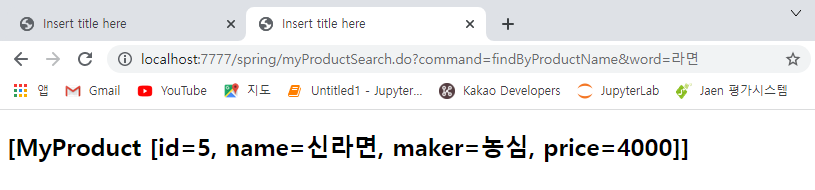

# 1124 Maven


## 1.

### 1) 

> sp03


#### web.xml

```xml
<?xml version="1.0" encoding="UTF-8"?>
<web-app version="2.5" xmlns="http://java.sun.com/xml/ns/javaee"
	xmlns:xsi="http://www.w3.org/2001/XMLSchema-instance"
	xsi:schemaLocation="http://java.sun.com/xml/ns/javaee https://java.sun.com/xml/ns/javaee/web-app_2_5.xsd">

	<servlet>
		<servlet-name>dispatcher</servlet-name>
		<servlet-class>org.springframework.web.servlet.DispatcherServlet</servlet-class>
		<init-param>
			<param-name>contextConfigLocation</param-name>
			<param-value>classpath:beans/beanconf.xml</param-value>
		</init-param>
		<load-on-startup>1</load-on-startup>
	</servlet>
		
	<servlet-mapping>
		<servlet-name>dispatcher</servlet-name>
		<url-pattern>*.do</url-pattern>
	</servlet-mapping>

	<!-- 한글처리 -->
	<filter>
		<filter-name>encodingFilter</filter-name>
		<filter-class>org.springframework.web.filter.CharacterEncodingFilter</filter-class>
		<init-param>
			<param-name>encoding</param-name>
			<param-value>utf-8</param-value>
		</init-param>
	</filter>
	<filter-mapping>
		<filter-name>encodingFilter</filter-name>
		<url-pattern>/*</url-pattern>
	</filter-mapping>
</web-app>
```


#### beanconf.xml

* /src/main/resources/beans/beanconf.xml

```xml
<?xml version="1.0" encoding="UTF-8"?>
<beans xmlns="http://www.springframework.org/schema/beans"
	xmlns:xsi="http://www.w3.org/2001/XMLSchema-instance"
	xmlns:context="http://www.springframework.org/schema/context"
	xsi:schemaLocation="http://www.springframework.org/schema/beans http://www.springframework.org/schema/beans/spring-beans.xsd
		http://www.springframework.org/schema/context http://www.springframework.org/schema/context/spring-context-3.1.xsd">

	<!-- API, 사용자 정의 Bean -->
	<!-- InternalResourceViewResolver는 여기서 생략...prefix, suffix 내용이 코드에 있다. -->
	<bean name="/form.do" class="com.edu.spring.controller.FormController"/>
	
	
	<!-- Annotation 에서는 반드시 이 부분을 추가해야한다. -->
<context:component-scan base-package="com.edu.spring.controller"/>
</beans>
```


#### form.html

```html
<!DOCTYPE html>
<html>
<head>
<meta charset="UTF-8">
<title>Insert title here</title>
</head>
<body>
<h2>Spring MVC Form...</h2>
<form action="form.do" method="post">
	NAME <input type="text" name="name"><br><br>
	ADDR <input type="text" name="addr"><br><br>
	<input type="submit" value="SEND">
	<input type="reset" value="CLEAR">
</form>
<hr>
<a href="anno.do">Annotation Controller 연결하기</a>
</body>
</html>
```


#### AnnoController.java

```java
package com.edu.spring.controller;

import org.springframework.stereotype.Controller;
import org.springframework.web.bind.annotation.RequestMapping;
import org.springframework.web.bind.annotation.RequestMethod;
/*
 * Annotation을 사용하면 인터페이스 상속받을 필요가 없다.
 * 오버라이딩 method가 없어진다.
 * 
 * anno.do라는 요청이 들어왔을때...어떤 메소드에서 요청을 작성해야 하는지를 알 수 없게 된다.
 * 메소드명은 사용자가 알아서 정하면 된다.
 */
import org.springframework.web.servlet.ModelAndView;
@Controller
public class AnnoController {	//인터페이스 상속 받을 필요가 없다.
	
	//anno.do라는 요청이 들어오면...annoExecute()를 호출해서 실행시켜라...
	//@RequestMapping("anno.do")
	@RequestMapping(value = "anno.do", method = RequestMethod.GET)
	public ModelAndView annoExecute() {
		return new ModelAndView("WEB-INF/views/anno_result.jsp","message","Annotation Controller");
	}

}
```


#### FormController.java

```java
package com.edu.spring.controller;

import javax.servlet.http.HttpServletRequest;
import javax.servlet.http.HttpServletResponse;

import org.springframework.web.servlet.ModelAndView;
import org.springframework.web.servlet.mvc.Controller;

public class FormController implements Controller {

	@Override
	public ModelAndView handleRequest(HttpServletRequest request, HttpServletResponse response) throws Exception {
		/*
		 * 폼값 받아서
		 * vo 생성
		 * DAO 리턴받아서
		 * Biz로직 메소드 호출
		 * 리턴되는 값 바인딩
		 * 네비게이션
		 */
		String name  = request.getParameter("name");
		String addr = request.getParameter("addr");
		//InternalResuouceViewResolver
		/*
		 * 1. 
		 * info라는 이름으로
		 * ServletRequest Attribute에 이름과 주소를 바인딩함.
		 * 
		 * 2.
		 * /WEB_INF/views폴더 아래에
		 * form_result.jsp 결과 페이지로
		 * 기본 이동(forward)한다.
		 */
		return new ModelAndView("/WEB-INF/views/form_result.jsp", "info", name+"님의 주소는 "+addr);
	}

}
```


#### anno_result.jsp

```jsp
<%@ page language="java" contentType="text/html; charset=UTF-8"
    pageEncoding="UTF-8"%>
<!DOCTYPE html>
<html>
<head>
<meta charset="UTF-8">
<title>Insert title here</title>
</head>
<body>
<h3>${message}</h3>
</body>
</html>
```


#### form_result.jsp

```jsp
<%@ page language="java" contentType="text/html; charset=UTF-8"
    pageEncoding="UTF-8"%>
<!DOCTYPE html>
<html>
<head>
<meta charset="UTF-8">
<title>Insert title here</title>
</head>
<body>
<h3>${info}</h3>
</body>
</html>
```


### 2) sp02 수정해보기

> sp04에 작성


#### web.xml

* 한글처리, 설정문서 경로 변경

```xml
<?xml version="1.0" encoding="UTF-8"?>
<web-app xmlns:xsi="http://www.w3.org/2001/XMLSchema-instance" xmlns="http://java.sun.com/xml/ns/javaee" xsi:schemaLocation="http://java.sun.com/xml/ns/javaee https://java.sun.com/xml/ns/javaee/web-app_2_5.xsd" version="2.5">
  <servlet>
    <servlet-name>dispatcher</servlet-name>
    <servlet-class>org.springframework.web.servlet.DispatcherServlet</servlet-class>
    <init-param>
      <param-name>contextConfigLocation</param-name>
      <param-value>classpath:config/beans.xml</param-value>
    </init-param>
    <load-on-startup>1</load-on-startup>
  </servlet>
  <servlet-mapping>
    <servlet-name>dispatcher</servlet-name>
    <url-pattern>*.do</url-pattern>
  </servlet-mapping>
  <filter>
    <filter-name>encodingFilter</filter-name>
    <filter-class>org.springframework.web.filter.CharacterEncodingFilter</filter-class>
    <init-param>
      <param-name>encoding</param-name>
      <param-value>utf-8</param-value>
    </init-param>
  </filter>
  <filter-mapping>
    <filter-name>encodingFilter</filter-name>
    <url-pattern>/*</url-pattern>
  </filter-mapping>
</web-app>
```


#### beans.xml

* dispatcher-servlet.xml 내용 옮기고 context:component 부분 추가

```xml
<?xml version="1.0" encoding="UTF-8"?>
<beans xmlns="http://www.springframework.org/schema/beans"
	xmlns:xsi="http://www.w3.org/2001/XMLSchema-instance"
	xmlns:context="http://www.springframework.org/schema/context"
	xsi:schemaLocation="http://www.springframework.org/schema/beans http://www.springframework.org/schema/beans/spring-beans.xsd
		http://www.springframework.org/schema/context http://www.springframework.org/schema/context/spring-context-3.1.xsd">

	<!-- API, 사용자 정의 Bean -->
	
	<!-- 결과 페이지의 위치와 확장자 정보를 가지고 있는 API bean :: InternalResourceViewResolver -->
	<bean id="viewResolver" class="org.springframework.web.servlet.view.InternalResourceViewResolver">
		<property name="prefix" value="/WEB-INF/results/" /> <!-- 결과 페이지의 물리적인 저장 위치 -->
		<property name="suffix" value=".jsp" /> <!-- 결과 페이지의 확장자 -->
	</bean>
	
	<!-- 사용자 정의 Bean 등록 name 속성값으로는 어떤 요청이 들어왔을 때 ControllerFactory가 생성해주는 Component인지를 등록 -->
	<bean name="/main.do" class="com.edu.spring.controller.MainController"></bean>
	
	
	
	<!-- Annotation 에서는 반드시 이 부분을 추가해야한다. -->
	<context:component-scan base-package="com.edu.spring.controller"/>
		
</beans>
```


#### MainController

* annotation으로 overriding 삭제

```java
package com.edu.spring.controller;

import org.springframework.stereotype.Controller;
import org.springframework.web.bind.annotation.RequestMapping;
import org.springframework.web.servlet.ModelAndView;

public class MainController{
	
	@RequestMapping("main.do")
	public ModelAndView main() {
		return new ModelAndView("result", "info", "MainController...execute !!");
	}
}
```


* 결과 sp02랑 똑같이 나옴 !!


## 2. 

### 0) 프로젝트 진행 순서

1. 프로젝트 착수
   1. 아키텍처
   2. Software / Hardware
   3. 기술 Set
   4. 일정 (WBS)

2. 분석 및 설계
   1. 요구사항 시나리오
   2. 요구사항 명세서(SRS)
   3. Usecase Diagram
      1.  화면설계
      2. DB 모델링 : 
         1. 개념설계
            1. Entity 추출 -> table
         2. 논리설계
            1. Entity 속성 - 기본 key, 일반 key
            2. 정규화...
         3. 물리설계
            1. 실제 테이블 생성 -> 구현으로 연결
      3. Template : 기능 설정
3. 구현
   1. Table 구축
   2. vo 작성
   3. DAO


* 앞으로 할 단계는 구현...

----------------------

### 1) DB Table 구축

#### Command

* Table 생성

```
mysql> use scott;
Database changed
mysql> CREATE TABLE myproduct(
    -> id int(10) auto_increment primary key,
    -> name varchar(30),
    -> maker varchar(30),
    -> price int(10));
Query OK, 0 rows affected (0.05 sec)
```

* 데이터 생성

```
mysql> INSERT INTO myproduct (name, maker, price) VALUES('통돌이 세탁기','대우',450000);
Query OK, 1 row affected (0.01 sec)

mysql> INSERT INTO myproduct (name, maker, price) VALUES('드럼울세탁 세탁기', '대우',550000);
Query OK, 1 row affected (0.00 sec)

mysql> SELECT * FROM myproduct;
+----+-------------------+-------+--------+
| id | name              | maker | price  |
+----+-------------------+-------+--------+
|  1 | 통돌이 세탁기     | 대우  | 450000 |
|  2 | 드럼울세탁 세탁기 | 대우  | 550000 |
+----+-------------------+-------+--------+
2 rows in set (0.00 sec)
```


### 2) VO 작성

#### MyProduct.java

* Encapsulation
* 컬럼명과 필드명 똑같이 생성
* 기본 생성자/ 명시적 생성자 / setter 및 getter / toString

```java
package com.edu.spring.domain;

public class MyProduct {
	
	//Encapsulation으로 필드 생성 - 컬럼명과 동일하게
	private int id;
	private String name;
	private String maker;
	private int price;
	
	//기본 생성자
	public MyProduct() {
	}

	//명시적 생성자
	public MyProduct(int id, String name, String maker, int price) {
		super();
		this.id = id;
		this.name = name;
		this.maker = maker;
		this.price = price;
	}
	
	//생성자 오버로딩
	public MyProduct(String name, String maker, int price) {
		this.name = name;
		this.maker = maker;
		this.price = price;
	}

	//setter / getter
	public int getId() {
		return id;
	}

	public void setId(int id) {
		this.id = id;
	}

	public String getName() {
		return name;
	}

	public void setName(String name) {
		this.name = name;
	}

	public String getMaker() {
		return maker;
	}

	public void setMaker(String maker) {
		this.maker = maker;
	}

	public int getPrice() {
		return price;
	}

	public void setPrice(int price) {
		this.price = price;
	}

	//toString
	@Override
	public String toString() {
		return "MyProduct [id=" + id + ", name=" + name + ", maker=" + maker + ", price=" + price + "]";
	}	
}
```


#### SqlMapConfig.xml

```xml
<?xml version="1.0" encoding="UTF-8" ?>
<!DOCTYPE configuration PUBLIC "-//mybatis.org//DTD Config 3.0//EN"
   "http://mybatis.org/dtd/mybatis-3-config.dtd">
<configuration>

   <!-- 1. db정보를 가지고 온다. -->
   <properties resource="config/dbconn.properties"/>
   
   <!-- Snake Case를 일반적으로 사용되는 Camel Case로 자동치환되어 인식이 가능 -->
   <settings>
   		<setting name="mapUnderscoreToCamelCase" value="true"/>
   </settings>
   
   <!-- 2. vo를 alias.... -->
   <typeAliases>
      <package name="com.edu.spring.domain"/> <!-- 자동으로 alias : myProduct -->
   </typeAliases>
   
   <!-- 3. jdbc 환경 구축 -->
   <!-- 단위 테스트용...MyBatisFramework를 위한...DI와 연결하기 전의... -->
   <environments default="mulcam">
      <environment id="mulcam" >
         <transactionManager type="JDBC"/>
         <dataSource type="UNPOOLED"> <!-- 단위 테스트할 때는  UNPOOLED -->
            <property name="driver" value="${jdbc.mysql.driver}"/>
            <property name="url" value="${jdbc.mysql.url}"/>
            <property name="username" value="${jdbc.mysql.username}"/>
            <property name="password" value="${jdbc.mysql.password}"/>
         
         </dataSource>
      </environment>
   </environments>
   
   <!--4. sql mapper -->
   <mappers>
      <mapper resource="sql/mybatis-myproduct-mapping.xml"/>
   </mappers>
   
</configuration>
```


#### mybatis-myproduct-mapping.xml

```XML
<?xml version="1.0" encoding="UTF-8" ?>
<!DOCTYPE mapper PUBLIC "-//mybatis.org//DTD Mapper 3.0//EN"
	"http://mybatis.org/dtd/mybatis-3-mapper.dtd">

<!-- 
	1) 상품 등록
	2) 등록된 모든 상품 정보를 검색
	3) 특정한 상품명이 들어가는 제품 검색
	   like %, _
	4) 제조사별 검색
	   like %, _
	5) 제품 정보 수정
	
	 -->
<mapper namespace="ns.sql.MyProductMapper">

	<!-- 상품 등록 -->
	<insert id="addProduct" parameterType="myproduct">
		INSERT INTO 
		myproduct (name, maker, price) 
		VALUES (#{name}, #{maker}, #{price})
		
	</insert>
	
	<!-- SELECT문 -->
	<sql id ="select-myproduct">
		SELECT id, name, maker, price
		FROM myproduct
	</sql>
	
	<!-- 등록된 모든 상품 정보를 검색 -->
	<select id="findProducts" resultType="myProduct" parameterType="string">
		<include refid="select-myproduct"/>
	</select>
	
	<!-- 특정한 상품명이 들어가는 제품 검색 -->
	<select id="findProductByName" resultType="myProduct" parameterType="string">
		<include refid="select-myproduct"/>
			WHERE name LIKE '%' #{VALUE} '%'
			<!-- WHERE name LIKE '%${VALUE}%' -->
	</select>
	
	<!-- 제조사별 검색 -->
	<select id="findProductByMaker" resultType="myProduct" parameterType="string">
		<include refid="select-myproduct"/>
			WHERE maker LIKE #{VALUE}
	</select>
	
	<!-- 제품 정보 수정 -->
	<update id="updateProduct" parameterType="myproduct">
		UPDATE myproduct
		SET name=#{name}, maker=#{maker}, price=#{price}
		WHERE ID=#{id}
	</update>
</mapper>
```


#### Maven Repository에서 dependency 받아오기

* https://mvnrepository.com/search?q=mybatis


[MyBatis 3.4.6](https://mvnrepository.com/artifact/org.mybatis/mybatis/3.4.6)

```
<!-- https://mvnrepository.com/artifact/org.mybatis/mybatis -->
<dependency>
    <groupId>org.mybatis</groupId>
    <artifactId>mybatis</artifactId>
    <version>3.4.6</version>
</dependency>
```

 [MyBatis Spring 1.3.2](https://mvnrepository.com/artifact/org.mybatis/mybatis-spring/1.3.2)

```
<!-- https://mvnrepository.com/artifact/org.mybatis/mybatis-spring -->
<dependency>
    <groupId>org.mybatis</groupId>
    <artifactId>mybatis-spring</artifactId>
    <version>1.3.2</version>
</dependency>
```

나머지도... 시간상 skip !


#### pom.xml

* dependency 추가

```xml
		<!-- 1. mybatis -->
		<dependency>
		    <groupId>org.mybatis</groupId>
		    <artifactId>mybatis</artifactId>
		    <version>3.4.6</version>
		</dependency>
		
		<!-- 2. mybatis-spring -->
		<dependency>
		    <groupId>org.mybatis</groupId>
		    <artifactId>mybatis-spring</artifactId>
		    <version>1.3.2</version>
		</dependency>
		
		<!-- 3. spring-jdbc -->
		<dependency>
		    <groupId>org.springframework</groupId>
		    <artifactId>spring-jdbc</artifactId>
		    <version>5.1.3.RELEASE</version>
		</dependency>
		
		<!-- 4. spring-tx -->
		<dependency>
		    <groupId>org.springframework</groupId>
		    <artifactId>spring-tx</artifactId>
		    <version>5.1.3.RELEASE</version>
		</dependency>
		
		<!-- 5. commons-dbcp -->
		<dependency>
		    <groupId>commons-dbcp</groupId>
		    <artifactId>commons-dbcp</artifactId>
		    <version>1.4</version>
		</dependency>
		
		<!-- 6. commons-pool2 -->
		<dependency>
		    <groupId>org.apache.commons</groupId>
		    <artifactId>commons-pool2</artifactId>
		    <version>2.6.0</version>
		</dependency>
		
		<!-- 7. mysql-connector-java -->
		<dependency>
		    <groupId>mysql</groupId>
		    <artifactId>mysql-connector-java</artifactId>
		    <version>8.0.15</version>
		</dependency>
```


#### MyBatisUnitTestApp.java

```java
package com.edu.spring.test;

import java.io.Reader;
import java.util.List;

import org.apache.ibatis.io.Resources;
import org.apache.ibatis.session.SqlSession;
import org.apache.ibatis.session.SqlSessionFactory;
import org.apache.ibatis.session.SqlSessionFactoryBuilder;

import com.edu.spring.domain.MyProduct;

public class MyBatisUnitTestApp {
	public static void main(String[] args) throws Exception{
		Reader r=Resources.getResourceAsReader("config/SqlMapConfig.xml");
		SqlSessionFactory factory = new SqlSessionFactoryBuilder().build(r);
		
		SqlSession session = factory.openSession();
		
		System.out.println("============== 1. addProduct =====================");
		MyProduct vo = new MyProduct("초코파이","오리온",1000);
		int result = session.insert("ns.sql.MyProductMapper.addProduct", vo);	//namespace.id
		session.commit(); //단위테스트...commit 반드시!
		System.out.println(result+"개의 상품이 추가되었습니다.");
		 
		
		System.out.println("============== 2. findProducts =====================");
		List<MyProduct> list = session.selectList("ns.sql.MyProductMapper.findProducts");
		for(MyProduct pro : list) System.out.println(pro);
      
		System.out.println("============== 3. findProductByName =====================");
		List<MyProduct> list2 = session.selectList("ns.sql.MyProductMapper.findProductByName","세탁기");
     	for(MyProduct pro : list2) System.out.println(pro);
		
	}
}
```

```
============== 1. addProduct =====================
1개의 상품이 추가되었습니다.
============== 2. findProducts =====================
MyProduct [id=1, name=통돌이 세탁기, maker=대우, price=450000]
MyProduct [id=2, name=드럼울세탁 세탁기, maker=대우, price=550000]
MyProduct [id=3, name=초코파이, maker=오리온, price=1000]
============== 3. findProductByName =====================
MyProduct [id=1, name=통돌이 세탁기, maker=대우, price=450000]
MyProduct [id=2, name=드럼울세탁 세탁기, maker=대우, price=550000]
```


### 3) Persistance Layer

> @Repository

#### MyProductDAO.java

```java
package com.edu.spring.model;

import java.util.List;

import com.edu.spring.domain.MyProduct;

/*
 * 비즈니스 로직 5개
 * 비즈니스 로직의 이름...mapping.xml의 id 이름과 동일하게 정의한다.
 */
public interface MyProductDAO {
	int addProduct(MyProduct vo) throws Exception;
	List<MyProduct> findProducts() throws Exception;
	List<MyProduct> findProductByName(String name) throws Exception;
	List<MyProduct> findProductByMaker(String maker) throws Exception;

}

```


#### MyProductDAOImpl.java

```java
package com.edu.spring.model;

import java.util.List;

import org.apache.ibatis.session.SqlSession;
import org.springframework.beans.factory.annotation.Autowired;
import org.springframework.stereotype.Repository;

import com.edu.spring.domain.MyProduct;

/*
 * Persistance Layer Bean --> @Component < @Repository
 */

@Repository
public class MyProductDAOImpl implements MyProductDAO{
	
	@Autowired
	private SqlSession sqlSession;
	
	private final static String NS = "ns.sql.MyproductMapper";

	@Override
	public int addProduct(MyProduct vo) throws Exception {
		int result=sqlSession.insert(NS+".addProduct", vo);
		return result;
	}

	@Override
	public List<MyProduct> findProducts() throws Exception {
		return sqlSession.selectList(NS+".findProducts");
	}

	@Override
	public List<MyProduct> findProductByName(String name) throws Exception {		
		return sqlSession.selectList(NS+".findProductByName",name);
	}
	
	@Override
	public List<MyProduct> findProductByMaker(String maker) throws Exception {		
		return sqlSession.selectList(NS+".findProductByMaker",maker);
	}
	

}

```


### 4) Service Layer

> @Service

#### MyProductService.java

```java
package com.edu.spring.model;

import java.util.List;

import com.edu.spring.domain.MyProduct;

public interface MyProductService {
	int addProduct(MyProduct vo) throws Exception;
	List<MyProduct> findProducts() throws Exception;
	List<MyProduct> findProductByName(String name) throws Exception;
	List<MyProduct> findProductByMaker(String maker) throws Exception;
}
```


#### MyProductServiceImpl.java

```java
package com.edu.spring.model;

/*
 * data 가공과 관련있는 레이어
 * 주로 Service Layer에서 트랜잭션 처리를 한다.
 */
import java.util.List;

import org.springframework.beans.factory.annotation.Autowired;
import org.springframework.stereotype.Service;
import org.springframework.transaction.annotation.Transactional;

import com.edu.spring.domain.MyProduct;

@Service
@Transactional
public class MyProductServiceImpl implements MyProductService{
	
	@Autowired
	private MyProductDAO myproductDAO;

	@Transactional
	@Override
	public int addProduct(MyProduct vo) throws Exception {
		int result=myproductDAO.addProduct(vo);
		return result;
	}

	@Override
	public List<MyProduct> findProducts() throws Exception {
		return myproductDAO.findProducts();
	}

	@Override
	public List<MyProduct> findProductByName(String name) throws Exception {
		return myproductDAO.findProductByName(name);
	}

	@Override
	public List<MyProduct> findProductByMaker(String maker) throws Exception {
		return myproductDAO.findProductByMaker(maker);
	}

}
```


#### 트랜잭션 (Transaction)

* 처리 단위
  * `@Transactional`
  * service layer에서..!
* ACID : 
  * 원자성(Atomicity), 일관성(Consistency), 고립성(Isolation), 영구성(Durability)


* 예시) 고현정 신한은행 -> 조인성 국민은행으로 계좌이체

1. 이체 전

   1. 고현정 신한은행 계좌는 $400 -> **일관성** !
   2. 조인성 국민은행 계좌는 $100 -> **일관성** !

2. 이체할 때 사고 발생

   1. 고현정의 계좌에서는 $100 출금 ok
   2. 조인성의 계좌로는 아직 입금 x
   3.  $100 공중분해 !! -> 이를 방지하기 위해 **Transaction** 처리 필수 !!

3. Transaction

   1. 거래 행위를 트랜잭션으로 묶는다 -> **원자성** !
   2. 원자 : 더이상 쪼개질 수 없는 최소의 단위 
   3. 즉, 거래 행위를 트랜잭션으로 묶는다 = 하나의 단위 / 최소 단위로 묶는다 
   4. 중간에 사고 나면 처리 안된 것으로...

4. 처리 안되었을 경우 

   1. 롤백 (rollback) -> 시작 부분으로... 아무일도 안 일어난것으로

5. 입금 완료 되었을 경우 

   1. 내부적으로  commit -> 이체가 진행된 것으로 완료
   2. 이때 고현정의 계좌 -> $300 / 조인성 $200 으로 **일관성** !
   3. db에 저장 -> **영속성** !

   

-------------------------------------


* 여기까지가 Back의 4번까지...이제 Front로...!


### 5) Front

#### productRegister.jsp

* /src/main/webapp/productRegister.jsp

```jsp
<%@ page language="java" contentType="text/html; charset=UTF-8"
    pageEncoding="UTF-8"%>
<!DOCTYPE html>
<html>
<head>
<meta charset="UTF-8">
<title>Insert title here</title>
</head>
<body>
<h2 align="center">Product Register Form.....</h2>
<form action="myProduct.do" method="post">
상품명 : <input type="text" name="name"><br><br>
제조사 : <input type="text" name="maker"><br><br>
가  격 : <input type="text" name="price"><br><br>
<input type="submit" value="상품등록">
</form>
++++++++++++++++++++++++++++++++++++++++++++++++
<br><br>
<h3>상품명, 제조사별 검색방법을 먼저 선택하세요.</h3>
<form action="myProductSearch.do">
<select name="command">
	<option value=""====아래에서 선택하세요 ====></option>
	<option value="findByProductName">상품명으로 검색하기</option>
	<option value="findByProductMaker">제조사로 검색하기</option>
	<option value="findByProductId">상품 아이디로 검색하기</option>
</select>
<input type="text" name="word"><br><br>
<input type="submit" value="상품찾기">
</form>
</body>
</html>
```


### 6) Presentation Layer

> @Controller

#### MyProductController.java

```java
package com.edu.spring.controller;

import org.springframework.beans.factory.annotation.Autowired;
import org.springframework.stereotype.Controller;
import org.springframework.web.bind.annotation.RequestMapping;
import org.springframework.web.servlet.ModelAndView;

import com.edu.spring.domain.MyProduct;
import com.edu.spring.model.MyProductService;

@Controller
public class MyProductController {
	
	@Autowired
	private MyProductService myProductService;
	
	@RequestMapping("myProduct.do")	//myProduct.do 요청 들어오면 동작하는 메소드
	//폼에서 넘어온 값이 vo에 자동 바인딩되어 Passing Into 되어진다.
	public ModelAndView insert(MyProduct pvo) throws Exception {	
		/*
		String name=  request.getParameter("name");
		String maker=  request.getParameter("maker");
		int price=  request.getParameter("price");
		MyProduct vo = new MyProduct(name, maker, price); 	//자동 바인딩되기 때문에 필요 x
		*/
		
		myProductService.addProduct(pvo); //dao.addProduct--> sqlSession--> 디비에 insert
		
		//ServletRequest에 바인딩 되어지고 insert_result.jsp에 forward되어진다.
		return new ModelAndView("insert_result", "info", pvo);	//확장자 x
	}
}
```


#### insert_result.jsp

```jsp
<%@ page language="java" contentType="text/html; charset=UTF-8"
    pageEncoding="UTF-8"%>
<!DOCTYPE html>
<html>
<head>
<meta charset="UTF-8">
<title>Insert title here</title>
</head>
<body>
${info}

</body>
</html>
```


#### web.xml

```xml
<?xml version="1.0" encoding="UTF-8"?>
<web-app version="2.5" xmlns="http://java.sun.com/xml/ns/javaee"
	xmlns:xsi="http://www.w3.org/2001/XMLSchema-instance"
	xsi:schemaLocation="http://java.sun.com/xml/ns/javaee https://java.sun.com/xml/ns/javaee/web-app_2_5.xsd">

	<servlet>
		<servlet-name>appServlet</servlet-name>
		<servlet-class>org.springframework.web.servlet.DispatcherServlet</servlet-class>
		<init-param>
			<param-name>contextConfigLocation</param-name>
			<param-value>classpath:beans/beanconf.xml</param-value>
		</init-param>
		<load-on-startup>1</load-on-startup>
	</servlet>
		
	<servlet-mapping>
		<servlet-name>appServlet</servlet-name>
		<url-pattern>*.do</url-pattern>
	</servlet-mapping>
	
	<!-- 한글처리 -->
	<filter>
		<filter-name>encodingFilter</filter-name>
		<filter-class>org.springframework.web.filter.CharacterEncodingFilter</filter-class>
		<init-param>
			<param-name>encoding</param-name>
			<param-value>utf-8</param-value>
		</init-param>
	</filter>
	<filter-mapping>
		<filter-name>encodingFilter</filter-name>
		<url-pattern>/*</url-pattern>
	</filter-mapping>
	
</web-app>
```


#### beanconf.xml

```xml
<?xml version="1.0" encoding="UTF-8"?>
<beans xmlns="http://www.springframework.org/schema/beans"
	xmlns:xsi="http://www.w3.org/2001/XMLSchema-instance"
	xmlns:context="http://www.springframework.org/schema/context"
	xsi:schemaLocation="http://www.springframework.org/schema/beans http://www.springframework.org/schema/beans/spring-beans.xsd
		http://www.springframework.org/schema/context http://www.springframework.org/schema/context/spring-context-3.1.xsd">

	<context:property-placeholder location="classpath:config/dbconn.properties"/>
	
	<!-- 1. DataSource API Bean -->
	<bean id="dataSource" class="org.apache.commons.dbcp.BasicDataSource">
		<property name="driverClassName" value="${jdbc.mysql.driver}"/>
		<property name="url" value="${jdbc.mysql.url}"/>
		<property name="username" value="${jdbc.mysql.username}"/>
		<property name="password" value="${jdbc.mysql.password}"/>
	</bean>
	
	<!--  2. MyBatis API Bean :: SqlSessionFactoryBean-->
	<bean id="sqlSessionFactoryBean" class="org.mybatis.spring.SqlSessionFactoryBean">
		<property name="configLocation" value="classpath:config/SqlMapConfig.xml"/>
		<property name="dataSource" ref="dataSource"/>
	</bean>
	
	<!--  3. MyBatis API Bean :: SqlSession-->
	<bean id="sqlSession" class="org.mybatis.spring.SqlSessionTemplate">
		<!--  생성자 주입-->
		<constructor-arg ref="sqlSessionFactoryBean"/>
	</bean>
	
	<!-- 4. InternalResourceViewResolver API bean -->
	<bean id="viewResolver" class="org.springframework.web.servlet.view.InternalResourceViewResolver">
		<property name="prefix" value="/WEB-INF/views/"/> <!--  결과페이지의 물리적인 저장 위치-->
		<property name="suffix" value=".jsp"/> <!-- 결과 페이지의 확장자 등록 -->
	</bean>

	
	<!-- Annotation에서는 반드시 이 부분을 추가해야한다. -->
	<context:component-scan base-package="com.edu.spring.controller, com.edu.spring.model"/>
	
</beans>
```


#### 여기서 id는 왜 0일까?


하나의 Row와 vo가 동기화 되지 않았음

id는 DB Table에서 만들어짐 - 하나의 로우 인스턴스화 시킨 것이 vo -> 동기화 안됨 !

동기화 위해서는 db의 id를 받아서 vo에 꽂아넣는 selecting을 한번 더 해야 한다 !


화면으로부터 받은 폼값을 가지고 vo가 생성됨

* 이때 id값은 들어있지 않다...기본 값인 0을 가지고 있다...나머지 값은 에어컨, 삼성, 3000000
* vo를 DB에 insert시키면 DB에서 id값은 자동 증가되어 4가 되어져 있다

결론 : 

* vo의 데이터와 DB 테이블의 row가 동기화/일치되지 않는 상황이 이럴 때 발생한다

정리 : 

* INSERT문에서 발생하는 문제...데이터 추가할 때 DB에서 자동증가하는 값이 하필 PK일 때 발생하는 문제이다

해결책 : 

* useGeneratedKeys="true" keyProperty="id" 추가


#### mybatis-myproduct-mapping.xml

```xml
<?xml version="1.0" encoding="UTF-8" ?>
<!DOCTYPE mapper PUBLIC "-//mybatis.org//DTD Mapper 3.0//EN"
	"http://mybatis.org/dtd/mybatis-3-mapper.dtd">

<!-- 
	1) 상품 등록
	2) 등록된 모든 상품 정보를 검색
	3) 특정한 상품명이 들어가는 제품 검색
	   like %, _
	4) 제조사별 검색
	   like %, _
	5) 제품 정보 수정
	
	 -->
<mapper namespace="ns.sql.MyProductMapper">
	<!-- 화면으로부터 받은 폼값을 가지고 vo가 생성됨
		 (이때 id값은 들어있지 않다...기본 값인 0을 가지고 있다...
		     나머지 값은 에어컨, 삼성, 3000000
		  vo를 DB에 insert시키면 DB에서 id값은 자동 증가되어 4가 되어져 있다
		  
		  결론 :
		  vo의 데이터와 DB 테이블의 row가 동기화/일치되지 않는 상황이 이럴 때 발생한다
		  
		  정리:
		  INSERT문에서 발생하는 문제...데이터 추가할 때
		  DB에서 자동증가하는 값이 하필 PK일 때 발생하는 문제이다
		  
		  해결책:
		  useGeneratedKeys="true" keyProperty="id" 추가
		   -->

	<!-- 상품 등록 -->
	<insert id="addProduct" parameterType="myproduct" useGeneratedKeys="true" keyProperty="id">
		INSERT INTO 
		myproduct (name, maker, price) 
		VALUES (#{name}, #{maker}, #{price})
		
	</insert>
	
	<!-- SELECT문 -->
	<sql id ="select-myproduct">
		SELECT id, name, maker, price
		FROM myproduct
	</sql>
	
	<!-- 등록된 모든 상품 정보를 검색 -->
	<select id="findProducts" resultType="myProduct" parameterType="string">
		<include refid="select-myproduct"/>
	</select>
	
	<!-- 특정한 상품명이 들어가는 제품 검색 -->
	<select id="findProductByName" resultType="myProduct" parameterType="string">
		<include refid="select-myproduct"/>
			WHERE name LIKE '%' #{VALUE} '%'
			<!-- WHERE name LIKE '%${VALUE}%' -->
	</select>
	
	<!-- 제조사별 검색 -->
	<select id="findProductByMaker" resultType="myProduct" parameterType="string">
		<include refid="select-myproduct"/>
			WHERE maker LIKE #{VALUE}
	</select>
	
	<!-- 제품 정보 수정 -->
	<update id="updateProduct" parameterType="myproduct">
		UPDATE myproduct
		SET name=#{name}, maker=#{maker}, price=#{price}
		WHERE ID=#{id}
	</update>
</mapper>
```


#### MyProductController.java

```java
package com.edu.spring.controller;

import org.springframework.beans.factory.annotation.Autowired;
import org.springframework.stereotype.Controller;
import org.springframework.web.bind.annotation.RequestMapping;
import org.springframework.web.servlet.ModelAndView;

import com.edu.spring.domain.MyProduct;
import com.edu.spring.model.MyProductService;

@Controller
public class MyProductController {
	
	@Autowired
	private MyProductService myProductService;
	
	@RequestMapping("myProduct.do")	//myProduct.do 요청 들어오면 동작하는 메소드
	//폼에서 넘어온 값이 vo에 자동 바인딩되어 Passing Into 되어진다.
	public ModelAndView insert(MyProduct pvo) throws Exception {	
		/*
		String name=  request.getParameter("name");
		String maker=  request.getParameter("maker");
		int price=  request.getParameter("price");
		MyProduct vo = new MyProduct(name, maker, price); 	//자동 바인딩되기 때문에 필요 x
		*/
		
		System.out.println("DB 입력하기 전..."+pvo.getId());
		myProductService.addProduct(pvo); //dao.addProduct--> sqlSession--> 디비에 insert
		System.out.println("DB 입력한 후..."+pvo.getId());
		
		//ServletRequest에 바인딩 되어지고 insert_result.jsp에 forward되어진다.
		return new ModelAndView("insert_result", "info", pvo);	//확장자 x
	}
}
```

```
DB 입력하기 전...0
DB 입력한 후...5
```


#### MyProductController.java

```java
package com.edu.spring.controller;

import java.util.List;

import org.springframework.beans.factory.annotation.Autowired;
import org.springframework.stereotype.Controller;
import org.springframework.web.bind.annotation.RequestMapping;
import org.springframework.web.servlet.ModelAndView;

import com.edu.spring.domain.MyProduct;
import com.edu.spring.model.MyProductService;

@Controller
public class MyProductController {
	
	@Autowired
	private MyProductService myProductService;
	
	@RequestMapping("myProduct.do")	//myProduct.do 요청 들어오면 동작하는 메소드
	//폼에서 넘어온 값이 vo에 자동 바인딩되어 Passing Into 되어진다.
	public ModelAndView insert(MyProduct pvo) throws Exception {	
		/*
		String name=  request.getParameter("name");
		String maker=  request.getParameter("maker");
		int price=  request.getParameter("price");
		MyProduct vo = new MyProduct(name, maker, price); 	//자동 바인딩되기 때문에 필요 x
		*/
		
		System.out.println("DB 입력하기 전..."+pvo.getId());
		myProductService.addProduct(pvo); //dao.addProduct--> sqlSession--> 디비에 insert
		System.out.println("DB 입력한 후..."+pvo.getId());
		
		//ServletRequest에 바인딩 되어지고 insert_result.jsp에 forward되어진다.
		return new ModelAndView("insert_result", "info", pvo);	//확장자 x
		
		}
	@RequestMapping("myProductSearch.do")
	public ModelAndView search(String word, String command) throws Exception {
		ModelAndView mv = null;
		if(command.equals("findByProductName")) {
			List<MyProduct> list = myProductService.findProductByName(word);
			mv = new ModelAndView("find_result", "list", list);
		}
		
		return mv;
	}
}
```


#### find_result.jsp

```jsp
<%@ page language="java" contentType="text/html; charset=UTF-8"
    pageEncoding="UTF-8"%>
<!DOCTYPE html>
<html>
<head>
<meta charset="UTF-8">
<title>Insert title here</title>
</head>
<body>
<h2>${list}</h2>

</body>
</html>
```


