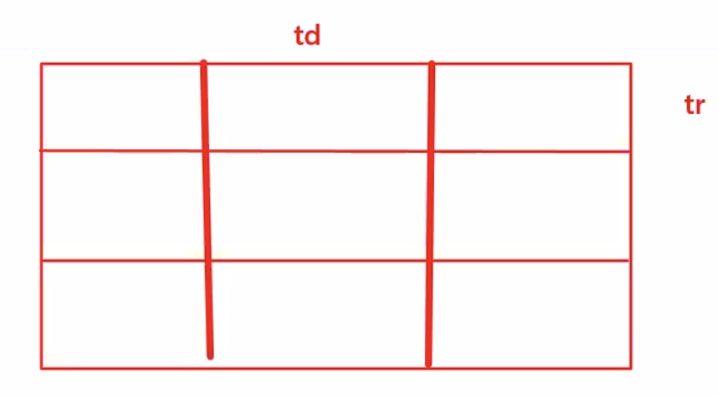
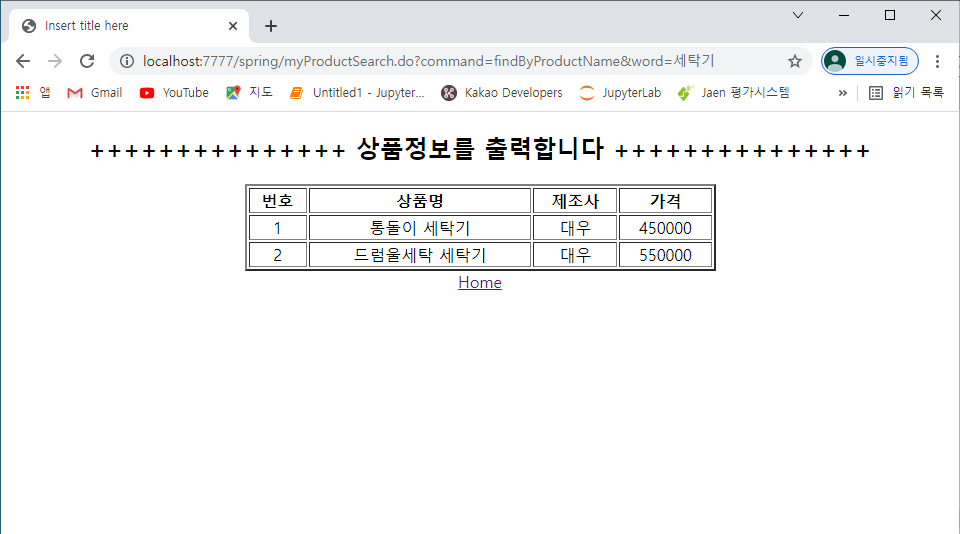
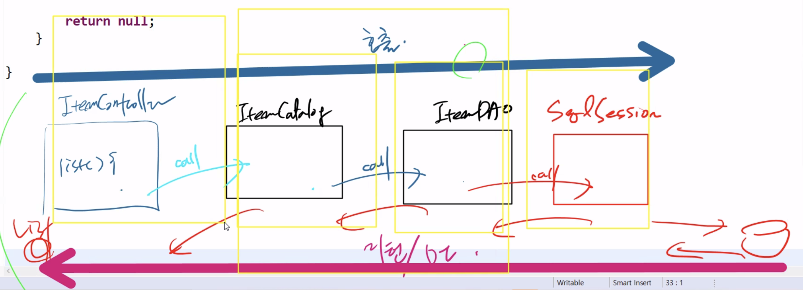

# 1125 Maven


## 1. 정리

Java spec 기술

* J2SE - Java, JDBC 
  * -> JDK 설치만으로 충분 -> JVM에서 실행
  * main x -> UnitTest, Junit

* J2EE - Web
  * 서버에서 servlet... -> JVM x, Container
  * -> JDK + WAS
  * MVC -> FC -> FM
  * DI, MyBatis, SpringMVC
  * 요청들어오기전에 WAS 가동 -> WEB.XML 읽어서 설정문서랑 연결 
  * -> DI Container가 bean 생성
    * Container 종류 : 원래 Bean Factory...-> Application Context : preloading
    * -> WebApplication Container :  WAS랑 연결


## 2. find 마무리


1. UnitTest

   MyBatistFramework

   * myproduct / mapping / db -> sqlMy...
   * -> sqlSessionFactory -> sqlSession

2. Persistence Layer
   1. MyProductDAOImpl
   2. 
3. Service Layer
   1. MyProductService
4. Presentation Layer
   1. D.S -> HandlerMapping
   2. MyProductController


#### MyProductController.java

* findByProductMaker 추가

```java
package com.edu.spring.controller;

import java.util.List;

import org.springframework.beans.factory.annotation.Autowired;
import org.springframework.stereotype.Controller;
import org.springframework.web.bind.annotation.RequestMapping;
import org.springframework.web.servlet.ModelAndView;

import com.edu.spring.domain.MyProduct;
import com.edu.spring.model.MyProductService;

@Controller
public class MyProductController {
	
	@Autowired
	private MyProductService myProductService;
	
	@RequestMapping("myProduct.do")	//myProduct.do 요청 들어오면 동작하는 메소드
	//폼에서 넘어온 값이 vo에 자동 바인딩되어 Passing Into 되어진다.
	public ModelAndView insert(MyProduct pvo) throws Exception {	
		/*
		String name=  request.getParameter("name");
		String maker=  request.getParameter("maker");
		int price=  request.getParameter("price");
		MyProduct vo = new MyProduct(name, maker, price); 	//자동 바인딩되기 때문에 필요 x
		*/
		
		System.out.println("DB 입력하기 전..."+pvo.getId());
		myProductService.addProduct(pvo); //dao.addProduct--> sqlSession--> 디비에 insert
		System.out.println("DB 입력한 후..."+pvo.getId());
		
		//ServletRequest에 바인딩 되어지고 insert_result.jsp에 forward되어진다.
		return new ModelAndView("insert_result", "info", pvo);	//확장자 x
		
		}
	@RequestMapping("myProductSearch.do")
	public ModelAndView search(String word, String command) throws Exception {
		ModelAndView mv = null;
		List<MyProduct> list = null;
		String viewName = "";
		
		if(command.equals("findByProductName")) {
			list = myProductService.findProductByName(word);
//			mv = new ModelAndView("find_result", "list", list);
			viewName = "find_result";
		}else if(command.equals("findByProductMaker")) {
			list = myProductService.findProductByMaker(word);
//			mv = new ModelAndView("find_result", "list", list);
			viewName = "find_result";
		}
		
//		return mv;
		return new ModelAndView(viewName,"list",list);

	}

}
```


#### find_result.jsp

* td 는 가로 / tr 은 세로



```jsp
<%@ page language="java" contentType="text/html; charset=UTF-8"
    pageEncoding="UTF-8"%>
<!-- jstl 사용해야 함. for each 
	 1) jar 2개 2) taglib -->

<%@ taglib prefix="c" uri="http://java.sun.com/jsp/jstl/core" %>
<!DOCTYPE html>
<html>
<head>
<style type="text/css">
	td, h2{text-align:center;}
</style>
<meta charset="UTF-8">
<title>Insert title here</title>
</head>
<body>
<h2>+++++++++++++++ 상품정보를 출력합니다 +++++++++++++++</h2>
<table border="2" align="center" width="50%">
	<thead>
		<th>번호</th><th>상품명</th><th>제조사</th><th>가격</th>
	</thead>
	<tbody>
		<c:forEach items="${list}" var="vo">
			<tr>
				<td>${vo.id}</td>
				<td>${vo.name}</td>
				<td>${vo.maker}</td>
				<td>${vo.price}</td>
			</tr>
		</c:forEach>
	</tbody>

</table>
<center><a href="productRegister.jsp">Home</a></center>
</body>
</html>
```





3 Tier


빨간색 - 내가 만든 bean x -> annotation 불가


WAS는 D.D 파일 먼저 : web.xml 읽어들임

1. ServletContext 생성

2. Dispather Servlet 생성
3. bean 설정문서 wiring

bean 설정문서 2개 생성

* Presentation Layer / Business Layer (Service,Persistence) / MyBatisFramework 다 bean 가지고 있음
* 두 부분으로 분리 !
  * Presentation bean 
  * 그외 Business Logic bean 
* Business Logic bean 먼저 생성 후 와이어링
* 그 다음 Presentation bean 생성 후 와이어링

이말은? 

* was : d.d읽어서 객체 만들고 설정문서 와이어링

* di container : bean 설정문서 읽어서 bean 생성 
* was위에 di container
* 설정문서의 모듈화..!! 기준은 ? 레이어!


현업에서는 도메인 기준....왜? bean이 많으니까


## 3. 설정문서 모듈화

서블릿 보다 먼저 만들어 지는 것 -> ServletContext


#### web.xml

* businesslogicBean / presentationBean 추가...

```xml
<?xml version="1.0" encoding="UTF-8"?>
<web-app version="2.5" xmlns="http://java.sun.com/xml/ns/javaee"
	xmlns:xsi="http://www.w3.org/2001/XMLSchema-instance"
	xsi:schemaLocation="http://java.sun.com/xml/ns/javaee https://java.sun.com/xml/ns/javaee/web-app_2_5.xsd">

	<context-param>
		<param-name>contextConfigLocation</param-name>
		<param-value>classpath:beans/businesslogicBean.xml</param-value>
	</context-param>
	
	<listener>
		<listener-class>org.springframework.web.context.ContextLoaderListener</listener-class>
	</listener>

	<servlet>
		<servlet-name>appServlet</servlet-name>
		<servlet-class>org.springframework.web.servlet.DispatcherServlet</servlet-class>
		<init-param>
			<param-name>contextConfigLocation</param-name>
			<param-value>classpath:beans/presentationBean.xml</param-value>
		</init-param>
		<load-on-startup>1</load-on-startup>
	</servlet>
		
	<servlet-mapping>
		<servlet-name>appServlet</servlet-name>
		<url-pattern>*.do</url-pattern>
	</servlet-mapping>
	
	<!-- 한글처리 -->
	<filter>
		<filter-name>encodingFilter</filter-name>
		<filter-class>org.springframework.web.filter.CharacterEncodingFilter</filter-class>
		<init-param>
			<param-name>encoding</param-name>
			<param-value>utf-8</param-value>
		</init-param>
	</filter>
	<filter-mapping>
		<filter-name>encodingFilter</filter-name>
		<url-pattern>/*</url-pattern>
	</filter-mapping>
	
</web-app>
```


#### businesslogicBean.xml

```xml
<?xml version="1.0" encoding="UTF-8"?>
<beans xmlns="http://www.springframework.org/schema/beans"
	xmlns:xsi="http://www.w3.org/2001/XMLSchema-instance"
	xmlns:context="http://www.springframework.org/schema/context"
	xsi:schemaLocation="http://www.springframework.org/schema/beans http://www.springframework.org/schema/beans/spring-beans.xsd
		http://www.springframework.org/schema/context http://www.springframework.org/schema/context/spring-context-3.1.xsd">

	<context:property-placeholder location="classpath:config/dbconn.properties"/>
	
	<!-- 1. DataSource API Bean -->
	<bean id="dataSource" class="org.apache.commons.dbcp.BasicDataSource">
		<property name="driverClassName" value="${jdbc.mysql.driver}"/>
		<property name="url" value="${jdbc.mysql.url}"/>
		<property name="username" value="${jdbc.mysql.username}"/>
		<property name="password" value="${jdbc.mysql.password}"/>
	</bean>
	
	<!--  2. MyBatis API Bean :: SqlSessionFactoryBean-->
	<bean id="sqlSessionFactoryBean" class="org.mybatis.spring.SqlSessionFactoryBean">
		<property name="configLocation" value="classpath:config/SqlMapConfig.xml"/>
		<property name="dataSource" ref="dataSource"/>
	</bean>
	
	<!--  3. MyBatis API Bean :: SqlSession-->
	<bean id="sqlSession" class="org.mybatis.spring.SqlSessionTemplate">
		<!--  생성자 주입-->
		<constructor-arg ref="sqlSessionFactoryBean"/>
	</bean>
		
	<!-- Annotation에서는 반드시 이 부분을 추가해야한다. -->
	<context:component-scan base-package="com.edu.spring.model"/>
	
	
</beans>
```


#### presentationBean.xml

```xml
<?xml version="1.0" encoding="UTF-8"?>
<beans xmlns="http://www.springframework.org/schema/beans"
	xmlns:xsi="http://www.w3.org/2001/XMLSchema-instance"
	xmlns:context="http://www.springframework.org/schema/context"
	xsi:schemaLocation="http://www.springframework.org/schema/beans http://www.springframework.org/schema/beans/spring-beans.xsd
		http://www.springframework.org/schema/context http://www.springframework.org/schema/context/spring-context-3.1.xsd">

	<!-- 4. InternalResourceViewResolver API bean -->
	<bean id="viewResolver" class="org.springframework.web.servlet.view.InternalResourceViewResolver">
		<property name="prefix" value="/WEB-INF/views/"/> <!--  결과페이지의 물리적인 저장 위치-->
		<property name="suffix" value=".jsp"/> <!-- 결과 페이지의 확장자 등록 -->
	</bean>

	
	<!-- Annotation에서는 반드시 이 부분을 추가해야한다. -->
	<context:component-scan base-package="com.edu.spring.controller"/>
	
	
</beans>
```


## 4. 마지막 실습


#### pom.xml

* 버전 변경
* dependency 추가

```xml
<?xml version="1.0" encoding="UTF-8"?>
<project xmlns="http://maven.apache.org/POM/4.0.0" xmlns:xsi="http://www.w3.org/2001/XMLSchema-instance"
	xsi:schemaLocation="http://maven.apache.org/POM/4.0.0 https://maven.apache.org/maven-v4_0_0.xsd">
	<modelVersion>4.0.0</modelVersion>
	<groupId>com.edu</groupId>
	<artifactId>spring</artifactId>
	<name>sp05_SpringMVC_fruits</name>
	<packaging>war</packaging>
	<version>1.0.0-BUILD-SNAPSHOT</version>
	<properties>
		<java-version>1.6</java-version>
		<org.springframework-version>4.1.1.RELEASE</org.springframework-version>
		<org.aspectj-version>1.6.10</org.aspectj-version>
		<org.slf4j-version>1.6.6</org.slf4j-version>
	</properties>
	<dependencies>
		<!-- Spring -->
		<dependency>
			<groupId>org.springframework</groupId>
			<artifactId>spring-context</artifactId>
			<version>${org.springframework-version}</version>
			<exclusions>
				<!-- Exclude Commons Logging in favor of SLF4j -->
				<exclusion>
					<groupId>commons-logging</groupId>
					<artifactId>commons-logging</artifactId>
				 </exclusion>
			</exclusions>
		</dependency>
		<dependency>
			<groupId>org.springframework</groupId>
			<artifactId>spring-webmvc</artifactId>
			<version>${org.springframework-version}</version>
		</dependency>
				
		<!-- AspectJ -->
		<dependency>
			<groupId>org.aspectj</groupId>
			<artifactId>aspectjrt</artifactId>
			<version>${org.aspectj-version}</version>
		</dependency>	
		
		<!-- Logging -->
		<dependency>
			<groupId>org.slf4j</groupId>
			<artifactId>slf4j-api</artifactId>
			<version>${org.slf4j-version}</version>
		</dependency>
		<dependency>
			<groupId>org.slf4j</groupId>
			<artifactId>jcl-over-slf4j</artifactId>
			<version>${org.slf4j-version}</version>
			<scope>runtime</scope>
		</dependency>
		<dependency>
			<groupId>org.slf4j</groupId>
			<artifactId>slf4j-log4j12</artifactId>
			<version>${org.slf4j-version}</version>
			<scope>runtime</scope>
		</dependency>
		<dependency>
			<groupId>log4j</groupId>
			<artifactId>log4j</artifactId>
			<version>1.2.15</version>
			<exclusions>
				<exclusion>
					<groupId>javax.mail</groupId>
					<artifactId>mail</artifactId>
				</exclusion>
				<exclusion>
					<groupId>javax.jms</groupId>
					<artifactId>jms</artifactId>
				</exclusion>
				<exclusion>
					<groupId>com.sun.jdmk</groupId>
					<artifactId>jmxtools</artifactId>
				</exclusion>
				<exclusion>
					<groupId>com.sun.jmx</groupId>
					<artifactId>jmxri</artifactId>
				</exclusion>
			</exclusions>
			<scope>runtime</scope>
		</dependency>

		<!-- @Inject -->
		<dependency>
			<groupId>javax.inject</groupId>
			<artifactId>javax.inject</artifactId>
			<version>1</version>
		</dependency>
				
		<!-- Servlet -->
		<dependency>
			<groupId>javax.servlet</groupId>
			<artifactId>servlet-api</artifactId>
			<version>2.5</version>
			<scope>provided</scope>
		</dependency>
		<dependency>
			<groupId>javax.servlet.jsp</groupId>
			<artifactId>jsp-api</artifactId>
			<version>2.1</version>
			<scope>provided</scope>
		</dependency>
		<dependency>
			<groupId>javax.servlet</groupId>
			<artifactId>jstl</artifactId>
			<version>1.2</version>
		</dependency>

		<!-- 1. mybatis -->
		<dependency>
		    <groupId>org.mybatis</groupId>
		    <artifactId>mybatis</artifactId>
		    <version>3.4.6</version>
		</dependency>
		
		<!-- 2. mybatis-spring -->
		<dependency>
		    <groupId>org.mybatis</groupId>
		    <artifactId>mybatis-spring</artifactId>
		    <version>1.3.2</version>
		</dependency>
		
		<!-- 3. spring-jdbc -->
		<dependency>
		    <groupId>org.springframework</groupId>
		    <artifactId>spring-jdbc</artifactId>
		    <version>5.1.3.RELEASE</version>
		</dependency>
		
		<!-- 4. spring-tx -->
		<dependency>
		    <groupId>org.springframework</groupId>
		    <artifactId>spring-tx</artifactId>
		    <version>5.1.3.RELEASE</version>
		</dependency>
		
		<!-- 5. commons-dbcp -->
		<dependency>
		    <groupId>commons-dbcp</groupId>
		    <artifactId>commons-dbcp</artifactId>
		    <version>1.4</version>
		</dependency>
		
		<!-- 6. commons-pool2 -->
		<dependency>
		    <groupId>org.apache.commons</groupId>
		    <artifactId>commons-pool2</artifactId>
		    <version>2.6.0</version>
		</dependency>
		
		<!-- 7. mysql-connector-java -->
		<dependency>
		    <groupId>mysql</groupId>
		    <artifactId>mysql-connector-java</artifactId>
		    <version>8.0.15</version>
		</dependency>
	
		<!-- Test -->
		<dependency>
			<groupId>junit</groupId>
			<artifactId>junit</artifactId>
			<version>4.7</version>
			<scope>test</scope>
		</dependency>        
	</dependencies>
    <build>
        <plugins>
            <plugin>
                <artifactId>maven-eclipse-plugin</artifactId>
                <version>2.9</version>
                <configuration>
                    <additionalProjectnatures>
                        <projectnature>org.springframework.ide.eclipse.core.springnature</projectnature>
                    </additionalProjectnatures>
                    <additionalBuildcommands>
                        <buildcommand>org.springframework.ide.eclipse.core.springbuilder</buildcommand>
                    </additionalBuildcommands>
                    <downloadSources>true</downloadSources>
                    <downloadJavadocs>true</downloadJavadocs>
                </configuration>
            </plugin>
            <plugin>
                <groupId>org.apache.maven.plugins</groupId>
                <artifactId>maven-compiler-plugin</artifactId>
                <version>2.5.1</version>
                <configuration>
                    <source>1.6</source>
                    <target>1.6</target>
                    <compilerArgument>-Xlint:all</compilerArgument>
                    <showWarnings>true</showWarnings>
                    <showDeprecation>true</showDeprecation>
                </configuration>
            </plugin>
            <plugin>
                <groupId>org.codehaus.mojo</groupId>
                <artifactId>exec-maven-plugin</artifactId>
                <version>1.2.1</version>
                <configuration>
                    <mainClass>org.test.int1.Main</mainClass>
                </configuration>
            </plugin>
        </plugins>
    </build>
</project>
```


### DB Table 세팅

#### Command

```
mysql> use scott;
Database changed

mysql> Create table item(
    -> item_id  int(5),
    -> item_name varchar(20),
    -> price int(6),
    -> description varchar(500),
    -> picture_url varchar(20),
    -> primary key(item_id));
Query OK, 0 rows affected (0.03 sec)

mysql> INSERT INTO item VALUES(1,'레몬',50,'레몬에 포함된 구연산은 피로회복에 좋습니다','img/lemon.jpg');
Query OK, 1 row affected (0.01 sec)

mysql> INSERT INTO item VALUES(2,'오렌지',100,'비타민c가 풍부합니다 생과일쥬스로 마시면 좋습니다','img/orange.jpg');
Query OK, 1 row affected (0.00 sec)

mysql> INSERT INTO item VALUES(3,'키위',200,'비타민c가 매우 풍부합니다 미용에 좋습니다','img/kiui.jpg');
Query OK, 1 row affected (0.00 sec)

mysql> INSERT INTO item VALUES(4,'포도',300,'폴리페놀을 다량 함유하고 있어 항산화작용을 합니다','img/grape.jpg');
Query OK, 1 row affected (0.00 sec)

mysql> commit;
Query OK, 0 rows affected (0.00 sec)

mysql> desc item;
+-------------+--------------+------+-----+---------+-------+
| Field       | Type         | Null | Key | Default | Extra |
+-------------+--------------+------+-----+---------+-------+
| item_id     | int(5)       | NO   | PRI | NULL    |       |
| item_name   | varchar(20)  | YES  |     | NULL    |       |
| price       | int(6)       | YES  |     | NULL    |       |
| description | varchar(500) | YES  |     | NULL    |       |
| picture_url | varchar(20)  | YES  |     | NULL    |       |
+-------------+--------------+------+-----+---------+-------+
5 rows in set (0.00 sec)
```


### vo 생성

#### item.java

```java
package com.edu.spring.domain;

public class Item {
	//컬럼과 Camelcase로도 유기적 연결 안되는 필드
	private int itemNumber;		//item_id
	private String name;		//item_name
	private int price;
	private String description;
	private String url;			//picture_url
	private int count;
	
	//기본 생성자
	public Item() {
		super();
		// TODO Auto-generated constructor stub
	}
	
	//명시적 생성자
	public Item(int itemNumber, String name, int price, String description, String url, int count) {
		super();
		this.itemNumber = itemNumber;
		this.name = name;
		this.price = price;
		this.description = description;
		this.url = url;
		this.count = count;
	}

	//생성자 오버로딩
	public Item(int itemNumber) {
		this.itemNumber = itemNumber;
	}

	public Item(int itemNumber, String name, int price, String description, String url) {
		super();
		this.itemNumber = itemNumber;
		this.name = name;
		this.price = price;
		this.description = description;
		this.url = url;
	}

	//setter / getter
	public int getItemNumber() {
		return itemNumber;
	}

	public void setItemNumber(int itemNumber) {
		this.itemNumber = itemNumber;
	}

	public String getName() {
		return name;
	}

	public void setName(String name) {
		this.name = name;
	}

	public int getPrice() {
		return price;
	}

	public void setPrice(int price) {
		this.price = price;
	}

	public String getDescription() {
		return description;
	}

	public void setDescription(String description) {
		this.description = description;
	}

	public String getUrl() {
		return url;
	}

	public void setUrl(String url) {
		this.url = url;
	}

	public int getCount() {
		return count;
	}

	public void setCount(int count) {
		this.count = count;
	}

	//toString
	@Override
	public String toString() {
		return "Item [itemNumber=" + itemNumber + ", name=" + name + ", price=" + price + ", description=" + description
				+ ", url=" + url + ", count=" + count + "]";
	}
}
```


### MyBatisFramework 환경 구축

> 기타 설정문서들...

/src/main/resources/config

* `dbconn.properties` : db 서버 상수값 메타 데이터 

* `SqlMapConfig.xml` : mybatis 핵심 설정문서

/src/main/resources/mapper

* `item-shopping-mapping.xml`


#### SqlMapConfig.xml

```xml
<?xml version="1.0" encoding="UTF-8" ?>
<!DOCTYPE configuration PUBLIC "-//mybatis.org//DTD Config 3.0//EN"
   "http://mybatis.org/dtd/mybatis-3-config.dtd">
<configuration>

   <!-- 1. db정보를 가지고 온다. -->
   <properties resource="config/dbconn.properties"/>
   
   <!-- Snake Case를 일반적으로 사용되는 Camel Case로 자동치환되어 인식이 가능 -->
   <settings>
   		<setting name="mapUnderscoreToCamelCase" value="true"/>
   </settings>
   
   <!-- 2. vo를 alias.... -->
   <typeAliases>
      <package name="com.edu.spring.domain"/> <!-- 자동으로 alias : item -->
   </typeAliases>
   
   <!-- 3. jdbc 환경 구축 -->
   <!-- 단위 테스트용...MyBatisFramework를 위한...DI와 연결하기 전의... -->
   <environments default="development">
      <environment id="development" >
         <transactionManager type="JDBC"/>
         <dataSource type="UNPOOLED"> <!-- 단위 테스트할 때는  UNPOOLED -->
            <property name="driver" value="${jdbc.mysql.driver}"/>
            <property name="url" value="${jdbc.mysql.url}"/>
            <property name="username" value="${jdbc.mysql.username}"/>
            <property name="password" value="${jdbc.mysql.password}"/>
         
         </dataSource>
      </environment>
   </environments>
   
   <!--4. sql mapper -->
   <mappers>
      <mapper resource="mapper/item-shopping-mapping.xml"/>
   </mappers>
   
</configuration>
```


#### item-shopping-mapping.xml

```xml
<?xml version="1.0" encoding="UTF-8" ?>
<!DOCTYPE mapper PUBLIC "-//mybatis.org//DTD Mapper 3.0//EN"
	"http://mybatis.org/dtd/mybatis-3-mapper.dtd">

<!--  -->
<mapper namespace="ns.sql.ItemMapper">
<resultMap type="item" id="selectRM">
		<result property="itemNumber" column="item_id"/>
		<result property="name" column="item_name"/>
		<result property="price" column="price"/>
		<result property="description" column="description"/>
		<result property="url" column="picture_url"/>
</resultMap>

	<sql id="select-item">
		SELECT 
		item_id, item_name, price, description, picture_url
		FROM
		item
	</sql>
	
	<select id="getItemList" resultMap="selectRM">
		<include refid="select-item" />
	</select>
	
	<select id="getItem" resultMap="selectRM" parameterType="int">
		<include refid="select-item" />
		WHERE item_id LIKE #{VALUE}
	</select>
</mapper>
```


#### MyBatisUnitTest.java

```java
package com.edu.spring.test;

import java.io.Reader;
import java.util.List;

import org.apache.ibatis.io.Resources;
import org.apache.ibatis.session.SqlSession;
import org.apache.ibatis.session.SqlSessionFactory;
import org.apache.ibatis.session.SqlSessionFactoryBuilder;
import org.junit.Test;

import com.edu.spring.domain.Item;

//JUnit을 사용한 단위테스트...이게 돌아간다면 item-shopping-mapping.xml 파일을 비롯한
//MyBatis Framework 단위에 있어서 아무런 문제가 없다
public class MyBatisUnitTest {
	
	@Test
	public void unit() throws Exception{
		Reader r=Resources.getResourceAsReader("config/SqlMapConfig.xml");
		SqlSessionFactory factory = new SqlSessionFactoryBuilder().build(r);
		
		SqlSession session = factory.openSession();
		
		System.out.println("1. ========= getItemList =========");
		List<Item> list = session.selectList("ns.sql.ItemMapper.getItemList");
		for(Item item : list)
			System.out.println(item);
		
		System.out.println("\n2. ========= getItem =========");
		Item item = session.selectOne("ns.sql.ItemMapper.getItem",1);
		System.out.println(item);

		

	}
}

```

```
1. ========= getItemList =========
Item [itemNumber=1, name=레몬, price=50, description=레몬에 포함된 구연산은 피로회복에 좋습니다, url=img/lemon.jpg, count=0]
Item [itemNumber=2, name=오렌지, price=100, description=비타민c가 풍부합니다 생과일쥬스로 마시면 좋습니다, url=img/orange.jpg, count=0]
Item [itemNumber=3, name=키위, price=200, description=비타민c가 매우 풍부합니다 미용에 좋습니다, url=img/kiui.jpg, count=0]
Item [itemNumber=4, name=포도, price=300, description=폴리페놀을 다량 함유하고 있어 항산화작용을 합니다, url=img/budou.jpg, count=0]

2. ========= getItem =========
Item [itemNumber=1, name=레몬, price=50, description=레몬에 포함된 구연산은 피로회복에 좋습니다, url=img/lemon.jpg, count=0]

```


### Business Logic Layer

### (1) Persistence Layer


#### ItemDAO.java

```java
package com.edu.spring.model;

import java.util.List;

import com.edu.spring.domain.Item;

/*
 * 템플릿 메소드 2개
 * 템플릿 메소드 이름은...mapping.xml의 태그의 아이디값
 */
public interface ItemDAO {
	List<Item> getItemList() throws Exception;
	Item getItem(Integer itemId) throws Exception;
}
```


#### ItemDAOImpl.java

```java
package com.edu.spring.model.impl;

import java.util.List;

import org.apache.ibatis.session.SqlSession;
import org.springframework.beans.factory.annotation.Autowired;
import org.springframework.stereotype.Repository;

import com.edu.spring.domain.Item;
import com.edu.spring.model.ItemDAO;

@Repository
public class ItemDAOImpl implements ItemDAO {

	private final static String NS = "ns.sql.ItemMapper.";
	
	@Autowired
	private SqlSession sqlSession;
	
	@Override
	public List<Item> getItemList() throws Exception {
		// TODO Auto-generated method stub
		return sqlSession.selectList(NS+"getItemList");
	}

	@Override
	public Item getItem(Integer itemId) throws Exception {
		// TODO Auto-generated method stub
		return sqlSession.selectOne(NS+"getItem",itemId);
	}

}
```


### (2) Service Layer


#### ItemCatalog.java

```java
package com.edu.spring.model;

import java.util.List;

import com.edu.spring.domain.Item;

public interface ItemCatalog {
	List<Item> getItemList() throws Exception;
	Item getItem(Integer itemId) throws Exception;

}
```


#### ItemCatalogImpl.java

```java
package com.edu.spring.model.impl;

import java.util.List;

import org.springframework.beans.factory.annotation.Autowired;
import org.springframework.stereotype.Service;

import com.edu.spring.domain.Item;
import com.edu.spring.model.ItemCatalog;
import com.edu.spring.model.ItemDAO;

@Service
public class ItemCatalogImpl implements ItemCatalog{
	
	@Autowired
	private ItemDAO itemDAO;
	
	@Override
	public List<Item> getItemList() throws Exception {
		// TODO Auto-generated method stub
		return itemDAO.getItemList();
	}

	@Override
	public Item getItem(Integer itemId) throws Exception {
		// TODO Auto-generated method stub
		return itemDAO.getItem(itemId);
	}

}
```


### Front

#### index.jsp

```jsp
<%@ page language="java" contentType="text/html; charset=UTF-8"
    pageEncoding="UTF-8"%>
<!DOCTYPE html>
<html>
<head>
<meta charset="UTF-8">
<title>Insert title here</title>
</head>
<body>
<h2 align="center"> =================== Fruit All Item =================== </h2>
<h3 align="center"><a href="list.do">Show All Fruit Item Using Spring MVC Framework></a></h3>
</body>
</html>
```


### Presentation Layer

#### ItemController.java

```java
package com.edu.spring.controller;

import java.util.List;

import org.springframework.beans.factory.annotation.Autowired;
import org.springframework.stereotype.Controller;
import org.springframework.web.bind.annotation.RequestMapping;
import org.springframework.web.servlet.ModelAndView;

import com.edu.spring.domain.Item;
import com.edu.spring.model.ItemCatalog;

@Controller
public class ItemController {
	
	@Autowired
	private ItemCatalog itemCatalog;	//ItemController는 ItemCatalog에 의존 -> ItemController가 itemCatalog의 메소드 호출
										//ItemCatalog는 ItemDAO에 의존 -> ItemCatalog가 ItemDAO의 메소드 호출
										//ItemDAO는 SqlSession의존 -> SqlSession은 db에서 data 가져옴 
										//-> 차례대로 List로 넘겨줌
	
	@RequestMapping("list.do")
	public ModelAndView list() throws Exception{
		List<Item> list = itemCatalog.getItemList();
		return  new ModelAndView("itemList", "list", list);
	}

}
```




//ItemController는 ItemCatalog에 의존 -> ItemController가 itemCatalog의 메소드 호출

//ItemCatalog는 ItemDAO에 의존 -> ItemCatalog가 ItemDAO의 메소드 호출

//ItemDAO는 SqlSession의존 -> SqlSession은 db에서 data 가져옴


//-> 차례대로 List로 넘겨줌


데이터 리턴 방향 = DI 방향


-> 이게 하나의 세션 호출하고 결과값 받는게 세션 ! 


#### itemList.jsp

```jsp
<%@ page language="java" contentType="text/html; charset=UTF-8"
    pageEncoding="UTF-8"%>
<%@ taglib prefix="c" uri="http://java.sun.com/jsp/jstl/core" %>

<!DOCTYPE html>
<html>
<head>
<meta charset="UTF-8">
<title>Insert title here</title>
</head>
<body>
<h1 align="center">Fruit Total List I. </h1>
<table align="center" border="2">
	<tr>
		<c:forEach items="${list}" var="item">
			<td>
				<br>
				상품명 : ${item.name}<br>
				가  격 : ${item.price}
			</td>
		</c:forEach>
	</tr>

</table>
</body>
</html>
```


### 설정문서 조립

#### web.xml

```xml
<?xml version="1.0" encoding="UTF-8"?>
<web-app xmlns:xsi="http://www.w3.org/2001/XMLSchema-instance" xmlns="http://java.sun.com/xml/ns/javaee" xsi:schemaLocation="http://java.sun.com/xml/ns/javaee https://java.sun.com/xml/ns/javaee/web-app_2_5.xsd" version="2.5">

	<context-param>
		<param-name>contextConfigLocation</param-name>
		<param-value>classpath:beans/businesslogicBean.xml</param-value>
	</context-param>
	
	<listener>
		<listener-class>org.springframework.web.context.ContextLoaderListener</listener-class>
	</listener>

	<servlet>
		<servlet-name>appServlet</servlet-name>
		<servlet-class>org.springframework.web.servlet.DispatcherServlet</servlet-class>
		<init-param>
			<param-name>contextConfigLocation</param-name>
			<param-value>classpath:beans/presentationBean.xml</param-value>
		</init-param>
		<load-on-startup>1</load-on-startup>
	</servlet>
		
	<servlet-mapping>
		<servlet-name>appServlet</servlet-name>
		<url-pattern>*.do</url-pattern>
	</servlet-mapping>
	
	<!-- 한글처리 -->
	<filter>
		<filter-name>encodingFilter</filter-name>
		<filter-class>org.springframework.web.filter.CharacterEncodingFilter</filter-class>
		<init-param>
			<param-name>encoding</param-name>
			<param-value>utf-8</param-value>
		</init-param>
	</filter>
	<filter-mapping>
		<filter-name>encodingFilter</filter-name>
		<url-pattern>/*</url-pattern>
	</filter-mapping>
	


</web-app>
```


#### businesslogicBean.xml

```xml
<?xml version="1.0" encoding="UTF-8"?>
<beans xmlns="http://www.springframework.org/schema/beans"
	xmlns:xsi="http://www.w3.org/2001/XMLSchema-instance"
	xmlns:context="http://www.springframework.org/schema/context"
	xsi:schemaLocation="http://www.springframework.org/schema/beans http://www.springframework.org/schema/beans/spring-beans.xsd
		http://www.springframework.org/schema/context http://www.springframework.org/schema/context/spring-context-3.1.xsd">

	<context:property-placeholder location="classpath:config/dbconn.properties"/>
	
	<!-- 1. DataSource API Bean -->
	<bean id="dataSource" class="org.apache.commons.dbcp.BasicDataSource">
		<property name="driverClassName" value="${jdbc.mysql.driver}"/>
		<property name="url" value="${jdbc.mysql.url}"/>
		<property name="username" value="${jdbc.mysql.username}"/>
		<property name="password" value="${jdbc.mysql.password}"/>
	</bean>
	
	<!--  2. MyBatis API Bean :: SqlSessionFactoryBean-->
	<bean id="sqlSessionFactoryBean" class="org.mybatis.spring.SqlSessionFactoryBean">
		<property name="configLocation" value="classpath:config/SqlMapConfig.xml"/>
		<property name="dataSource" ref="dataSource"/>
	</bean>
	
	<!--  3. MyBatis API Bean :: SqlSession-->
	<bean id="sqlSession" class="org.mybatis.spring.SqlSessionTemplate">
		<!--  생성자 주입-->
		<constructor-arg ref="sqlSessionFactoryBean"/>
	</bean>
		
	<!-- Annotation에서는 반드시 이 부분을 추가해야한다. -->
	<context:component-scan base-package="com.edu.spring.model.impl"/>
	
	
</beans>

```


#### presentationBean.xml

```xml
<?xml version="1.0" encoding="UTF-8"?>
<beans xmlns="http://www.springframework.org/schema/beans"
	xmlns:xsi="http://www.w3.org/2001/XMLSchema-instance"
	xmlns:context="http://www.springframework.org/schema/context"
	xsi:schemaLocation="http://www.springframework.org/schema/beans http://www.springframework.org/schema/beans/spring-beans.xsd
		http://www.springframework.org/schema/context http://www.springframework.org/schema/context/spring-context-3.1.xsd">

	<!-- 4. InternalResourceViewResolver API bean -->
	<bean id="viewResolver" class="org.springframework.web.servlet.view.InternalResourceViewResolver">
		<property name="prefix" value="/WEB-INF/views/"/> <!--  결과페이지의 물리적인 저장 위치-->
		<property name="suffix" value=".jsp"/> <!-- 결과 페이지의 확장자 등록 -->
	</bean>

	
	<!-- Annotation에서는 반드시 이 부분을 추가해야한다. -->
	<context:component-scan base-package="com.edu.spring.controller"/>	
	
</beans>
```


### 상세 페이지로 이동


#### itemList.jsp

```jsp
<%@ page language="java" contentType="text/html; charset=UTF-8"
    pageEncoding="UTF-8"%>
<%@ taglib prefix="c" uri="http://java.sun.com/jsp/jstl/core" %>

<!DOCTYPE html>
<html>
<head>
<meta charset="UTF-8">
<title>Insert title here</title>
</head>
<body>
<h1 align="center">Fruit Total List I. </h1>
<table align="center" border="2">
	<tr>
		<c:forEach items="${list}" var="item">
			<td>
				<a href="itemView.do?itemnumber=${item.itemNumber}">	<!-- get방식으로 -->
					</a><br>
				상품명 : ${item.name}<br>
				가  격 : ${item.price}
			</td>
		</c:forEach>
	</tr>

</table>
</body>
</html>
```


#### itemView.jsp

```jsp
<%@ page language="java" contentType="text/html; charset=UTF-8"
    pageEncoding="UTF-8"%>
<!DOCTYPE html>
<html>
<head>
<meta charset="UTF-8">
<title>Insert title here</title>
<style type="text/css">
	#first{ background-color: threedlightshadow;}
	*{ color:  navy;}
</style>
</head>
<body>
<h1 align="center"><b>${item.name}</b></h1>
<table align="center" width="600" id="first">
	<tr>	
		<td align="center">
			조회수 : ${item.count} &nbsp;&nbsp; &nbsp;&nbsp;<button>장바구니 담기</button>&nbsp;&nbsp;<button>장바구니 확인</button>
		</td>
	</tr>
</table>

<table align="center" width="600">
	<tr>	
		<td rowspan="3">
			
		</td>
		<td>종 류 : ${item.name}</td>
	</tr>
	<tr>			
		<td>가 격 : ${item.price}</td>
	</tr>
	<tr>		
		<td>설  명: ${item.description}</td>
	</tr>
	<tr>		
		<td colspan="2" align="center"><a href="list.do">상품 목록 보기</a></td>
	</tr>
</table>
</body>
</html>
```


#### ItemController.java

```java
package com.edu.spring.controller;

import java.util.List;

import org.springframework.beans.factory.annotation.Autowired;
import org.springframework.stereotype.Controller;
import org.springframework.web.bind.annotation.RequestMapping;
import org.springframework.web.servlet.ModelAndView;

import com.edu.spring.domain.Item;
import com.edu.spring.model.ItemCatalog;

@Controller
public class ItemController {
	
	@Autowired
	private ItemCatalog itemCatalog;	//ItemController는 ItemCatalog에 의존 -> ItemController가 itemCatalog의 메소드 호출
										//ItemCatalog는 ItemDAO에 의존 -> ItemCatalog가 ItemDAO의 메소드 호출
										//ItemDAO는 SqlSession의존 -> SqlSession은 db에서 data 가져옴 
										//-> 차례대로 List로 넘겨줌
	
	@RequestMapping("list.do")
	public ModelAndView list() throws Exception{
		List<Item> list = itemCatalog.getItemList();
		return new ModelAndView("itemList", "list", list);
	}
	
	@RequestMapping("itemView.do")		//itemNumber 자동 바인딩
	public ModelAndView itemNumber(int itemnumber) throws Exception{
		Item item = itemCatalog.getItem(itemnumber);
		return new ModelAndView("itemView", "item", item);
	}

}
```


