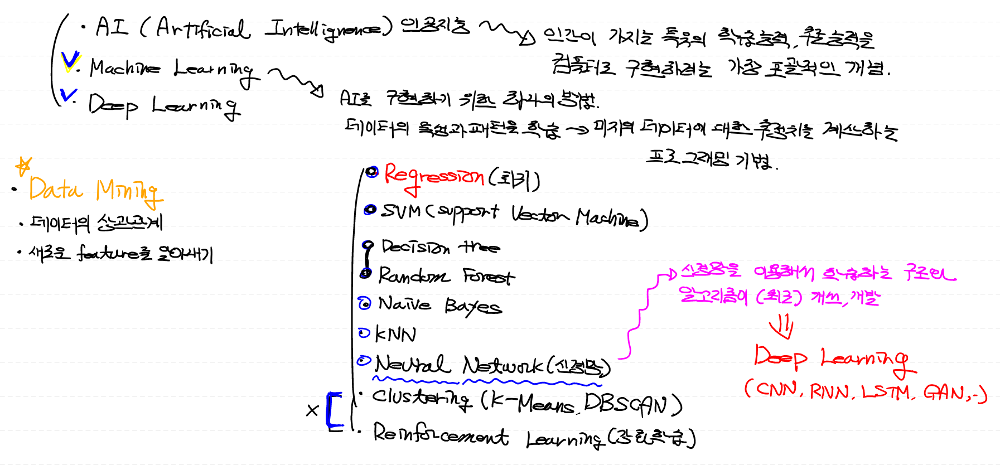
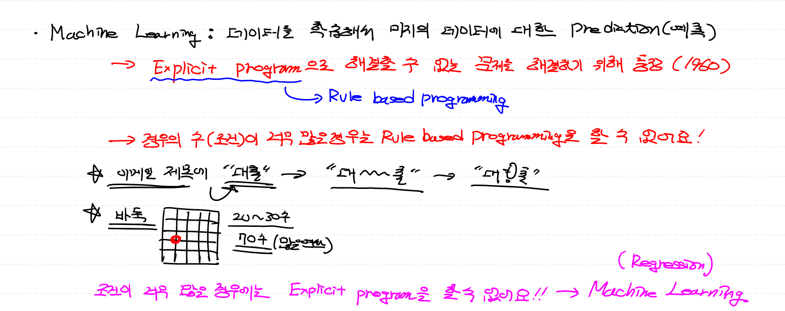
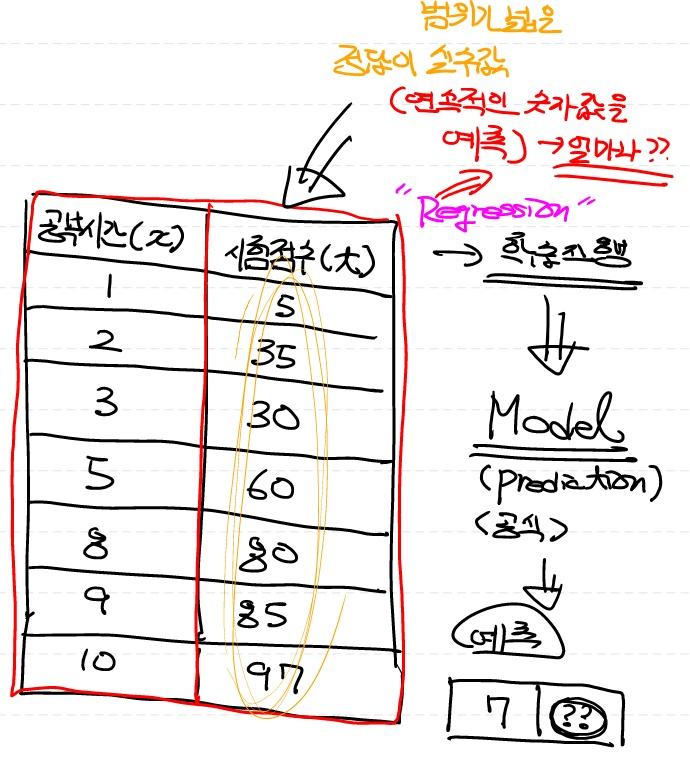
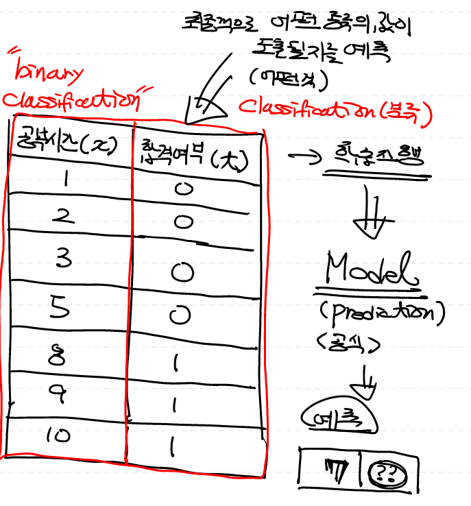
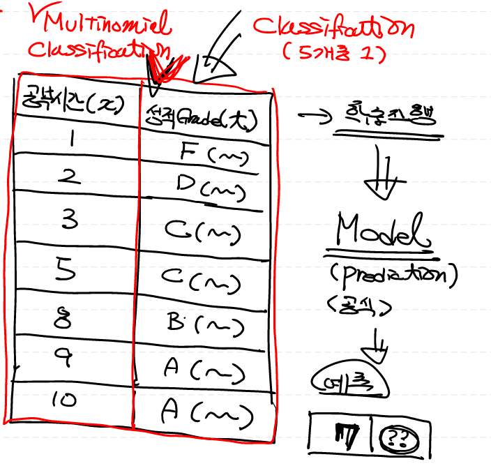

# 01. ML_0219

## 1. ML 기본 개념

### 1) AI (Artificial Intelligence)

- 인간이 가지는 특유의 학습능력, 추론능력을 컴퓨터로 구현하려는 가장 포괄적인 개념

### 2) Machine Learning

- AI를 구현하는 하나의 방법
- 데이터의 특성과 패턴을 학습하여 미지의 데이터에 대한 추정치를 계산하는 프로그래밍 기법
- 다양한 머신러닝 기법
  - Regression (회귀)
  - SVM (Support Vector Machine)
  - Decision Tree / Random Forest
  - Naive Bayes
  - KNN (K-Nearest Neighbor)
  - Neural Network (신경망)
    - 신경망을 이용해서 학습하는 구조와 알고리즘이 최근에 개선, 개발됨
    - **Deep Learning**
  - Clustering (K-Means, DBSCAN)
  - Reinforcement Learning (강화학습)

### 3) Deep Learning

* **Machine Learning** 기법 중 `Neural Network`를 의미 
* CNN, RNN, LSTM, GAN

### 4) Data Mining

- 데이터의 특성간 상관관계를 파악
- 새로운 feature (속성, 특징) 를 알아낼 때 사용

## 2. ML 배경

- **Explicit Program**으로 해결할 수 없는 문제를 해결하기 위해서 등장 (1960년대)
  - `Explicit Program` : Rule based programming
    - 약속된 규칙대로 프로그래밍 하는 방식
    - Rule (경우의 수, 조건) 이 너무 많은 경우는 불가능 ex) 바둑

## 3. ML의 4가지 학습방법

- 지도 학습 (Supervised Learning)
- 비지도 학습 (Unsupervised Learning)
- 준지도 학습 (Semi-supervised Learning)
- 강화 학습 (Reinforcement Learning)

### 1) 지도 학습 (Supervised Learning)

> 우리가 해결하는 대부분의 문제는 지도 학습에 해당

- 입력값에 대하여 **정답(Lable)이 있는** 데이터가 주어지는 경우의 학습
  - `Training Data Set`: 
    - 입력값 : `x` 
    - 정답(Lable) : `t` 
- 주어진 **Training Data Set**으로 학습을 진행하여 예측 모델(수학식)을 생성하고, 이를 이용하여 새로운 데이터에 대한 결과를 예측
- 지도 학습의 종류
  - `Regression` : 연속적인 숫자값을 예측
    - ex) 공부시간에 따른 시험점수 예측
  - `Binary Classification` : 두개의 label 중 어떤 종류의 값인지 예측
    - ex) 공부시간에 따른 시험합격 (합/불) 여부 예측
  - `Multinomial Classification` : 두개 이상의 label 중 어떤 종류의 값인지 예측
    - ex) 공부시간에 따른 성적분류 (Grade) 예측

   

### 2) 비지도 학습 (Unsupervised Learning)

- 입력값에 대하여 **정답(Lable)이 없는 **데이터가 주어지는 경우의 학습
- 주어진 Data Set을 비슷한 특징끼리 **군집화**하여 새로운 데이터에 대한 결과를 예측
- `Clustering` :
  - ex) 뉴스와 같은 문자 데이터 (비정형 데이터) 의 의미를 파악하여 정치, 연예, 스포츠 기사로 군집화

### 3) 준지도 학습 (Semi-supervised Learning)

- 어떤 입력값에 대해서는 **정답(Lable)이 존재**하지만 어떤 입력값에 대해서는 **정답(Lable)이 존재하지 않는** 경우의 학습
- 주어진 Data Set에 비지도 학습 (Clustering) 후 Lable이 있는 데이터를 기준으로 지도 학습 진행

### 4) 강화학습 (Reinforcement Learning)

* 가장 최대의 **보상(Reward)**을 가져다주는지 행동이 무엇인지를 학습
  *  정의된 주체(agent)가 주어진 환경의 현재 상태를 관찰하여, 이를 기반으로 행동(action)
  * 이때 환경의 상태가 변화하면서 정의된 주체는 보상(reward)을 받음
  * 더 많은 보상을 얻을 수 있는 방향(best action)으로 행동을 학습

