# 02. ML_0222


**[리뷰]  ML** 

* Machine Learning : 
  * AI : 가장 포괄적인 개념
  * Machine Learning : AI를 구현하기 위한 하나의 방법, 데이터의 특성 및 패턴을 파악하여 미지의 데이터에 대한 prediction
  * Deep Learning : 머신 러닝 기법 중 Neural Network (신경망)을 이용해서 학습 및 추론하는 다양한 알고리즘 및 기법

* 기존의 Data Mining과 다른점: 
  * Explicit program으로 해결할 수 없는 문제를 해결하기 위해 등장

* Machine Learning의 Type : 
  * 지도학습, 비지도학습, 준지도학습, 강화학습

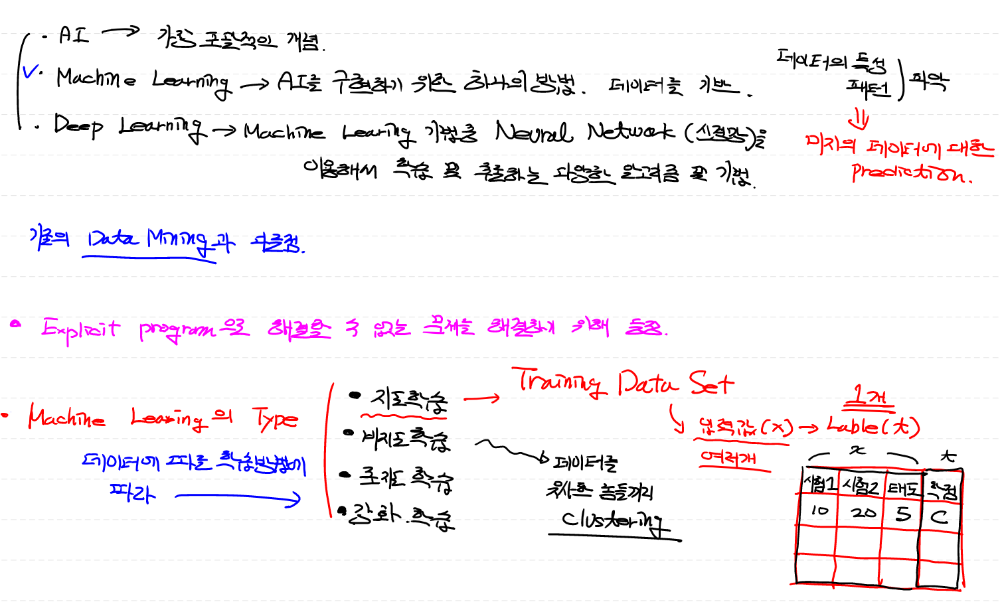


## 1. 미분의 기본 개념


### 1) 미분의 정의

- 미분 (derivative) : 
  - 어떤 함수의 정의역 속 각 점에서 독립변수의 변화량과 함수값을 변화량의 비율의 극한으로 구성된 집합으로 치역이 구성되는 함수 (=도함수)
  - 함수에 대한 특정 순간의 **변화량**
    - x의 변화가 f(x)를 얼마만큼 변화시키는지 나타냄
- 미분법 (differentiation) : 미분을 하는 작업 / 도함수를 구하는 작업 그 자체

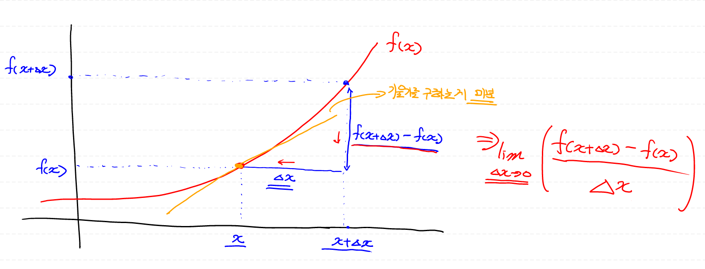

### 2) 미분의 종류

- **해석미분** (Analytical Differentiation) :  
  - 이론에 입각하여 (종이와 펜을 이용) 논리적으로 미분 수행
- **수치미분** (Numerical Differentiation) : 
  - 프로그램적으로 계산을 통해서 미분 수행 
  - 오차 발생 가능 (약간의 오류가 발생)
  - 전향차분 / 중앙차분 / 후향차분
    - 중앙차분이 가장 정확도가 높음
    - 프로그램 구현 시 1e-6 정도로 정의

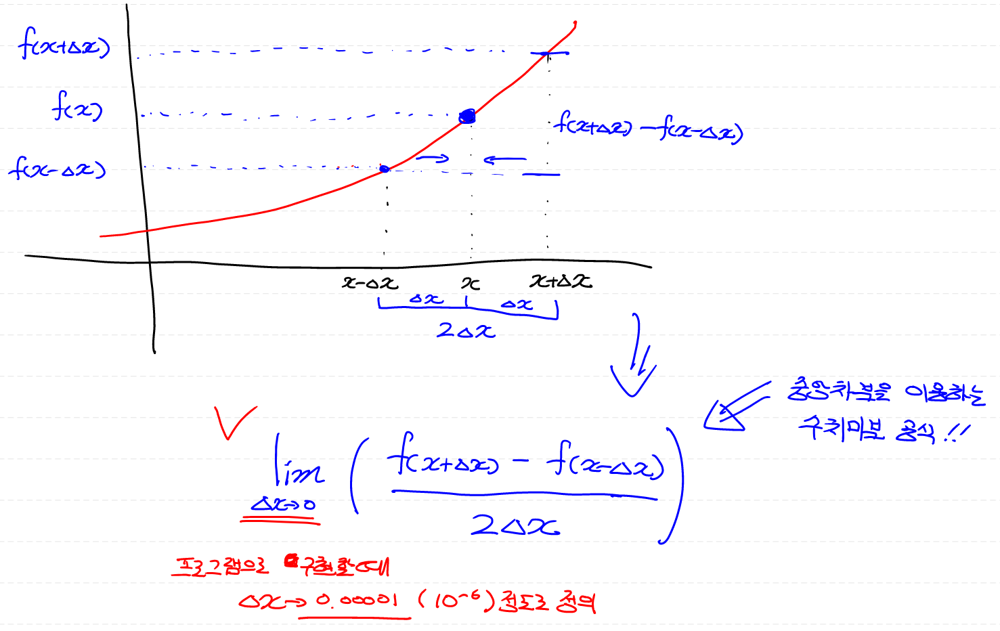 


## 2. 기본 미분 공식

1.  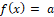 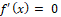

    

2. 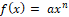

   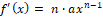

    

   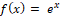

   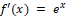

    

   

   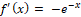

    

   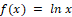

   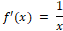

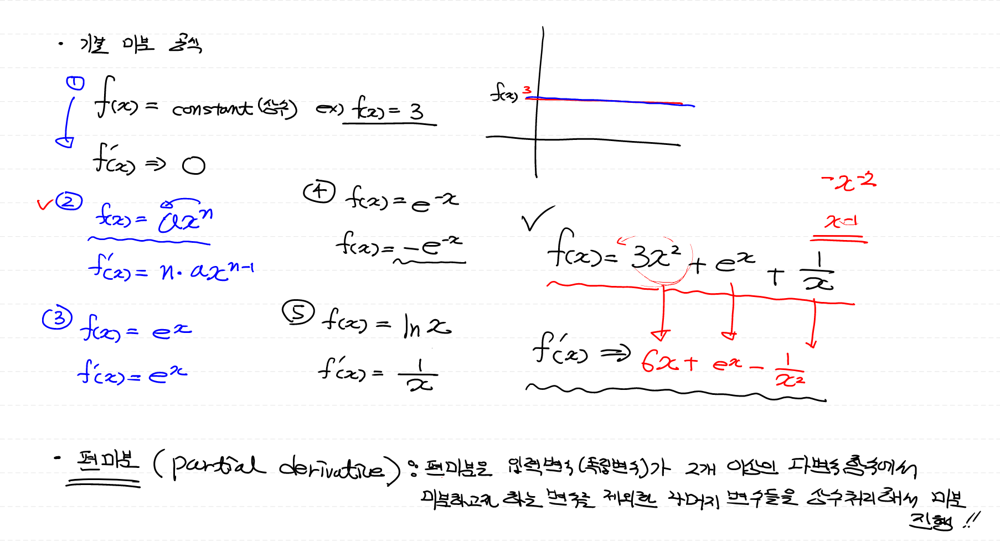


## 3. 편미분

> 입력변수(독립변수)가 2개 이상인 `다변수 함수`에서 미분하고자 하는 변수를 제외한 `나머지 변수`들을 `상수`처리해서 미분 진행!

- f(x,y)를 x에 대해서 partial derivative(편미분)하는 경우

- ==> x에 대해 편미분 한것은 y를 상수처리

  ==> y에 대해 편미분 한것은 x를 상수처리

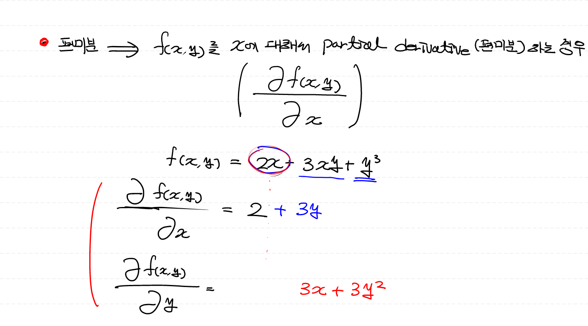


## 4. 연쇄법칙(Chain Rule)

> 합성합수(composite function): 여러함수로 구성된 함수
>
> 함성함수를 미분 ==> chain rule 적용 ==> 합성함수를 구성하는 각 함수를 각각 미분해서 그 결과의 곱으로 계산


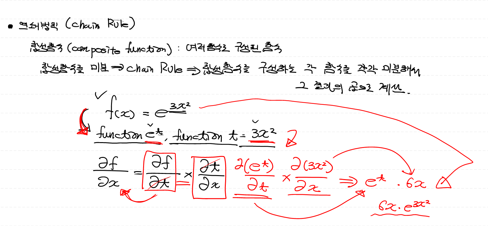


## 5. Numeric Differentiation 구현


- 일변수 함수에 대한 수치미분 코드 구현

  ```
  # 입력으로 들어오는 x에서 아주 미세하게 변화할 때
  # 함수 f가 얼마나 변화하는지에 대해 수치적으로 계산해보아요!
  
  # 수치 미분 함수 / 인자를 2개 갖는데
  # 한개는 미분하려는 함수, 나머지 한개는 특정 점에서 미분값을 구하기 위한 x값
  
  def numerical_derivative(f,x):
      
      # f : 미분하려는 함수
      # x : 미분값을 알고자 하는 입력값
      # delta_x ==> 극한에 해당하는 값으로 아주 작은 값을 이용
      #             1e-8 (10의 -8제곱) 이 이하로 지정하는 소수점 연산 오류 발생
      #             일반적으로 1e-5 정도로 설정!
      
      delta_x = 1e-5
      
      return (f(x+delta_x) - f(x-delta_x)) / (2*delta_x)
  
  # 미분하려는 함수가 있어야 해요 (단변수 함수로 지정)
  def my_func(x):
      return x**2
  
  # 함수 넣을 때 함수 자체를 넣어줘야 한다! (my_func)
  result = numerical_derivative(my_func, 3)
  print(result) # ==> 6.000000000039306
  ```

- 다변수 함수에 대한 수치미분 ==> 입력변수가 2개이기 때문에 x와 y에 대해서 각각 편미분 수행 ==> f(x, y) = 2x + 3xy +y^3

  ```
  # 일반적으로 다변수 함수의 수치미분 코드를 이용한다!
  
  # 입력변수가 2개 이상인 다변수 함수인 경우,
  # 입력변수는 서로 독립이기 때문에 
  # 수치미분 역시 변수의 개수만큼 개별적으로 진행해야 한다.
  
  import numpy as np
  
  def numerical_derivative(f,x):
      
      # f : 미분하려고 하는 다변수 함수
      # x : 모든 값을 포함하는 numpy array  / ex) f'(1.0 , 2.0)  ==> (8.0, 15.0)
      
      delta_x = 1e-4  # >>> 극한으로 가는 값
      derivative_x = np.zeros_like(x)  # x처럼 만들어서 0로 채워주세요 / x= shape / >>> (0, 0)  
  
      it = np.nditer(x, flags=['multi_index']) # 독립변수 x가 2행 2열인 matrix형태로 들어올 수 있다.
  
      while not it.finished:
          
          #현재의 인덱스를 추출해야 한다.
          idx = it.multi_index # ==> 튜플 형태로 주어진다.
          
          print(idx)
          
          tmp = x[idx]    # 현재 index의 값을 잠시 보존
                          # delta_x를 이용한 값으로 ndarray를 수정한 후 편미분 계산
                          # 함수값을 계산한 후 원상복구를 해 줘야 다음 독립변수에 대한
                          # 편미분을 정상적으로 수행할 수 있다!
          print(tmp)
          
          # 편미분 시작
          x[idx] = tmp + delta_x
          fx_plus_delta = f(x) # x에 대해서 ==> f([1.00001, 2.0])  ==> f(x + delta_x)
                               # y에 대해서 ==> f([1.0, 2.00001])  ==> f(y + delta_x)
              
          x[idx] = tmp - delta_x
          fx_minus_delta = f(x) # x에 대해서 ==> f([0.99999, 2.0])  ==> f(x - delta_x)
                                # y에 대해서 ==> f([1.0, 1.99999])  ==> f(y - delta_x)
          
          derivative_x[idx] = (fx_plus_delta - fx_minus_delta) / (2*delta_x)
          
          # x == (1.0, 2.0) 값 원상복귀
          x[idx] = tmp
          
          it.iternext()
          
      return derivative_x
  
  
  # 다변수
  def my_func(input_data):
      x = input_data[0]
      y = input_data[1]
      return 2*x + 3*x*y + np.power(y,3)  # ==> f(x) = 2x + 3xy + y^3
  
  param = np.array([1.0, 2.0])
  result = numerical_derivative(my_func, param)
  print(result)
  ```

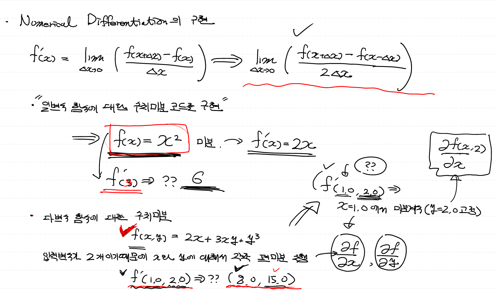


## 6. Regression Model

> - 어떠한 `데이터`에 대해서 그 값에 영향을 주는 `조건(회귀계수)`을 고려하여 데이터의 `평균`을 구하기 위한 함수
> - 평균이라는 표현은 어떤 의미?? >>> 평균적으로' 라는 표현은 `대표성`을 나타낸다. (But, 극단의 이상치가 존재하면 대표성이 깨진다.)
> - 그래서 Regression Model(회귀모델) 다시 정의 ==> 어떠한 `데이터`에 대해서 그 값에 영향을 주는 `조건(회귀계수)`을 고려하여 그 데이터를 `가장 잘 표현하는 함수`

- 독립변수가 1개인 함수를 가정 ==> `Υ = β0 + β¹x` ==> Y = ax + b (직선!) ==> `β0` : 기타 영향을 주는 요인 / `β¹` : x에 영향을 주는 요인
- 우리가 구하려는 Regression Model은 주어진 데이터를 가장 잘 표현하는 `직선`을 찾는 것으로 정의할 수 있다. (독립변수가 1개인 경우) ==> `Classical linear Regression Model`

> 즉, 어떤 연속형 데이터 Y와 Y의 원인으로 생각되는 X간의 관계를 추정하기 위해 만든 관계식 == `Y = f(x)+e`
>
> Y = h(x1, x2, x3 ... xⁿ, β1, β2, β3, ... βⁿ) + ε h : 조건에 따른 평균을 구하는 함수(회귀모델)

- 모델을 왜 만들까? ==> 우리가 해결해야 하는 현실을

   

  ```
  단순화
  ```

   

  하기 위해 (

  ```
  가정
  ```

  을 세운다.)

  - 오차 항은 평균이 0 , 정규분포 따른다.
  - 독립변수와 종속 변수는 선형
  - 데이터에 아웃라이어가 없어야 한다.
  - 독립변수와 오차항은 독립!

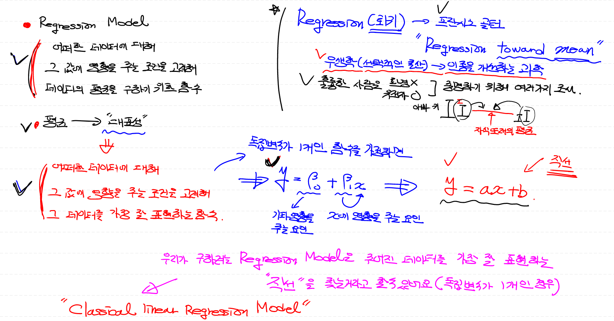

## Classical linear Regression Model (고전적 선형 회귀 모델)

> 우리가 사용할 모델

- 식 = `y = β0 + ∑(βi*xi) (i=1 부터 p까지)`
- 단변량 선형 회귀 모델 : 종속변수가 1개
- 단순 선형 회귀 모델 : 독립변수(x) 1개
- 다중 선형 회귀 모델 : 독립변수(x) 2개 이상


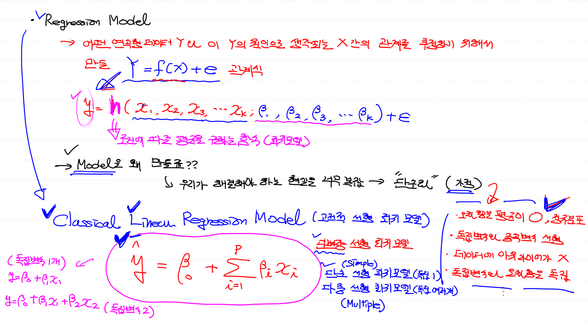