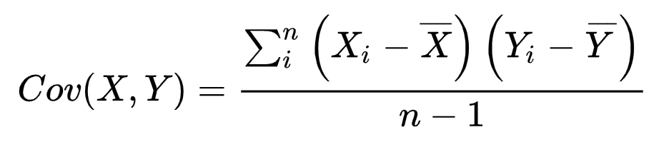

# 04. Pandas - DataFrame 함수


## 1. 기본 개념


* 기댓값 (expected value) : 
  * 어떤 확률을 가진 사건을 무한히 반복했을 때 얻을 수 있는 값의 평균으로서 기대할 수 있는 값

 

* 편차(deviation) : 
  * 확률변수 X와 평균값(기댓값)의 차이
  * 편차의 합계는 0으로 평균 x, 데이터의 흩어진 정도를 수치화하기 어려움 


* 분산 (variance) : 
  * 편차의 제곱의 평균
  * 제곱한 값이기 때문에 사용하기 애매함


* 표준편차 (standard deviation) : 
  * 분산의 제곱근  
  * 데이터가 얼마나 흩어져 있는지, 얼마나 차이가 심한지를 알 수 있음


```python
# 주사위 1개를 던지는 사건을 무한히 반복했을 경우의 기댓값은
import numpy as np
result = np.random.randint(1,7,(100000,))
print(result.mean()) # 3.49796

# 평균, 편차, 분산, 표준편차
arr = np.array([4,6,1,3,8,8], dtype=np.int32)

print(arr.sum()) 	# 합계
print(arr.mean()) 	# 평균
print(arr.var()) 	# 분산 
print(arr.std()) 	# 표준편차
```

    30
    5.0
    6.666666666666667
    2.581988897471611


## 2. 공분산 (cov)


* 공분산  (covariance) : 

  * 확률변수 X (독립변수)와 Y (종속변수)의 관계를 보여주는 값 
  * X가 변할 때 Y가 변하는 정도를 나타냄
  * 두 변수의 편차의 곱의 평균으로 데이터가 평균으로부터 얼마나 떨어져 있는가를 나타냄

  * 공분산이 양수인지 음수인지에 따라 데이터의 방향성을 알 수 있음

    * 단, 단위의 문제로 실제 어느정도의 연관성이 있는지는 알 수 없음

  * 두 변수가 서로 아무 관련이 없는 독립이면 공분산은 0으로 수렴

    * 방향성이 없이 랜덤하게 무수하게 많은 샘플에 대해 값을 계산하게 되면 결국 양수,음수가 번갈아 나오게 되서 최종적으로 0과 가까워짐
    * 일반적으로 역은 성립하지 않음 (즉, X와 Y가 독립이 아니더라도 0의 공분산 가능)

    

* 모공분산: 두 확률변수 각각의 편차의 곱에 대한 평균

  표준공분산: 두 확률변수 각각의 편차의 곱에 대한 합을 n-1로 나누어 계산   




```python
import numpy as np
import pandas as pd

np.random.seed(2)
sampleNum = 100

x = np.random.randint(0,10,(sampleNum,))
y = np.random.randint(-10,20,(sampleNum,))

x_mean = x.mean()   # x의 평균
y_mean = y.mean()   # y의 평균

x_deviation = x-x_mean; 
y_deviation = y-y_mean; 

result = 0;
for i in range(sampleNum):
    result += (x_deviation[i] * y_deviation[i])
    
result_covariance = result / (sampleNum-1);  # 표준공분산(n-1)
print(result_covariance)

# cov
print(np.cov(x,y))   # NumPy의 함수를 이용하여 계산   
```


> 공분산(예제)

* `pip install pandas-datareader` or `conda install pandas-datareader`

```python
# DataReader API를 통해서 yahoo finance의 데이터 가져오기

import numpy as np
import pandas as pd
import pandas_datareader.data as pdr
from datetime import datetime

start = datetime(2019,1,1)  # 2019-01-01 날짜 객체 생성
end = datetime(2019,12,31)  # 2019-12-31 날짜 객체 생성

# YAHOO에서 제공하는 KOSPI 지수
df_KOSPI = pdr.DataReader('^KS11','yahoo',start,end)
# display(df_KOSPI['Close'].values)

# YAHOO에서 제공하는 삼성전자 지수
df_SE = pdr.DataReader('005930.KS','yahoo',start,end)
# display(df_SE['Close'].values)

# cov
print(np.cov(df_KOSPI['Close'].values,df_SE['Close'].values))
# 0행 0열 : KOSPI의 공분산 ( KOSPI & KOSPI )
# 0행 1열 : KOSPI와 삼성전자의 공분산
# 1행 0열 : 삼성전자와 KOSPI의 공분산
# 1행 1열 : 삼성전자의 공분산 ( 삼성전자 & 삼성전자 )
```

    [[6.28958682e+03 9.46863621e+04]
     [9.46863621e+04 1.41592089e+07]]


## 3. 상관계수 (corr)


* 상관관계 (correlation) : 
  * 두 대상이 서로 연관성이 있다고 추측되는 관계
  * 단, 상관관계로 인과관계는 설명할 수 없음
  * ex) 성적과 자존감, 온라인 게임과 폭력성


* 상관계수 (correlation coefficient) : 

  * 확률변수 X (독립변수)와 Y (종속변수)의 상관관계를 보여주는 값
  * 하나의 변수가 변화할 때 다른 변수가 변화하는 정도를 나타냄
  * 공분산을 각 변수의 표준편차의 곱으로 나눈값 
  * -1과 1사이의 실수
    * 양수일 경우 정적 상관관계, 음수일 경우 부적상관관계
    * 0에 가까울수록 관련성이 없고, 절대값이 1에 가까울수록 관련성이 높음

  


```python
import numpy as np
import pandas as pd
import pandas_datareader.data as pdr
from datetime import datetime

start = datetime(2018,1,1)  # 2018-01-01 날짜 객체 생성
end = datetime(2018,12,31)  # 2018-12-31 날짜 객체 생성

# YAHOO에서 제공하는 종목 지수
df_KOSPI = pdr.DataReader('^KS11','yahoo',start,end)  # KOSPI
df_SE = pdr.DataReader('005930.KS','yahoo',start,end) # 삼성전자
df_PUSAN = pdr.DataReader('011390.KS','yahoo',start,end) # 부산산업(남북경협)
df_LIG = pdr.DataReader('079550.KS','yahoo',start,end) # LIG넥스원(방위)

# corrcoef
print(np.corrcoef(df_KOSPI['Close'],df_SE['Close'])) # NumPy의 함수를 이용하여 계산

my_dict = {
    'KOSPI' : df_KOSPI['Close'],
    '삼성전자' : df_SE['Close'],
    '부산산업' : df_PUSAN['Close'],
    'LIG넥스원' : df_LIG['Close']
}

df = pd.DataFrame(my_dict)
display(df)

# corr
display(df.corr())  # DataFrame의 함수를 이용하여 계산  
```


    [[1.         0.91357384]
     [0.91357384 1.        ]]
<table border="1" class="dataframe">
  <thead>
    <tr style="text-align: right;">
      <th></th>
      <th>KOSPI</th>
      <th>삼성전자</th>
      <th>부산산업</th>
      <th>LIG넥스원</th>
    </tr>
  </thead>
  <tbody>
    <tr>
      <th>KOSPI</th>
      <td>1.000000</td>
      <td>0.913574</td>
      <td>-0.574980</td>
      <td>0.791497</td>
    </tr>
    <tr>
      <th>삼성전자</th>
      <td>0.913574</td>
      <td>1.000000</td>
      <td>-0.464685</td>
      <td>0.649536</td>
    </tr>
    <tr>
      <th>부산산업</th>
      <td>-0.574980</td>
      <td>-0.464685</td>
      <td>1.000000</td>
      <td>-0.708109</td>
    </tr>
    <tr>
      <th>LIG넥스원</th>
      <td>0.791497</td>
      <td>0.649536</td>
      <td>-0.708109</td>
      <td>1.000000</td>
    </tr>
  </tbody>
</table>


## 4. 합계 (sum), 평균 (mean)

```python
import numpy as np
import pandas as pd

data = [[2, np.nan],
        [7, -3],
        [np.nan, np.nan],
        [1, -2]]

df = pd.DataFrame(data,
                  columns=['one', 'two'],
                  index=['a','b','c','d'])
display(df)				

# sum
print(df.sum())   			# one    10.0
							# two    -5.0
  							# axis=0, skipna=True (default) 
							# Series로 return      
            
print(df.sum(axis=1)) 		# a    2.0
							# b    4.0
							# c    0.0
							# d   -1.0
            
print(df['two'].sum())   	# 특정 열에 대한 합
print(df.loc['b'].sum()) 	# 특정 행에 대한 합

# mean
print(df.mean(axis=0,skipna=False)) # one   NaN
									# two   NaN
									# skipna=False => NaN을 연산에 포함(실수처리)

print(df.mean(axis=0,skipna=True))  # one    3.333333
									# two   -2.500000
									# skipna=True => NaN을 연산에서 배제  

df = df.fillna(value=df.mean()) 	# 결측값을 평균으로 대체
display(df) 					
```


## 5. 정렬 (sort)

```python
import numpy as np
import pandas as pd

np.random.seed(1)
df = pd.DataFrame(np.random.randint(0,10,(6,4)))
df.columns = ['A','B','C','D'] 					 # column 지정
df.index = pd.date_range('20200101', periods=6)  # index 지정
display(df)

new_index = np.random.permutation(df.index) 	 # index 순열 랜덤 치환
# permutation(): 원본 변경x, 순서가 바뀐 복사본 return
# shuffle(): 원본 변경 => Error. Index는 mutable opertion 지원 x


# index와 column이 재설정된 DataFrame 생성
df2 = df.reindex(index=new_index, columns=['B','A','D','C'])
display(df2)

# sort
display(df2.sort_index(axis=1, ascending=True))  # axis=0 : 행(row) 기준 정렬
												 # axis=1 : 열(column) 기준 정렬
												 # ascending=Flase : 내림차순 정렬

display(df2.sort_values(by="B"))				 # 특정 column의 값으로 행 정렬

display(df2.sort_values(by=["B","A"]))			 # "B"값이 같을 때 "A"로 정렬 (2차정렬)
```


## 6. 기타 함수 (unique, value_counts, isin)

* `unique()` : 중복제거 (ndarray)
* `value_counts()` : 각 값들의 개수 return (Series)
* `isin([])` : boolean indexing (Series)  

```python
import numpy as np
import pandas as pd

np.random.seed(1)
df = pd.DataFrame(np.random.randint(0,10,(6,4)))
df.columns = ['A','B','C','D']
df.index = pd.date_range('20200101', periods=6)
df['E'] = ['AA','BB','CC','CC','AA','CC']
display(df)

print(df['E'].unique())   		  # ['AA' 'BB' 'CC']

print(df['E'].value_counts())     # CC    3
							 	  # AA    2
								  # BB    1
        
print(df['E'].isin(['AA','BB']))  # 2020-01-01     True
								  # 2020-01-02     True
								  # 2020-01-03    False
								  # 2020-01-04    False
								  # 2020-01-05     True
								  # 2020-01-06    False
```

<table border="1" class="dataframe">
  <thead>
    <tr style="text-align: right;">
      <th></th>
      <th>A</th>
      <th>B</th>
      <th>C</th>
      <th>D</th>
      <th>E</th>
    </tr>
  </thead>
  <tbody>
    <tr>
      <th>2020-01-01</th>
      <td>5</td>
      <td>8</td>
      <td>9</td>
      <td>5</td>
      <td>AA</td>
    </tr>
    <tr>
      <th>2020-01-02</th>
      <td>0</td>
      <td>0</td>
      <td>1</td>
      <td>7</td>
      <td>BB</td>
    </tr>
    <tr>
      <th>2020-01-03</th>
      <td>6</td>
      <td>9</td>
      <td>2</td>
      <td>4</td>
      <td>CC</td>
    </tr>
    <tr>
      <th>2020-01-04</th>
      <td>5</td>
      <td>2</td>
      <td>4</td>
      <td>2</td>
      <td>CC</td>
    </tr>
    <tr>
      <th>2020-01-05</th>
      <td>4</td>
      <td>7</td>
      <td>7</td>
      <td>9</td>
      <td>AA</td>
    </tr>
    <tr>
      <th>2020-01-06</th>
      <td>1</td>
      <td>7</td>
      <td>0</td>
      <td>6</td>
      <td>CC</td>
    </tr>
  </tbody>
</table>


