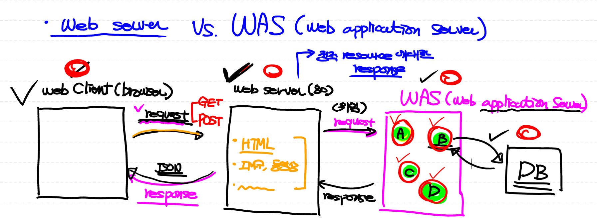
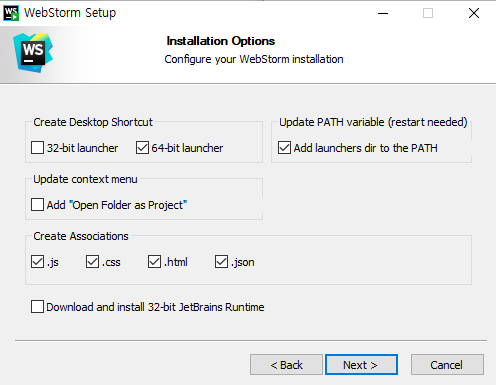

# 01. Web 기본 개념


## 1. Web programming


**Web programming** :`HTTP protocol`로 통신하는 클라이언트/서버 프로그램을 개발

- protocol : 데이터 통신을 주고받기 위해서 지켜야하는 약속 혹은 규약.
  - `HTTP` : Web 전용 protocol
  - `FTP` : file 전송 전용 protocol
  - `SMTP` : e-mail 전용 protocol
- 웹 클라이언트/웹 서버 프로그램은 따로 개발할 수도 있고 함께 개발도 가능
  - `Django` : 웹 서버 프로그램


**Web program**: CS 구조로 구성 (Client , Server)

* `Client` : 능동적으로 서비스를 요청
  * `Web client `: 웹 서버에 접속하는 클라이언트 프로그램 
    * 우리가 작성
    * chrome, IE, safari, firefox 등의 Browser
  * `web client application` : 클라이언트에서 동작하는 응용프로그램
    * HTML ,CSS, javascript
  
* `Server` : 클라이언트 요청에 대해 서비스를 제공
    * `Web server` : 웹 클라이언트의 요청을 받아 서비스를 제공하는 프로그램 
        * performance가 중요, 우리가 작성 x
      * Apache Web server, IIS, Oracle Webserver
    * `web server application` : 서버에서 동작하는 응용프로그램
      * Django-python, Servlet-java


## 2. URL 구성요소

```
HTTP://192.168.0.34:4000
```

* `HTTP:// ` : **protocol**
* `192.168.0.34 ` : **IP address**
* `4000 ` : **port**


> 외부에서 `IP 주소`를 통해 우리 컴퓨터에 접근 가능
>
> 컴퓨터의 특정 프로그램에 접근하기 위해서는 프로그램에 할당된 `Port 번호`가 필요


### 1) Protocol

* 데이터 통신을 주고받기 위해서 지켜야하는 약속 혹은 규약
  * `HTTP` :  Web 전용 protocol

### 2) IP/MAC address

* 컴퓨터 외부에서 내부에 있는 프로그램과 연결
  * `IP address`: 
    * Network에 연결되어있는 각종 기기에 부여되는 논리적인 주소 (변경)
    * `.` 를 기준으로 4자리
    * ex. 192.168.34.2
  * `MAC address`: 
    * Network에 연결되어있는 물리적인 주소 (변경 불가)
    * `.` 를 기준으로 6자리
    * ex.34.37.128.34.2.76

### 3) port

* 0~65535 사이에 있는 하나의 숫자. (포트 번호)
  * 0~1024 : reserved (예약, 지정된 값)
  * 1025~65535 : 사용자가 사용 가능한 범위
  * 80번 port : default 값으로 지정
* 하나의 프로세스 (프로그램)을 지칭


## 3. HTTP protocol


**HTTP protocol** : HyperText Transfer Protocol

- 웹 서버와 웹 클라이언트가 서로 데이터를 주고 받기 위해 사용하는 통신규약.

- TCP/IP Protocol stack 위에서 등장하는 `protocol`

  - `IP address`를 기반으로 통신

- 여러 종류의 Data를 주고 받을 수 있음

  - Text 뿐만 아니라 컴퓨터 내에서 사용하는 여러가지 포맷들 (이미지, 동영상, PDF 등) 가능

    

**HTTP의 특징** : `stateless`

* Web Client와 Web Server는 계속 연결되어 있지 않음

  1. Web Client에서  Web Server로 요청 (HTTP request)

  2. 논리적인 데이터 통로가 연결 (request를 통해)

  3.  Web Server에서 응답 (HTTP response)

  4. 사용이 끝나면 연결을 끊음

* **Why?** Server는 한정되어 있기 때문에 Client 수 조절 필요 

  * Server의 부하를 줄임

* Server가 Client를 구별할 수 없게 됨

  * IP address는 논리적 주소이기 때문에 변경됨 => **stateless**

* http protocol를 stateless protocol이라고 부르기도 함

* Session Tracking 필요


## 4. Request 

> HTTP Request message 양식

```
GET /book/readme.md HTTP/1.1
Host: www.example.com:80

body
```


### 1) GET

- 전달한 데이터를 Query String 형식으로 URL 뒤에 붙여서 전송

  ex. 일일 boxoffice 순위 Open API (__ ?key= __ & targetDt=20200101)

- 장점 : 사용하기 쉬움

  단점 : 데이터가 URL에 그대로 붙어서 보안성이 없고 URL의 길이 제한 있음

### 2) POST

- request message body 부분에 데이터를 포함해서 전송
- 장점 : 보안성이 있고 보내려는 데이터의 길이 제한이 없음


**[참고]  요청방식 4가지 (HTTP Methods)**

> GET/ POST 두 가지 방식으로도 모든 CRUD 작업 가능

1. GET : 서버에게 resource를 보내달라고 요청
2. POST : 서버에게 resource를 보내면서 생성해 달라고 요청
3. PUT : 서버에게 resource의 업데이트 하거나, 새로운 resource를 생성해 달라고 요청
4. Delete : 서버에게 resource의 삭제를 요청


## 5. WAS 


**Web Server** :

웹 브라우저 클라이언트로부터 HTTP 요청을 받아 **정적**인 컨텐츠를 제공하는 컴퓨터 프로그램

* 정적인 컨텐츠의 경우 WAS를 거치지 않고 바로 resource 제공
  * `.html`, `.jpeg`, `.css` 등
* 동적인 컨텐츠의 경우 클라이언트의 요청을 WAS에 보내고, WAS가 처리한 결과를 클라이언트에게 전달
* Ex) Apache Server, Nginx, IIS (Windows 전용 Web 서버) 등
  


**WAS (Web Application Server)**: 

DB 조회나 다양한 로직 처리를 요구하는 **동적**인 컨텐츠를 제공하기 위해 만들어진 Application Server

* HTTP를 통해 컴퓨터나 장치에 애플리케이션을 수행해주는 미들웨어(소프트웨어 엔진)
*  Container 라고도 불림 (JSP, Servlet을 실행시킬 수 있는 소프트웨어)

* 클라이언트로부터 웹 서버가 요청을 받으면 애플리케이션에 대한 로직을 실행하여 웹 서버로 다시 반환

* Ex) Tomcat, JBoss, Jeus, Web Sphere 등




* **웹의 기본 구조** : 
  * Web client =>  Web server =>  WAS => DB (Database)


## 6. Static Web 생성


### 1) WebStorm 설치

1. *WebStorm* 다운로드

   * https://www.jetbrains.com/webstorm/
   * free 30-day trial

   

2. *WebStorm Set up* 




3. *Import WebStorm Settings* 


### 2) WebStorm으로 HTML 작성

1. *WebStorm* 실행 후 프로젝트 생성

   * Empty Project 선택
   * FrontEndWeb 폴더 생성 후 해당 폴더에서 프로젝트 진행

2. `a.html` 생성

   ```html
   <!DOCTYPE html>
   <html lang="en">
       <head>
           <meta charset="UTF-8">
           <title>Title</title>
           <!-- 설정 -->      
       </head>
       <body>
           이것은 소리없는 아우성!!
       </body>    
   </html>
   ```

3. Web Server Program 실행

   * *WebStorm*안에 있는 내장 Web Server 이용

   * Web Server가 우리 project를 인식해야 나중에 클라이언트가 요청했을 때 파일을 찾아서 제공할 수 있음=> **configure**

   * 우리 project를 Web에서 사용할 수 있도록 전개 => **deploy**

   * Web Client (browser) 실행, URL 입력 (request)

   * 해당 `a.html` 파일을 받아 렌더링

