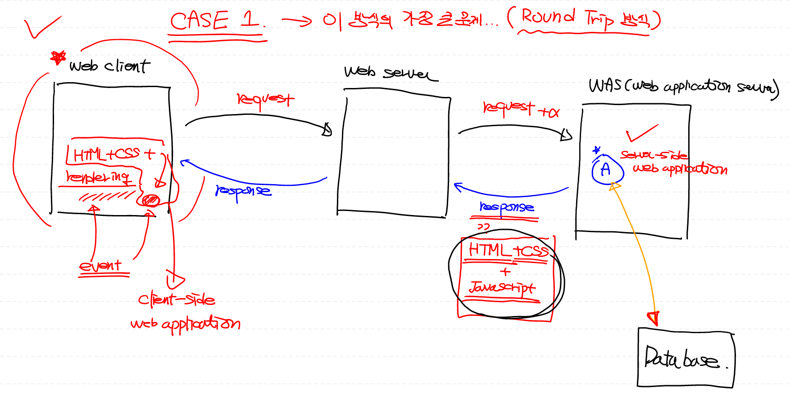
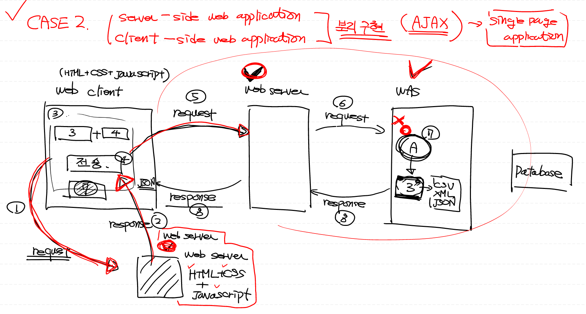
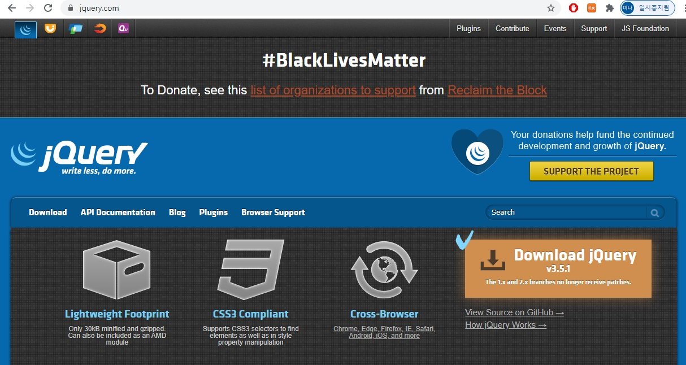
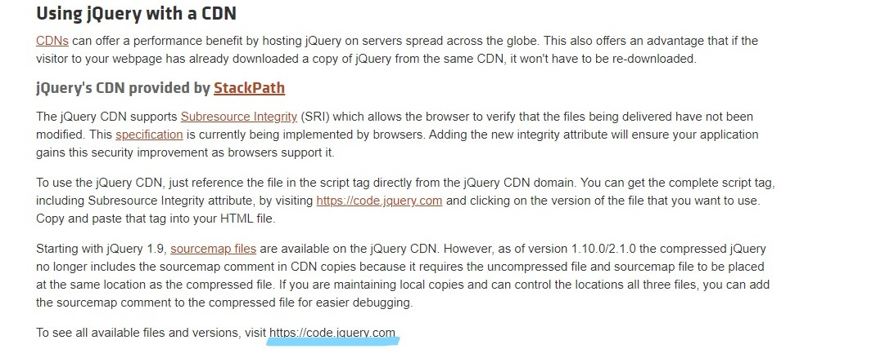
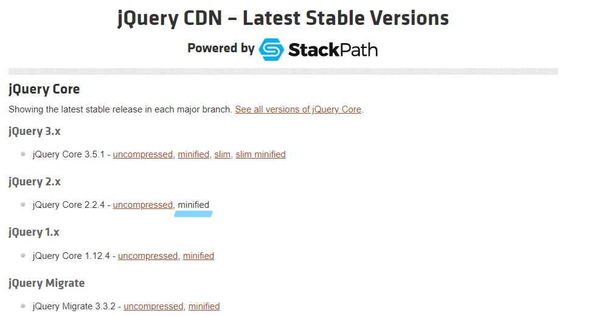
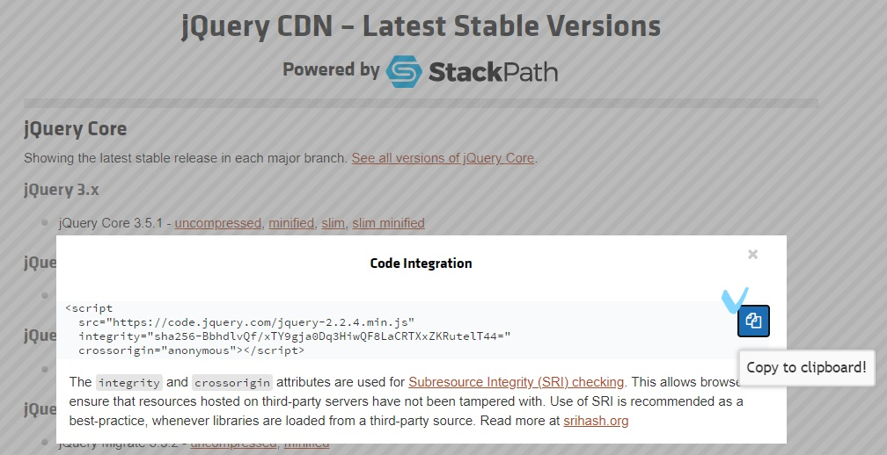
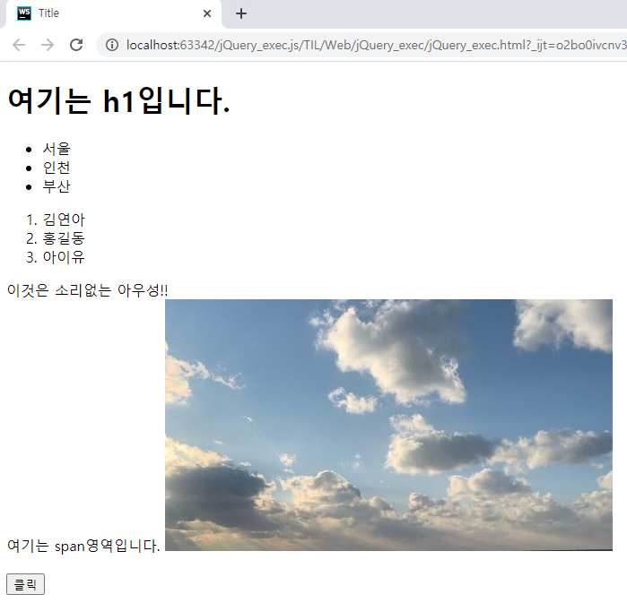
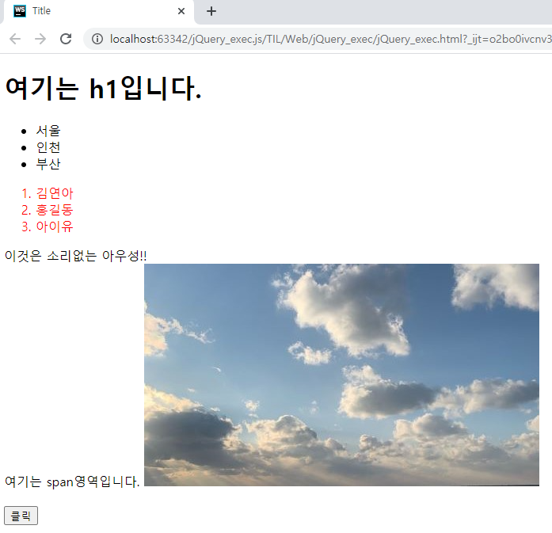

# 02. Web 어플리케이션


## 1. 개념


### Network

- 컴퓨터 안에 있는 프로그램끼리 통신할 수 있는 망

### Internet

- network of network: 네트워크와 네트워크를 연결하는 큰 네트워크

- 물리적인 Framework: 전세계적으로 구축된 네트워크 망

  - HTTP: HyperText Transfer Protocol
  - SMTP: Email Transfer Protocol
  - FTP: File Transfer Protocol

  

> **[참고] Web**

- Web client (web client program)

  - browser(chrome)
  - 따로 구현할 수 있다.
  
- Web server (web server program)

  - Apache,IIS,oracle web server
  - 따로 구현하지 않는다.
  - 정적인 컨텐츠를 서비스 (web server가 처리)
  - 동적인 컨텐츠를 만들어서 서비스 x 
    - 동적 컨텐츠: 서버에서 별도의 `Web program`을 실행시켜서 나온 결과
    - `Web program` = `Server-Side Web Application`
    - `WAS (Web Application Server)` 에게 위임
  
- WAS
    - 별도의 `Web program` 보유


### Framework

* Library : 
  * 특정 기능을 수행하는 코드 묶음. 알고리즘과 로직 포함 x
  * 개발자가 프로그램의 흐름을 제어
  * ex. 파이썬 module

* Framework : 
  * 라이브러리의 개념을 확장시킨 것으로 시스템의 기초가 구축되어있음. 
  * 프레임워크의 흐름 내에서 개발자가 일부분을 수정해서 기능 구현
  *  ex. Django

* Platform : 다른 프로그램을 실행시켜주는 프로그램 환경
  * ex. OS계열 (windows, Linux 등)


## 2. Web Application

### CASE 1) Round Trip 방식




1. web client가 web server에 request => WAS에 위임

2. WAS의 Server-side web application에서 결과 값과 HTML + CSS + JavaScript 코드를 합쳐서 response

3. web client가 HTML/CSS를 rendering (Client-side web application) => event 발생

4. web server에 request 과정 없이 web client 내부에서 JavaScript 실행

   

- 단점: 
  - 서버에서 HTML + CSS + JavaScript의 모든 프로그램이 다 작성됨
  - 데이터 전달량이 많음


### CASE 2) AJAX 방식 (Single Page Application)

> Server-side Web Application과 Client-side Web Application을 분리해서 구현




1. web client가 별도의 다른 web server에 request 
2. HTML+CSS+Javascript로 이루어진 별도의 웹 프로그램 response
3. web client가 웹 화면 rendering (`Client-side web application`) => event 발생
4. data 가져올 수 있는 web server에 request => WAS에 위임
5. WAS의 `Server-side web application`에서 결과 값만 CSV, XML, JSON 형식으로 response
6. response 받은 결과 값 (JSON) 으로  web client 내부에서 JavaScript 실행


* 장점: 
  * WAS가 다 수행할 필요없이 처리된 결과만 보내면 됨 
  * 전송되는 데이터 양이 적어서 서버 쪽에 대한 부하가 적음
  * 패턴에 입각해 개발하면 유지보수에 용이


## 3.실습

> boxoffice open api data 가져오기


- 2개 이상의 언어가 같이 있으면 혼재되고 유지보수가 어려움.
- 한개의 언어를 각각 파일을 만들어 저장하고 파일끼리 연결을 권장

### 1) jQuery 설치 및 설정

1. *jQuery* 다운로드 사이트 접속

- https://jquery.com/




2. CDN 방식 이용

* CDN(Contents Delivery Network) : 태그를 이용해서 라이브러리를 사용




3. *2.x* 버전으로 다운로드



4. 코드 복사해서 붙여넣기




### 2) Client Web Application 작성


> boxoffice.html

```html
<!DOCTYPE html>
<html lang="en">
<head>
    <meta charset="UTF-8">
    <title>Title</title>
    <!-- ctrl + / : HTML 주석 처리 -->
    <!-- jQuery를 이용하기 위해서 CDN 방식을 이용 -->
    <script
            src="https://code.jquery.com/jquery-2.2.4.min.js"
            integrity="sha256-BbhdlvQf/xTY9gja0Dq3HiwQF8LaCRTXxZKRutelT44="
            crossorigin="anonymous">
    </script>

    <!-- src javascript는 my_script.js 파일 그대로 사용 -->
    <script src="js/my_script.js">
    </script>
</head>
<body>
일일 박스오피스 순위
<br><br>
<!-- 입력 상자를 생성하는 함수 input -->
key : <input type="text" id="userKey">
<br><br>
날짜 : <input type="text" id="userDate">
<br><br>
<input type="button" value="조회!!"
        onclick="hello()">
</body>
</html>
```


> my_script.js

```javascript
function hello() {
    alert('버튼이 클릭됨')
    // $ : Jquery를 시작할 때 사용하는 기호
    // # : Id를 지칭하는 기호
    // val() : 사용자가 입력한 value를 호출하는 함수
    user_key = $('#userKey').val()
    // 682ca358e95538a21f1702baa2dd****(마스킹처리)

    user_date = $('#userDate').val()
    open_api = 'http://www.kobis.or.kr/kobisopenapi/webservice/rest/boxoffice/searchDailyBoxOfficeList.json'

    // api query = open_api URL + ?key=key값&targetDt=targetDt값
    my_url = open_api + '?key=' + user_key + '&targetDt=' + user_date

    // location : 현재 웹 브라우저 페이지를 의미
    // .href : 현재 웹 브라우저를 의미, 이를 변경하면 웹페이지가 변경됨
    location.href = my_url
}
```


## 4. HTML & JavaScript


### 1) HTML 

> 웹 페이지를 만드는 데 사용하는 언어

- `element` : HTML의 구성 요소
  - `block level element` : element가 한 라인을 완전히 차지
    - ex) div
  - `inline elemen`t : element가 해당 내용의 영역만 차지
    - ex) span
- `tag` : `<>`로 구성되는 HTML 요소  (element에 포함)

```html
<!DOCTYPE html>
<html lang="en">
<head>
    <meta charset="UTF-8">
    <title>Title</title>
</head>
<body>
    <h1></h1>	<!-- block level, 헤드라인 -->
    <ul>	<!-- unordered list-->
    <li></li>
    </ul>
    <ol>
    <li></li>
    </ol>	<!-- ordered list-->
    <div></div>		<!-- block level -->
    <span></span>	<!-- inline level -->
    	<!-- image, 끝나는 태그가 없음 -->
    <input type="button" value="click" onclick="my_func()">
</body>
</html>
```


### 2) JavaScript

> 객체(object) 기반의 스크립트 언어로 웹의 동작을 구현

```javascript
// 1. 변수선언
// let : 변수 선언 예약어
// ; :  문장 종료 지시어
let tmp1 = 'sample'; // string
let tmp2 = 10.34; // number
let tmp3 = true // boolean
let tmp4 = [1, 2, 3, 4] // array

// 2. 변수출력
// alert() 
alert(tmp1) // blocking method: 여기에서 코드의 실행 (확인 버튼 누를 때 까지) 일시 중지
// consol.log()
console.log('변수의 값: ' + tmp1);

// 3. 객체
let obj = {
    name : '홍길동',
    age : 25
}
console.log(obj.name);

// 4. 함수
function add(x, y) {
    return x + y;
}

alert(add(10, 20))
```


## 5. jQuery

>  오픈 소스 기반의 자바스크립트 라이브러리

* jQuery는 `$` 기호로 시작

- **selector** : HTML element를 지칭하는 특수한 표기법
- `$(selector).method()` : selector 찾아서 method 적용

```javascript
// 1. 전체 선택자 : *
$("*").css("color","red") // body 안에 있는 모든 element 스타일 변경

// 2. 태그 선택자 
$("span").remove(); // span tag 찾아서 제거
$("li").css("background-color","yellow"); // li tag 배경색을 노랑으로

//3. 아이디 선택자 : #
$("#incheon").text("소리없는 아우성") // id 값이 'inchon'인 tag 안의 text를 변경

//4. 클래스 선택자 : . 
$(".region").css("color","blue") // class가 'region'인 tag 파랑으로

// 5. 구조 선택자 
// 공백 : 후손, > : 자식, + : 바로 다음에 나오는 형제, ~ : 뒤에 나오는 모든 형제
$('ol > li').css('color', 'red') // ol tag에 속해 있는 tag 중 li라는 자식 tag
$('ol > *') // ol tag 안에 모든 자식 tag
$('ol li')  // ol 후손들 중에 li tag
$('ol + li') // ol 바로 다음에 나오는 형제 중 li tag
$('ol ~ span').css('color', 'blue') // ol 뒤에 나오는 모든 형제 중 span tag

// 6. 속성 선택자 : []
$('input[type]') // input tag를 찾아서 type 속성이 있는 element 선택
$('input [type = button]').disable() // input tag를 찾아서 type 속성이 button인 element 비활성화
```


### jQuery 실습

> jQuery_exec.js

```javascript
function my_func() {
    $('ol > li').css('color','red')
}
```


> jQuery_exec.html

```html
<!DOCTYPE html>
<html lang="en">
<head>
    <meta charset="UTF-8">
    <title>Title</title>
    <script
            src="https://code.jquery.com/jquery-2.2.4.min.js"
            integrity="sha256-BbhdlvQf/xTY9gja0Dq3HiwQF8LaCRTXxZKRutelT44="
            crossorigin="anonymous"></script>
    <script src="jQuery_exec.js"></script>
</head>
<body>
    <h1>여기는 h1입니다.</h1>
    <ul>   <!-- unordered list -->
        <li class="region">서울</li>
        <li id="inchon">인천</li>
        <li>부산</li>
    </ul>
    <ol>    <!-- ordered list -->
        <li>김연아</li>
        <li>홍길동</li>
        <li>아이유</li>
    </ol>
    <div>이것은 소리없는 아우성!!</div>
    <span>여기는 span영역입니다.</span>
    
    <br><br>
    <input type="button" value="클릭"
           onclick="my_func()">
</body>
</html>
```

- 출력

  ​		  				