# 03. Web jQuery 연습


## 1. jQuery 연습 (1)


### 1) HTML

* `form` : 사용자 입력 양식, 사용자로부터 데이터를 입력받아서 서버로 전송
  * `action` : 서버 쪽 프로그램
  * `method` : 서버 쪽 요청 방식


> jQuery_sample01.html

```html
<!DOCTYPE html>
<html lang="en">
<head>
    <meta charset="UTF-8">
    <title>Title</title>
    <script
            src="https://code.jquery.com/jquery-2.2.4.min.js"
            integrity="sha256-BbhdlvQf/xTY9gja0Dq3HiwQF8LaCRTXxZKRutelT44="
            crossorigin="anonymous"></script>
    <script src="./js/jQuery_sample01.js"></script>
</head>
<body>
    <div>
        <ul>
            <li id='apple'>사과</li>
            <li id='pineapple'>파인애플</li>
            <li class='myList'>참외</li>
        </ul>
        <!-- 사용자 입력 양식 -->
        <form action="#" method="post">
            <input type="text" id="uId" size="20">
        </form>
        <ol>
            <li class="myList">고양이</li>
            <li class="myList">호랑이</li>
            <li class="myList">강아지</li>
        </ol>
        <input type="button" value="클릭"
               onclick="my_func()">
    </div>
</body>
</html>
```


### 2) Javascript

* `text()` : 태그 사이 글자를 가져오는 함수
* `val()` : 입력 상자 안에 있는 값을 가져오는 함수
* `attr()` : 속성 값을 가져오는 함수
* `eq()` : 순서를 지정해서 가져오는 함수
* `function()` : 이름이 없는 묵시적 함수 => **lambda** 함수
  * 독자적으로 사용 불가 => 변수 같은 곳에 저장해서 사용
  * 함수를 하나의 값으로 인식 => first class
  * 함수가 하나의 값으로 사용되기 때문에 함수를 다른 함수의 인자로 사용 가능
  * `let 함수 = function () {}` 으로 사용


> jQuery_sample01.js

```javascript
function my_func() {
    // text() : 태그 사이의 글자를 가져오는 함수
    console.log($('#apple').text()) // 사과 (콘솔에 출력)
    $('#apple').text('배') // 배로 변경
    console.log($('#pineapple').text()) // 파인애플 (콘솔에 출력)
    console.log($('ul > .myList').text()) // 참외 (콘솔에 출력)

    // val() : 입력 상자 안에 있는 값을 가져오는 함수
    console.log($('#uId').val()) // 연습

    // attr() : 속성 값을 가져오는 함수
    console.log($('input[type=text]').attr('id')) // uId: id의 속성 값 출력
    $('input[type=text]').attr('size',10) // size의 속성 값 변경
    console.log($('ol > li:first').text()) // 고양이 : ol > li중에 첫번째
    console.log($('ol > li:last').text()) // 강아지 : ol > li중에 마지막
    console.log($('ol > li:first + li').text()) // 호랑이 :  ol > li중에 첫번째 다음

    // eq() : 순서 지정해서 가져오는 함수
    console.log($('ol > li:eq(1)').text()) // 호랑이 :  ol > li중에 첫번째 다음
    console.log($('ol > li').text()) // 고양이호랑이강아지

    // function() : 이름이 없는 묵시적 함수 => lambda 함수
    $('ol > li').each(function(idx,item) {
        console.log(idx + '번째 ' + $(item).text() + '입니다.')
    }) // 0번째 고양이입니다.1번째 호랑이입니다.2번째 강아지입니다.
}
```


### 3) 출력 화면

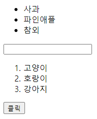 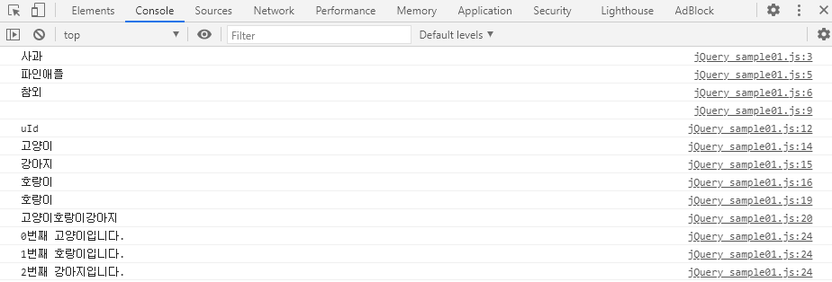

 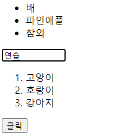	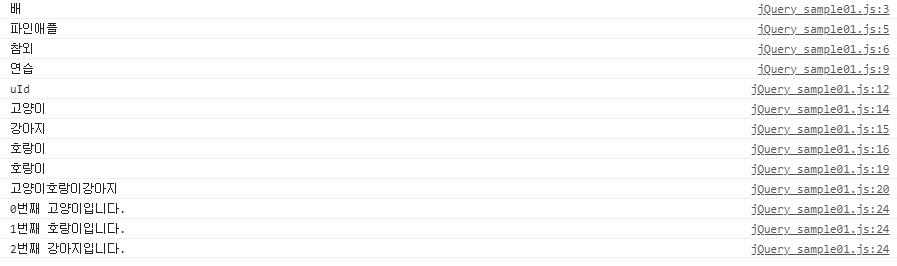 


## 2. jQuery 연습 (2)


### 1) HTML

* `disabled` : 비활성화


> jQuery_sample02.html

```html
<!DOCTYPE html>
<html lang="en">
<head>
    <meta charset="UTF-8">
    <title>Title</title>
    <script
            src="https://code.jquery.com/jquery-2.2.4.min.js"
            integrity="sha256-BbhdlvQf/xTY9gja0Dq3HiwQF8LaCRTXxZKRutelT44="
            crossorigin="anonymous">
    </script>
    <script src="js/jQuery_sample02.js"></script>
    <style>
        .myStyle {
            width: 300px;
            height: 100px;
            background-color: yellow;
        }
    </style>
</head>
<body>
<div>이것은 소리없는 아우성</div>
<div class = "myStyle">
    <ol>
        <li>홍길동</li>
        <li>김길동</li>
    </ol>
</div>
	<ul>
    	<li>김연아</li>
    	<li>이순신</li>
    	<li>강감찬</li>
	</ul>

<input type ="button" value="클릭?" disabled = "disabled">
<input type = button value="클릭" onclick="my_func()">
<input type = button value="스타일 제거" onclick="remove_func()">

</body>
</html>
```


### 2) Javascript

- `addClass()` : class 추가 함수
- `removeAttr()` : 속성 지우는 함수
- `remove()` :  요소 제거 함수
- `empty()` : 후손을 삭제하는 함수 (자신은 x)
- `append()`, `prepend()`, `after()`, `before()` :  tag 생성 시 위치 설정


> jQuery_sample02.js

```javascript
function remove_func() {
    // removeClass : class를 제거
    $('div').removeClass('myStyle')
}

function my_func() {
    $('div').css('color', 'red')
    $('div').css('background-color', 'blue')
    
    // addClass() : class 추가
    $('div').addClass('myStyle')
    
    // removeAttr() : 속성 제거
    $('input[type=button]:first').removeAttr('disabled') 
    
    // remove() : 요소 제거
    $('div.myStyle').remove() 
    
    // empty() : 후손 삭제
    $('div.myStyle').empty()
    


    // 새로운 tag 생성하기
    
    // <div>소리없는 아우성</div>
    let my_div = $('<div></div>').text('소리없는 아우성')

    // 
    let my_img = $('').attr('src','img/sky.jpg')

    // <li>아이유</li>
    let my_li = $('<li></li>').text('아이유')
    
    // element 위치 설정
    // 1. append() : 맨 마지막 자식으로 붙임
          $('ul').append(my_li)
    // 2. prepend() : 맨 처음 자식으로 붙임
          $('ul').prepend(my_li)
    // 3. after() : 바로 다음 형제로 붙임
          $('ul > li:eq(1)').after(my_li)
    // 4. before() : 바로 이전 형제로 붙임
          $('ul > li:last').before(my_li)

}
```


### 3) 출력 화면

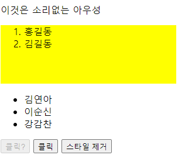 

```javascript
function my_func() {
$('div.myStyle').remove() // 클래스가 myStyle인 div 태그 제거

$('input[type=button]:first').removeAttr('disabled')} // type=button인 disabled 속성 삭제
```

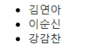 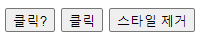

```javascript
// div tag 스타일 변경
// 비권장
function my_func() {
$('div').css('color', 'red') 
$('div').css('background-color', 'blue')}
// 권장
function my_func() {
$('div').addClass('myStyle')} // addClass() : class 추가 후 스타일 적용
```

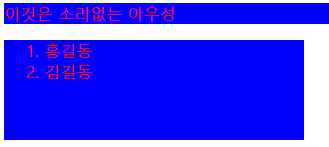 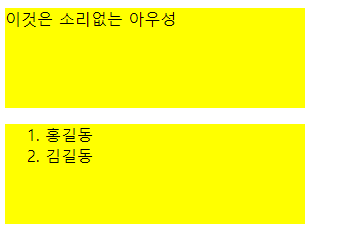 

```javascript
function remove_func() {
$('div').removeClass('myStyle')} // removeClass : myStyle class를 제거
```

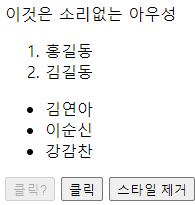 

```javascript
function remove_func() {
    let my_li = $('<li></li>').text('아이유')
    // 1. append() : 맨 마지막 자식으로 붙임
          $('ul').append(my_li)
    // 2. prepend() : 맨 처음 자식으로 붙임
          $('ul').prepend(my_li)
    // 3. after() : 바로 다음 형제로 붙임
          $('ul > li:eq(1)').after(my_li)
    // 4. before() : 바로 이전 형제로 붙임
          $('ul > li:last').before(my_li)}
```

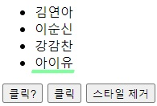 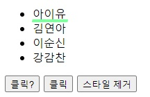 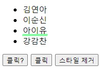 


## 3. jQuery 연습 (3)


### 1) HTML

* **html** `event` 관련 속성
  * `onclick="함수"`: 클릭하면 함수 실행
  * `onmouseover="함수"`: 특정 컴포넌트 위에 마우스가 올라가면 함수 실행
  * `onmouseenter="함수"`: 특정 영역으로 마우스가 들어가면 함수 실행
  * `onmouseleave="함수"`: 특정 영역에서 마우스가 나가면 함수 실행


> jQuery_sample03.html

```html
<!DOCTYPE html>
<html lang="en">
<head>
    <meta charset="UTF-8">
    <title>Title</title>
    <script
            src="https://code.jquery.com/jquery-2.2.4.min.js"
            integrity="sha256-BbhdlvQf/xTY9gja0Dq3HiwQF8LaCRTXxZKRutelT44="
            crossorigin="anonymous"></script>
    <script src="js/jQuery_sample03.js"></script>
    <style>
        .myStyle {
            background-color: yellow;
            color : red;
        }
    </style>
</head>
<body>
    
    <!-- jQuery Event -->
	<h1 onclick="my_func()">여기는 H1 영역입니다.</h1>
	<h1 onmouseover="set_style()">여기는 H1 영역입니다.</h1> 
    <h1 onmouseleave="release_style()">여기는 H1 영역입니다.</h1>
    
    <h1>사용자이름 : 아이유</h1>
    <h1>사용자이름 : 김연아</h1>

    <input type="button" value="클릭" onclick="add_event()">
</body>
</html>
```


### 2) Javascript

`$(document).on('ready', function(event) {})`

* `document` : 전체 문서 창을 의미
* `on()` : 특정 요소에 이벤트 처리능력을 부여
* **on('ready')**
  * 일반적으로 jQuery는 html의 body부분이 호출되기 전에 읽어짐
  * 'ready'로 준비상태 => html 렌더링이 모두 끝나고 난 후 event 실행
* `this`: 현재 이벤트가 발생한 element를 지칭
  * 이벤트가 발생했을때 어떤 element에서 발생했는지를 파악


> jQuery_sample03.js

```javascript
$(document).on('ready',function() {

    $('h1').on('click',function(event) {
        // 어떤 element에서 event 발생
        alert($(this).text())
    })
})

function my_func() {
    alert('클릭됨')
}

function set_style() {
    $('h1').addClass('myStyle')
}

function release_style() {
    $('h1').removeClass('myStyle')
}

function add_event() {
    // h1을 찾아서 해당 element에 event처리 능력을 부여
    $('h1').on('click',function(event) {
        alert('h1 클릭')
    })
}
```

 


## 4. jQuery 연습 (4)


### kakao API 받아오기


1. 애플리케이션 추가


2. 생성한 애플리케이션으로 들어가서 REST API키 복사


3. 제품 탭 - 인공지능 API - 검색 엔진 클릭


4. 개발 가이드를 참고하여 활용
   * https://developers.kakao.com/docs/latest/ko/daum-search/dev-guide


### 1) HTML


> jQuery_sample04.html

```html
<!DOCTYPE html>
<html lang="en">
<head>
    <meta charset="UTF-8">
    <title>Title</title>
    <script
            src="https://code.jquery.com/jquery-2.2.4.min.js"
            integrity="sha256-BbhdlvQf/xTY9gja0Dq3HiwQF8LaCRTXxZKRutelT44="
            crossorigin="anonymous">
    </script>
    <script src="js/jQuery_sample04.js"></script>
</head>
<body>

    <div id="myDiv"></div>
    <input type="button", value="검색엔진 호출"
           onclick="my_search()">
</body>
</html>
```


### 2) Javascript

* AJAX 방식으로 서버프로그램을 호출
  * Daum KAKAO의 이미지 (키워드) 검색 프로그램


> jQuery_sample04.js

```javascript
function my_search() {
    let keyword = '건축학개론'

    $.ajax({
        url : 'https://dapi.kakao.com/v2/search/image',
        type : 'GET',
        dataType : 'json',
        data : {
            query : keyword
        },
        headers : {
            Authorization : 'KakaoAK 307077ab922a695a3942b852bcde6004'
        },
        success : function() {
            alert('호출 성공')
        },
        error : function() {
            alert('호출 실패')
        }
    })
}
```
