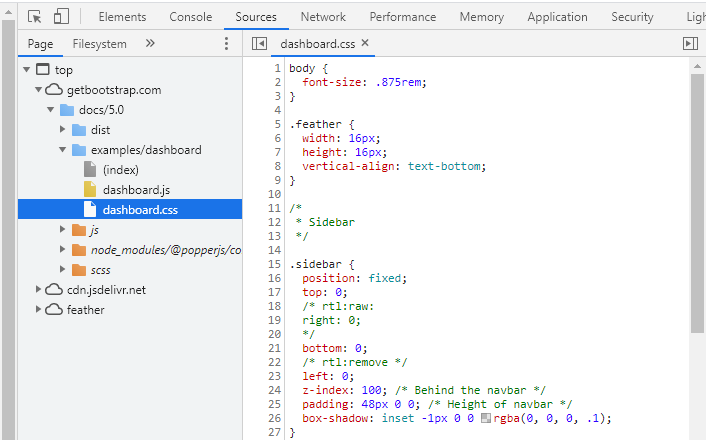

# 04. Web DailyBoxOffice 실습


### Bootstrap의 dashboard 활용

- *Bootstrap* sample의 html 코드를 가져와 실습 진행
  - https://getbootstrap.com/ 
  - examples -> dashboard -> 우클릭 후 페이지 소스 보기 -> 복사


* `index.html`에 붙여넣기 -> 수정


* CDN 복사


* 다시 dashboard -> F12 -> `dashboard.css` 




## 1. 실습 (1)

>순위, 영화제목, 누적관객수, 누적매출액, 개봉일 데이터 가져오기


### 1) HTML

```html
<!doctype html>
<html lang="en">
<head>
    <meta charset="utf-8">
    <title>BoxOffice Search</title>

    <script
            src="https://code.jquery.com/jquery-2.2.4.min.js"
            integrity="sha256-BbhdlvQf/xTY9gja0Dq3HiwQF8LaCRTXxZKRutelT44="
            crossorigin="anonymous">
    </script>


    <!-- Bootstrap core CSS -->
    <!-- Bootstrap CDN -->
    <link href="https://cdn.jsdelivr.net/npm/bootstrap@5.0.0-beta1/dist/css/bootstrap.min.css" rel="stylesheet" integrity="sha384-giJF6kkoqNQ00vy+HMDP7azOuL0xtbfIcaT9wjKHr8RbDVddVHyTfAAsrekwKmP1" crossorigin="anonymous">
    <script src="https://cdn.jsdelivr.net/npm/bootstrap@5.0.0-beta1/dist/js/bootstrap.bundle.min.js" integrity="sha384-ygbV9kiqUc6oa4msXn9868pTtWMgiQaeYH7/t7LECLbyPA2x65Kgf80OJFdroafW" crossorigin="anonymous"></script>

    <style>
        .bd-placeholder-img {
            font-size: 1.125rem;
            text-anchor: middle;
            -webkit-user-select: none;
            -moz-user-select: none;
            user-select: none;
        }

        @media (min-width: 768px) {
            .bd-placeholder-img-lg {
                font-size: 3.5rem;
            }
        }
    </style>


    <!-- Custom styles for this template -->
    <link href="css/dashboard.css" rel="stylesheet">

    <script src="js/dailyBoxOfficeSearch.js"></script>

</head>

<body>

<header class="navbar navbar-dark sticky-top bg-dark flex-md-nowrap p-0 shadow">
    <a class="navbar-brand col-md-3 col-lg-2 me-0 px-3" href="#">BoxOffice</a>
    <button class="navbar-toggler position-absolute d-md-none collapsed" type="button" data-bs-toggle="collapse" data-bs-target="#sidebarMenu" aria-controls="sidebarMenu" aria-expanded="false" aria-label="Toggle navigation">
        <span class="navbar-toggler-icon"></span>
    </button>
    <!-- search 검색창, placeholder : 처음 뜨는 힌트 문구 -->
    <input class="form-control form-control-dark w-100"
           type="text" placeholder="날짜를 입력하세요(yyyymmdd)"
           id="userInputDate" aria-label="Search">

    <ul class="navbar-nav px-3">
        <li class="nav-item text-nowrap">
            <a class="nav-link" href="#"
                onclick="my_func()">검색</a>
        </li>

    </ul>
</header>

<div class="container-fluid">
    <div class="row">
        <nav id="sidebarMenu" class="col-md-3 col-lg-2 d-md-block bg-light sidebar collapse">
            <div class="position-sticky pt-3">
                <ul class="nav flex-column">
                    <li class="nav-item">
                        <a class="nav-link active" aria-current="page" href="#">
                            <span data-feather="home"></span>
                            순위 조회
                        </a>
                    </li>
                </ul>
            </div>
        </nav>

        <main class="col-md-9 ms-sm-auto col-lg-10 px-md-4">

            <!-- <a href="http://www.naver.com">네이버로 이동</a>-->
            <!-- a : hyperlink를 만들어주는 element로 href 속성 다음에 있는 URL로 GET방식의 request 전송 -->

            <h2>일일 BoxOffice 검색 순위</h2>
            <div class="table-responsive">
                <table class="table table-striped table-sm">
                    <thead>
                        <tr>
                            <th>순위</th>
                   	     	<th>영화제목</th>
                    	    <th>누적관객수</th>
                    	    <th>누적매출액</th>
                    	    <th>개봉일</th>
                    	</tr>
                   	</thead>
                    <tbody>
                   		<tr>
                        	<td>1,001</td>
                        	<td>Lorem</td>
                        	<td>ipsum</td>
                        	<td>dolor</td>
                        	<td>sit</td>
                    	</tr>
                    </tbody>
                </table>
            </div>
        </main>
    </div>
</div>

</body>
</html>
```


### 2) Javascript

> 사용자가 입력한 날짜에 대한 boxoffice 순위 가져오기

```javascript
let my_url = open_api + '?key=' + user_key + '&targetDt=' + user_date
location.href = my_url
```

* location.href : page 불러올 때, 새로운 화면으로 refresh => 원하는 작업 불가
  * 위와 같은 문제를 해결하기 위해 JavaScript가 가지고 있는 특별한 통신방식 사용 
  * => **AJAX** 

```javascript
$.ajax({
    url : open_api,     // 호출할 서버쪽 프로그램의 URL, Query string 제외
    type : 'GET',       // 서버쪽 프로그램에 대한 request 방식
    dataType : "json",  // 서버 프로그램이 결과로 보내주는 데이터 형식
    data : {			// 서버 프로그램 호출할 때 넘어가는 데이터
        key : user_key,
        targetDt : user_date
    },
    success : function () {
        alert('서버 호출 성공)
    },
    error : function () {
        alert('서버 호출 실패')
    }
})
```

* **AJAX** : 화면이 refresh 되지 않도록 해주는 데이터 통신 방식
  * 순수 JavaScript 코드 구현을 AJAX 사용하는 것은 너무 어렵고 힘듦
  * jQuery를 이용해서 AJAX를 구현
  * javascript의 객체인 `{key : value}` 이용


```javascript
function my_func() {
    // 사용자가 입력한 날짜를 가져와서 해당 날짜에 대한 
    // boxoffice 순위를 알려주는 서버 쪽 웹 프로그램을 호출하고 그 결과를 화면에 출력
    let user_date = $('#userInputDate').val()
    let user_key = '682ca358e95538a21f1702baa2ddb218'
    let open_api = 'http://www.kobis.or.kr/kobisopenapi/webservice/rest/boxoffice/searchDailyBoxOfficeList.json'

    $.ajax({
        url : open_api,    
        type : 'GET',       
        dataType : "json",  
        data : {            
            key : user_key,
            targetDt : user_date
        },
        // result : 결과 json 데이터 => 단순 문자열인 json 데이터를 javascript 객체로 변환 => dataType에 json명시
        success : function (result) {
            
            // 현재 데이터로 갱신하기 => tbody tag 후손 모두 삭제
            $('#my_tbody').empty()
            
            let movie_list = result["boxOfficeResult"]["dailyBoxOfficeList"]
            
            // for문으로 필요한 요소들을 각각 저장 
            for(let i=0; i<movie_list.length; i++) {
                let m_name = movie_list[i].movieNm
                let m_rank = movie_list[i].rank
                let m_audi = movie_list[i].audiAcc
                let m_sales = movie_list[i].salesAcc
                let m_openDt = movie_list[i].openDt
				
                // tag element 생성
                let tr = $('<tr></tr>')
                let rank_td = $('<td></td>').text(m_rank)
                let name_td = $('<td></td>').text(m_name)
                let audi_td = $('<td></td>').text(m_audi)
                let sales_td = $('<td></td>').text(m_sales)
                let open_td = $('<td></td>').text(m_openDt)
                
                // delete_button
                let delete_td = $('<td></td>')
                let delete_button = $('<input />').attr('type','button').attr('value','삭제')
                // <tr></tr> 삭제
                delete_btn.on('click', function(){
                    $(this).parent().parent().remove() // input -> 부모: td -> td의 부모: tr
                })
                
                // 'tr' element에 각 'td' element 추가
                tr.append(rank_td)
                tr.append(name_td)
                tr.append(audi_td)
                tr.append(sales_td)
                tr.append(open_td)
                
                tr.append(delete_td);
                delete_td.append(delete_btn);
                
                // tr' element를 'tbody' element 안에 삽입
                $('#my_tbody').append(tr)

            }
        },
        error : function () {
            alert('error!')
        }

    })

}
```


## 2. 실습 (2)

### 1) HTML

> dailyBoxOfficeSearch.html

```html
<!doctype html>
<html lang="en">
<head>
    <meta charset="utf-8">
    <title>BoxOffice Search</title>

    <script
            src="https://code.jquery.com/jquery-2.2.4.min.js"
            integrity="sha256-BbhdlvQf/xTY9gja0Dq3HiwQF8LaCRTXxZKRutelT44="
            crossorigin="anonymous"></script>

    <!-- Bootstrap core CSS -->
    <!-- Bootstrap CDN -->
    <link href="https://cdn.jsdelivr.net/npm/bootstrap@5.0.0-beta1/dist/css/bootstrap.min.css" rel="stylesheet" integrity="sha384-giJF6kkoqNQ00vy+HMDP7azOuL0xtbfIcaT9wjKHr8RbDVddVHyTfAAsrekwKmP1" crossorigin="anonymous">
    <script src="https://cdn.jsdelivr.net/npm/bootstrap@5.0.0-beta1/dist/js/bootstrap.bundle.min.js" integrity="sha384-ygbV9kiqUc6oa4msXn9868pTtWMgiQaeYH7/t7LECLbyPA2x65Kgf80OJFdroafW" crossorigin="anonymous"></script>

    <style>
        .bd-placeholder-img {
            font-size: 1.125rem;
            text-anchor: middle;
            -webkit-user-select: none;
            -moz-user-select: none;
            user-select: none;
        }

        @media (min-width: 768px) {
            .bd-placeholder-img-lg {
                font-size: 3.5rem;
            }
        }
    </style>

    <!-- Custom styles for this template -->
    <link href="css/dashboard.css" rel="stylesheet">

    <script src="js/dailyBoxOfficeSearch.js"></script>

</head>
<body>

<header class="navbar navbar-dark sticky-top bg-dark flex-md-nowrap p-0 shadow">
    <a class="navbar-brand col-md-3 col-lg-2 me-0 px-3" href="#">BoxOffice</a>
    <button class="navbar-toggler position-absolute d-md-none collapsed" type="button" data-bs-toggle="collapse" data-bs-target="#sidebarMenu" aria-controls="sidebarMenu" aria-expanded="false" aria-label="Toggle navigation">
        <span class="navbar-toggler-icon"></span>
    </button>
    <input class="form-control form-control-dark w-100"
           type="text" placeholder="날짜를 입력하세요(yyyymmdd)"
           id='userInputDate' aria-label="Search">
    <ul class="navbar-nav px-3">
        <li class="nav-item text-nowrap">
            <a class="nav-link" href="#"
               onclick="my_func()">검색</a>
        </li>
    </ul>
</header>

<div class="container-fluid">
    <div class="row">
        <nav id="sidebarMenu" class="col-md-3 col-lg-2 d-md-block bg-light sidebar collapse">
            <div class="position-sticky pt-3">
                <ul class="nav flex-column">
                    <li class="nav-item">
                        <a class="nav-link active" aria-current="page" href="#">
                            <span data-feather="home"></span>
                            순위조회
                        </a>
                    </li>
                </ul>
            </div>
        </nav>

        <main class="col-md-9 ms-sm-auto col-lg-10 px-md-4">

            <!--
            <a href="http://www.naver.com:80">네이버로 이동</a>
             a element는 hyperlink를 만들어주는 element이고
             href 속성다음에 있는 URL로 GET방식의 request를 보내게 되요!
            -->

            <h2>일일 BoxOffice 검색 순위</h2>
            <div class="table-responsive">
                <table class="table table-striped table-sm">
                    <thead>
                    <tr>
                        <th>순위</th>
                        <th>영화제목</th>
                        <th>포스터</th>
                        <th>누적매출액</th>
                        <th>포스터보기</th>
                    </tr>
                    </thead>
                    <tbody id="my_tbody">
                        <tr>
                            <td>1</td>
                            <td>건축학개론</td>
                            <td></td>
                            <td>500</td>
                            <td>
                                <input type="button" value="포스터 보기">
                            </td>
                        </tr>

                    </tbody>
                </table>
            </div>
        </main>
    </div>
</div>

</body>
</html>
```

### 2) Javascript


```javascript
function my_func(){
    let user_date = $('#userInputData').val()
    let user_key = 'd666cbf6f3b1ff4e48517a6d1b7f3166'
    let open_api = 'http://www.kobis.or.kr/kobisopenapi/webservice/rest/boxoffice/searchDailyBoxOfficeList.json'
    
    $.ajax({
        url : open_api,
        type : 'GET',
        dataType : 'json',
        data : {
            key : user_key,
            targetDt : user_date
        },
        success : function(result) {
            $('#my_tbody').empty()
            
            let movie_list = result['boxOfficeResult']['dailyBoxOfficeList']
            for(let i=0; i<movie_list.length; i++) {
                let m_name = movie_list[i].movieNm
                let m_rank = movie_list[i].rank
                let m_sales = movie_list[i].salesAcc
                

                let tr = $('<tr></tr>')
                let rank_td = $('<td></td>').text(m_rank)
                let title_td = $('<td></td>').text(m_name)
                let img_td = $('<td></td>') // 포스터
                let sales_td = $('<td></td>').text(m_sales)
                let poster_td = $('<td></td>')
                
                // poster button
                let poster_button = $('<input />').attr('type','button')
                    .attr('value','포스터 보기')
                
                // poster button event
                poster_button.on('click',function(){
                    let keyword = '포스터' + m_name;

                    $.ajax({
                        url : "https://dapi.kakao.com/v2/search/image",
                        type : 'GET',
                        dataType : 'json',
                        data : {
                            query : keyword,
                        },
                        headers : {
                            Authorization : 'KakaoAK 7a3ed81af7c2aa2be7912bbb20b5f70b'
                        },
                        success : function(result) {
                            let img_url = result['documents'][2]['thumbnail_url'];
                            let image = $('').attr('src', img_url);
                            img_td.append(image);

                        },
                        error : function () {
                            alert('error!')
                        }
                    })
                })
                
                poster_td.append(poster_button)
                
                tr.append(rank_td)
                tr.append(title_td)
                tr.append(img_td)
                tr.append(sales_td)
                tr.append(poster_td)
                
                $('#my_tbody').append(tr)
            }
        },
        error : function () {
            alert('error!')
        }
    })

}
```

```javascript
function my_func(){
    let user_date = $('#userInputData').val()
    let user_key = 'd666cbf6f3b1ff4e48517a6d1b7f3166'
    let open_api = 'http://www.kobis.or.kr/kobisopenapi/webservice/rest/boxoffice/searchDailyBoxOfficeList.json'
    
    $.ajax({
        url : open_api,
        type : 'GET',
        dataType : 'json',
        data : {
            key : user_key,
            targetDt : user_date
        },
        success : function(result) {
            $('#my_tbody').empty()
            
            let movie_list = result['boxOfficeResult']['dailyBoxOfficeList']
            for(let i=0; i<movie_list.length; i++) {
                let m_name = movie_list[i].movieNm
                let m_rank = movie_list[i].rank
                let m_sales = movie_list[i].salesAcc
                

                let tr = $('<tr></tr>')
                let rank_td = $('<td></td>').text(m_rank)
                let title_td = $('<td></td>').text(m_name)
                let img_td = $('<td></td>') // 포스터
                let sales_td = $('<td></td>').text(m_sales)
                let poster_td = $('<td></td>')
                
                // poster button
                let poster_button = $('<input />').attr('type','button')
                    .attr('value','포스터 보기')
                
                // poster button event
                poster_btn.on('click',function() {
                    let mv_title = $(this).parent().parent().children().eq(1).text()
                    let result_img = $(this).parent().parent().children().find('[data-title]')
                    $.ajax({
                        url : 'https://dapi.kakao.com/v2/search/image',
                        type : 'GET',
                        dataType : 'json',
                        data : {
                            query : mv_title
                        },
                        headers : {
                            Authorization : 'KakaoAK fe9385cf939654f03afaad5ddc06411b'
                        },
                        success : function(result) {
                            img_url = result['documents'][0].thumbnail_url;
                            result_img.attr('src',img_url)
                        },
                        error : function () {
                            alert('error!')
                        }
                    })
                })
                
                poster_td.append(poster_button)
                
                tr.append(rank_td)
                tr.append(title_td)
                tr.append(img_td)
                tr.append(sales_td)
                tr.append(poster_td)
                
                $('#my_tbody').append(tr)
            }
        },
        error : function () {
            alert('error!')
        }
    })

}
```

