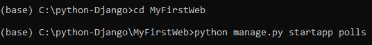
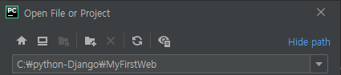
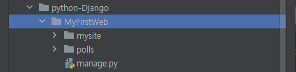

# 05. Web Django 기본


## 1. 기본 개념

### 1) Web server 

* 인터넷을 통해 client의 request가 전달됬을때 이 요청을 처리하는 hardware와 software를지칭
  * 우리는 software 관점에서 공부

- 정적 resource를 서비스하는데 초점

### 2) CGI 

> Common Gateway Interface

* Web server에서 application을 수행시키기 위한 규약

- 정적인 기능을 하는 Web server에 동적인 프로그램을 수행시킬수 있는 기능을 부여 (C, Perl ) 
- 클라이언트 request => Web server (Apache, NginX) => Web server가 직접 프로그램 실행
- Web server의 과부하, 부담 증가

### 3) WAS

> Web Application Server

* 일반적으로 Web server와 Web application을 동작시킬수 있는 Container를 분리
* 여러 프로그램의 집합 및 해당 프로그램이 돌아가는 컴퓨터

- 클라이언트 request => Web server => WAS (Tomcat, jBOss) => 프로그램 실행 (개발자가 구현)

### 4) WSGI

> Web Server Gateway Interface

* Python에 종속된 개념으로 Python script (Web application)가 웹 서버와 통신하기 위한 규약

- 클라이언트 request => Web server =>  WSGI server (Middleware) => WSGI 규약을 준수하는 웹 어플리케이션 실행 (Django, Flask)
-  WSGI Middleware = WSGI Module + WSGI Process 
  - `WSGI middleware`는 Web 서버와 application을 연결  (WAS 역할)
  - WSGI module과 WSGI Process는 WSGI 전용 프로토콜로 연동
    - WSGI module : Web Server
    - WSGI Process : Container


## 2. Django

> Python으로 만들어진 open source Web application Framework


### 1) MVT 패턴

* Software Design Pattern : 프로그램 전체 구조 설계에 대한 방법론
  * 예) MVC Pattern, Singleton Pattern, Observer Pattern

* Django framework에서는 MVC를 **MVT**로 표현
  * MVC (Model - View - Controller) :
    * `Model` : data, `View` : UI, `Controller` : business logic
  * MVT (Model - View - Template) :
    * `Model` : data, `View` : business logic, `Template` : UI
* web client -> URLConf -> View -> CRUD -> Model -> ORM -> Database -> Template -> HTML -> View -> response -> web client


### 2) ORM

* Object Relational Mapping  (객체 관계 매핑)

- Python의 class, object를 이용해서 database를 제어
- 내부적으로 SQL을 자동생성하여 사용


### 3) 관리자 page가 자동으로 생성


### 4) Elegant URL

* 일반적으로 웹 프로그램에서 URL Design을 직관적이고 쉽게 표현 가능


## 3. 용어정리

- Server Side Web application
  - project : 우리가 개발하는 전체 프로그램 (우리가 구현하는 site)
  - application : 우리 프로젝트 내에서 모듈화된 단위 program
- Database
  - 계층형 database (Tree 구조) : 초창기의 DB 시스템, 탑다운 방식, 데이터 간의 연동이 어려움
  - Network database (Graph 구조) : 데이터의 연동이 쉬우나 구현이 어렵다.
  - Relation database (Table 구조) : Relation 논문을 기반으로 IBM의 DB2 개발
  - 객체-관계형 DB : 객체지향의 개념을 관계형 데이터베이스에 포함시킴
    - 정형 데이터 처리에 적합 
  - 몽고 DB
    - 비정형 데이터를 위한 database


## 4. Project 설계 

> 설문조사 Web Program

**화면 UI 설계**

- index.html : 
  - 취미가 뭐에요?, 가장 좋아하는 연예인은?, 어디에 살고 있어요?
- detail.html : 
  - 아이유, 김연아, 홍길동, '투표 버튼'
- result.html :
  - 아이유 - 5표, 김연아 - 7표, 홍길동 - 1표, '첫 화면으로'


**Database Table 설계**

* Question table : 
  * `id` (숫자, 자동생성(시퀀스), Primary Key, not null), `question - text` (문자열, not null), `pub - date` (날짜, not null)

* Choice table :
  * `id`, `choice - text` (문자열), `votes` (숫자), `question_id`(Foreign key)


## 5. Django 실습

> Django를 이용하여 MyFirstWeb 프로젝트 진행

1. *anaconda prompt*에서 프로젝트 생성

```python
> conda install django
> python -m django --version

> cd .. 								# 경로 지정
> mkdir python-Django 					# 폴더 생성
> cd python-Django 						# 경로 이동
> django-admin startproject mysite 		# 프로젝트 시작
```


2. mysite의 최상위 폴더 이름을 MyFirstWeb으로 변경
3. *anaconda prompt*에서 어플리케이션 생성

```python
> cd MyFirstWeb 						# 최상위 폴더로 이동
> python manage.py startapp polls 		# 어플리케이션 생성
```



3. *pycharm*을 이용해 만들어둔 프로젝트를 불러오기





4. mysite/settings.py 

```python
ALLOWED_HOSTS = ['localhost','127.0.0.1']
```

```python
INSTALLED_APPS = [
    'django.contrib.admin',
    'django.contrib.auth',
    'django.contrib.contenttypes',
    'django.contrib.sessions',
    'django.contrib.messages',
    'django.contrib.staticfiles',
    'users.apps.PollsConfig' # 추가
]
```

```python
TEMPLATES = [
    {
        'BACKEND': 'django.template.backends.django.DjangoTemplates',
        'DIRS': [os.path.join(BASE_DIR),'templates'],
```

```python
TIME_ZONE = 'Asia/Seoul'
```

```python
STATICFILES_DIRS = [
    os.path.join(BASE_DIR,'static')
]
```

5. *pycharm terminal*

```python
>python manage.py migrate		# db.sqlite3 생성
>python manage.py runserver		# server 동작
```


5. `localhost:8000` 접속


### **현재까지 진행한 Project의 폴더 구조**

* MyFirstWeb : Project
  - db.sqlite3 : database파일
  - manage.py
  - mysite : Project 폴더
    - __ init __.py
    - setting.py : Project의 전체 설정
    - urls.py : project level의 URL pattern을 정의하는 URL conf파일
    - wsgi.py : Apache와 같은 WebServer와 연동하기 위한 설정 
  - polls : application 폴더
    - admin.py : Admin site(관리자 page)에 model class 등록(database연동)
    - apps.py : application의 설정 class를 정의하는 파일
    - migrations : database 변경사항을 관리하기 위한 폴더
    - models.py : database로 모델 class를 정의하는 파일
    - views.py : View함수(로직 처리)를 정의하는 파일


