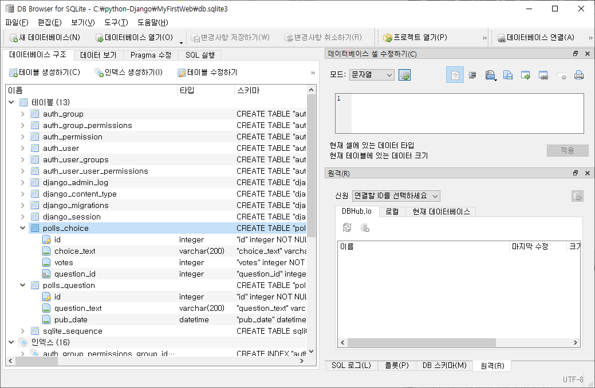
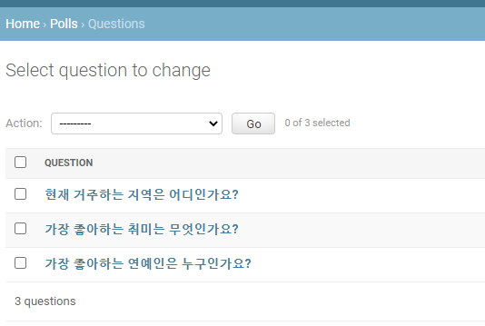

# 06. Web Django MyFirstWeb 실습

> Django를 이용하여 MyFirstWeb 투표 만들기


## 1. 실습 1단계_0128

1. *anaconda prompt*에서 프로젝트 생성

```python
> conda install django
> python -m django --version

> cd .. 								# 경로 지정
> mkdir python-Django 					# 폴더 생성
> cd python-Django 						# 경로 이동
> django-admin startproject mysite 		# 프로젝트 시작
```


2. 폴더 이름 **MyFirstWeb**으로 변경
3. *anaconda prompt*에서 어플리케이션 생성

```python
> cd MyFirstWeb 						# 최상위 폴더로 이동
> python manage.py startapp polls 		# 어플리케이션 생성
```


4. *pycharm*을 이용해 만들어둔 프로젝트를 불러오기


5. `mysite/settings.py`에서 설정 변경

```python
ALLOWED_HOSTS = ['localhost','127.0.0.1']
```

```python
INSTALLED_APPS = [
    'django.contrib.admin',
    'django.contrib.auth',
    'django.contrib.contenttypes',
    'django.contrib.sessions',
    'django.contrib.messages',
    'django.contrib.staticfiles',
    'polls.apps.PollsConfig' # 추가
]
```

```python
TIME_ZONE = 'Asia/Seoul'
```


6. *pycharm terminal* 에서 DB 생성

```python
>python manage.py migrate		# db.sqlite3 생성
>python manage.py runserver		# server 동작
```


7. *anaconda prompt*에서 관리자 계정 생성

```
> python manage.py createsuperuser

Username (leave blank to use 'mina'): mina
Email address: mina49140@naver.com
Password:
Password (again):
```


8. `polls/models.py`에서 Database의 Table 생성

  ```python
from django.db import models

class Question(models.Model): # 이렇게 정의되는 class가 데이터베이스의 Table과 mapping
                              # Table의 column 속성으로 표현 => Model 상속
    question_text = models.CharField(max_length=200) # 문자열
    pub_date = models.DateTimeField('date published')

    def __str__(self):				# class 객체 표현 수정 가능
        return self.question_text 	# 안하면 question 출력했을 때 메모리 주소 출력 => 항목 출력으로!

class Choice(models.Model):
    choice_text = models.CharField(max_length=200)
    votes = models.IntegerField(default=0) # 정수 필드 -> 초기값 0
    question = models.ForeignKey(Question, on_delete = models.CASCADE)
              # question_id로 컬렴명 자동으로 변경됨
              # 특정 테이블(Question class)의 primary key = foreign key
              # on_delete : Question key에서 지워지면 Foreign에서도 지워짐
              #             -> 참조무결성 유지, 제약사항 영향 x

    def __str__(self):
        return self.choice_text
  ```

  

9. `polls/admin.py`에서 class 기록

```python
from polls.models import Question, Choice

admin.site.register(Question)
admin.site.register(Choice)
```


10. 새로운 *pycharm terminal* 에서 DB 저장

```python
>python manage.py makemigrations  # 변경사항을 파일로 기록
```

* 0001_initial.py 파일 생성됨


11. *local terminal*에서 DB 변경

```python
>python manage.py migrate		# 변경사항을 바탕으로 DB 작성
```


**[데이터베이스 확인]**

* *DB Browser for SQLite* 다운로드
* https://sqlitebrowser.org/


- DB Browser for SQLite.exe로 DB확인

  [](https://github.com/UYounghyun/TIL/blob/master/web/md-images/image-20210128131105029.png)


12. `polls/templates/index.html` 생성


```html
<!DOCTYPE html>
<html lang="en">
<head>
    <meta charset="UTF-8">
    <title>Title</title>
</head>
<body>
    
        <ul>
            
                <li><a href="/polls/{{ question.id }}"> {{ question.question_text }} </a></li>
                <!--<a href="">: 클릭가능한 하이퍼링크'-->
            
        </ul>
    
        <h1>데이터 없음</h1>
    
</body>
</html>
```


13. `mysite/urls.py`에서 URLCONF 추가

```python
from django.contrib import admin
from django.urls import path
from polls import views

urlpatterns = [
    path('admin/', admin.site.urls),           # https://localhost:8000/admin
    path('polls/', views.index, name='index')  # https://localhost:8000/polls
                                               # views의 index 호출하라고 지시
]
```


14. `polls/views.py`

```python
from polls.models import Question

def index(request): # django가 객체로 만들어줌 -> 데이터베이스에서 설문목록 가져오기
                    # (테이블명 : polls_question, 클래스명 : Question)
    question_list = Question.objects.all().order_by('-pub_date')[:5] # pub_date 컬럼 오름차순 정렬 -> -pub_date : 내림차순
    # data 전달용 dictionary 만들기
    context = {'q_list': question_list}
    return render(request, 'index.html', context) # request + model data + index.html => view에 결과 도출
```


15. *admin site*에서 설문작성




16. 선택지 작성


17. 화면 출력


## 2. 실습 2단계_0129

1. `mysite/url.py`에서 urls 분리

```python
from django.contrib import admin
from django.urls import path, include

urlpatterns = [
    path('admin/', admin.site.urls),
    path('polls/', include('polls.urls'))      # 루트의 urls.py에 모든 주소를 기입하는 것은 불가능
    										   # 다른 url 파일에게 config 처리 넘김
                                               # polls라는 app안에도 url 추가해야
]
```


2. `polls/url.py` 생성

```python
from django.urls import path
from . import views

app_name = 'polls'

urlpatterns = [
    path('', views.index, name='index')  # polls/ app안의 url은 모두 여기에
]
```


3. `settings.py`에서 templates 추가

```python
TEMPLATES = [
    {
        'BACKEND': 'django.template.backends.django.DjangoTemplates',
        'DIRS': [os.path.join(BASE_DIR, 'templates')], # 추가
        'APP_DIRS': True,
        'OPTIONS': {
            'context_processors': [
                'django.template.context_processors.debug',
                'django.template.context_processors.request',
                'django.contrib.auth.context_processors.auth',
                'django.contrib.messages.context_processors.messages',
            ],
        },
    },
]
```


4. polls/templates/polls/ 폴더 만든 후 `index.html` 생성


5. `views.py` 에서  'polls/index.html' 경로 지정

```python
from django.shortcuts import render
from polls.models import Question

def index(request): 
    question_list = Question.objects.all().order_by('-pub_date')[:5]  
    context = {'q_list': question_list}
    return render(request, 'polls/index.html', context) # 경로 지정
```


6. `polls/urls.py`에서 설문 페이지 연결

```python
from django.urls import path
from . import views

app_name = 'polls'

urlpatterns = [
    path('', views.index, name='index'),  
    # polls/ -> polls: index, app안의 url은 모두 여기에
    path('<int:question_id>/', views.detail, name = 'detail')
    # polls/숫자/ 로 url
]
```


7. `polls/views`에 detail 추가

```python
from django.shortcuts import render
from polls.models import Question

def index(request): # django가 객체로 만들어줌 -> 데이터베이스에서 설문목록 가져오기
                    # (테이블명 : polls_question, 클래스명 : Question)
    question_list = Question.objects.all().order_by('-pub_date')[:5] 
    # pub_date 컬럼 오름차순 정렬 -> -pub_date : 내림차순
    # data 전달용 dictionary 만들기
    context = {'q_list': question_list}
    return render(request, 'polls/index.html', context) 
    # request + model data + index.html => view에 결과 도출

def detail(request, question_id):
    # 숫자 question_id로 들어옴 -> 설문에 대한 primary key
    question = get_object_or_404(Question, pk = question_id) 
    # 객체를 가져옴 or 없으면 error 404
    context = {'selected_question': question}
    return render(request, 'polls/detail.html', context)

```


8. `polls/detail.html` 생성

> vote  하나씩 만들기

```html
<!DOCTYPE html>
<html lang="en">
<head>
    <meta charset="UTF-8">
    <title>Title</title>
</head>
<body>
    <h1>{{ selected_question.question_text }}</h1>
    <form action = '#' method = '#'>
    
        <input type = 'radio' name = 'my_choice' id = 'kaka01'>
        <label for="kaka01">아이유</label><br>
        <input type = 'radio' name = 'my_choice' id = 'kaka02'>
        <label for="kaka02">김연아</label><br>
        <input type = 'radio' name = 'my_choice' id = 'kaka03'>
        <label for="kaka03">서현진</label> -->
    </form>
</body>
</html>
```

> vote 한번에 만들기

```html
<!DOCTYPE html>
<html lang="en">
<head>
    <meta charset="UTF-8">
    <title>Title</title>
</head>
<body>
    <h1>{{ selected_question.question_text }}</h1>
    <form action = '#' method = '#'>
    
        
        <!-- choice class 의 instance -> selected_question과 foreign key로 연결된 choice table 객체의 집합 전체 -->
        
        <input type = 'radio' name = 'my_choice' id = 'kaka{{ forloop.counter }}'>  <!--  forloop.counter: for와 매칭 -->
        <label for="kaka{{ forloop.counter }}">{{ choice.choice_text }}</label><br> <!--choice 항목-->
        
    </form>
</body>
</html>
```

> POST 방식으로 request 전달 / 투표 버튼 만들기 / value 값 추가

```html
<!DOCTYPE html>
<html lang="en">
<head>
    <meta charset="UTF-8">
    <title>Title</title>
</head>
<body>
    <h1>{{ selected_question.question_text }}</h1>
    <form action = '' method = 'POST'> 
        <!-- POST 방식으로 request 전달 => 서버 프로그램 이 url 이용 polls라는 name space안의 vote -->        
    
        
        
        <input type = 'radio' name = 'my_choice' id = 'kaka{{ forloop.counter }}'>
               value = '{{ choice.id }}'> <!-- 서버에 value 값 추가: my_choice = choice.id 처럼  -->       
        <label for="kaka{{ forloop.counter }}">{{ choice.choice_text }}</label><br> 
        <br>
        <input type="submit" value = '투표'> <!-- 투표 버튼 -->
    </form>
</body>
</html>
```


9. `urls.py`에 vote 추가

```python
from django.urls import path
from . import views

app_name = 'polls'

urlpatterns = [
    path('', views.index, name='index'), 
    path('<int:question_id>/', views.detail, name='detail'), 
    path('<int:question_id>/vote/', views.vote, name='vote') # polls:vote
    # http://localhost:8000/polls/1/vote
]
```


10. `views.py`에 vote 추가

```python
from django.shortcuts import render, get_object_or_404
from polls.models import Question

def index(request): 
    question_list = Question.objects.all().order_by('-pub_date')[:5] 
    context = {'q_list': question_list}
    return render(request, 'polls/index.html', context) 

def detail(request, question_id):
    question = get_object_or_404(Question, pk = question_id) 
               # 객체를 가져옴 or 없으면 error 404
    context = {'selected_question': question}
    return render(request, 'polls/detail.html', context)

def vote(request, question_id):
    question = get_object_or_404(Question, pk=question_id)
    selected_choice = question.choice_set.get(pk=request.POST['my_choice']) 
                                                   # choice의 id -> my_choice
    selected_choice.votes += 1
    selected_choice.save()

    context = {'selected_question': question}
    return render(request, 'polls/detail.html', context)
```


11. `detail.html` 에 error message 추가

```html
<!DOCTYPE html>
<html lang="en">
<head>
    <meta charset="UTF-8">
    <title>Title</title>
</head>
<body>
    <h1>{{ selected_question.question_text }}</h1>
    
    <div>{{ error_message }}</div>
    
    <form action = ''
          method = 'POST'>
    
        
        <input type = 'radio'
               name = 'my_choice'
               id = 'kaka{{ forloop.counter }}'
               value = '{{ choice.id }}'>
        <label for="kaka{{ forloop.counter }}">
        {{ choice.choice_text }}</label><br>
        <br>
        <input type="submit" value = '투표'>
    </form>
</body>
</html>
```


12. `views.py`의 vote에  error message 추가

```python
from django.shortcuts import render, get_object_or_404
from polls.models import Question,Choice
from django.http import HttpResponseRedirect
from django.urls import reverse # url config에 있는 name을 url 형태로 변경

def index(request): 
    question_list = Question.objects.all().order_by('-pub_date')[:5] 
    context = {'q_list': question_list}
    return render(request, 'polls/index.html', context) 

def detail(request, question_id):
    question = get_object_or_404(Question, pk = question_id) 
    context = {'selected_question': question}
    return render(request, 'polls/detail.html', context)

def vote(request, question_id):
    question = get_object_or_404(Question, pk=question_id)
    try:
        selected_choice = question.choice_set.get(pk=request.POST['my_choice']) # choice의 id -> my_choice
    except(KeyError,Choice.DoesNotExist): # PK가 없어서  KeyError 발생할 경우
        return render(request, 'polls/detail.html',{
            'selected_question': question,
            'error_message': '아무것도 선택하지 않음'
        })
    else:
        selected_choice.votes += 1
        selected_choice.save()
                # reverse() : urls.py(URLConf)에 있는 name을 이용해서 url 형식으로 변환
                # 클라이언트 http 브라우징 x -> url 보여줄테니 다시 요청해
        return HttpResponseRedirect(reverse('polls:results'))
                # return HttpResponse() 클라이언트 브라우징 끝
```


13. `urls.py`에 results 추가

```python
from django.urls import path
from . import views

app_name = 'polls'

urlpatterns = [
    path('', views.index, name='index'), 
    path('<int:question_id>/', views.detail, name='detail'), 
    path('<int:question_id>/vote/', views.vote, name='vote'), 
    path('<int:question_id>/results/', views.results, name='results') 
    # polls:results
    # http://localhost:8000/polls/1/results/
]
```


14. `views.py`에 results  추가

```python
from django.shortcuts import render, get_object_or_404
from polls.models import Question,Choice
from django.http import HttpResponseRedirect
from django.urls import reverse # url config에 있는 name을 url 형태로 변경

def index(request): 
    question_list = Question.objects.all().order_by('-pub_date')[:5] 
    context = {'q_list': question_list}
    return render(request, 'polls/index.html', context) 

def detail(request, question_id):
    question = get_object_or_404(Question, pk = question_id) 
    context = {'selected_question': question}
    return render(request, 'polls/detail.html', context)

def vote(request, question_id):
    question = get_object_or_404(Question, pk=question_id)
    try:
        selected_choice = question.choice_set.get(pk=request.POST['my_choice'])
    except(KeyError,Choice.DoesNotExist): 
        return render(request, 'polls/detail.html',{
            'selected_question': question,
            'error_message': '아무것도 선택하지 않음'
        })
    else:
        selected_choice.votes += 1
        selected_choice.save()
        return HttpResponseRedirect(reverse('polls:results',  
                                            args=(question.id,)))  
        # args 설문 정보 -> 인자 1개인 tuple

def results(request, question_id):
    question = get_object_or_404(Question, pk=question_id) # 아까와 같은 질문
    return render(request, 'polls/results.html',{'question': question}) # 질문 객체로 화면 브라우징
```


15. `result.html` 생성

```html
<!DOCTYPE html>
<html lang="en">
<head>
    <meta charset="UTF-8">
    <title>Title</title>
</head>
<body>
    <h1>{{ question.question_text }}</h1>
    <ul>
         
        <!-- 해당 질문 당 choice 항목 다 가져옴 -->
            <li>{{ choice.choice_text }} - {{ choice.votes }}</li>
        
    </ul>
    <a href =''>다시 투표</a>
</body>
</html>
```


16. 결과


