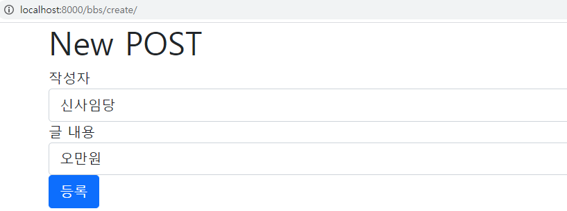

# 07. Web Django MyShoppingMall 실습

> Django를 이용하여 MyShoppingMall 게시판 만들기


## 1. 실습 1단계

1. *anaconda prompt*에서 프로젝트 생성

```
(base) C:\>cd python-Django

(base) C:\python-Django>django-admin startproject shoppingmall
```

2. 폴더 이름 **MyShoppingMall**으로 변경
3. *anaconda prompt*에서 어플리케이션 생성

```
(base) C:\python-Django\MyShoppingMall>python manage.py startapp bbs
```

4. *pycharm*을 이용해 만들어둔 프로젝트를 불러오기
5. `mysite/settings.py`에서 설정 변경

```python
ALLOWED_HOSTS = ['localhost','127.0.0.1']
```

```python
INSTALLED_APPS = [
    'django.contrib.admin',
    'django.contrib.auth',
    'django.contrib.contenttypes',
    'django.contrib.sessions',
    'django.contrib.messages',
    'django.contrib.staticfiles',
    'bbs.apps.BbsConfig' # 추가
]
```

```python
TIME_ZONE = 'Asia/Seoul'
```

```python
TEMPLATES = [
'DIRS': [os.path.join(BASE_DIR, 'templates')],
```

```python
TIME_ZONE = 'Asia/Seoul'
```

```python
STATICFILES_DIRS = [
    os.path.join(BASE_DIR,'static'),
]
```

6. *pycharm terminal* 에서 DB 생성

```python
>python manage.py migrate		# db.sqlite3 생성
>python manage.py runserver		# server 동작
```

7. *anaconda prompt*에서 관리자 계정 생성

```
> python manage.py createsuperuser

Username (leave blank to use 'mina'): mina
Email address: mina49140@naver.com
Password:
Password (again):
```

8. `models.py`에서 Database의 Table 생성

  ```python
from django.db import models

# bbs_post 라는 table로 Database 생성
# class의 속성이 table의 column이 됨

class Post(models.Model):
    author = models.CharField('작성자', max_length=20)
    contents = models.CharField('글 내용', max_length=100)
  ```

9. `admin.py`에서 class 기록

```python
from django.contrib import admin
from bbs.models import Post
# Register your models here.

admin.site.register(Post)
```

10. 새로운 *pycharm terminal* 에서 DB 저장

```python
>python manage.py makemigrations 
```

11. *local terminal*에서 DB 변경

```python
>python manage.py migrate		
```


## 2. 실습 2단계


1. `urls.py` 

```python
# 먼저 Root-URLCONF에서 설정

from django.contrib import admin
from django.urls import path
from django.conf.urls import url
# view함수가 아닌 html을 바로 호출
from django.views.generic.base import TemplateView  # template file 결과로 바로 view


# Url pattern 설정할때 사용할 수 있는 함수
# url(), path(), re_path()
# url() : 예전에 사용했던 함수, 정규표현식을 포함해서 일반적인 설정이 가능
# 사용하기 힘들어 path(), re_path()로 분리 (2.0 이후)
# path() : 일반 문자역 형태로 url conf할 때
# re_path() : 정규표현식(regular expression)으로 url conf할떄
# 정규표현식 = [a-z] : 영문 소문자로 이루어진 1개 ex) s
# 정규표현식 = [a-z]{3} : 영문 소문자로 이루어진 3개 ex) asd
# ^(Caret) : 문자열의 시작, $ : 문자열의 끝

#http://localhost:8000/
urlpatterns = [
    url(r'^$', TemplateView.as_view(template_name='index.html')),  # '' 문자열 시작/끝
    path('admin/', admin.site.urls),
]
```


2. `index.html` 생성

* bootstrap의 cover 이용(https://getbootstrap.com/)
* cover 페이지 소스와 bootstrap CDN  복사

           

* `index.html`에 붙여넣기

```html
<!doctype html>
<html lang="en" class="h-100">
  <head>
    <meta charset="utf-8">
    <title>Welcome My Shopping Mall</title>

    <!-- Bootstrap core CSS(CDN) -->
<link href="https://cdn.jsdelivr.net/npm/bootstrap@5.0.0-beta1/dist/css/bootstrap.min.css" rel="stylesheet" integrity="sha384-giJF6kkoqNQ00vy+HMDP7azOuL0xtbfIcaT9wjKHr8RbDVddVHyTfAAsrekwKmP1" crossorigin="anonymous">
<script src="https://cdn.jsdelivr.net/npm/bootstrap@5.0.0-beta1/dist/js/bootstrap.bundle.min.js" integrity="sha384-ygbV9kiqUc6oa4msXn9868pTtWMgiQaeYH7/t7LECLbyPA2x65Kgf80OJFdroafW" crossorigin="anonymous"></script>

    <style>
      .bd-placeholder-img {
        font-size: 1.125rem;
        text-anchor: middle;
        -webkit-user-select: none;
        -moz-user-select: none;
        user-select: none;
      }

      @media (min-width: 768px) {
        .bd-placeholder-img-lg {
          font-size: 3.5rem;
        }
      }
    </style>


    <!-- Custom styles for this template -->
    <link href="/static/css/cover.css" rel="stylesheet">
  </head>
  <body class="d-flex h-100 text-center text-white bg-dark">
    
<div class="cover-container d-flex w-100 h-100 p-3 mx-auto flex-column">
  <header class="mb-auto">
    <div>
      <h3 class="float-md-start mb-0">Cover</h3>
      <nav class="nav nav-masthead justify-content-center float-md-end">
      </nav>
    </div>
  </header>

  <main class="px-3">
    <h1>Welcome My Shopping Mall</h1>
    <p class="lead">Only Board.</p>
    <p class="lead">
      <a href="/bbs/list" class="btn btn-lg btn-secondary fw-bold border-white bg-white">
          Enter bbs</a>
    </p>
  </main>

  <footer class="mt-auto text-white-50">
    <p>Cover template for <a href="https://getbootstrap.com/" class="text-white">Bootstrap</a>, by <a href="https://twitter.com/mdo" class="text-white">@mdo</a>.</p>
  </footer>
</div>


    
  </body>
</html>
```

* static/css에 cover.css 파일 저장

 


3. `shoppingmall/urls.py`

```python
from django.contrib import admin
from django.urls import path,include
from django.conf.urls import url
from django.views.generic.base import TemplateView # template file 결과로 바로 view

#http://localhost:8000/
urlpatterns = [
    url(r'^$',TemplateView.as_view(template_name = 'index.html')),  # r'^$' : ''
    path('admin/', admin.site.urls),
    path('bbs/', include('bbs.urls'))
]
```


4. `bbs/urls.py` 생성

```python
from django.urls import path
from . import views

app_names = 'bbs'

urlpatterns = [
    path('list/',views.p_list, name = 'p_list'),
]
```


5. `views`

```python
from bbs.models import Post

def p_list(request):
    posts = Post.objects.all()
    # 데이터베이스의 모든 글의 내용을 다 들고와야 함
```


6. `templates/base.html` 생성

> jquery 이용

```html
<!DOCTYPE html>
<html lang="en">
<head>
    <meta charset="UTF-8">
    <title></title>
    <!--jQuery CDN -->
    <script src="https://code.jquery.com/jquery-2.2.4.min.js" integrity="sha256-BbhdlvQf/xTY9gja0Dq3HiwQF8LaCRTXxZKRutelT44=" crossorigin="anonymous"></script>
    <!--Bootstrap CDN -->
    <link href="https://cdn.jsdelivr.net/npm/bootstrap@5.0.0-beta1/dist/css/bootstrap.min.css" rel="stylesheet" integrity="sha384-giJF6kkoqNQ00vy+HMDP7azOuL0xtbfIcaT9wjKHr8RbDVddVHyTfAAsrekwKmP1" crossorigin="anonymous">
    <script src="https://cdn.jsdelivr.net/npm/bootstrap@5.0.0-beta1/dist/js/bootstrap.bundle.min.js" integrity="sha384-ygbV9kiqUc6oa4msXn9868pTtWMgiQaeYH7/t7LECLbyPA2x65Kgf80OJFdroafW" crossorigin="anonymous"></script>

</head>
<body>
    
    
</body>
</html>
```


7. `bbs/templates/bbs/list.html` 생성

```html
 <!-- 가져다가 확장 
  container로 치환 -->
    <script src="/static/js/posts.js"></script>
    <div class="container"> <!-- bootstrap CDN 스타일 -->
        <h1>Bulletin Board System(BBS)</h1>
        <button type = 'button'
                class = 'btn btn-primary'
                onclick="new_post()">새글작성</button>
        <div class="m-1"></div>
    </div>

```


8. 출력 화면


9. `bbs/list.html` 수정

* bootstrap의 dashboard 이용(https://getbootstrap.com/)
* cover 페이지 소스  복사


```html
 <!-- 가져다가 확장 -->

  <!-- container로 치환 -->

    <script src="/static/js/posts.js"></script>
    <div class="container"> <!-- bootstrap CDN 스타일 -->
        <h1>Bulletin Board System(BBS)</h1>
        <button type = 'button'
                class = 'btn btn-primary'
                onclick="new_post()">새글작성</button>
        <div class="m-1"></div>
            <div class="table-responsive">
        <table class="table table-striped table-sm">
          <thead>
            <tr>
              <th>#</th>
              <th>글 작성자</th>
              <th>글 내용</th>
              <th>수정</th>
              <th>삭제</th>
            </tr>
          </thead>
          <tbody>
            <tr>
              <td>1</td>
              <td>홍길동</td>
              <td>소리없는 아우성</td>
              <td>버튼 1</td>
              <td>버튼 2</td>
            </tr>
          </tbody>
        </table>
            </div>
    </div>



```


10. 출력 화면


11. *admin site*에서 add post

* http://localhost:8000/admin/bbs/post/


12. `models.py`에 def __ str __(self): 추가 

* 데이터 내용 출력하기

```python
from django.db import models

# Create your models here.

# bbs_post 라는 table로 Database 생성
# class의 속성이 table의 column이 됨

class Post(models.Model):
    author = models.CharField('작성자', max_length=20)
    contents = models.CharField('글 내용', max_length=100)
    
    def __str__(self):
        return self.contents # self의 객체 내용 출력
```


13. 출력 화면


14. `list.html` posts 내용으로 바꾸기

```html
<tbody>
  
  <tr>
    <td>{{ post.id }}</td>
    <td>{{ post.author }}</td>
    <td>{{ post.contents }}</td>
    <td>버튼 1</td>
    <td>버튼 2</td>
  </tr>
  
</tbody>
```


15. 출력 화면 posts 내용으로 변경


```html
<input type = "text" <!-- 입력상자 -->
```


**[문제발생]**  modelsform : 겉은 boots 인데 model만 css x => 화면 깨짐


16. *pycharm terminal* 

```
> pip install django-bootstrap4
```


17. `settings.py`에 bootstrap4 추가

```python
INSTALLED_APPS = [
    'django.contrib.admin',
    'django.contrib.auth',
    'django.contrib.contenttypes',
    'django.contrib.sessions',
    'django.contrib.messages',
    'django.contrib.staticfiles',
    'bbs.apps.BbsConfig',
    'bootstrap4' # 추가
]
```


18. `bbs/forms.py` 생성

```python
# 여기서 ModelForm class를 정의
# ModelForm이 자동으로 Form field(HTML tag)를 생성
# Form 처리를 간단하게
from django import forms
from bbs.models import Post


class PostForm(forms.ModelForm):
    class Meta:
        model = Post
        fields = ['author', 'contents'] # Post 모델 안의 모든 것 이용 x -> 사용할 필드만 
                                        # 따로 Home field로 generation
```


19. `posts.js` 생성

```javascript
function new_post() {
    location.href = '/bbs/create'
}
```


20. `bbs/urls.py`에 p_create 추가

```python
from django.urls import path
from . import views

app_names = 'bbs'

urlpatterns = [
    path('list/',views.p_list, name = 'p_list'), 
    path('create/',views.p_create, name = 'p_create')
]
```


21. `views.py`에 p_create 추가

```python
from django.shortcuts import render
from bbs.models import Post
from bbs.forms import PostForm

def p_list(request):
    posts = Post.objects.all().order_by('-id')
    # 데이터베이스의 모든 글의 내용을 다 들고와야 함
    # order_by: 최신글 정렬
    return render(request, 'bbs/list.html',
                  {'posts': posts})

def p_create(request):   
    # get 방식
    post_form = PostForm()
```


22. `bbs/create.html` 생성

```html



    <div class="container">
        <h1>New POST</h1>
        <form method="post">
            
            
            <button type="submit"
                    class="btn btn-primary">등록</button>
        </form>
    </div>

```


23. `post.js` 파일 수정

```js
function new_post() {
    // bbs/create : 상대경로 -> 현재경로  http://localhost:8000/bbs/list 기준으로 경로 설정
    //                         http://localhost:8000/bbs/list/bbs/create
    // /bbs/create: 절대경로 -> http://localhost:8000 기준
    //                         http://localhost:8000/bbs/create
    location.href = '/bbs/create'
}
```


24. `views.py`에서 p_create 수정

```python
from django.shortcuts import render,redirect
from bbs.models import Post
from bbs.forms import PostForm

def p_list(request):
    posts = Post.objects.all().order_by('-id')
    # 데이터베이스의 모든 글의 내용을 다 들고와야 함
    # order_by: 최신글 정렬
    return render(request, 'bbs/list.html',
                  {'posts': posts})

def p_create(request):

    # GET 방식 - 빈칸 입력 form 출력
    if request.method == 'GET':
        post_form = PostForm() # 빈 Form 객체
        return render(request,'bbs/create.html',
                  {'post_form' : post_form })

    # POST 방식 - 데이터 베이스에 저장
    #            사용자 전달해준 데이터 request.POST 안에
    if request.method =="POST":
        post_form = PostForm(request.POST)  # 전달받은 Form 객체
        if post_form.is_valid(): # 유효하면
            post_form.save() # model안에 save -> 데이터 내용 저장
            return redirect('bbs:p_list') # client 재접속          
```


25. 출력 화면




