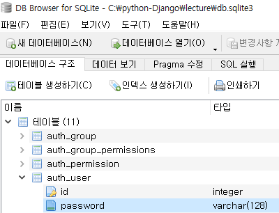

# 08. Web Django lecture 실습

> Django를 이용하여 Lecture 로그인 만들기


## 1. 실습 1단계

1. *anaconda prompt*에서 프로젝트 생성

```
(base) C:\>cd python-Django

(base) C:\python-Django>django-admin startproject lecture
```

2. *pycharm terminal*에서 어플리케이션 생성

```
(base) C:\python-Django\lecture>python manage.py startapp users
```

3. `lecture/settings.py`에서 설정 변경

```python
ALLOWED_HOSTS = ['localhost','127.0.0.1']
```

```python
INSTALLED_APPS = [
    'django.contrib.admin',
    'django.contrib.auth',
    'django.contrib.contenttypes',
    'django.contrib.sessions',
    'django.contrib.messages',
    'django.contrib.staticfiles',
    'bbs.apps.BbsConfig' # 추가
]
```

```python
TIME_ZONE = 'Asia/Seoul'
```

```python
TEMPLATES = [
'DIRS': [os.path.join(BASE_DIR, 'templates')],
```

```python
TIME_ZONE = 'Asia/Seoul'
```

```python
STATICFILES_DIRS = [
    os.path.join(BASE_DIR,'static'),
]
```

6. *pycharm terminal* 에서 DB 생성

```python
>python manage.py migrate		# db.sqlite3 생성
>python manage.py runserver		# server 동작
```

7. 관리자 계정 생성

```
> python manage.py createsuperuser

Username (leave blank to use 'mina'): mina
Email address: mina49140@naver.com
Password:
Password (again):
```


## 2. 실습 2단계


1. `lecture/urls.py`

```python
from django.contrib import admin
from django.urls import path
from django.views.generic.base import TemplateView # 추가

urlpatterns = [
    path("", TemplateView.as_view(template_name='index.html'),name='home'), # 추가
    path('admin/', admin.site.urls),
    path('users/', include('users.urls')), # 추가
]
```

* `TemplateView.as_view` :
  * path가 빈칸일 때, index.html를 home이라는 이름으로 view를 통해 호출 
  * 바로 리턴하기 때문에 속도 빠름 but 동적 html에는 사용 불가

* `incluse` : 
  * 'users/~~'로 들어오면 users/urls.py 모듈에서 처리하는 계층적 구조


2. ` templates/index.html`

- bootstrap에서 테이블 소스와 CDN 복붙

```html
<!doctype html>
<html lang="en" class="h-100">
  <head>
    <meta charset="utf-8">
    <title>Lecture Sample</title>
    
    <!-- Bootstrap core CSS CDN -->
    <link href="https://cdn.jsdelivr.net/npm/bootstrap@5.0.0-beta1/dist/css/bootstrap.min.css" rel="stylesheet" integrity="sha384-giJF6kkoqNQ00vy+HMDP7azOuL0xtbfIcaT9wjKHr8RbDVddVHyTfAAsrekwKmP1" crossorigin="anonymous">
    <script src="https://cdn.jsdelivr.net/npm/bootstrap@5.0.0-beta1/dist/js/bootstrap.bundle.min.js" integrity="sha384-ygbV9kiqUc6oa4msXn9868pTtWMgiQaeYH7/t7LECLbyPA2x65Kgf80OJFdroafW" crossorigin="anonymous"></script>


    <style>
      .bd-placeholder-img {
        font-size: 1.125rem;
        text-anchor: middle;
        -webkit-user-select: none;
        -moz-user-select: none;
        user-select: none;
      }

      @media (min-width: 768px) {
        .bd-placeholder-img-lg {
          font-size: 3.5rem;
        }
      }
    </style>

    
    <!-- Custom styles for this template -->
    <link href="/static/css/cover.css" rel="stylesheet">
  </head>
  <body class="d-flex h-100 text-center text-white bg-dark">
    
<div class="cover-container d-flex w-100 h-100 p-3 mx-auto flex-column">
  <header class="mb-auto">
    <div>
      <h3 class="float-md-start mb-0">Lecture Sample</h3>
    </div>
  </header>

  <main class="px-3">
    <h1>Lecture Sample</h1>
    <p class="lead">예제입니다</p>
    <p class="lead">
      <a href="#" class="btn btn-lg btn-secondary fw-bold border-white bg-white">로그인</a>
    </p>
  </main>

  <footer class="mt-auto text-white-50">
  </footer>
</div>
  
  </body>
</html>
```


3. `users/urls.py` 파일 생성

```python
from django.urls import path, include
from . import views # . : 현재 폴더
app_name = 'users' # namespace

urlpatterns = [
    path('login/', views.login, name = 'login'), # views에 있는 login 함수 사용
]
```

* namespace를 이용해 이름 겹치는 것 방지
  * users:login 형식으로 사용


4. `users/views.py` 에 login 추가

```python
def login(request):
    return render(request, 'users/login.html', {
        'page_title': 'User Login'
    })
```

 

5. `index.html`의 로그인 버튼에 url 연결

```html
<a href="/users/login" class="btn btn-lg btn-secondary fw-bold border-white bg-white">로그인</a>
```


6. `templates/base.html` 생성

```html
<!doctype html>
<html lang="en">
  <head>
    <meta charset="utf-8">
    <title>{{ page_title }}</title>


    <!-- jQuery CDN -->
    <script src="https://code.jquery.com/jquery-2.2.4.min.js" integrity="sha256-BbhdlvQf/xTY9gja0Dq3HiwQF8LaCRTXxZKRutelT44=" crossorigin="anonymous"></script>

    <!-- Bootstrap core CSS CDN -->
    <link href="https://cdn.jsdelivr.net/npm/bootstrap@5.0.0-beta1/dist/css/bootstrap.min.css" rel="stylesheet" integrity="sha384-giJF6kkoqNQ00vy+HMDP7azOuL0xtbfIcaT9wjKHr8RbDVddVHyTfAAsrekwKmP1" crossorigin="anonymous">
    <script src="https://cdn.jsdelivr.net/npm/bootstrap@5.0.0-beta1/dist/js/bootstrap.bundle.min.js" integrity="sha384-ygbV9kiqUc6oa4msXn9868pTtWMgiQaeYH7/t7LECLbyPA2x65Kgf80OJFdroafW" crossorigin="anonymous"></script>

    <!-- 부가적인 CSS 설정 -->
    
    

  </head>
  

  
  


</html>
```


7. `users/templates/users/login.html` 생성

* `base.html`을 확장해서 사용
* `users.js` 파일을 참조

```html




    <style>
      .bd-placeholder-img {
        font-size: 1.125rem;
        text-anchor: middle;
        -webkit-user-select: none;
        -moz-user-select: none;
        user-select: none;
      }

      @media (min-width: 768px) {
        .bd-placeholder-img-lg {
          font-size: 3.5rem;
        }
      }
    </style>


    <!-- Custom styles for this template -->
    <link href="/static/css/signin.css" rel="stylesheet">
    <script src="/static/js/users.js"></script>

   </head>


   <body class="text-center">

<main class="form-signin">
  <form>
    <h1 class="h3 mb-3 fw-normal">Please sign in</h1>
    <label for="inputId" class="visually-hidden">User ID</label>
    <input type="text" id="inputId" class="form-control" placeholder="User ID" required autofocus>
    <label for="inputPassword" class="visually-hidden">Password</label>
    <input type="password" id="inputPassword" class="form-control" placeholder="Password" required>
    <div class="checkbox mb-3">
      <label>
        <input type="checkbox" value="remember-me"> Remember me
      </label>
    </div>
    <button class="w-100 btn btn-lg btn-primary" type="submit">Sign in</button>
    <br>
    <br>
    <button class="w-100 btn btn-lg btn-warning" type="button"
            onclick = "user_register()">회원가입</button>
    {# js 파일 추가 #}
  </form>
</main>

</body>


```


8. `static/js/users.js` 파일 생성

```javascript
function user_register() {
    location.href = '/users/signup'
    // http://localhost:8000/users/signup
}
```


**[참고] id와 password**

  		  


9. `users/urls.py`에 signup 추가

```python
from django.urls import path, include
from . import views                               # . : 현재 폴더

app_name = 'users'                                # namespace

urlpatterns = [
    path('login/', views.login, name='login'),    # localhost:8000/users/login/
    path('signup/', views.signup, name='signup'),   # localhost:8000/users/signup/
]
```


10. `users/views.py`에 signup 추가

```python
from django.shortcuts import render


def login(request):
    # 데이터베이스 처리가 있으면 model 이용해서 데이터 가져오기
    # 로직처리가 있으면 로직처리 진행
    # template 이용해서 결과 html을 만들어서 리턴 => render 함수
    return render(request, 'users/login.html', {        # templates 폴더 안의 users
        'page_title': 'User Login',                     # {key : data}
        'user_data': '데이터'
    })

def signup(request):
    return render(request, 'users/signup.html', {       # templates 폴더 안의 users
        'page_title': '회원가입',                        # {key : data}
    })
```


11. `users/templates/users/signup.html` 생성

```html


    <style>
      .bd-placeholder-img {
        font-size: 1.125rem;
        text-anchor: middle;
        -webkit-user-select: none;
        -moz-user-select: none;
        user-select: none;
      }

      @media (min-width: 768px) {
        .bd-placeholder-img-lg {
          font-size: 3.5rem;
        }
      }
    </style>

    <!-- Custom styles for this template -->
    <link href="/static/css/signin.css" rel="stylesheet">
    <script src="/static/js/users.js"></script>


</head>


<body class="text-center">

<main class="form-signin">
  <form action="/users/signupProcess/" method="post">
  
    <h1 class="h3 mb-3 fw-normal">회원가입입니다</h1>
    <label for="inputId" class="visually-hidden">User ID</label>
    <input type="text" id="inputId" name="inputId"
           class="form-control" placeholder="User ID" required autofocus>
    <label for="inputPassword1" class="visually-hidden">Password1</label>
    <input type="password" id="inputPassword1" name="inputPassword1"
           class="form-control" placeholder="Password" required>
    <label for="inputPassword2" class="visually-hidden">Password2</label>
    <input type="password" id="inputPassword2" name="inputPassword2"
           class="form-control" placeholder="Password" required>

    <div class="checkbox mb-3">
    </div>
    <button class="w-100 btn btn-lg btn-primary" type="submit">회원가입</button>

  </form>
</main>

</body>

```


12. `users/urls.py`에 signupProcess 추가

```python
from django.urls import path, include
from . import views                               # . : 현재 폴더

app_name = 'users'                                # namespace

urlpatterns = [
    path('login/', views.login, name='login'),    # localhost:8000/users/login/
    path('signup/', views.signup, name='signup'),   # localhost:8000/users/signup/
    path('signupProcess/', views.signup_process, name='signup_process') # localhost:8000/users/signupProcess/
]
```


13. `users/views.py`에 signup_process 추가

```python
from django.shortcuts import render
from django.contrib.auth.models import User


def login(request):
    # 데이터베이스 처리가 있으면 model 이용해서 데이터 가져오기
    # 로직처리가 있으면 로직처리 진행
    # template 이용해서 결과 html을 만들어서 리턴 => render 함수
    return render(request, 'users/login.html', {        # templates 폴더 안의 users
        'page_title': 'User Login',                     # {key : data}
        'user_data': '데이터'
    })

def signup(request):
    return render(request, 'users/signup.html', {       # templates 폴더 안의 users
        'page_title': '회원가입',                        # {key : data}
    })

def signup_process(request):
    user_id = request.POST['inputId']
    u_pass1 = request.POST['inputPassword1']
    u_pass2 = request.POST['inputPassword2']
    
    # 클라이언트가 회원가입을 위해 보내준 데이터 서버가 받음
	# 이 id와 pw를 이용해서 데이터 베이스에 저장

    # 사용자 ID는 unique해야 함
    # 이미 존재하는 ID인지 확인하고 만약 존재하지 않는 ID이면 회원가입 처리 진행
    # 모든 사용자 데이터 가져오기
    user_list = User.objects.all()
    if user_list.filter(username=user_id).exists():
        # 회원가입하려는 ID가 이미 사용되고 있는 경우
        # 오류메시지와 함께 회원가입 화면 전송
        return render(request,'users/signup.html', {
            'err_msg':'이미 존재하는 ID입니다'
        })
    elif u_pass1 == u_pass2:
        # 회원가입 가능
        User.objects.create_user(username=user_id, password=u_pass1)
        return redirect('home')
    else:
        # 회원가입을 위해 입력한 비밀번호 2개가 서로 다른 경우
        return render(request,'users/signup.html', {
            'err_msg':'비밀번호가 다릅니다'
        })
```


12. `users/signup.html` if err_msg 추가

```html



    <style>
      .bd-placeholder-img {
        font-size: 1.125rem;
        text-anchor: middle;
        -webkit-user-select: none;
        -moz-user-select: none;
        user-select: none;
      }

      @media (min-width: 768px) {
        .bd-placeholder-img-lg {
          font-size: 3.5rem;
        }
      }
    </style>

    <!-- Custom styles for this template -->
    <link href="/static/css/signin.css" rel="stylesheet">
    <script scr ="/static/js/users_js"> </script>


  </head>



  <body class="text-center">

<main class="form-signin">
  <form action="/users/signupProcess/" method="post">
      
    <h1 class="h3 mb-3 fw-normal">회원가입입니다</h1>
      			{# 추가 #}
              <h1 class="h3 mb-3 fw-normal">{{ err_msg }}</h1>
      
    <label for="inputEmail" class="visually-hidden">User ID</label>
    <input type="text"
           id="inputId"
           name="inputId"     {# name => key 값 #}
           class="form-control" placeholder="User ID" required autofocus>
    <label for="inputPassword1" class="visually-hidden">Password1</label>
    <input type="password"
           id="inputPassword1"
           name="inputPassword1"
           class="form-control" placeholder="Password" required>
    <label for="inputPassword2" class="visually-hidden">Password2</label>
    <input type="password"
           id="inputPassword2"
           name="inputPassword2"
           class="form-control" placeholder="Password" required>

    <div class="checkbox mb-3">
    </div>
     <button class="w-100 btn btn-lg btn-primary" type="submit">회원가입</button>
  </form>
</main>
</body>



</html>
```


13. `users/urls.py`에 login_Process 추가

```python
from django.urls import path
from . import views                               # . : 현재 폴더

app_name = 'users'                                # namespace

urlpatterns = [
    path('login/', views.login, name='login'),    # localhost:8000/users/login/
    path('loginProcess/', views.login_process, name='login_process'),  # localhost:8000/users/signupProcess/
    path('signup/', views.signup, name='signup'),  # localhost:8000/users/signup/
    path('signupProcess/', views.signup_process, name='signup_process'),  # localhost:8000/users/signupProcess/
] # views는 파이썬 함수 => 소문자로 표현
```


14. `users/login.html`에 if err_msg 추가

```html




    <style>
      .bd-placeholder-img {
        font-size: 1.125rem;
        text-anchor: middle;
        -webkit-user-select: none;
        -moz-user-select: none;
        user-select: none;
      }

      @media (min-width: 768px) {
        .bd-placeholder-img-lg {
          font-size: 3.5rem;
        }
      }
    </style>


    <!-- Custom styles for this template -->
    <link href="/static/css/signin.css" rel="stylesheet">
    <script src="/static/js/users.js"></script>

   </head>


   <body class="text-center">

<main class="form-signin">
  <form action="/users/loginProcess/", method="post">
      
      
          <h1 class="h3 mb-3 fw-normal">{{ err_msg }}</h1>
      
    <h1 class="h3 mb-3 fw-normal">Please sign in</h1>
    <label for="inputId" class="visually-hidden">User ID</label>
    <input type="text"
           id="inputId"
           name="inputId"
           class="form-control" placeholder="User ID" required autofocus>
    <label for="inputPassword" class="visually-hidden">Password</label>
    <input type="password"
           id="inputPassword"
           name="inputPassword"
           class="form-control" placeholder="Password" required>
    <div class="checkbox mb-3">
      <label>
        <input type="checkbox" value="remember-me"> Remember me
      </label>
    </div>
    <button class="w-100 btn btn-lg btn-primary" type="submit">Sign in</button>
    <br>
    <br>
    <button class="w-100 btn btn-lg btn-warning" type="button"
            onclick = "user_register()">회원가입</button>
    {# js 파일 추가 #}
  </form>
</main>


  </body>


</html>
```


15. `lecture/urls.py`수정

* TemplateView로 바로 출력하는 것이 아닌 views 이용해서 출력으로 변환

```python
from django.contrib import admin
from django.urls import path, include
from django.views.generic.base import TemplateView

urlpatterns = [
    path('', views.home, name='home'), # views 이용해서 출력으로 변환
    path('admin/', admin.site.urls),
    path('users/', include('users.urls'))           

]
```


16. `lecture/views.py` 생성

```python
from django.shortcuts import render

def home(request):
    return render(request, 'index.html')
```


17. `index.html` 

```html
<!doctype html>
<html lang="en" class="h-100">
  <head>
    <meta charset="utf-8">
    <title>Lecture Sample</title>
    

    <!-- Bootstrap core CSS CDN -->
    <link href="https://cdn.jsdelivr.net/npm/bootstrap@5.0.0-beta1/dist/css/bootstrap.min.css" rel="stylesheet" integrity="sha384-giJF6kkoqNQ00vy+HMDP7azOuL0xtbfIcaT9wjKHr8RbDVddVHyTfAAsrekwKmP1" crossorigin="anonymous">
    <script src="https://cdn.jsdelivr.net/npm/bootstrap@5.0.0-beta1/dist/js/bootstrap.bundle.min.js" integrity="sha384-ygbV9kiqUc6oa4msXn9868pTtWMgiQaeYH7/t7LECLbyPA2x65Kgf80OJFdroafW" crossorigin="anonymous"></script>


    <style>
      .bd-placeholder-img {
        font-size: 1.125rem;
        text-anchor: middle;
        -webkit-user-select: none;
        -moz-user-select: none;
        user-select: none;
      }

      @media (min-width: 768px) {
        .bd-placeholder-img-lg {
          font-size: 3.5rem;
        }
      }
    </style>

    
    <!-- Custom styles for this template -->
    <link href="/static/css/cover.css" rel="stylesheet">
  </head>
  <body class="d-flex h-100 text-center text-white bg-dark">
    
<div class="cover-container d-flex w-100 h-100 p-3 mx-auto flex-column">
  <header class="mb-auto">
    <div>
      <h3 class="float-md-start mb-0">Lecture Sample</h3>
    </div>
  </header>

  <main class="px-3">
    <h1>Lecture Sample</h1>
    <p class="lead">예제입니다</p>
    <!-- 템플릿 문법에선 속성으로 접근 -->
    
<!--도 가능하다-->
        <!-- 로그인이 된 경우 -->
        <p class="lead">
          <a href="/users/login" 
             class="btn btn-lg btn-secondary fw-bold border-white bg-white">BoxOffice</a>
          <a href="/users/login" 
             class="btn btn-lg btn-secondary fw-bold border-white bg-white">BBS</a>
          <a href="/users/login" 
             class="btn btn-lg btn-secondary fw-bold border-white bg-white">로그아웃</a>
        </p>
    
        <!-- 로그인이 안된 경우 -->
        <p class="lead">
          <a href="/users/login" class="btn btn-lg btn-secondary fw-bold border-white bg-white">로그인</a>
        </p>
     

  </main>

  <footer class="mt-auto text-white-50">
  </footer>
</div>

  </body>
</html>
```


18. `users/urls.py` logout 추가

```python
from django.urls import path
from . import views                               # . : 현재 폴더

app_name = 'users'                                # namespace

urlpatterns = [
    path('login/', views.login, name='login'),    # localhost:8000/users/login/
    path('loginProcess/', views.login_process, name='login_process'),  # localhost:8000/users/signupProcess/
    path('signup/', views.signup, name='signup'),  # localhost:8000/users/signup/
    path('signupProcess/', views.signup_process, name='signup_process'),  # localhost:8000/users/signupProcess/
    path('logout/', views.logout, name='logout')  # localhost:8000/users/logout/
] 
```


19. `users/views.py` logout 추가

```python
from django.shortcuts import render, redirect
from django.contrib.auth.models import User
from django.contrib import auth


def login(request):
    # 데이터베이스 처리가 있으면 model 이용해서 데이터 가져오기
    # 로직처리가 있으면 로직처리 진행
    # template 이용해서 결과 html을 만들어서 리턴 => render 함수
    return render(request, 'users/login.html', {        # templates 폴더 안의 users
        'page_title': 'User Login',                     # {key : data}
        'user_data': '데이터'
    })

def login_process(request):
    # 클라이언트로부터 POST 방식으로 id와 pw 넘어옴
    u_id = request.POST['inputId']
    u_pw = request.POST['inputPassword']
    # 로그인이 되는지 확인(데이터베이스에 해당 id와 pw가 있는지 확인
    user = auth.authenticate(request, username=u_id, password=u_pw)
    if user is not None:
        # 로그인 처리를 진행 (session 처리 진행)
        auth.login(request,user)
        user_dict = {                                   # 임의의 data 딕셔너리
            'u_id': user.id,
            'u_name': user.username
        }
        # session 처리
        request.session['loginObj'] = user_dict         # 세션 저장소안에 딕셔너리 저장
        return redirect('home')
    else:
        return render(request,'users/login.html',{
            'err_msg':'로그인 실패'
        })

def signup(request):
    return render(request, 'users/signup.html', {       # templates 폴더 안의 users
        'page_title': '회원가입',                        # {key : data}
    })

def signup_process(request):
    user_id = request.POST['inputId']                   # signup에서 받아온 name
    user_pw1 = request.POST['inputPassword1']
    user_pw2 = request.POST['inputPassword2']
    print('회원가입 호출 성공')
    print(user_id)
    print(user_pw1)
    print(user_pw2)

    user_list = User.objects.all()
    if user_list.filter(username=user_id).exists():
        # 회원가입하려는 id가 이미 사용되고 있는 경우
        # 오류메시지와 함께 회원가입 화면 전송
        return render(request,'users/signup.html', {
            'err_msg':'이미 존재하는 ID입니다'
        })
    elif user_pw1 == user_pw2:
        # 회원가입 가능
        User.objects.create_user(username=user_id, password=user_pw1)
        return redirect('home')
    else:
        # 회원가입을 위해 입력한 비밀번호 2개가 서로 다른 경우
        return render(request,'users/signup.html', {
            'err_msg':'비밀번호가 다릅니다'
        })

def logout(request):
    # 로그아웃 처리
    # session 정보를 만료 (session 정보를 삭제)
    auth.logout(request)
    return redirect('home')
```


## 3. 실습 3단계

1. *pycharm terminal*에서 어플리케이션 생성

```
(base) C:\python-Django\lecture>python manage.py startapp boxoffice
```


2. `lecture/settings.py`에서 설정 변경

```python
INSTALLED_APPS = [
    'django.contrib.admin',
    'django.contrib.auth',
    'django.contrib.contenttypes',
    'django.contrib.sessions',
    'django.contrib.messages',
    'django.contrib.staticfiles',
    'users.apps.UsersConfig',
    'boxoffice.apps.BoxofficeConfig' # 추가
]
```


3. `lecture/urls.py` 에 movie 추가

```python
urlpatterns = [
    path('', views.home, name='home'),
    path('admin/', admin.site.urls),
    path('users/', include('users.urls'))      # localhost:8000/users/~~
    path('movie/', include('boxoffice.urls'))  # localhost:8000/movie/~~

]
```


4. `boxoffice/urls.py`

```python
from django.urls import path
from . import views                               # . : 현재 폴더

app_name = 'boxoffice'                                # namespace

urlpatterns = [
    path('search/', views.search, name='login'),    # localhost:8000/movie/search/

]
```


5. `boxoffice/views`

```python
from django.shortcuts import render

# Create your views here.

def search(request):
    return render(request,'boxoffice/search.html') # search.html => 클라우드 브라우저에서 수행 => 프론트엔드
```


6. `boxoffice/templates/boxoffice/search.html` 생성

```html




<head>

    <style>
        .bd-placeholder-img {
            font-size: 1.125rem;
            text-anchor: middle;
            -webkit-user-select: none;
            -moz-user-select: none;
            user-select: none;
        }

        @media (min-width: 768px) {
            .bd-placeholder-img-lg {
                font-size: 3.5rem;
            }
        }
    </style>

    <!-- Custom styles for this template -->
    <link href="/static/css/dashboard.css" rel="stylesheet">
    <script src="/static/js/dailyBoxOfficeSearch.js"></script>


</head>



<body>

<header class="navbar navbar-dark sticky-top bg-dark flex-md-nowrap p-0 shadow">
    <a class="navbar-brand col-md-3 col-lg-2 me-0 px-3" href="#">BoxOffice</a>
    <button class="navbar-toggler position-absolute d-md-none collapsed" type="button" data-bs-toggle="collapse" data-bs-target="#sidebarMenu" aria-controls="sidebarMenu" aria-expanded="false" aria-label="Toggle navigation">
        <span class="navbar-toggler-icon"></span>
    </button>
    <input class="form-control form-control-dark w-100"
           type="text" placeholder="날짜를 입력하세요(YYYYMMDD)"
           id='userInputDate' aria-label="Search">
    <ul class="navbar-nav px-3">
        <li class="nav-item text-nowrap">
            <a class="nav-link" href="#"
            onclick="my_func()">검색</a>
        </li>
    </ul>
</header>

<div class="container-fluid">
    <div class="row">
        <nav id="sidebarMenu" class="col-md-3 col-lg-2 d-md-block bg-light sidebar collapse">
            <div class="position-sticky pt-3">
                <ul class="nav flex-column">
                    <li class="nav-item">
                        <a class="nav-link active" aria-current="page" href="#">
                            <span data-feather="home"></span>
                            순위조회
                        </a>
                    </li>
                </ul>
            </div>
        </nav>

        <main class="col-md-9 ms-sm-auto col-lg-10 px-md-4">
            <!-- a element는 hyperlink를 만들어주는 element
                 href속성 다음에 있는 url로 get방식의 request를 보냄 -->
            <!-- <a href="http://www.naver.com">네이버로 가기</a> -->
            <h2>일일 박스오피스 순위</h2>
            <div class="table-responsive">
                <table class="table table-striped table-sm">
                    <thead>
                    <tr>
                        <th>순위</th>
                        <th>영화제목</th>
                        <th>포스터</th>
                        <th>누적매출액</th>
                        <th>포스터보기</th>
                    </tr>
                    </thead>
                    <tbody id="my_tbody">
                        <tr>
                            <td>1</td>
                            <td>건축학개론</td>
                            <td></td>
                            <td>500</td>
                            <td><input type="button" value="포스터보기"></td>
                        </tr>
                    </tbody>
                </table>
            </div>
        </main>
    </div>
</div>

</body>

```


7. `static/js/dailyBoxOfficeSearch.js` 추가

8. `lecture/index.html` 수정

```html
<!doctype html>
<html lang="en" class="h-100">
  <head>
    <meta charset="utf-8">
    <title>Lecture Sample</title>


    <!-- Bootstrap core CSS CDN -->
    <link href="https://cdn.jsdelivr.net/npm/bootstrap@5.0.0-beta1/dist/css/bootstrap.min.css" rel="stylesheet" integrity="sha384-giJF6kkoqNQ00vy+HMDP7azOuL0xtbfIcaT9wjKHr8RbDVddVHyTfAAsrekwKmP1" crossorigin="anonymous">
    <script src="https://cdn.jsdelivr.net/npm/bootstrap@5.0.0-beta1/dist/js/bootstrap.bundle.min.js" integrity="sha384-ygbV9kiqUc6oa4msXn9868pTtWMgiQaeYH7/t7LECLbyPA2x65Kgf80OJFdroafW" crossorigin="anonymous"></script>


    <style>
      .bd-placeholder-img {
        font-size: 1.125rem;
        text-anchor: middle;
        -webkit-user-select: none;
        -moz-user-select: none;
        user-select: none;
      }

      @media (min-width: 768px) {
        .bd-placeholder-img-lg {
          font-size: 3.5rem;
        }
      }
    </style>


    <!-- Custom styles for this template -->
    <link href="/static/css/cover.css" rel="stylesheet">


  </head>
  <body class="d-flex h-100 text-center text-white bg-dark">

<div class="cover-container d-flex w-100 h-100 p-3 mx-auto flex-column">
  <header class="mb-auto">
    <div>
      <h3 class="float-md-start mb-0">Lecture Sample</h3>
      <nav class="nav nav-masthead justify-content-center float-md-end">

        <a class="nav-link active" aria-current="page" href="#">Home</a>
        <a class="nav-link" href="#">Features</a>
        <a class="nav-link" href="#">Contact</a>

      </nav>
    </div>
  </header>

  <main class="px-3">
    <h1>Lecture Sample</h1>
    <p class="lead">예제입니다</p>
      
      {# 로그인이 된 경우 #}
      <p class="lead">
      <a href="/movie/search"
         class="btn btn-lg btn-secondary fw-bold border-white bg-white">BoxOffice</a>
      <a href=""
         class="btn btn-lg btn-secondary fw-bold border-white bg-white">BBS</a>
      <a href="/users/logout"
         class="btn btn-lg btn-secondary fw-bold border-white bg-white">로그아웃</a>
      
    <p class="lead">
      <a href="/users/login"
         class="btn btn-lg btn-secondary fw-bold border-white bg-white">로그인</a>
    </p>
    
  </main>

  <footer class="mt-auto text-white-50">
    <p> Github <a href="https://github.com/xeomina" class="text-white">@xeomina</a>.</p>
  </footer>
</div>


  </body>
</html>
```

